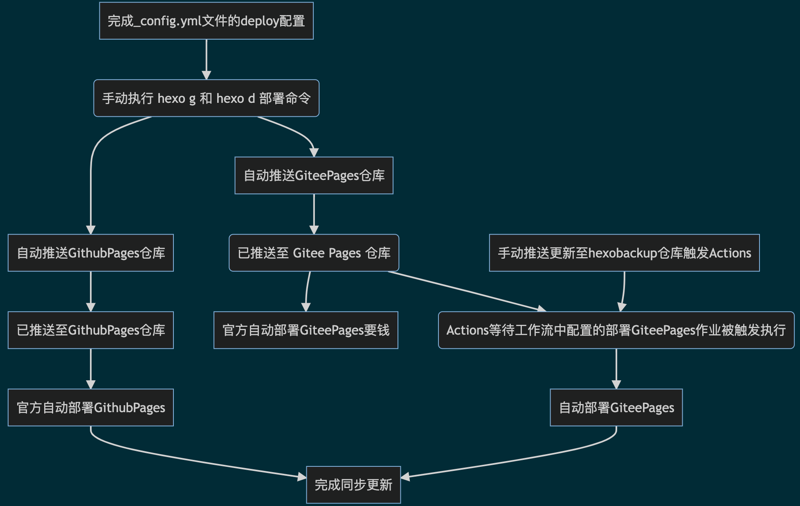
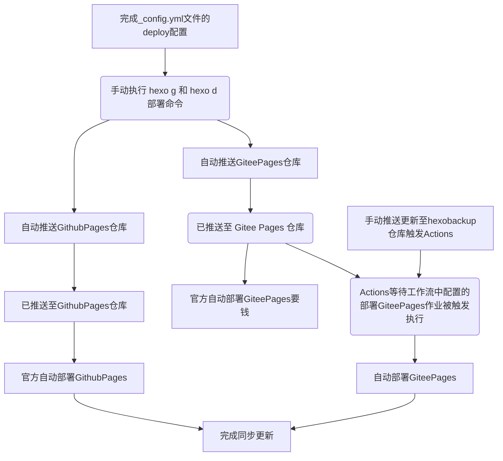

在当前仓库 `hexobackup` 配置以下工作流，实现向当前仓库提交更新时，触发 GitPages 自动编译。



Something about Continuously Integrity / Continuously Deploy...

Github Actions.

.github/workflows/main.yml文件代码：

```yml
name: Sync

on:
  push:
    branches: [master]
  workflow_dispatch:

jobs:
  build:
    runs-on: ubuntu-latest
    steps:
      - name: Build Gitee Pages
        uses: yanglbme/gitee-pages-action@main
        with:
          # 注意替换为你的 Gitee 用户名
          gitee-username: xy94
          # 注意在 Settings->Secrets 配置 GITEE_PASSWORD
          gitee-password: ${{ secrets.GITEE_PASSWORD }}
          # 注意替换为你的 Gitee 仓库，仓库名严格区分大小写，请准确填写，否则会出错
          gitee-repo: xy94/xy94
          # 要部署的分支，默认是 master，若是其他分支，则需要指定（指定的分支必须存在）
          branch: master
```

SSH

CI 持续集成
