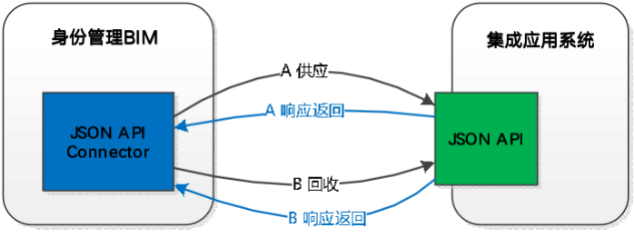

## 1. 引言

### 1.1. 编写目的

该文档将阐述下游应用系统接入身份管理平台（以下简称 BIM）后，根据 BIM 定义的标准 JSON 数据格式接口规范与 BIM 做数据交互。该文档定义了机构、账号、角色、资源类对象增、删、查、改的抽象方法，下游应用系统根据集成范围做对应的业务实现。

<!-- more -->

### 1.2. 读者对象

本文档的对象为下游应用系统的开发人员和测试人员。

### 1.3. 术语定义

| 名称      | 定义                                               |
|---------|--------------------------------------------------|
| IAM     | 统一身份认证管理平台                                       |
| BIM     | 竹云公司的身份管理产品，即 BambooCloud Identity Manager        |
| BAM     | 竹云公司的访问控制产品，即 BambooCloud Access Manager          |
| AppHub  | 竹云公司的集中应用安全访问导航平台软件，即 Bamboocloud Application Hub |
| Epass   | 竹云公司的移动安全 e 账通平台软件，即 Bamboocloud Epass              |
| User    | 用户，即在统一身份认证平台中的用户身份标识                            |
| Account | 账号，即在各个应用系统中的用户身份标识                              |
| 供应      | 身份信息从 BIM 同步至应用系统的过程                               |
| 回收      | 身份信息从应用系统同步至 BIM 的过程                               |
| MDM     | 主数据平台                                            |
| ESB     | 企业服务总线                                           |

---

## 2. 业务介绍

BIM 与下游集成应用系统，数据交互分为 “供应 / 回收” 两个部分。



### 2.1. 数据供应

IAM 中进行账号、机构的增删改查操作时，通过调用应用系统该接口，将变动数据推送至应用。

应用系统实现 UserCreateService、UserUpdateService、UserDeleteService 接口，IAM 调用接口完成对本应用系统账号数据的增、改（更新、启用、禁用）、删操作。

应用系统实现 OrgCreateService、OrgUpdateService、OrgDeleteService 接口，IAM 调用接口完成对本应用系统组织机构数据的增、改、删操作。

应用系统实现 RoleCreateService、RoleUpdateService、RoleDeleteService 接口，IAM 调用接口完成对本应用系统角色数据的增、改、删操作。

应用系统实现 ResourceCreateService、ResourceUpdateService、ResourceDeleteService 接口，IAM 调用接口完成对本应用系统资源类数据的增、改、删操作。

注意：**资源是指除账号、机构、角色以外的任意对象，如岗位、职级等**

### 2.2. 数据回收

数据回收是指应用系统非新建系统，存量账号、机构需要与 IAM 中数据进行绑定。或应用系统存在角色等特有数据，通过回收，将数据定期拿到 IAM 中，用于在 IAM 中创建账号时进行的角色选择等。

应用系统实现 QueryAllUserIdsService、QueryUserByIdService 接口，IAM 调用接口实现对本系统账号数据的查询操作。

应用系统实现 QueryAllOrgIdsService、QueryOrgByIdService 接口，IAM 调用接口实现对本系统组织机构数据的查询操作。

应用系统实现 QueryAllRoleIdsService、QueryRoleByIdService 方接口，IAM 调用接口实现对本系统角色数据的查询操作。

应用系统实现 QueryAllResourceIdsService、QueryResourceByIdService 接口，IAM 调用接口实现对本系统资源类数据的查询操作

---

## 3. 接口列表

| 接口名                        | 描述                                                 | 接口地址                                           |
|----------------------------|----------------------------------------------------|------------------------------------------------|
| SchemaService              | 对象属性字段查询                                           | <http://{host}:{port}/../SchemaService>          |
| UserCreateService          | 账号创建                                               | <http://{host}:{port}/../UserCreateService>      |
| UserUpdateService          | 账号修改                                               | <http://{host}:{port}/../UserUpdateService>      |
| UserDeleteService          | 账号删除                                               | <http://{host}:{port}/../UserDeleteService>      |
| QueryAllUserIdsService     | 批量查询账号 ID                                           | <http://{host}:{port}/../QueryAllUserIdsService> |
| QueryUserByIdService       | 根据账号 ID 查询账号详细内容                                     | <http://{host}:{port}/../QueryUserByIdService>   |
| OrgCreateService           | 组织机构创建                                             | <http://{host}:{port}/../OrgCreateService>       |
| OrgUpdateService           | 组织机构修改                                             | <http://{host}:{port}/../OrgUpdateService>       |
| OrgDeleteService           | 组织机构删除                                             | <http://{host}:{port}/../OrgDeleteService>       |
| QueryAllOrgIdsService      | 批量查询组织机构 ID                                         | <http://{host}:{port}/../QueryAllOrgIdsService>  |
| QueryOrgByIdService        | 根据组织机构 ID 查询账号详细内容                                   | <http://{host}:{port}/../QueryOrgByIdService>    |
| RoleCreateService          | 角色创建                                               | <http://{host}:{port}/../RoleCreateService>      |
| RoleUpdateService          | 角色修改                                               | <http://{host}:{port}/../RoleUpdateService>      |
| RoleDeleteService          | 角色删除                                               | <http://{host}:{port}/../RoleDeleteService>      |
| QueryAllRoleIdsService     | 批量查询角色 ID                                           | <http://{host}:{port}/../QueryAllRoleIdsService> |
| QueryRoleByIdService       | 根据角色 ID 查询角色详细内容                                     | <http://{host}:{port}/../QueryRoleByIdService>   |
| ResourceCreateService      | 资源类创建，根据资源类型（如：menu）等进行区分不同资源的创建                   | <http://{host}:{port}/../ResourceCreateService>  |
| ResourceUpdateService      | 资源类更新，根据资源类型（如：menu）等进行区分不同资源的更新                   | <http://{host}:{port}/../ResourceUpdateService> |
| ResourceDeleteService      | 资源类删除，根据资源类型（如：menu）等进行区分不同资源的删除                   | <http://{host}:{port}/../ResourceDeleteService> |
| QueryAllResourceIdsService | 批量查询资源类型 ID，根据资源类型（如：menu）等进行区分不同资源    | <http://{host}:{port}/../QueryAllResourceIdsService> |
| QueryResourceByIdService   | 根据资源类 ID 进行资源查询，根据资源类型（如：menu）等进行区分不同资源    | <http://{host}:{port}/../QueryResourceByIdService>   |

**注意**：

- 接口接收请求方式为 http post 方式，接收和返回报文为 json 格式
- 接口地址后端的方法名需要按照上面表格定义实现
- 在与统一用户集成前，需要跟统一用户确认调用的接口，上面列表中的接口不是全部要实现

---

## 4. 接口功能实现指导

### 4.1. SchemaService

#### 4.1.1. 简要描述

SchemaService 的功能是获取第三方目标系统中 “账号” 等对象全部属性信息，包括属性名称、类型、是否必填字段、是否多值。用以建立起 BIM 平台用户字段和第三方目标系统 “账号” 等对象字段的映射关系。**集成的第三方目标系统必须要实现此接口**。

#### 4.1.2. 接口版本

| 版本号 | 制定人 | 制定日期 | 修订日期 |
|:----    |:---|:----- |:-----   |
|-|-|-|-|

#### 4.1.3. 请求 URL

- <http://{host}:{port}/../SchemaService>

#### 4.1.4. 请求方式

- POST

#### 4.1.5. 请求头

| 参数名 | 是否必须 | 类型 | 说明 |
|:----    |:---|:----- |-----   |
|Content-Type | 是  |string | 请求类型： application/json   |

#### 4.1.6. 请求参数

| 参数名 | 是否必须 | 类型 | 说明 |
|:----    |:---|:----- |-----   |
|bimRequestId | 是 | String|BIM 每次调用生成的随机 ID，应用系统每次响应返回此 ID|
|bimRemoteUser | 是 | String|BIM 调用三方应用接口的授权账号，由应用分配给 BIM 系统 |
|bimRemotePwd | 是 | String|BIM 调用三方应用接口的密码，由应用分配给 BIM 系统 |

#### 4.1.7. 返回示例

资源类以 menu 为例

- **正确时返回**

```json
{
    "bimRequestId": "9e928d12ec8a4c1bb75283b8df71308d",
    "account": [{
        "multivalued": false,
        "name": "loginName",
        "required": true,
        "type": "String"
    }, {
        "multivalued": false,
        "name": "orgId",
        "required": true,
        "type": "String"
    }, {
        "multivalued": false,
        "name": "fullName",
        "required": true,
        "type": "String"
    },……],
    "organization": [{
        "multivalued": false,
        "name": "orgName",
        "required": true,
        "type": "String"
    }, {
        "multivalued": false,
        "name": "orgId",
        "required": true,
        "type": "String"
    }, {
        "multivalued": false,
        "name": "parOrgId",
        "required": true,
        "type": "String"
    }],
"role": [{
        "multivalued": false,
        "name": "roleName",
        "required": true,
        "type": "String"
    }, {
        "multivalued": false,
        "name": "roleId",
        "required": true,
        "type": "String"
    }, {
        "multivalued": false,
        "name": "ResourceList",
        "required": true,
        "type": "String"
    }...],
"menu": [{
        "multivalued": false,
        "name": "ResourceName",
        "required": true,
        "type": "String"
    }, {
        "multivalued": false,
        "name": "ResourceId",
        "required": true,
        "type": "String"
    }, {
        "multivalued": false,
        "name": "desc",
        "required": true,
        "type": "String"
    }……]
}
```

- **错误时返回**

```json

```

#### 4.1.8. 返回参数说明

| 参数名 | 类型 | 说明 |
|:-----  |:-----|-----                           |
|bimRequestId |String|BIM 每次调用接口发送的请求 ID|
|account/organization/role/menu | 数组类型 | 此接口定义的对象类型，可选值为 account（账号）、organization（组织机构）、role（角色）、资源类。如果只做账号管理，organization 等其它对象可以不用定义。**资源类字段如：menu（菜单）由竹云方定义并告知**。|
|name |String | 定义对象的属性字段名称。|
|type |String | 定义对象的属性字段类型，可选值为 String、int、double、float、long、byte、boolean。(**建议默认为 String**)|
|required |boolean | 定义对象的属性字段在创建时是否为必填字段。可选值 true 或者 false。|
|multivalued |boolean | 定义对象的属性字段是否为多值。可选值 true 或者 false。|

#### 4.1.9. 备注

---

### 4.2. UserCreateService

#### 4.2.1. 简要描述

UserCreateService 接口是应用系统的账号创建方法。

#### 4.2.2. 接口版本

| 版本号 | 制定人 | 制定日期 | 修订日期 |
|:----    |:---|:----- |:-----   |
|-|-|-|-|

#### 4.2.3. 请求 URL

- <http://{host}:{port}/../UserCreateService>

#### 4.2.4. 请求方式

- POST

#### 4.2.5. 请求头

| 参数名 | 是否必须 | 类型 | 说明 |
|:----    |:---|:----- |-----   |
|Content-Type | 是  |string | 请求类型： application/json   |

#### 4.2.6. 请求参数

| 参数名 | 是否必须 | 类型 | 说明 |
|:----    |:---|:----- |-----   |
|bimRequestId/bimRemotePwd/bimRemoteUser | 是 | String|BIM 接口调用的必传字段，说明见 SchemaService。|
|loginName/orgId/fullName |-|String | 第三方应用系统 SchemaService 接口中定义的账号字段属性。|

#### 4.2.7. 返回示例

- **正确时返回**

```json
{
    "bimRequestId": "11928d12ec8a4c1bb75283b8df71308d",
    "uid": "89746776",
    "resultCode": "0",
    "message": "success"
}
```

- **错误时返回**

```json
{
    "bimRequestId": "11928d12ec8a4c1bb75283b8df71308d",
    "resultCode": "500",
    "message": "字段不全，账号创建失败"
}
```

#### 4.2.8. 返回参数说明

| 参数名 | 类型 | 说明 |
|:-----  |:-----|-----                           |
|uid |String | 应用系统账号创建后，形成的全局唯一 ID，此 ID 不能被修改，建议为数据库表主键。此 ID 返回至 BIM 系统，此后账号的修改和删除都以此 ID 为主键。必传字段。|
|resultCode |String | 接口调用处理的结果码，**0 为正常处理，其它值由应用系统定义**。必传字段。|
|message |String | 接口调用处理的信息。|
|bimRequestId |String|BIM 每次调用接口发送的请求 ID，必传字段。|

---

### 4.3. UserUpdateService

#### 4.3.1. 简要描述

UserUpdateService 接口是应用系统的账号修改方法。

#### 4.3.2. 接口版本

| 版本号 | 制定人 | 制定日期 | 修订日期 |
|:----    |:---|:----- |:-----   |
|-|-|-|-|

#### 4.3.3. 请求 URL

- <http://{host}:{port}/../UserUpdateService>

#### 4.3.4. 请求方式

- POST

#### 4.3.5. 请求头

| 参数名 | 是否必须 | 类型 | 说明 |
|:----    |:---|:----- |-----   |
|Content-Type | 是  |string | 请求类型： application/json   |

#### 4.3.6. 请求参数

| 参数名 | 是否必须 | 类型 | 说明 |
|:----    |:---|:----- |-----   |
|bimRequestId/bimRemotePwd/bimRemoteUser | 是 | String|BIM 接口调用的必传字段，说明见 SchemaService。|
|bimUid:| 是 | String | 第三方应用系统账号创建时，返回给 BIM 应用系统的账号主键 uid。必传字段。|
|loginName/fullName |-|String | 需要修改的账号字段属性。|
|`__ENABLE__` |-|boolean | 状态属性，`__ENABLE__`:true 启用，`__ENABLE__`：false 禁用。|

#### 4.3.7. 返回示例

- **正确时返回**

```json
{
    "bimRequestId": "22928d12ec8a4c1bb75283b8df71308d",
    "resultCode": "0",
    "message": "success"
}
```

- **错误时返回**

```json

```

#### 4.3.8. 返回参数说明

| 参数名 | 类型 | 说明 |
|:-----  |:-----|-----                           |
|resultCode |String | 接口调用处理的结果码，0 为正常处理，其它值由应用系统定义。字段为 String 类型，必传字段。|
|message |String | 接口调用处理的信息。字段为 String 类型。|
|bimRequestId |String|BIM 每次调用接口发送的请求 ID，字段为 String 类型，必传字段。|

#### 4.3.9. 备注

---

### 4.4. UserDeleteService

#### 4.4.1. 简要描述

UserDeleteService 接口是应用系统的账号删除方法。

#### 4.4.2. 接口版本

| 版本号 | 制定人 | 制定日期 | 修订日期 |
|:----    |:---|:----- |:-----   |
|-|-|-|-|

#### 4.4.3. 请求 URL

- <http://{host}:{port}/../UserDeleteService>

#### 4.4.4. 请求方式

- POST

#### 4.4.5. 请求头

| 参数名 | 是否必须 | 类型 | 说明 |
|:----    |:---|:----- |-----   |
|Content-Type | 是  |string | 请求类型： application/json   |

#### 4.4.6. 请求参数

| 参数名 | 是否必须 | 类型 | 说明 |
|:----    |:---|:----- |-----   |
|bimRequestId/bimRemotePwd/bimRemoteUser | 是 | String|BIM 接口调用的必传字段，说明见 SchemaService。|
|bimUid | 是 | String| 第三方应用系统账号创建时，返回给 BIM 应用系统的账号主键 uid。必传字段。|

#### 4.4.7. 返回示例

- **正确时返回**

```json
{
    "bimRequestId": "33928d12ec8a4c1bb75283b8df71308d",
    "resultCode": "0",
    "message": "success"
}
```

- **错误时返回**

```json

```

#### 4.4.8. 返回参数说明

| 参数名 | 类型 | 说明 |
|:-----  |:-----|-----                           |
|resultCode |String | 接口调用处理的结果码，0 为正常处理，其它值由应用系统定义。字段为 String 类型，必传字段。|
|message |String | 接口调用处理的信息。字段为 String 类型。|
|bimRequestId |String|BIM 每次调用接口发送的请求 ID，字段为 String 类型，必传字段。|

#### 4.4.9. 备注

---

### 4.5. QueryAllUserIdsService

#### 4.5.1. 简要描述

`QueryAllUserIdsService` 是查询第三方应用系统账号唯一性主键 ID 列表的接口方法。此 ID 需与 `UserCreateService` 接口响应报文中的 uid 字段值相同。

**对于在与身份认证系统集成前，已经有账号并希望纳入身份管理的应用系统，必须要实现接口 `QueryAllUserIdsService` 和 `QueryUserByIdService`**。

#### 4.5.2. 接口版本

| 版本号 | 制定人 | 制定日期 | 修订日期 |
|:----    |:---|:----- |:-----   |
|-|-|-|-|

#### 4.5.3. 请求 URL

- <http://{host}:{port}/../QueryAllUserIdsService>

#### 4.5.4. 请求方式

- POST

#### 4.5.5. 请求头

| 参数名 | 是否必须 | 类型 | 说明 |
|:----    |:---|:----- |-----   |
|Content-Type | 是  |string | 请求类型： application/json   |

#### 4.5.6. 请求参数

同 SchemaService:

| 参数名 | 是否必须 | 类型 | 说明 |
|:----    |:---|:----- |-----   |
|bimRequestId | 是 | String|BIM 每次调用生成的随机 ID，应用系统每次响应返回此 ID|
|bimRemoteUser | 是 | String|BIM 调用三方应用接口的授权账号，由应用分配给 BIM 系统 |
|bimRemotePwd | 是 | String|BIM 调用三方应用接口的密码，由应用分配给 BIM 系统 |

#### 4.5.7. 返回示例

- **正确时返回**

```json
{
    "resultCode": "0",
    "message": "success",
    "userIdList": ["ID00001", "ID00002", "ID00003"],
    "bimRequestId": "47f591ceca2c410a9fe092af05987f40"
}
```

- **错误时返回**

```json

```

#### 4.5.8. 返回参数说明

| 参数名 | 类型 | 说明 |
|:-----  |:-----|-----                           |
|userIdList |String 数组类型 | 账号主键 ID 列表，字段为 String 数组类型，必传字段。|
|resultCode |String | 接口调用处理的结果码，0 为正常处理，其它值由应用系统定义。字段为 String 类型，必传字段。|
|message |String | 接口调用处理的信息。字段为 String 类型。|
|bimRequestId |String|BIM 每次调用接口发送的请求 ID，字段为 String 类型，必传字段。|

#### 4.5.9. 备注

---

### 4.6. QueryUserByIdService

#### 4.6.1. 简要描述

根据 `QueryAllUserIdsService` 接口查询返回的账号 ID，查询账号的详细信息。

#### 4.6.2. 接口版本

| 版本号 | 制定人 | 制定日期 | 修订日期 |
|:----    |:---|:----- |:-----   |
|-|-|-|-|

#### 4.6.3. 请求 URL

- <http://{host}:{port}/../QueryUserByIdService>

#### 4.6.4. 请求方式

- POST

#### 4.6.5. 请求头

| 参数名 | 是否必须 | 类型 | 说明 |
|:----    |:---|:----- |-----   |
|Content-Type | 是  |string | 请求类型： application/json   |

#### 4.6.6. 请求参数

| 参数名 | 是否必须 | 类型 | 说明 |
|:----    |:---|:----- |-----   |
|bimRequestId/bimRemotePwd/bimRemoteUser | 是 | String|BIM 接口调用的必传字段，说明见 SchemaService。|
|bimUid | 是 | String| `QueryAllUserIdsService` 接口查询返回的账号 ID。必传字段。|

#### 4.6.7. 返回示例

- **正确时返回**

```json
{
    "account": {
        "orgId": "1000-10001-10000011",
        "loginName": "zhangsan",
        "fullName": "张三",
        "uid": "ID00001"
    },
    "resultCode": "0",
    "message": "success",
    "bimRequestId": "55528d12ec8a4c1bb75283b8df71308d"
}
```

- **错误时返回**

```json

```

#### 4.6.8. 返回参数说明

| 参数名 | 类型 | 说明 |
|:-----  |:-----|-----                           |
|account |String | 应用返回的账号 json 对象。必传字段。|
|orgId/loginName/fullName |String | 第三方应用系统 SchemaService 接口中定义的账号字段属性。|
|resultCode |String | 接口调用处理的结果码，0 为正常处理，其它值由应用系统定义。字段为 String 类型，必传字段。|
|message |String | 接口调用处理的信息。字段为 String 类型。|
|bimRequestId |String|BIM 每次调用接口发送的请求 ID，字段为 String 类型，必传字段。|

#### 4.6.9. 备注

---

### 4.7. OrgCreateService

`OrgCreateService` 接口是应用系统的组织机构创建方法。

#### 4.7.1. 简要描述

#### 4.7.2. 接口版本

| 版本号 | 制定人 | 制定日期 | 修订日期 |
|:----    |:---|:----- |:-----   |
|-|-|-|-|

#### 4.7.3. 请求 URL

- <http://{host}:{port}/../OrgCreateService>

#### 4.7.4. 请求方式

- POST

#### 4.7.5. 请求头

| 参数名 | 是否必须 | 类型 | 说明 |
|:----    |:---|:----- |-----   |
|Content-Type | 是  |string | 请求类型： application/json   |

#### 4.7.6. 请求参数

| 参数名 | 是否必须 | 类型 | 说明 |
|:----    |:---|:----- |-----   |
|bimRequestId/bimRemotePwd/bimRemoteUser | 是 | String|BIM 接口调用的必传字段，说明见 SchemaService。|
|OrgId/orgName/parOrgId | 是 | String | 第三方应用系统 SchemaService 接口中定义的组织机构字段属性。parOrgId 上级组织 id 一般必传，是组织机构树建立的依据。|

#### 4.7.7. 返回示例

- **正确时返回**

```json
{
    "bimRequestId": "11928d12ec8a4c1bb75283b8df71308d",
    "orgId": "0000011",
    "resultCode": "0",
    "message": "success"
}
```

- **错误时返回**

```json
{
    "bimRequestId": "11928d12ec8a4c1bb75283b8df71308d",
    "resultCode": "500",
    "message": "字段不全，组织机构创建失败"
}
```

#### 4.7.8. 返回参数说明

| 参数名 | 类型 | 说明 |
|:-----  |:-----|-----                           |
|orgId|String | 应用系统组织机构创建后，形成的全局唯一 ID，此 ID 不能被修改，建议为数据库表主键。此 ID 返回至 BIM 系统，此后组织机构的修改和删除都以此 ID 为主键。字段为 String 类型，必传字段。
|resultCode |String | 接口调用处理的结果码，0 为正常处理，其它值由应用系统定义。字段为 String 类型，必传字段。
|message |String | 接口调用处理的信息。字段为 String 类型。
|bimRequestId |String|BIM 每次调用接口发送的请求 ID，字段为 String 类型，必传字段。

#### 4.7.9. 备注

---

### 4.8. `OrgUpdateService`

#### 4.8.1. 简要描述

`OrgUpdateService` 接口是应用系统的组织机构修改方法。

#### 4.8.2. 接口版本

| 版本号 | 制定人 | 制定日期 | 修订日期 |
|:----    |:---|:----- |:-----   |
|-|-|-|-|

#### 4.8.3. 请求 URL

- <http://{host}:{port}/../OrgUpdateService>

#### 4.8.4. 请求方式

- POST

#### 4.8.5. 请求头

| 参数名 | 是否必须 | 类型 | 说明 |
|:----    |:---|:----- |-----   |
|Content-Type | 是  |string | 请求类型： application/json   |

#### 4.8.6. 请求参数

| 参数名 | 是否必须 | 类型 | 说明 |
|:----    |:---|:----- |-----   |
|bimRequestId/bimRemotePwd/bimRemoteUser | 是 | String|BIM 接口调用的必传字段，说明见 SchemaService。
|bimOrgId | 是 | String | 第三方应用系统组织机构创建时，返回给 BIM 应用系统的组织机构主键 orgId。必传字段。
|orgName /parOrgId | 是 | String | 需要修改的组织机构字段属性。
|`__ENABLE__` |-|boolean | 状态属性，`__ENABLE__`:true 启用，`__ENABLE__`：false 禁用。

#### 4.8.7. 返回示例

- **正确时返回**

```json
{
    "bimRequestId": "22928d12ec8a4c1bb75283b8df71308d",
    "resultCode": "0",
    "message": "success"
}
```

- **错误时返回**

```json

```

#### 4.8.8. 返回参数说明

| 参数名 | 类型 | 说明 |
|:-----  |:-----|-----                           |
|resultCode|String | 接口调用处理的结果码，0 为正常处理，其它值由应用系统定义。字段为 String 类型，必传字段。
|message|String | 接口调用处理的信息。字段为 String 类型。
|bimRequestId|String|BIM 每次调用接口发送的请求 ID，字段为 String 类型，必传字段。

#### 4.8.9. 备注

---

### 4.9. `OrgDeleteService`

#### 4.9.1. 简要描述

`OrgDeleteService` 接口是应用系统的组织机构删除方法。

#### 4.9.2. 接口版本

| 版本号 | 制定人 | 制定日期 | 修订日期 |
|:----    |:---|:----- |:-----   |
|-|-|-|-|

#### 4.9.3. 请求 URL

- <http://{host}:{port}/../OrgDeleteService>

#### 4.9.4. 请求方式

- POST

#### 4.9.5. 请求头

| 参数名 | 是否必须 | 类型 | 说明 |
|:----    |:---|:----- |-----   |
|Content-Type | 是  |string | 请求类型： application/json   |

#### 4.9.6. 请求参数

| 参数名 | 是否必须 | 类型 | 说明 |
|:----    |:---|:----- |-----   |
|bimRequestId/bimRemotePwd/bimRemoteUser | 是 | String|BIM 接口调用的必传字段，说明见 SchemaService。
|bimOrgId | 是 | String| 三方应用系统组织机构创建时，返回给 BIM 应用系统的账号主键 uid。必传字段。

#### 4.9.7. 返回示例

- **正确时返回**

```json
{
    "bimRequestId": "33928d12ec8a4c1bb75283b8df71308d",
    "resultCode": "0",
    "message": "success"
}
```

- **错误时返回**

```json

```

#### 4.9.8. 返回参数说明

| 参数名 | 类型 | 说明 |
|:-----  |:-----|-----                           |
|resultCode|String | 接口调用处理的结果码，0 为正常处理，其它值由应用系统定义。字段为 String 类型，必传字段。
|message|String | 接口调用处理的信息。字段为 String 类型。
|bimRequestId|String|BIM 每次调用接口发送的请求 ID，字段为 String 类型，必传字段

#### 4.9.9. 备注

---

### 4.10. `QueryAllOrgIdsService`

#### 4.10.1. 简要描述

`QueryAllOrgIdsService` 是查询第三方应用系统组织机构唯一性主键 ID 列表的接口方法。此 ID 需与 [`OrgCreateService`](#OrgCreateService) 接口响应中的主键 uid 字段值相同。

#### 4.10.2. 接口版本

| 版本号 | 制定人 | 制定日期 | 修订日期 |
|:----    |:---|:----- |:-----   |
|-|-|-|-|

#### 4.10.3. 请求 URL

- <http://{host}:{port}/../QueryAllOrgIdsService>

#### 4.10.4. 请求方式

- POST

#### 4.10.5. 请求头

| 参数名 | 是否必须 | 类型 | 说明 |
|:----    |:---|:----- |-----   |
|Content-Type | 是  |string | 请求类型： application/json   |

#### 4.10.6. 请求参数

| 参数名 | 是否必须 | 类型 | 说明 |
|:----    |:---|:----- |-----   |
| 同 [`SchemaService`](#SchemaService) |-|-|-|

#### 4.10.7. 返回示例

- **正确时返回**

```json
{
    "resultCode": "0",
    "message": "success",
    "orgIdList": ["0000011", "0000012", "0000013"],
    "bimRequestId": "47f591ceca2c410a9fe092af05987f40"
}
```

- **错误时返回**

```json

```

#### 4.10.8. 返回参数说明

| 参数名 | 类型 | 说明 |
|:-----  |:-----|-----                           |
|orgIdList|String | 组织机构主键 ID 列表，字段为 String 数组类型，必传字段。
|resultCode|String | 接口调用处理的结果码，0 为正常处理，其它值由应用系统定义。字段为 String 类型，必传字段。
|message|String | 接口调用处理的信息。字段为 String 类型。
|bimRequestId|String|BIM 每次调用接口发送的请求 ID，字段为 String 类型，必传字段。

#### 4.10.9. 备注

---

### 4.11. QueryOrgByIdService

#### 4.11.1. 简要描述

根据 [`QueryAllOrgIdsService`](#QueryAllOrgIdsService) 接口查询返回的组织机构 ID，查询组织机构的详细信息。

#### 4.11.2. 接口版本

| 版本号 | 制定人 | 制定日期 | 修订日期 |
|:----    |:---|:----- |:-----   |
|-|-|-|-|

#### 4.11.3. 请求 URL

- <http://{host}:{port}/../QueryOrgByIdService>

#### 4.11.4. 请求方式

- POST

#### 4.11.5. 请求头

| 参数名 | 是否必须 | 类型 | 说明 |
|:----    |:---|:----- |-----   |
|Content-Type | 是  |string | 请求类型： application/json   |

#### 4.11.6. 请求参数

| 参数名 | 是否必须 | 类型 | 说明 |
|:----    |:---|:----- |-----   |
|bimRequestId/bimRemotePwd/bimRemoteUser | 是 | String|BIM 接口调用的必传字段，说明见 SchemaService。
|bimOrgId | 是 | String| [`QueryAllOrgIdsService`](#QueryAllOrgIdsService) 接口查询返回的组织机构 ID。必传字段。

#### 4.11.7. 返回示例

- **正确时返回**

```json
{
    "organization": {
        "orgName": "信息中心应用处",
        "parOrgId": "000001",
        "orgId": "0000012"
    },
    "resultCode": "0",
    "message": "success",
    "bimRequestId": "55528d12ec8a4c1bb75283b8df71308d"
}
```

- **错误时返回**

```json

```

#### 4.11.8. 返回参数说明

| 参数名 | 类型 | 说明 |
|:-----  |:-----|-----                           |
|organization|String | 应用返回的组织 json 对象。必传字段。
|orgName /parOrgId/orgId|String| 三方应用系统 [`SchemaService`](#SchemaService) 接口中定义的组织机构字段属性。
|resultCode |String | 接口调用处理的结果码，0 为正常处理，其它值由应用系统定义。字段为 String 类型，必传字段。
|message |String | 接口调用处理的信息。字段为 String 类型。
|bimRequestId |String|BIM 每次调用接口发送的请求 ID，字段为 String 类型，必传字段。

#### 4.11.9. 备注

---

### 4.12. `RoleCreateService`

#### 4.12.1. 简要描述

`RoleCreateService` 接口是应用系统的角色创建方法。

#### 4.12.2. 接口版本

| 版本号 | 制定人 | 制定日期 | 修订日期 |
|:----    |:---|:----- |:-----   |
|-|-|-|-|

#### 4.12.3. 请求 URL

- <http://{host}:{port}/../RoleCreateService>

#### 4.12.4. 请求方式

- POST

#### 4.12.5. 请求头

| 参数名 | 是否必须 | 类型 | 说明 |
|:----    |:---|:----- |-----   |
|Content-Type | 是  |string | 请求类型： application/json   |

#### 4.12.6. 请求参数

| 参数名 | 是否必须 | 类型 | 说明 |
|:----    |:---|:----- |-----   |
|bimRequestId/bimRemotePwd/bimRemoteUser | 是 | String | 统一身份权限管理平台接口调用的必传字段，说明见 [`SchemaService`](#SchemaService) 。
|roleId/roleName | 是 | String | 应用系统 [`SchemaService`](#SchemaService) 接口中定义的角色字段属性。

#### 4.12.7. 返回示例

- **正确时返回**

```json
{
    "bimRequestId": "11928d12ec8a4c1bb75283b8df71308d",
    "roleId": "zz01231212",
    "resultCode": "0",
    "message": "success"
}
```

- **错误时返回**

```json
{
    "bimRequestId": "11928d12ec8a4c1bb75283b8df71308d",
    "resultCode": "500",
    "message": "角色创建失败，报错信息自定义"
}
```

#### 4.12.8. 返回参数说明

| 参数名 | 类型 | 说明 |
|:-----  |:-----|-----                           |
|uid |String | 应用系统角色创建后，形成的全局唯一 ID，此 ID 不能被修改，建议为数据库表主键。此 ID 返回至 BIM 系统，此后角色的修改和删除都以此 ID 为主键。字段为 String 类型，必传字段。
|resultCode |String | 接口调用处理的结果码，0 为正常处理，其它值由应用系统定义。字段为 String 类型，必传字段。
|message |String | 接口调用处理的信息。字段为 String 类型。
|bimRequestId |String|BIM 每次调用接口发送的请求 ID，字段为 String 类型，必传字段。

#### 4.12.9. 备注

**报文编码格式统一采用 UTF-8。**

---

### 4.13. RoleUpdateService

#### 4.13.1. 简要描述

RoleUpdateService 接口是应用系统的角色修改方法。

#### 4.13.2. 接口版本

| 版本号 | 制定人 | 制定日期 | 修订日期 |
|:----    |:---|:----- |:-----   |
|-|-|-|-|

#### 4.13.3. 请求 URL

- <http://{host}:{port}/../RoleUpdateService>

#### 4.13.4. 请求方式

- POST

#### 4.13.5. 请求头

| 参数名 | 是否必须 | 类型 | 说明 |
|:----    |:---|:----- |-----   |
|Content-Type | 是  |string | 请求类型： application/json   |

#### 4.13.6. 请求参数

| 参数名 | 是否必须 | 类型 | 说明 |
|:----    |:---|:----- |-----   |
|bimRequestId/bimRemotePwd/bimRemoteUser | 是 | String|BIM 接口调用的必传字段，说明见 [`SchemaService`](#SchemaService)。
|bimRid | 是 | String | 第三方应用系统角色创建时，返回给 BIM 应用系统的角色主键 uid
|roleId/roleName | 是 | String | 需要修改的角色字段属性。
|`__ENABLE__` | 是 | boolean | 角色状态属性，`__ENABLE__`:true 启用，`__ENABLE__`：false 禁用。

注：**报文编码格式统一采用 UTF-8**.

#### 4.13.7. 返回示例

- **正确时返回**

```json
{
    "bimRequestId": "22928d12ec8a4c1bb75283b8df71308d",
    "resultCode": "0",
    "message": "success"
}
```

- **错误时返回**

```json
{
    "bimRequestId": "11928d12ec8a4c1bb75283b8df71308d",
    "resultCode": "500",
    "message": "角色更新失败，报错信息自定义"
}
```

#### 4.13.8. 返回参数说明

| 参数名 | 类型 | 说明 |
|:-----  |:-----|-----                           |
|resultCode|String | 接口调用处理的结果码，0 为正常处理，其它值由应用系统定义。字段为 String 类型，必传字段。
|message|String | 接口调用处理的信息。字段为 String 类型。
|bimRequestId|String|BIM 每次调用接口发送的请求 ID，字段为 String 类型，必传字段。

注：**报文编码格式统一采用 UTF-8**.

---

### 4.14. RoleDeleteService

#### 4.14.1. 简要描述

RoleDeleteService 接口是应用系统的角色删除方法。

#### 4.14.2. 接口版本

| 版本号 | 制定人 | 制定日期 | 修订日期 |
|:----    |:---|:----- |:-----   |
|-|-|-|-|

#### 4.14.3. 请求 URL

- <http://{host}:{port}/../RoleDeleteService>

#### 4.14.4. 请求方式

- POST

#### 4.14.5. 请求头

| 参数名 | 是否必须 | 类型 | 说明 |
|:----    |:---|:----- |-----   |
|Content-Type | 是  |string | 请求类型： application/json   |

#### 4.14.6. 请求参数

| 参数名 | 是否必须 | 类型 | 说明 |
|:----    |:---|:----- |-----   |
|bimRequestId/bimRemotePwd/bimRemoteUser | 是 | String|BIM 接口调用的必传字段，说明见 [`SchemaService`](#SchemaService)。
|bimRid | 是 | String | 第三方应用系统账号创建时，返回给 BIM 应用系统的角色主键 bimRid。必传字段。

注：**报文编码格式统一采用 UTF-8**.

#### 4.14.7. 返回示例

- **正确时返回**

```json
{
    "bimRequestId": "33928d12ec8a4c1bb75283b8df71308d",
    "resultCode": "0",
    "message": "success"
}
```

- **错误时返回**

```json
{
    "bimRequestId": "11928d12ec8a4c1bb75283b8df71308d",
    "resultCode": "500",
    "message": "角色删除失败，报错信息自定义"
}
```

#### 4.14.8. 返回参数说明

| 参数名 | 类型 | 说明 |
|:-----  |:-----|-----                           |
|resultCode |String | 接口调用处理的结果码，0 为正常处理，其它值由应用系统定义。字段为 String 类型，必传字段。
|message |String | 接口调用处理的信息。字段为 String 类型。
|bimRequestId |String|BIM 每次调用接口发送的请求 ID，字段为 String 类型，必传字段。

注：**报文编码格式统一采用 UTF-8**.

---

### 4.15. `QueryAllRoleIdsService`

#### 4.15.1. 简要描述

`QueryAllRoleIdsService` 是查询第三方应用系统角色唯一性主键 ID 列表的接口方法。此 ID 需与 [`RoleCreateService`](#RoleCreateService) 接口响应数据中的主键 ID 字段值相同

#### 4.15.2. 接口版本

| 版本号 | 制定人 | 制定日期 | 修订日期 |
|:----    |:---|:----- |:-----   |
|-|-|-|-|

#### 4.15.3. 请求 URL

- <http://{host}:{port}/../QueryAllRoleIdsService>

#### 4.15.4. 请求方式

- POST

#### 4.15.5. 请求头

| 参数名 | 是否必须 | 类型 | 说明 |
|:----    |:---|:----- |-----   |
|Content-Type | 是  |string | 请求类型： application/json   |

#### 4.15.6. 请求参数

| 参数名 | 是否必须 | 类型 | 说明 |
|:----    |:---|:----- |-----   |
|bimRequestId | 是 | String|BIM 每次调用第三方应用接口生成的随机 ID，应用系统每次响应返回此 ID，String 类型。
|bimRemoteUser | 是 | String|BIM 调用第三方应用接口的授权账号，由应用分配给 BIM 系统，String 类型。
|bimRemotePwd | 是 | String|BIM 调用第三方应用接口的密码，由应用分配给 BIM 系统，String 类型。

#### 4.15.7. 返回示例

- **正确时返回**

```json
{
    "resultCode": "0",
    "message": "success",
    "roleIdList": ["R00001", "R00002", "R00003"],
    "bimRequestId": "47f591ceca2c410a9fe092af05987f40"
}
```

- **错误时返回**

```json

```

#### 4.15.8. 返回参数说明

| 参数名 | 类型 | 说明 |
|:-----  |:-----|-----                           |
|roleIdList |String | 角色主键 ID 列表，字段为 String 数组类型，必传字段。
|resultCode |String | 接口调用处理的结果码，0 为正常处理，其它值由应用系统定义。字段为 String 类型，必传字段。
|message |String | 接口调用处理的信息。字段为 String 类型。
|bimRequestId |String|BIM 每次调用接口发送的请求 ID，字段为 String 类型，必传字段。

注：**报文编码格式统一采用 UTF-8**.

---

### 4.16. `QueryRoleByIdService`

#### 4.16.1. 简要描述

根据 [QueryAllRoleIdsService](#QueryAllRoleIdsService) 接口查询返回的角色 ID，查询角色的详细信息。

#### 4.16.2. 接口版本

| 版本号 | 制定人 | 制定日期 | 修订日期 |
|:----    |:---|:----- |:-----   |
|-|-|-|-|

#### 4.16.3. 请求 URL

- <http://{host}:{port}/../QueryRoleByIdService>

#### 4.16.4. 请求方式

- POST

#### 4.16.5. 请求头

| 参数名 | 是否必须 | 类型 | 说明 |
|:----    |:---|:----- |-----   |
|Content-Type | 是  |string | 请求类型： application/json   |

#### 4.16.6. 请求参数

| 参数名 | 是否必须 | 类型 | 说明 |
|:----    |:---|:----- |-----   |
|bimRequestId/bimRemotePwd/bimRemoteUser | 是 | String|BIM 接口调用的必传字段，说明见 [SchemaService](#SchemaService)。
|bimRid | 是 | String| [QueryAllRoleIdsService](#QueryAllRoleIdsService) 接口查询返回的角色 ID。必传字段。

注：**报文编码格式统一采用 UTF-8**.

#### 4.16.7. 返回示例

- **正确时返回**

```json
{
    "role": {
        "roleName": "登录首页",
        "roleId": "R00001"
    },
"resultCode": "0",
"message": "success",
"bimRequestId": "55528d12ec8a4c1bb75283b8df71308d"
}
```

- **错误时返回**

```json
{
    "bimRequestId": "11928d12ec8a4c1bb75283b8df71308d",
    "resultCode": "500",
    "message": "报错信息自定义"
}
```

#### 4.16.8. 返回参数说明

| 参数名 | 类型 | 说明 |
|:-----  |:-----|-----                           |
|role|String | 应用返回的角色 json 对象。必传字段。
|roleName/roleId|String | 第三方应用系统 SchemaService 接口中定义的角色字段属性。
|resultCode |String | 接口调用处理的结果码，0 为正常处理，其它值由应用系统定义。字段为 String 类型，必传字段。
|message |String | 接口调用处理的信息。字段为 String 类型。
|bimRequestId |String|BIM 每次调用接口发送的请求 ID，字段为 String 类型，必传字段。

备注：**报文编码格式统一采用 UTF-8**.

---

### 4.17. ResourceCreateService

#### 4.17.1. 简要描述

ResourceCreateService 接口是应用系统的资源类（如：menu 菜单列表等）创建方法。应用系统根据请求报文中的 `resourceType` 值，进行相应对象的创建方法调用。**resourceType 的值由竹云提供**。

#### 4.17.2. 接口版本

| 版本号 | 制定人 | 制定日期 | 修订日期 |
|:----    |:---|:----- |:-----   |
|-|-|-|-|

#### 4.17.3. 请求 URL

- <http://{host}:{port}/../ResourceCreateService>

#### 4.17.4. 请求方式

- POST

#### 4.17.5. 请求头

| 参数名 | 是否必须 | 类型 | 说明 |
|:----    |:---|:----- |-----   |
|Content-Type | 是  |string | 请求类型： application/json   |

#### 4.17.6. 请求参数

| 参数名 | 是否必须 | 类型 | 说明 |
|:----    |:---|:----- |-----   |
|bimRequestId/bimRemotePwd/bimRemoteUser | 是 | String | 统一身份权限管理平台接口调用的必传字段，说明见 SchemaService。
|resourceType | 是 | String | 资源类型，根据此类型处理相应对象，（例如：menu: 指 菜单列表，menu 代码值由竹云提前告知）。
|resourceId/resourceName/desc | 是 | String | 应用系统 SchemaService 接口中定义的系统资源（菜单列表）字段属性。

#### 4.17.7. 返回示例

- **正确时返回**

```json
{
    "bimRequestId": "11928d12ec8a4c1bb75283b8df71308d",
    "uid": "M01",
    "resultCode": "0",
    "message": "success"
}
```

- **错误时返回**

```json
{
    "bimRequestId": "11928d12ec8a4c1bb75283b8df71308d",
    "resultCode": "500",
    "message": "字段不全，资源创建失败"
}
```

#### 4.17.8. 返回参数说明

| 参数名 | 类型 | 说明 |
|:-----  |:-----|-----                           |
|uid|String | 应用系统资源创建后，形成的全局唯一 ID，此 ID 不能被修改，建议为数据库表主键。此 ID 返回至统一身份权限管理平台系统，此后账号的修改和删除都以此 ID 为主键。字段为 String 类型，必传字段。
|resultCode|String | 接口调用处理的结果码，0 为正常处理，其它值由应用系统定义。字段为 String 类型，必传字段。
|message|String | 接口调用处理的信息。字段为 String 类型。
|bimRequestId|String | 统一身份权限管理平台每次调用接口发送的请求 ID，字段为 String 类型，必传字段。

注：**报文编码格式统一采用 UTF-8**.

---

### 4.18. ResourceUpdateService

#### 4.18.1. 简要描述

ResourceUpdateService 接口是应用资源类的修改方法。应用系统根据 `resourceType` 的值进行不同资源对象的更新方法调用判断

#### 4.18.2. 接口版本

| 版本号 | 制定人 | 制定日期 | 修订日期 |
|:----    |:---|:----- |:-----   |
|-|-|-|-|

#### 4.18.3. 请求 URL

- <http://{host}:{port}/../ResourceUpdateService>

#### 4.18.4. 请求方式

- POST

#### 4.18.5. 请求头

| 参数名 | 是否必须 | 类型 | 说明 |
|:----    |:---|:----- |-----   |
|Content-Type | 是  |string | 请求类型： application/json   |

#### 4.18.6. 请求参数

| 参数名 | 是否必须 | 类型 | 说明 |
|:----    |:---|:----- |-----   |
|bimRequestId/bimRemotePwd/bimRemoteUser | 是 | String | 统一身份权限管理平台接口调用的必传字段，说明见 [`SchemaService`](#SchemaService)。
|resourceType | 是 | String | 资源类型，根据此类型处理相应对象，（例如：`menu`: 指菜单列表，`menu` 代码值由竹云提前告知）；
|bimResourceId | 是 | String| 应用系统资源创建时，返回给统一身份权限管理平台应用系统的资源主键 uid。必传字段。
|resourceName/desc|-|String | 需要修改的资源字段属性。

注：**报文编码格式统一采用 UTF-8**.

#### 4.18.7. 返回示例

- **正确时返回**

```json
{
    "bimRequestId": "22928d12ec8a4c1bb75283b8df71308d",
    "resultCode": "0",
    "message": "success"
}
```

- **错误时返回**

```json
{
    "bimRequestId": "11928d12ec8a4c1bb75283b8df71308d",
    "resultCode": "500",
    "message": "资源更新失败，报错信息自定义"
}
```

#### 4.18.8. 返回参数说明

| 参数名 | 类型 | 说明 |
|:-----  |:-----|-----                           |
|resultCode | String | 接口调用处理的结果码，0 为正常处理，其它值由应用系统定义。字段为 String 类型，必传字段。
|message | String | 接口调用处理的信息。字段为 String 类型。
|bimRequestId | String | 统一身份权限管理平台每次调用接口发送的请求 ID，字段为 String 类型，必传字段。

注：**报文编码格式统一采用 UTF-8**.

---

### 4.19. ResourceDeleteService

#### 4.19.1. 简要描述

ResourceDeleteService 接口是应用系统资源删除方法。应用系统根据 `resourceType` 方法的值进行区分不同资源对象的删除方法调用

#### 4.19.2. 接口版本

| 版本号 | 制定人 | 制定日期 | 修订日期 |
|:----    |:---|:----- |:-----   |
|-|-|-|-|

#### 4.19.3. 请求 URL

- <http://{host}:{port}/../ResourceDeleteService>

#### 4.19.4. 请求方式

- POST

#### 4.19.5. 请求头

| 参数名 | 是否必须 | 类型 | 说明 |
|:----    |:---|:----- |-----   |
|Content-Type | 是  |string | 请求类型： application/json   |

#### 4.19.6. 请求参数

| 参数名 | 是否必须 | 类型 | 说明 |
|:----    |:---|:----- |-----   |
|bimRequestId/bimRemotePwd/bimRemoteUser | 是 | String | 统一身份权限管理平台接口调用的必传字段，说明见 [`SchemaService`](#SchemaService)。
|resourceType | 是 | String | 资源类型，根据此类型处理相应对象，（例如：menu: 指 菜单列表，menu 代码值由竹云提前告知）；
|bimResourceId | 是 | String | 应用系统资源创建时，返回给统一身份权限管理平台应用系统的主键 id。必传字段。

注：**报文编码格式统一采用 UTF-8.**

#### 4.19.7. 返回示例

- **正确时返回**

```json
{
    "bimRequestId": "33928d12ec8a4c1bb75283b8df71308d",
    "resultCode": "0",
    "message": "success"
}
```

- **错误时返回**

```json
{
    "bimRequestId": "11928d12ec8a4c1bb75283b8df71308d",
    "resultCode": "500",
    "message": "资源删除失败，报错信息自定义"
}
```

#### 4.19.8. 返回参数说明

| 参数名 | 类型 | 说明 |
|:-----  |:-----|-----                           |
|resultCode | String | 接口调用处理的结果码，0 为正常处理，其它值由应用系统定义。字段为 String 类型，必传字段。
|message | String | 接口调用处理的信息。字段为 String 类型。
|bimRequestId | String | 统一身份权限管理平台每次调用接口发送的请求 ID，字段为 String 类型，必传字段。

注：**报文编码格式统一采用 UTF-8**.

#### 4.19.9. 备注

---

### 4.20. `QueryAllResourceIdsService`

#### 4.20.1. 简要描述

[`QueryAllResourceIdsService`](#QueryAllResourceIdsService) 是查询第三方应用系统资源类唯一性主键 ID 列表的接口方法。此 ID 需与 `ResourceCreateService` 接口中的 `uid` 字段值相同。`第三方应用根据 resourceType` 的值进行不同资源类的查询方法调用判断

#### 4.20.2. 接口版本

| 版本号 | 制定人 | 制定日期 | 修订日期 |
|:----    |:---|:----- |:-----   |
|-|-|-|-|

#### 4.20.3. 请求 URL

- <http://{host}:{port}/../QueryAllResourceIdsService>

#### 4.20.4. 请求方式

- POST

#### 4.20.5. 请求头

| 参数名 | 是否必须 | 类型 | 说明 |
|:----    |:---|:----- |-----   |
|Content-Type | 是  |string | 请求类型： application/json   |

#### 4.20.6. 请求参数

| 参数名 | 是否必须 | 类型 | 说明 |
|:----    |:---|:----- |-----   |
|bimRequestId | 是 | String|BIM 每次调用生成的随机 ID，应用系统每次响应返回此 ID，String 类型。
|bimRemoteUser | 是 | String|BIM 调用三方应用接口的授权账号，由应用分配给 BIM 系统，String 类型。
|bimRemotePwd | 是 | String|BIM 调用三方应用接口的密码，由应用分配给 BIM 系统，String 类型。
|resourceType | 是 | String | 资源类型，根据此类型处理相应对象，（例如：menu: 指 菜单列表，menu 代码值由竹云提前告知）；

#### 4.20.7. 返回示例

- **正确时返回**

```json
{
    "resultCode": "0",
    "message": "success",
    "resourceIdList": ["M00001", "M00002", "M00003"],
    "bimRequestId": "47f591ceca2c410a9fe092af05987f40"
}
```

- **错误时返回**

```json

```

#### 4.20.8. 返回参数说明

| 参数名 | 类型 | 说明 |
|:-----  |:-----|-----                           |
|resourceIdList | String | 资源主键 ID 列表，字段为 String 数组类型，必传字段。
|resultCode | String | 接口调用处理的结果码，0 为正常处理，其它值由应用系统定义。字段为 String 类型，必传字段。
|message | String | 接口调用处理的信息。字段为 String 类型。
|bimRequestId | String | BIM 每次调用接口发送的请求 ID，字段为 String 类型，必传字段。

注：**报文编码格式统一采用 UTF-8.**

---

### 4.21. QueryResourceByIdService

#### 4.21.1. 简要描述

根据 [QueryAllResourceIdsService](#QueryAllResourceIdsService) 接口查询返回的资源 ID，查询资源的详细信息。第三方应用根据 `resourceType` 的值进行不同资源类的查询方法调用判断

#### 4.21.2. 接口版本

| 版本号 | 制定人 | 制定日期 | 修订日期 |
|:----    |:---|:----- |:-----   |
|-|-|-|-|

#### 4.21.3. 请求 URL

- <http://{host}:{port}/../QueryResourceByIdService>

#### 4.21.4. 请求方式

- POST

#### 4.21.5. 请求头

| 参数名 | 是否必须 | 类型 | 说明 |
|:----    |:---|:----- |-----   |
|Content-Type | 是  |string | 请求类型： application/json   |

#### 4.21.6. 请求参数

| 参数名 | 是否必须 | 类型 | 说明 |
|:----    |:---|:----- |-----   |
|bimRequestId/bimRemotePwd/bimRemoteUser | 是 | String|BIM 接口调用的必传字段，说明见 SchemaService。
|resourceId| 是 | String| QueryAllRoleIdsService 接口查询返回的资源 ID。必传字段。
|resourceType| 是 | String | 资源类型，根据此类型处理相应对象，（例如：menu: 指 菜单列表，menu 代码值由竹云提前告知）。

注：**报文编码格式统一采用 UTF-8**.

#### 4.21.7. 返回示例

- **正确时返回**

```json
{
    "resource": {
        "resourceName": "系统设置",
        "resourceId": "M00001",
    },
"resultCode": "0",
    "message": "success",
    "bimRequestId": "55528d12ec8a4c1bb75283b8df71308d"
}
```

- **错误时返回**

```json
{
    "bimRequestId": "11928d12ec8a4c1bb75283b8df71308d",
    "resultCode": "500",
    "message": "报错信息自定义"
}
```

#### 4.21.8. 返回参数说明

| 参数名 | 类型 | 说明 |
|:-----  |:-----|-----                           |
|resource|String | 应用返回的资源 json 对象。必传字段。
|resourceName/resourceId|String | 第三方应用系统 [SchemaService](#SchemaService) 接口中定义的资源字段属性。
|resultCode |String | 接口调用处理的结果码，0 为正常处理，其它值由应用系统定义。字段为 String 类型，必传字段。
|message |String | 接口调用处理的信息。字段为 String 类型。
|bimRequestId |String|BIM 每次调用接口发送的请求 ID，字段为 String 类型，必传字段。

注：**报文编码格式统一采用 UTF-8.**

---

## 5. 身份验证

在调用接口时，为了防止非法调用，需要在每次请求中添加授权信息（如账号名、密码）。第三方应用服务端给 BIM 系统分配接口调用的授权账号和密码。
BIM 每次调用接口时，提供授权账号和密码，报文字段详见接口实现指导。
第三方应用服务端收到请求，校验授权账号和密码，校验通过则执行请求，校验不通过则返回错误提示。

---

## 6. DEMO

BbcControllerUnencrypted

---
