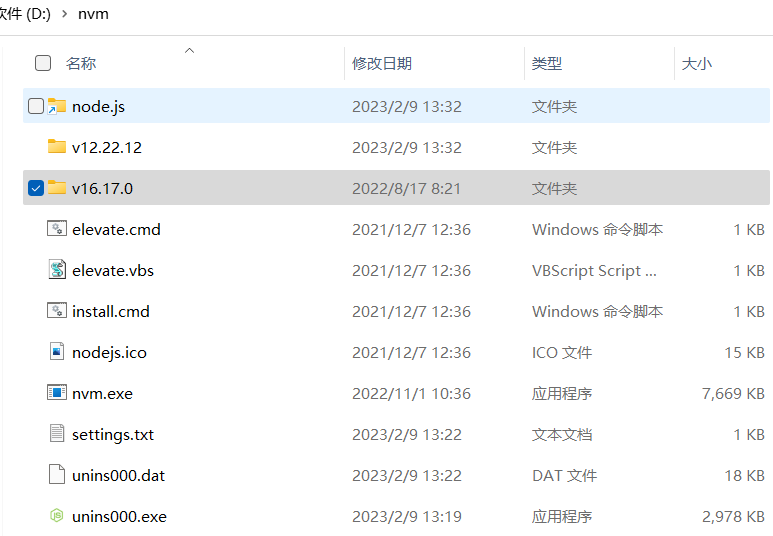
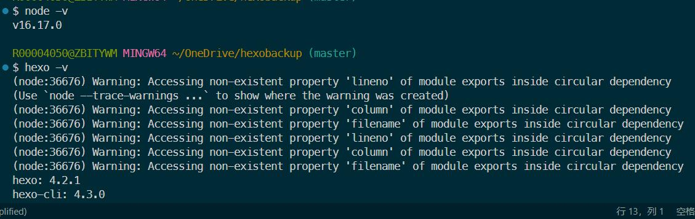
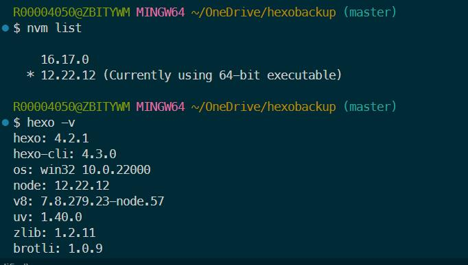

## nvm

### windows环境安装nvm

安装 [nvm-setup.exe](https://github.com/coreybutler/nvm-windows/releases)

*安装路径不能包含空格*。

1. NVM安装路径设置为 **`D:\nvm`**
2. Node.js Symlink路径设置为 **`D:\nvm\node.js`**

安装nvm前不必卸载之前已安装的node.js环境，安装nvm时会提示“是否允许nvm控制已安装的node.js版本？"，点同意即可。nvm会自动把已安装的Node.js文件夹移动到设置好的Node.js Symlink路径，即 `**D:\nvm\node.js**`。

### 使用nvm解决nodejs版本不兼容造成的hexo警告信息

[根据Hexo官网介绍，不同版本的Hexo依赖不同版本的Node.js](https://hexo.io/docs/#Required-Node-js-version)

If you are stuck with older Node.js, you can consider installing a past version of Hexo.

Please note we do not provide bugfixes to past versions of Hexo.

We highly recommend to always install the [latest version](https://www.npmjs.com/package/hexo?activeTab=versions) of Hexo and the [recommended version](https://hexo.io/docs/#Requirements) of Node.js, whenever possible.

| Hexo version | Minimum (Node.js version) | Less than (Node.js version) |
| --- | --- | --- |
| 6.2+ | 12.13.0 | latest |
| 6.0+ | 12.13.0 | 18.5.0 |
| 5.0+ | 10.13.0 | 12.0.0 |
| 4.1 - 4.2 | 8.10 | 10.0.0 |
| 4.0 | 8.6 | 8.10.0 |
| 3.3 - 3.9 | 6.9 | 8.0.0 |
| 3.2 - 3.3 | 0.12 | unknown |
| 3.0 - 3.1 | 0.10 or iojs | unknown |
| 0.0.1 - 2.8 | 0.10 | unknown |

hexo在较高版本的node.js环境下运行时的警告：

使用nvm命令安装（`nvm install v12`）并使用`nvm use`命令切换node.js版本为v12，警告消失：

<!-- more -->

## 环境搭建

npm安装 vue-cli: `npm install -g vue-cli`

当前 index.html 路径下安装 vue.js: `npm i vue --save`

`vue init webpack-simple Demo5`

好多，不想写了...
