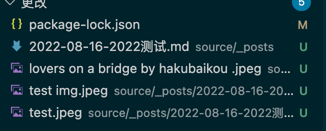

## Hexo 使用教程

### 1.新建页面

命令：`hexo new post 2022测试`

添加 Tags：修改 tags 内容为`tags: [Github,hexo]`

### 2.添加图片


<!-- more -->


引用方法 3 不可用：``


### 本地启动

```bash
hexo clean
hexo g -d
hexo s
```

## Hexo 升级

升级 hexo：`npm install hexo-cli -g`
安装插件：`npm install hexo-renderer-marked --save`
删除插件：`npm remove hexo-renderer-marked`

> [What does 'x packages are looking for funding' mean when running \`npm install\`?](https://stackoverflow.com/questions/58972251/what-does-x-packages-are-looking-for-funding-mean-when-running-npm-install)
