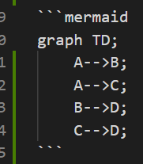
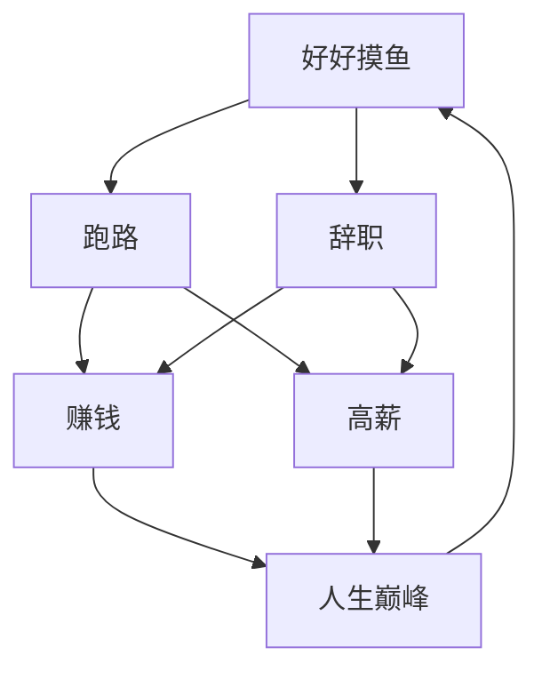
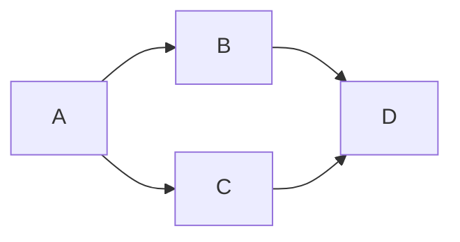
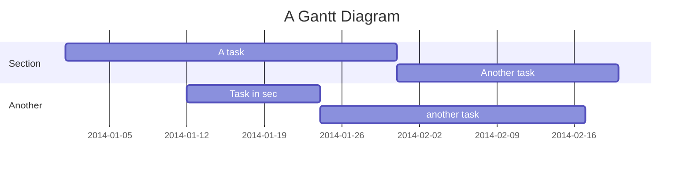
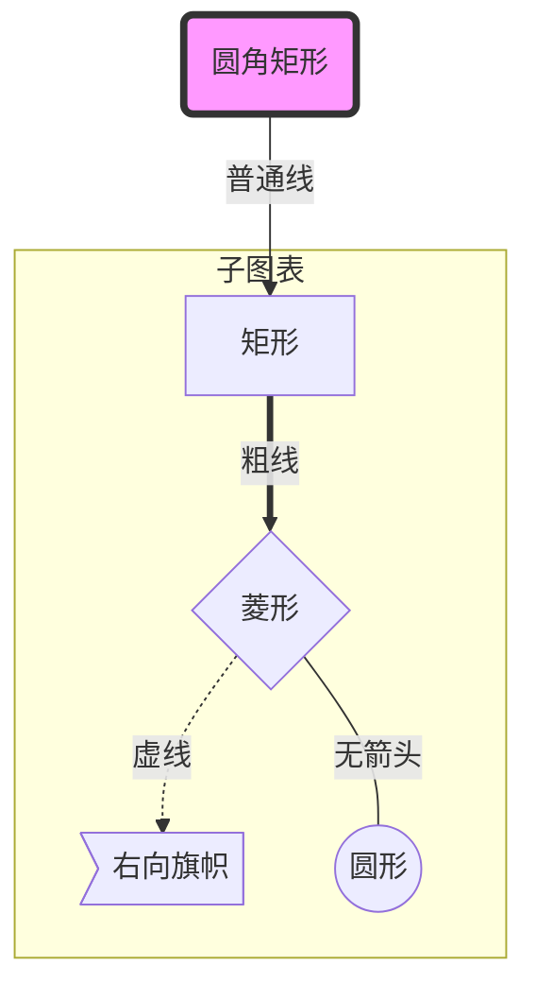
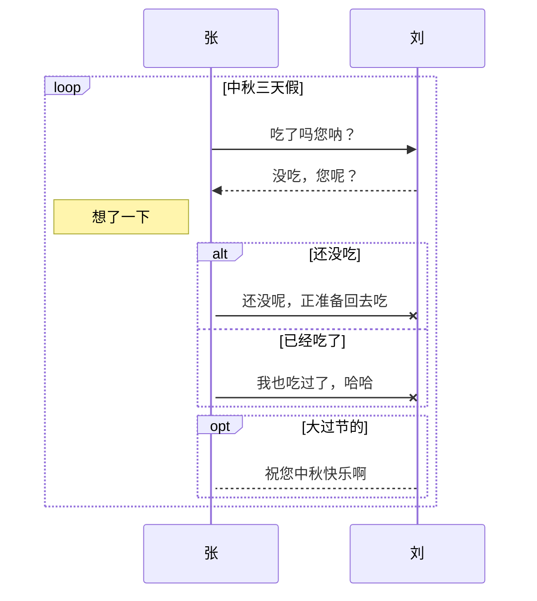
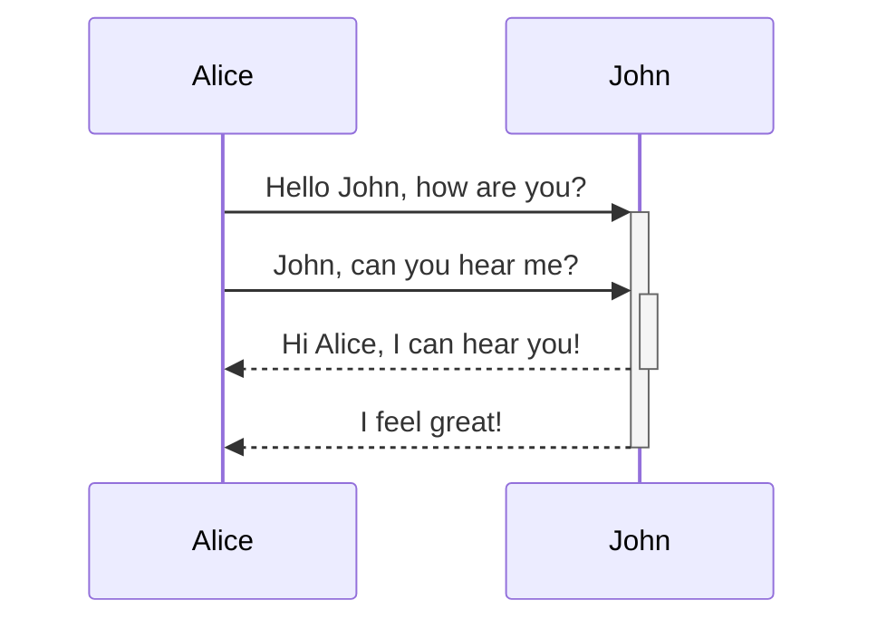
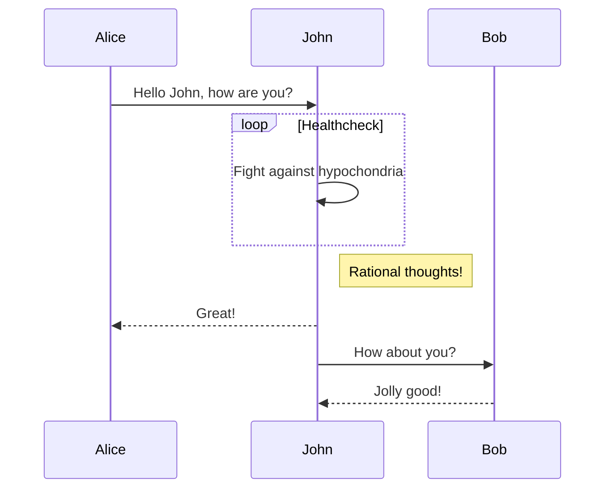

## mermaid 流程图

### graph测试

垂直流程图 `graph TD`：

```mermaid
graph TD;
    好好摸鱼-->辞职;
    好好摸鱼-->跑路;
    跑路-->赚钱;
    辞职-->赚钱;
    跑路-->高薪;
    辞职-->高薪;
    赚钱-->人生巅峰;
    高薪-->人生巅峰;        
    人生巅峰-->好好摸鱼;
```

水平流程图

```mermaid
graph LR;
    A-->B;
    A-->C;
    B-->D;
    C-->D;
```

```mermaid
graph TD;
    A-->B;
    A-->C;
    B-->D;
    C-->D;
```

---

flowchart 测试

```mermaid
gantt
    title A Gantt Diagram
    dateFormat  YYYY-MM-DD
    section Section
    A task           :a1, 2014-01-01, 30d
    Another task     :after a1  , 20d
    section Another
    Task in sec      :2014-01-12  , 12d
    another task      : 24d
```

```mermaid
graph TB
    id1(圆角矩形)--普通线-->id2[矩形]
    subgraph 子图表
        id2==粗线==>id3{菱形}
        id3-.虚线.->id4>右向旗帜]
        id3--无箭头---id5((圆形))
    end
    style id1 fill:#f9f,stroke:#333,stroke-width:4px
```

```mermaid
sequenceDiagram
    participant z as 张
    participant l as 刘
    loop 中秋三天假
        z->>l: 吃了吗您呐？
        l-->>z: 没吃，您呢？
        activate z
        Note left of z: 想了一下
        alt 还没吃
            z-xl: 还没呢，正准备回去吃
        else 已经吃了
            z-xl: 我也吃过了，哈哈
        end
        opt 大过节的
            l-->z: 祝您中秋快乐啊
        end
    end
```

---

```mermaid
sequenceDiagram
    Alice->>+John: Hello John, how are you?
    Alice->>+John: John, can you hear me?
    John-->>-Alice: Hi Alice, I can hear you!
    John-->>-Alice: I feel great!
```

---

sequenceDiagram测试

```mermaid
sequenceDiagram;
Alice->>John: Hello John, how are you?
loop Healthcheck
    John->>John: Fight against hypochondria
end
Note right of John: Rational thoughts!
John-->>Alice: Great!
John->>Bob: How about you?
Bob-->>John: Jolly good!
```

---
