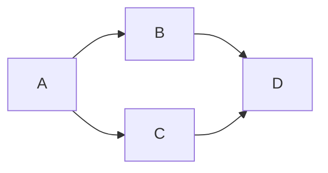
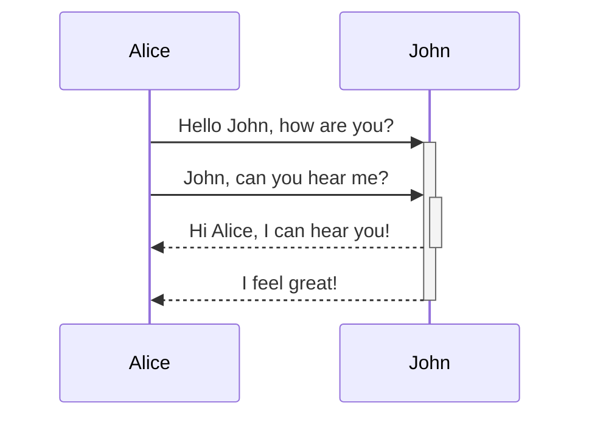
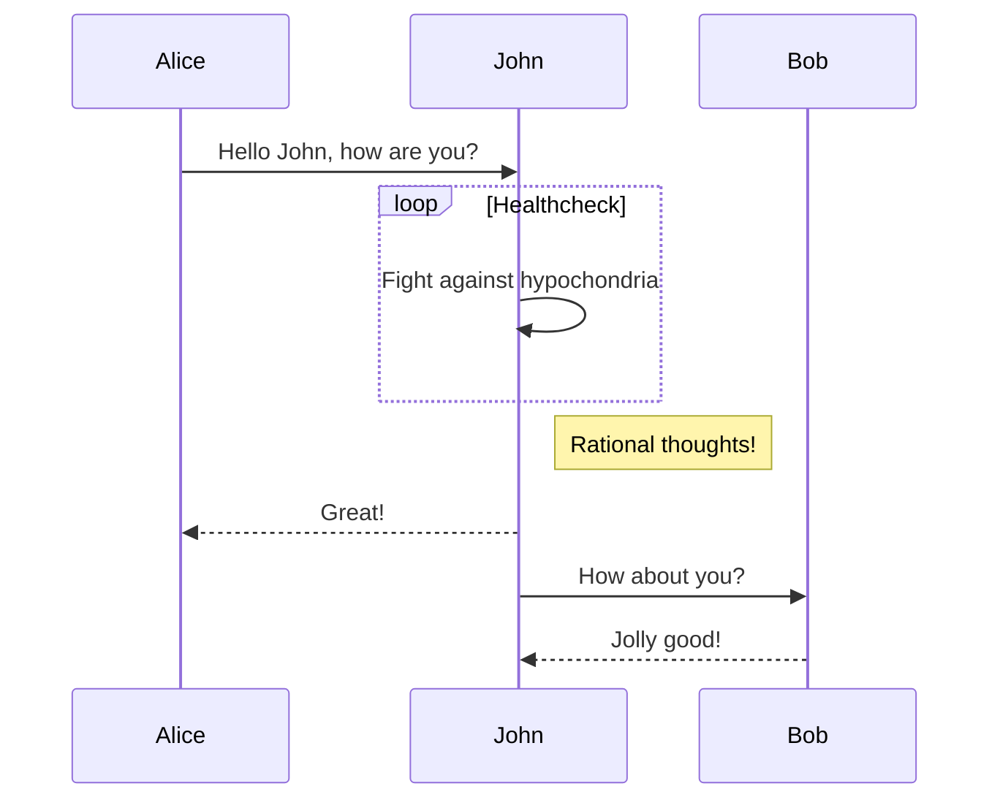

## mermaid 流程图


graph测试

```cs
graph TD;
    A-->B;
    A-->C;
    B-->D;
    C-->D;
```


```mermaid
graph TD;
    A-->B;
    A-->C;
    B-->D;
    C-->D;
```


```mermaid
graph LR;
    A-->B;
    A-->C;
    B-->D;
    C-->D;
```

---

flowchart测试


```mermaid
sequenceDiagram
    Alice->>+John: Hello John, how are you?
    Alice->>+John: John, can you hear me?
    John-->>-Alice: Hi Alice, I can hear you!
    John-->>-Alice: I feel great!
```

---

sequenceDiagram测试


```mermaid
sequenceDiagram;
Alice->>John: Hello John, how are you?
loop Healthcheck
    John->>John: Fight against hypochondria
end
Note right of John: Rational thoughts!
John-->>Alice: Great!
John->>Bob: How about you?
Bob-->>John: Jolly good!
```
