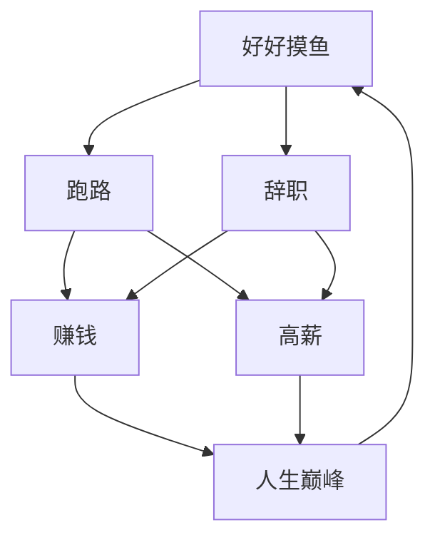
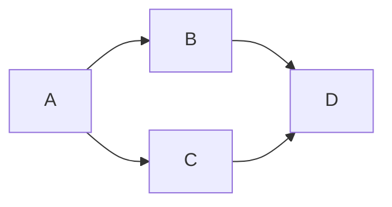
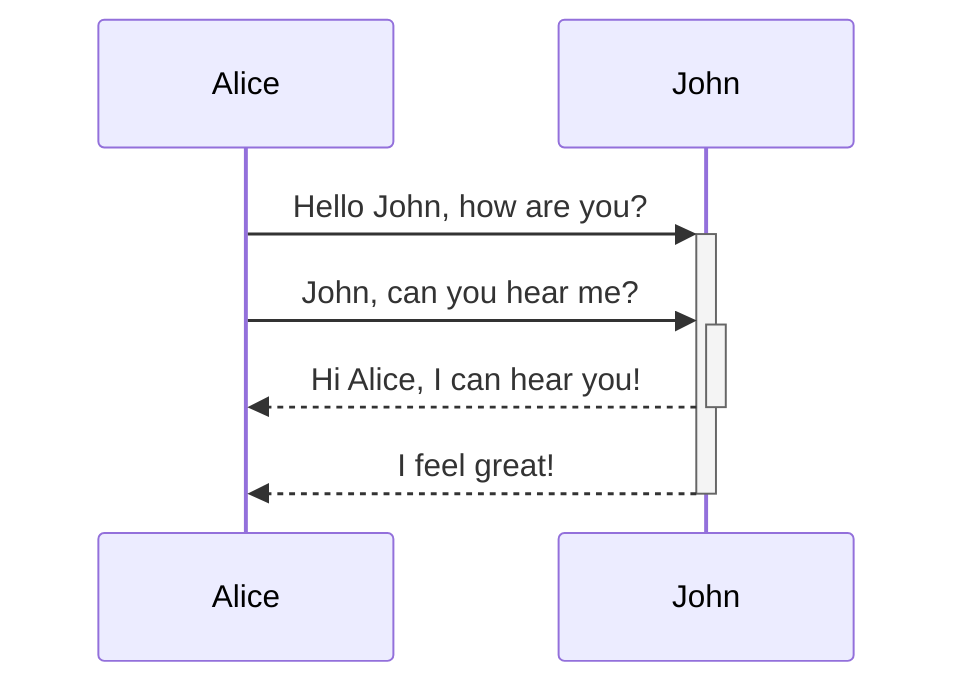
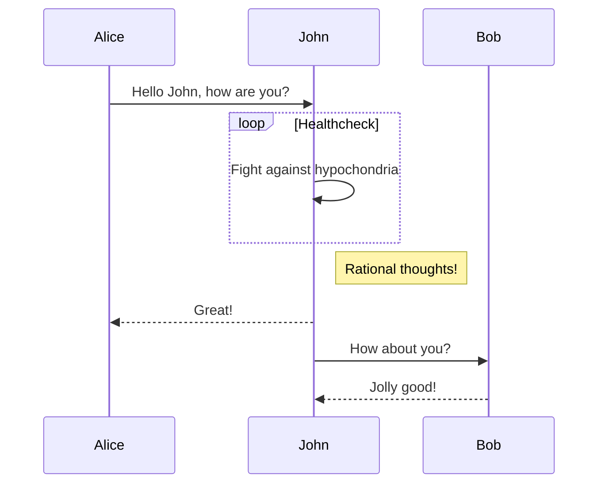

## mermaid 流程图

### graph测试

垂直流程图 `graph TD`：

```mermaid
graph TD;
    好好摸鱼-->辞职;
    好好摸鱼-->跑路;
    跑路-->赚钱;
    辞职-->赚钱;
    跑路-->高薪;
    辞职-->高薪;
    赚钱-->人生巅峰;
    高薪-->人生巅峰;        
    人生巅峰-->好好摸鱼;
```

水平流程图

```mermaid
graph LR;
    A-->B;
    A-->C;
    B-->D;
    C-->D;
```

```mermaid
graph TD;
    A-->B;
    A-->C;
    B-->D;
    C-->D;
```

---

flowchart测试

```mermaid
sequenceDiagram
    Alice->>+John: Hello John, how are you?
    Alice->>+John: John, can you hear me?
    John-->>-Alice: Hi Alice, I can hear you!
    John-->>-Alice: I feel great!
```

---

sequenceDiagram测试

```mermaid
sequenceDiagram;
Alice->>John: Hello John, how are you?
loop Healthcheck
    John->>John: Fight against hypochondria
end
Note right of John: Rational thoughts!
John-->>Alice: Great!
John->>Bob: How about you?
Bob-->>John: Jolly good!
```
