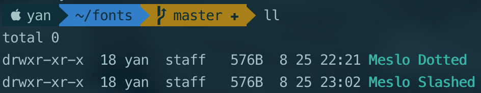

## 背景

需要从 [GitHub 仓库][1] 安装 PowerLine 系列字体，然而字体太多，不想全部克隆下来，又不想一个一个下载单个文件。

<!-- more -->

## 方法

1. 终端输入以下命令，克隆仓库

    ```bash
    git clone \
    --depth 1 \
    --filter=blob:none \
    --no-checkout \
    https://github.com/powerline/fonts \ # 仓库地址
    ```

    > ps: 不包含任何文件，只包含仓库索引文件）

2. 进入克隆的仓库

    ```bash
    cd fonts
    ```

3. 克隆远程仓库里的指定文件夹

   ```bash
   git checkout master Meslo\ Dotted
   git checkout master Meslo\ Slashed
   ```

4. 查看

    

## 参考

[最新git clone 克隆部分文件的方法][2]

---

  [1]: https://github.com/powerline/fonts
  [2]: https://blog.csdn.net/fjh1997/article/details/110074907
