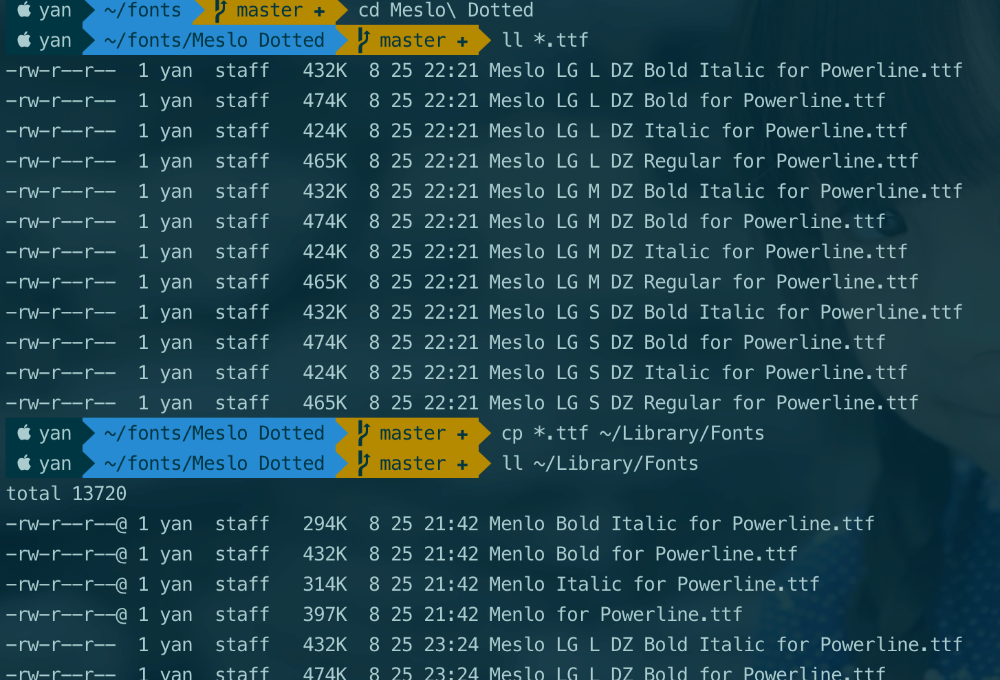
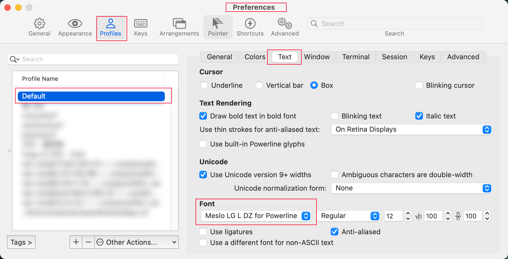

## macOS 安装字体

1. 以下载安装 PowerLine 字体为例，下载仓库为 [https://github.com/powerline/fonts][1]

    ```bash
    git clone \
    --depth 1 \
    --filter=blob:none \
    --no-checkout \
    https://github.com/powerline/fonts \ # 仓库地址
    ;
    cd fonts
    git checkout master Meslo\ Dotted
    git checkout master Meslo\ Slashed
    ```

1. 进入字体文件夹，可以手动打开字体ttf文件进行安装，亦可以批量安装

    ```bash
    cd Meslo\ Dotted
    ll *.ttf
    cp *.ttf ~/Library/Fonts
    ```

    

## VSCode 设置里的终端字体修改

VSCode 用户设置部分，编辑 `settings.json` 文件

```json
    "terminal.integrated.fontFamily": "Meslo LG L DZ for Powerline", // 需安装字体
    "terminal.integrated.defaultProfile.osx": "zsh",
    "terminal.external.osxExec": "iTerm.app",
    "terminal.integrated.profiles.osx": {
        "zsh": {
            "path": "/bin/zsh",
            "args": ["-l"], // 若为空数组 [], 则环境变量有问题；为 ["-l"] 或则不配置 "args" 参数
            "icon": "terminal-powershell"
        }
    },
    "settingsSync.ignoredSettings": [
        "terminal.integrated.fontFamily"
    ]
```

> ps：需要确保指定字体已安装，且字体名称正确。（注意: 字体文件名和字体名称可能不同）

## iTerm 终端字体

iTerm 终端的字体设置方法比较简单



---

  [1]: https://github.com/powerline/fonts
