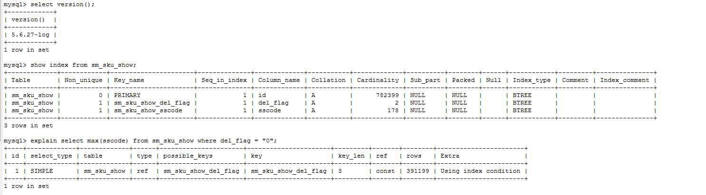
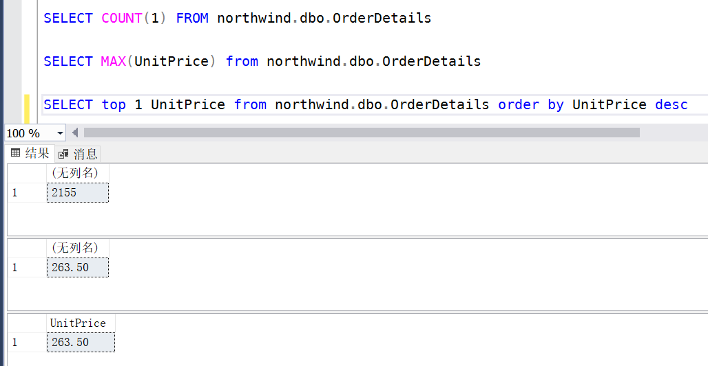
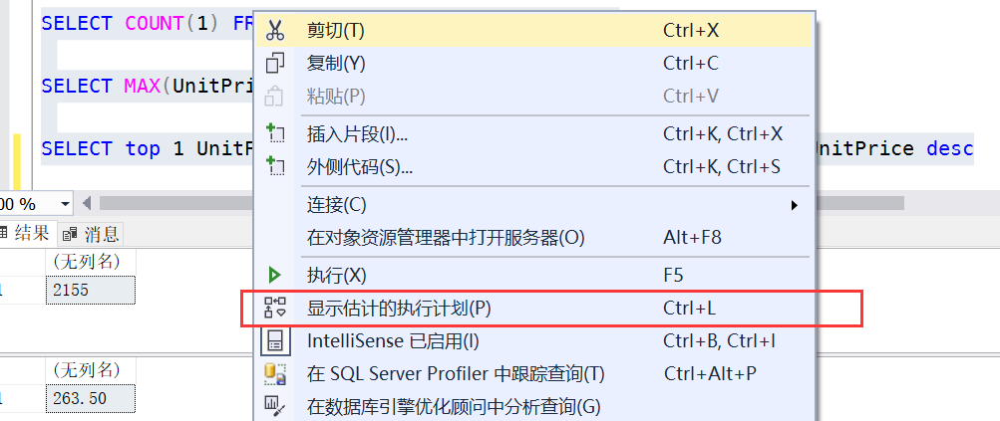
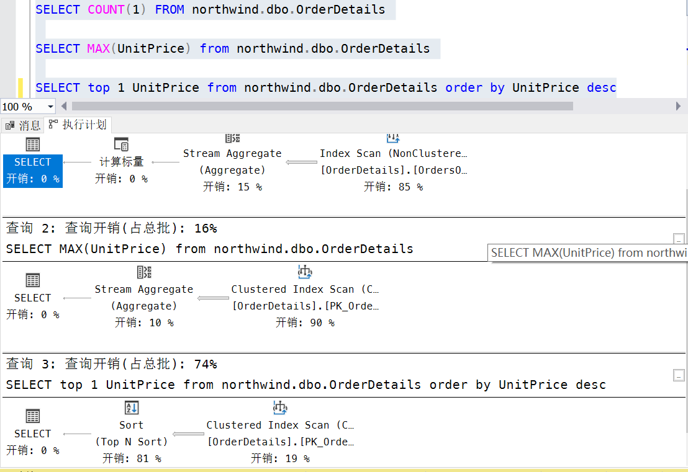

## MySQL中使用order by ... limit 1替换Max函数

测试环境：



测试Sql：

```sql
select max(sscode) from sm_sku_show where del_flag = "0";
select sscode from sm_sku_show where del_flag = "0" order by sscode desc limit 1;
```

测试耗时：

```html
[SQL]
select max(sscode) from sm_sku_show where del_flag = "0";
受影响的行: 0
时间: 19.503s

[SQL]
select sscode from sm_sku_show where del_flag = "0" order by sscode desc limit 1;
受影响的行: 0
时间: 0.001s
```

测试结果：

```html
+---------------------+
| max(sscode)         |
+---------------------+
| SS20180120101925999 |
+---------------------+
1 row in set

+---------------------+
| sscode              |
+---------------------+
| SS20180120101925999 |
+---------------------+
1 row in set
```

**结论**：

max() 函数的需扫描where条件过滤后的所有行。

请慎用max()函数，特别是频繁执行的sql，若需用到可转化为测试中的  order by id desc limit 1

<!-- more -->

---

## SQL Server中Max函数查询优化与查看执行计划

SQL语句：

```SQL
SELECT COUNT(1) FROM northwind.dbo.OrderDetails

SELECT MAX(UnitPrice) from northwind.dbo.OrderDetails

SELECT TOP 1 UnitPrice from northwind.dbo.OrderDetails order by UnitPrice desc
```

执行结果：


查看执行计划：


预估的执行计划：


- [参考1][1]
- [参考2][2]

---
  [1]: https://codeantenna.com/a/dPHrkc3gb1
  [2]: https://blog.csdn.net/aumgla/article/details/79125979
