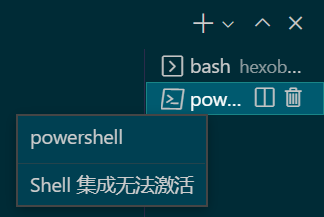
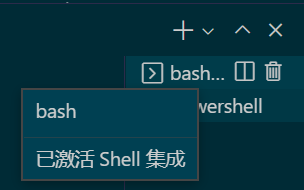

## 问题描述



## 解决方法

<!-- more -->
不同的终端设置方式不同。

首先设置 `settings.json` 文件，添加如下设置

```json
"terminal.integrated.shellIntegration.enabled":false,
```

### bash

Add the following to your `~/.bashrc` file. Run `code ~/.bashrc` in bash to open the file in VS Code.

```bash
[[ "$TERM_PROGRAM" == "vscode" ]] && . "$(code --locate-shell-integration-path bash)"
```

重启终端，结果如下：



参考官方文档：[https://code.visualstudio.com/docs/terminal/shell-integration#_manual-installation](https://code.visualstudio.com/docs/terminal/shell-integration#_manual-installation)
