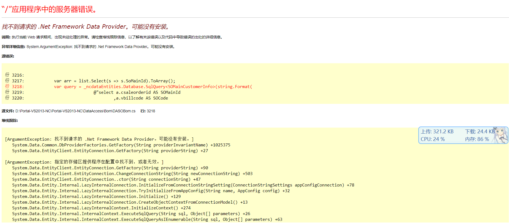
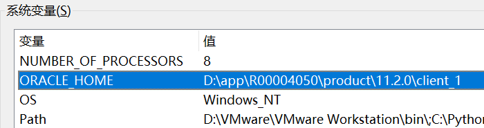
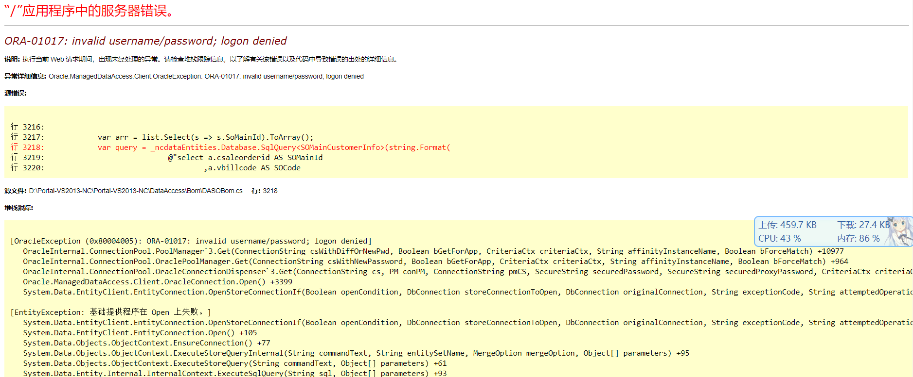

## 解决错误信息：找不到请求的 .Net Framework Data Provider。可能没有安装

### “/”应用程序中的服务器错误



<!-- more -->

---

## *找不到请求的 .Net Framework Data Provider。可能没有安装。*

**说明:** 执行当前 Web 请求期间，出现未经处理的异常。请检查堆栈跟踪信息，以了解有关该错误以及代码中导致错误的出处的详细信息。

**异常详细信息:** System.ArgumentException: 找不到请求的 .Net Framework Data Provider。可能没有安装。

**源错误:**

```C#
行 3216:
行 3217:            var arr = list.Select(s => s.SoMainId).ToArray();
行 3218:            var query = _ncdataEntities.Database.SqlQuery<SOMainCustomerInfo>(string.Format( 
行 3219:                            @"select a.csaleorderid AS SOMainId
,a.vbillcode AS SOCode
```

**源文件:** `D:\\Portal-VS2013-NC\\Portal-VS2013-NC\\DataAccess\\Bom\\DASOBom.cs` **行:** 3218

**堆栈跟踪:**

```C#
[ArgumentException: 找不到请求的 .Net Framework Data Provider。可能没有安装。]
   System.Data.Common.DbProviderFactories.GetFactory(String providerInvariantName) +1025375
   System.Data.EntityClient.EntityConnection.GetFactory(String providerString) +27

[ArgumentException: 指定的存储区提供程序在配置中找不到，或者无效。]
   System.Data.EntityClient.EntityConnection.GetFactory(String providerString) +90
   System.Data.EntityClient.EntityConnection.ChangeConnectionString(String newConnectionString) +503
   System.Data.EntityClient.EntityConnection..ctor(String connectionString) +47
   System.Data.Entity.Internal.LazyInternalConnection.InitializeFromConnectionStringSetting(ConnectionStringSettings appConfigConnection) +78
   System.Data.Entity.Internal.LazyInternalConnection.TryInitializeFromAppConfig(String name, AppConfig config) +32
   System.Data.Entity.Internal.LazyInternalConnection.Initialize() +129
   System.Data.Entity.Internal.LazyInternalConnection.CreateObjectContextFromConnectionModel() +13
   System.Data.Entity.Internal.LazyInternalContext.InitializeContext() +274
   System.Data.Entity.Internal.InternalContext.ExecuteSqlQuery(String sql, Object[] parameters) +26
   System.Data.Entity.Internal.InternalContext.ExecuteSqlQueryAsIEnumerable(String sql, Object[] parameters) +63
   System.Data.Entity.Internal.InternalContext.ExecuteSqlQuery(Type elementType, String sql, Object[] parameters) +175
   System.Data.Entity.Internal.InternalSqlNonSetQuery.GetEnumerator() +26
   System.Data.Entity.Internal.InternalSqlQuery`1.GetEnumerator() +17
   System.Collections.Generic.List`1..ctor(IEnumerable`1 collection) +174
   System.Linq.Enumerable.ToList(IEnumerable`1 source) +61
   Portal.DataAccess.Bom.DASOBom.GetCPSOBomMainList(List`1 soBomList, Int32& pageid, Int32 pagesize) in D:\Portal-VS2013-NC\Portal-VS2013-NC\DataAccess\Bom\DASOBom.cs:3218
   Portal.BLL.Bom.SOBom.GetCPSOBomMainObjectList(List`1 soBomList, Int32& pageid, Int32 pagesize) in D:\Portal-VS2013-NC\Portal-VS2013-NC\BLL\Bom\SOBom.cs:2611
   Portal.Web.bom.SOBomMain_CP.InitData(String strSearchText) in D:\Portal-VS2013-NC\Portal-VS2013-NC\web\bom\SOBomMain_CP.aspx.cs:108
   Portal.Web.bom.SOBomMain_CP.BtnSearchClick(Object sender, EventArgs e) in D:\Portal-VS2013-NC\Portal-VS2013-NC\web\bom\SOBomMain_CP.aspx.cs:151
   Portal.Web.bom.SOBomMain_CP.Page_Load(Object sender, EventArgs e) in D:\Portal-VS2013-NC\Portal-VS2013-NC\web\bom\SOBomMain_CP.aspx.cs:49
   System.Web.Util.CalliEventHandlerDelegateProxy.Callback(Object sender, EventArgs e) +52
   System.Web.UI.Control.OnLoad(EventArgs e) +97
   System.Web.UI.Control.LoadRecursive() +61
   System.Web.UI.Page.ProcessRequestMain(Boolean includeStagesBeforeAsyncPoint, Boolean includeStagesAfterAsyncPoint) +693
```

**版本信息:** Microsoft .NET Framework 版本:4.0.30319; ASP.NET 版本:4.8.4494.0

---

## 问题原因

出现此错误的原因是：**Oracle数据库的ODP.NET驱动没有安装**。

ps:

> **首先考虑 ODP.NET 是否安装成功**的，其次，考虑x86/x64的原因，您的项目的build target(x86/x64)设定要与本机安装的ODP.NET的驱动版本(x86/x64)要一致。

---

## Windows下查看与设置环境变量

使用命令或在系统环境变量中设置 `ORACLE_HOME` 环境变量。

命令设置方式参考：

[Windows10通过cmd命令行添加环境变量_code_god_1024的博客-CSDN博客_命令行添加环境变量](https://blog.csdn.net/csdjia11/article/details/107773757)

## 设置ORACLE_HOME环境变量

查看设置的环境变量是否正确: `echo %ORACLE_HOME%`

```CMD
D:\Downloads\压缩文件\ODP.NET_Managed_ODAC122cR1_3>echo %ORACLE_HOME%
D:\app\R00004050\product\11.2.0\client_1
```

若没有定义，去系统环境变量中添加，`D:\app\R00004050\product\11.2.0\client_1`



---

## 下载与安装ODP.NET驱动

.Net应用程序与ODP.Net处理器类型保持一致。

查看`web.config`文件

```XML
<TargetFrameworkVersion>v4.0</TargetFrameworkVersion>
...
<PlatformTarget>x86</PlatformTarget>
```

我是32位x
86版本，.Net Framework 4.0

下载地址(总揽):
<http://www.oracle.com/technetwork/topics/dotnet/downloads/index.html>

64位ODP.Net下载地址:
<http://www.oracle.com/technetwork/database/windows/downloads/index-090165.html>

**32位ODP.Net下载地址**:
<http://www.oracle.com/technetwork/database/windows/downloads/utilsoft-087491.html>

注意下载的时候,跟你的数据库版本保持一致.

下载解压后，打开文件 `readme.htm` 查看安装方法（管理员模式CMD命令安装）。

CMD（管理员模式）：

```CMD
install_odpm.bat %ORACLE_HOME% both true
```

使用命令安装完成后，查看是否生成节点信息。在对应的.NetFramework版本下查看 `machine.config`里面的`<system.data><DbProviderFactories>`节点。

我的文件在：`C:\Windows\Microsoft.NET\Framework\v4.0.30319\Config\machine.config`

[](https://imgse.com/i/vhE8HI)

生成的节点信息：

```XML
<system.data>
    <DbProviderFactories>
      <add name="ODP.NET, Managed Driver" invariant="Oracle.ManagedDataAccess.Client" description="Oracle Data Provider for .NET, Managed Driver" type="Oracle.ManagedDataAccess.Client.OracleClientFactory, Oracle.ManagedDataAccess, Version=4.122.1.0, Culture=neutral, PublicKeyToken=89b483f429c47342" />
      
      <add name="Microsoft SQL Server Compact Data Provider 4.0" invariant="System.Data.SqlServerCe.4.0" description=".NET Framework Data Provider for Microsoft SQL Server Compact" type="System.Data.SqlServerCe.SqlCeProviderFactory, System.Data.SqlServerCe, Version=4.0.0.0, Culture=neutral, PublicKeyToken=89845dcd8080cc91" />
    </DbProviderFactories>
  </system.data>
```

---

至此，驱动应该安装完成了。

---

## 安装ODP.NET后重启应用



“/”应用程序中的服务器错误

---

## *ORA-01017: invalid username/password; logon denied*

**说明:** 执行当前 Web 请求期间，出现未经处理的异常。请检查堆栈跟踪信息，以了解有关该错误以及代码中导致错误的出处的详细信息。

**异常详细信息:** Oracle.ManagedDataAccess.Client.OracleException: ORA-01017: invalid username/password; logon denied

**源错误:**

```C#

行 3216:
行 3217:            var arr = list.Select(s => s.SoMainId).ToArray();
行 3218:            var query = _ncdataEntities.Database.SqlQuery<SOMainCustomerInfo>(string.Format( 行 3219:                            @"select a.csaleorderid AS SOMainId
行 3220:                                    ,a.vbillcode AS SOCode

```

**源文件:** D:\\Portal-VS2013-NC\\Portal-VS2013-NC\\DataAccess\\Bom\\DASOBom.cs **行:** 3218

**堆栈跟踪:**

```C#
[OracleException (0x80004005): ORA-01017: invalid username/password; logon denied]
   OracleInternal.ConnectionPool.PoolManager`3.Get(ConnectionString csWithDiffOrNewPwd, Boolean bGetForApp, CriteriaCtx criteriaCtx, String affinityInstanceName, Boolean bForceMatch) +10977
   OracleInternal.ConnectionPool.OraclePoolManager.Get(ConnectionString csWithNewPassword, Boolean bGetForApp, CriteriaCtx criteriaCtx, String affinityInstanceName, Boolean bForceMatch) +964
   OracleInternal.ConnectionPool.OracleConnectionDispenser`3.Get(ConnectionString cs, PM conPM, ConnectionString pmCS, SecureString securedPassword, SecureString securedProxyPassword, CriteriaCtx criteriaCtx) +1065
   Oracle.ManagedDataAccess.Client.OracleConnection.Open() +3399
   System.Data.EntityClient.EntityConnection.OpenStoreConnectionIf(Boolean openCondition, DbConnection storeConnectionToOpen, DbConnection originalConnection, String exceptionCode, String attemptedOperation, Boolean& closeStoreConnectionOnFailure) +41

[EntityException: 基础提供程序在 Open 上失败。]
   System.Data.EntityClient.EntityConnection.OpenStoreConnectionIf(Boolean openCondition, DbConnection storeConnectionToOpen, DbConnection originalConnection, String exceptionCode, String attemptedOperation, Boolean& closeStoreConnectionOnFailure) +220
   System.Data.EntityClient.EntityConnection.Open() +105
   System.Data.Objects.ObjectContext.EnsureConnection() +77
   System.Data.Objects.ObjectContext.ExecuteStoreQueryInternal(String commandText, String entitySetName, MergeOption mergeOption, Object[] parameters) +95
   System.Data.Objects.ObjectContext.ExecuteStoreQuery(String commandText, Object[] parameters) +61
   System.Data.Entity.Internal.InternalContext.ExecuteSqlQuery(String sql, Object[] parameters) +93
   System.Data.Entity.Internal.InternalContext.ExecuteSqlQueryAsIEnumerable(String sql, Object[] parameters) +63
   System.Data.Entity.Internal.InternalContext.ExecuteSqlQuery(Type elementType, String sql, Object[] parameters) +175
   System.Data.Entity.Internal.InternalSqlNonSetQuery.GetEnumerator() +26
   System.Data.Entity.Internal.InternalSqlQuery`1.GetEnumerator() +17
   System.Collections.Generic.List`1..ctor(IEnumerable`1 collection) +174
   System.Linq.Enumerable.ToList(IEnumerable`1 source) +61
   Portal.DataAccess.Bom.DASOBom.GetCPSOBomMainList(List`1 soBomList, Int32& pageid, Int32 pagesize) in D:\Portal-VS2013-NC\Portal-VS2013-NC\DataAccess\Bom\DASOBom.cs:3218
   Portal.BLL.Bom.SOBom.GetCPSOBomMainObjectList(List`1 soBomList, Int32& pageid, Int32 pagesize) in D:\Portal-VS2013-NC\Portal-VS2013-NC\BLL\Bom\SOBom.cs:2611
   Portal.Web.bom.SOBomMain_CP.InitData(String strSearchText) in D:\Portal-VS2013-NC\Portal-VS2013-NC\web\bom\SOBomMain_CP.aspx.cs:108
   Portal.Web.bom.SOBomMain_CP.BtnSearchClick(Object sender, EventArgs e) in D:\Portal-VS2013-NC\Portal-VS2013-NC\web\bom\SOBomMain_CP.aspx.cs:151
   Portal.Web.bom.SOBomMain_CP.Page_Load(Object sender, EventArgs e) in D:\Portal-VS2013-NC\Portal-VS2013-NC\web\bom\SOBomMain_CP.aspx.cs:49
   System.Web.Util.CalliEventHandlerDelegateProxy.Callback(Object sender, EventArgs e) +52
   System.Web.UI.Control.OnLoad(EventArgs e) +97
   System.Web.UI.Control.LoadRecursive() +61
   System.Web.UI.Page.ProcessRequestMain(Boolean includeStagesBeforeAsyncPoint, Boolean includeStagesAfterAsyncPoint) +693
```

### 解决错误

出现此错误，说明前面安装Oracle连接驱动正常，但是连接配置有问题，所以报用户名密码无效。

查看源码中`_ncdataEntities`对象在初始化时所使用的连接字符串`NCDATAEntities`在`app.config`中的配置内容：

```XML
<add name="NCDATAEntities" connectionString="metadata=res://*/NCDATAModel.csdl|res://*/NCDATAModel.ssdl|res://*/NCDATAModel.msl;provider=Oracle.ManagedDataAccess.Client;provider connection string=&quot;data source=ORCL;password=******;user id=NCDB&quot;" 
providerName="System.Data.EntityClient" />
    
```

这是一种连接字符串的写法，Oracle 对 微软 实体框架 EF6 的支持，在 ODP.NET 的新版本中才有实现。

关注这里的 `data source`, `password`, `user id` 几个关键属性。我们的报错信息 `Oracle.ManagedDataAccess.Client.OracleException: ORA-01017: invalid username/password; logon denied` 主要和这几个参数配置有关。

#### 先了解下 oracle `tnsnames.ora` 文件用法

##### 1.用途

Oracle客户端所需要的一个文件，通过该文件可以配置数据库的连接地址，配好后，Oracle地址了，直接用简易的字符串代替。

如：本该是数据库地址为：`127.0.0.1:1521/orcl`,通过设置`tnsnames.ora`,为它起的别名为：`dataBaseAddr`,就可以用 `dataBaseAddr` 代替了。

##### 2.用法

用以管理员方式运行文本编辑器，打开Oracle客户端目录的`D:\app\R00004050\product\11.2.0\client_1\network\admin\tnsnames.ora`文件，内容如下：

[](https://imgse.com/i/vhEt4f)

```tnsnames.ora
ORCL =
   (DESCRIPTION =
    (ADDRESS = (PROTOCOL = TCP)(HOST = 192.168.80.50)(PORT = 1521))
    (CONNECT_DATA =
      (SERVER = DEDICATED)
      (SERVICE_NAME = ORCL) 
    )
  )

  
```

在我们的项目中的连接字符串所设置的`data source=ORCL` 属性，这里的`ORCL`就是`tnsnames.ora`文件中所配置的别名 `ORCL = (...)`。

### 解决方法

解决方法：检查项目 `app.config` 的 `user id`, `password` 以及这里`tnsnames.ora`文件的 `HOST`,`PORT` 是否正确。

本例中 HOST 地址配置错误，使用了测试环境 Oracle 的 IP 地址，所以将 `HOST` 改为生产环境 IP 地址后 Oracle 数据库连接正确。

---

参考文章：

1. [**错误:找不到请求的 .Net Framework Data Provider。可能没有安装.**](https://www.cnblogs.com/gudi/p/6110875.html)
1. [.net中使用ODP.net访问Oracle数据库（无客户端部署方法）_iteyer的技术博客_51CTO博客](https://blog.51cto.com/iteyer/3239259)
1. [找不到请求的 .Net Framework Data Provider。可能没有安装。](https://social.msdn.microsoft.com/Forums/vstudio/zh-CN/b408efcb-d03f-4ddb-b9a5-e1db2d5b793d/252141998121040358312771430340-net-framework-data?forum=wpfzhchs)
1. [**oracle tnsnames.ora文件用法说明**](https://www.cnblogs.com/Marydon20170307/p/9453064.html)
1. [Oracle Data Provider for .NET（C# 版）入门](https://www.oracle.com/ocom/groups/public/@otn/documents/webcontent/229640_zhs.htm)
1. [ODP.NET_风神修罗使的博客-CSDN博客](https://blog.csdn.net/WuLex/article/details/87303446)
1. [Installing Oracle Data Provider for .NET, Managed Driver](https://docs.oracle.com/cd/E63277_01/win.121/e63268/installODPmd.htm#ODPNT8149)
1. [Windows10通过cmd命令行添加环境变量_code_god_1024的博客-CSDN博客_命令行添加环境变量](https://blog.csdn.net/csdjia11/article/details/107773757)
