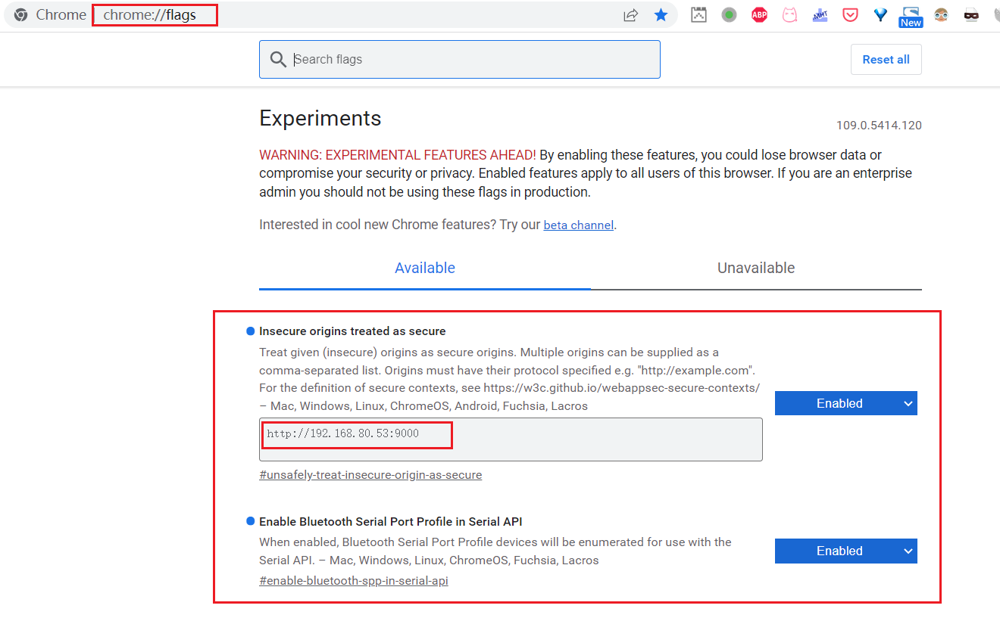
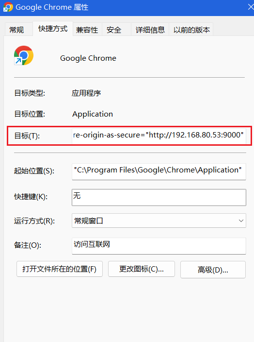

* [前期准备](#前期准备)
* [资源链接](#资源链接)
* [代码示例](#代码示例)
  * [检查浏览器是否支持](#检查浏览器是否支持)
  * [打开串行端口](#打开串行端口)
* [地磅读数代码示例](#地磅读数代码示例)
* [chrome浏览器配置在http协议使用web串行api](#chrome浏览器配置在http协议使用web串行api)

<!-- more -->

## 前期准备

1. 学习 **Web Serial API**
2. 下载串口模拟工具 VSPD，用于建立虚拟串口对
3. 下载串口调试精灵，用于调试，包括打开、关闭串口，发送、接收数据等
4. 编写 js 代码，读取串口数据

## 资源链接

1. [VSPD](https://cn.bing.com/search?q=VSPD)
2. [串口调试精灵](https://cn.bing.com/search?q=串口调试精灵)
3. [Web Serial API](https://cn.bing.com/search?q=Chrome%20Web%20Serial%20API)

## 代码示例

### 检查浏览器是否支持

只有浏览器支持 **Web Serial API** 才能通过 JavaScript 代码访问串口设备。要检查是否支持 Web Serial API，请使用：

```JavaScript
if ("serial" in navigator) {
  // 支持 Web 串行 API。
}
```

### 打开串行端口

Web Serial API 在设计上是异步的。这可以防止网站 UI 在等待输入时阻塞。要打开串行端口，首先访问一个 SerialPort 对象。为此，可以通过调用 `navigator.serial.requestPort()` 以响应用户手势（例如触摸或鼠标单击）来提示用户选择单个串行端口，或者从返回的 `navigator.serial.getPorts()` 中选择一个网站已被授予访问权限的串行端口列表。

```JavaScript
document.querySelector('button').addEventListener('click', async () => {
  // 提示用户选择任意串口。
  const port = await navigator.serial.requestPort();
});
```

```JavaScript
// 获取用户之前授予网站访问权限的所有串行端口。
const ports = await navigator.serial.getPorts();
```

```JavaScript
// 提示用户选择任意串口。
const port = await navigator.serial.requestPort();

// 等待串口打开。波特率 9600
await port.open({ baudRate: 9600 });
```

还可以在打开串行端口时指定以下任何选项。这些选项是可选的，[查看默认值](https://wicg.github.io/serial/#serialoptions-dictionary)。

* `dataBits`: 每帧的数据位数（7 或 8）。
* `stopBits`: 帧末尾的停止位数（1 或 2）。
* `parity`: 奇偶校验模式（`"none"`, `"even"` 或者 `"odd"`）。
* `bufferSize`: 应创建的读写缓冲区的大小（必须小于 16MB）。
* `flowControl`：流量控制模式（`"none"` 或 `"hardware"`）。

## 地磅读数代码示例

```JavaScript
var $ = window.$;
$find = window.$find;
$(function () {
    if (!("serial" in navigator)) {
        alertError("无法使用", "该浏览器不支持读取串口设备，请更换Chrome浏览器！");
    }

    // 设置全局变量
    window.weightValues = []; //存储最近三次称重值
    window.sameCount = 3; //3 // weightValues数组的大小
    window.r1 = /\)0\s{1,9}(\d*)\s{1,9}\d\d/g; //使用正则表达式匹配读数

    setRadRadioButtonList();
    setHideOrShow();

});

function setRadRadioButtonList() {
    //if ($find("RadRadioButtonList").get_selectedIndex() === -1) {
    //    //若未选，则选中第一次称重
    //    //$find("RadRadioButtonList").set_selectedIndex(0);
    //}

    ////添加切换事件
    //$find("RadRadioButtonList").add_selectedIndexChanged(setHideOrShow);

}

//判断第几次称重要显示的控件
function setHideOrShow() {
    /*const label = $("#RadLabelReadingTip")[0];*/
    //console.log(i.get_selectedIndex());
    //switch ($find("RadRadioButtonList").get_selectedIndex()) {
    //    case 0:
    //        //第一次称重 毛重读数
    //        //label.setHTML(label.getInnerHTML().replace("皮重", "毛重"));
    //        $("#carNumberDiv").show();
    //        $("#containerDeductionDiv").show();
    //        $("#trayDeductionDiv").hide();
    //        $("#InputArea").css("background-color", "orange");
    //        $("#tareWeightDiv").hide();
    //        $("#grossWeightDiv").show();
    //        break;
    //    case 1:
    //        //第二次称重 皮重
    //        //label.setHTML(label.getInnerHTML().replace("毛重", "皮重"));
    //        $("#carNumberDiv").hide();
    //        $("#containerDeductionDiv").hide();
    //        $("#trayDeductionDiv").show();
    //        $("#InputArea").css("background-color", "lightcoral");
    //        $("#tareWeightDiv").show();
    //        $("#grossWeightDiv").hide();
    //        break;
    //    default:
    //        break;
    //}
}

//保存
function savePounds(saveBtn) {
    console.log(saveBtn.name);

    //第几次称重
    //const times = $find("RadRadioButtonList").get_selectedIndex();
    const times = $("#HiddenFieldTimes").val();
    //if (times === -1) {
    //    //若未选，则选中第一次称重
    //    alertBasic("请选择第几次称重");

    //    return false;
    //}
    /*readPounds();*/
    //集装箱号
    /*const containerNumber = $find("RadTextBoxContainerNumber").get_value().trim();*/
    const containerNumber = (new URL(window.location)).searchParams.get("ContainerNumber")?.trim();
    //车牌号
    const carNumber = $find("RadTextBoxCarNumber").get_value().trim();
    if (!carNumber) {
        alertError("输入有误", "车牌号不能为空！");
        return false;
    } else {
        //if (!
        //    /^([京津沪渝冀豫云辽黑湘皖鲁新苏浙赣鄂桂甘晋蒙陕吉闽贵粤青藏川宁琼使领A-Z]{1}[a-zA-Z](([DF]((?![IO])[a-zA-Z0-9](?![IO]))[0-9]{4})|([0-9]{5}[DF]))|[京津沪渝冀豫云辽黑湘皖鲁新苏浙赣鄂桂甘晋蒙陕吉闽贵粤青藏川宁琼使领A-Z]{1}[A-Z]{1}[A-Z0-9]{4}[A-Z0-9挂学警港澳]{1})$/
        //        .test(carNumber)) {
        //    alertError("输入有误", "请重新输入有效的车牌号！");
        //    return false;
        //}
        if (carNumber.length < 3) {
            alertError("输入有误", "请重新输入有效的车牌号！");
            return false;
        }
    }
    //集装箱扣重
    const containerDeduction = $find("RadNumericTextBoxContainerDeduction").get_value();
    //集装箱重范围检查
    if (times === "1" && !containerDeduction) {
        alertError("输入有误", "集装箱扣重不能为空！");
        return false;
    } else {
        //干货箱（钢）                     门尺寸(mm)             内部尺寸(mm)     载重(Kg)                 体积(m3)
        //箱型     尺寸                 宽度     高度     长度     宽度     高度     最大重量 自重     最大载重 最大装载体积
        //20"普柜 20' x 8' x 8' 6" 2, 340 2, 274 5, 896 2, 350 2, 385 27, 000 2, 150 24, 850 33
        //40"普柜 40' x 8' x 8' 6" 2, 339 2, 274 12, 035 2, 350 2, 393 32, 500 3, 700 28, 800 67
        //40" 高柜 40' x 8' x 9' 6" 2, 340 2, 577 12, 035 2, 350 2, 697 34, 000 3, 800 30, 200 76
        //45" 高柜 45' x 8' x 9' 6" 2, 340 2, 585 13, 556 2, 352 2, 697 32, 500 4, 800 27, 820 86
        //柜型
        window.params = (new URL(document.location)).searchParams; // URL接口的searchParams只读属性返回URLSearchParams对象，允许访问URL中包含的GET解码查询参数。
        window.containerType = params.get("ContainerType");
        switch (containerType) {
            case `20'GP`:
                if (Math.abs(containerDeduction - 2150) >= 1000) {
                    alertError("集装箱重范围检查", "请检查输入的集装箱扣重！");
                    return false;
                }
                break;
            case `40'GP`:
                if (Math.abs(containerDeduction - 3700) >= 1000) {
                    alertError("集装箱重范围检查", "请检查输入的集装箱扣重！");
                    return false;
                }
                break;
            case `40'HQ`:
                if (Math.abs(containerDeduction - 3800) >= 1000) {
                    // 40'HQ自重3.8吨 允许输入误差范围1000kg
                    alertError("集装箱重范围检查", "请检查输入的集装箱扣重！");
                    return false;
                }
                break;
            case `45'HQ`:
                if (Math.abs(containerDeduction - 4800) >= 1000) {
                    alertError("集装箱重范围检查", "请检查输入的集装箱扣重！");
                    return false;
                }
                break;
            case `53'HQ`:
                if (Math.abs(containerDeduction - 5380) >= 1000) {
                    alertError("集装箱重范围检查", "请检查输入的集装箱扣重！");
                    return false;
                }
                break;
            default:
        }
    }
    //托盘扣重
    const trayDeduction = $find("RadNumericTextBoxTrayDeduction").get_value();
    if (times === "2" && !trayDeduction) {
        alertError("输入有误", "托盘扣重不能为空！");
        return false;
    }
    if (!containerNumber) {
        alertError("输入有误", "集装箱号不能为空！");
        return false;
    }
    //(async function() {
    //    const result = await readPounds();
    //    return result;
    //})();
    const isSuccess = readPounds();
    isSuccess.then((res) => {
        if (!Promise.resolve(res)) {
            return false;
        } else {
            //毛重读数
            const grossWeight = $("#RadLabelGrossWeight2")[0].innerText;
            if (times === "1" && !grossWeight) {
                alertError("读数有误", "毛重读数不能为空！");
                return false;
            }
            //皮重读数
            //const tareWeight = $find("RadNumericTextBoxTareWeight").get_textBoxValue();
            const tareWeight = $("#RadLabelTareWeight2")[0].innerText;
            if (times === "2" && !tareWeight) {
                alertError("读数有误", "皮重读数不能为空！");
                return false;
            }
            // TODO 异步请求：保存
            //window.$find("BtnSave").set_enabled(false);
            $(`#${saveBtn.name}`)[0].disabled = false;
            $.ajax(
                {
                    type: "POST",
                    url: "MLWeightReadPounds.aspx/AjaxSavePounds",
                    data: JSON.stringify({
                        containerNumber: containerNumber,
                        times: times,
                        grossWeight: grossWeight,
                        tareWeight: tareWeight,
                        value: times === "1" ? grossWeight : tareWeight,
                        userId: $("#HiddenFieldUserId").val(),
                        carNumber: carNumber,
                        containerType: containerType,
                        containerDeduction: containerDeduction,
                        trayDeduction: trayDeduction,
                        purchaseOrder: params.get("PurchaseOrder"),
                        declarationId: params.get("DeclarationId")
                    }),
                    dataType: "json",
                    // async: false,
                    contentType: "application/json; charset=utf-8",
                    success: function (infos) {
                        const jsonRes = JSON.parse(infos.d);
                        console.log(jsonRes);
                        if (jsonRes.status === "200") {
                            alertSuccess("保存成功！");
                        } else {
                            //alert(infos.d.errMsg);
                            console.log(jsonRes);
                            alertError(jsonRes.errMsg, jsonRes.exception);
                        }

                        window.location.reload();
                        //window.$find("BtnSave").set_enabled(true);
                        $(`#${saveBtn.name}`)[0].disabled = false;
                    },
                    error: function (exception) {
                        alertError("浏览器Ajax请求错误", exception.responseText);
                        //window.$find("BtnSave").set_enabled(true);
                        $(`#${saveBtn.name}`)[0].disabled = false;
                    }
                });
            return true;
        }
    });
    return true;
}

// 临时保存读数至会话存储
function savePoundsToLocalStorage(weightValue) {
    const userId = $("#HiddenFieldUserId")[0].value; // 工号
    const containerId = $("#HiddenFieldContainerId")[0].value; // 集装箱Id
    //第几次称重
    //const times = $find("RadRadioButtonList").get_selectedIndex();
    const times = $("#HiddenFieldTimes").val();
    sessionStorage.setItem("ML_WEIGHT_USERID", userId);
    sessionStorage.setItem("ML_WEIGHT_CONTAINER_ID", containerId);
    sessionStorage.setItem(`ML_WEIGHT_VALUE_${times}`, weightValue);
}

async function readPounds() {
    // 判断是否支持Web串行API。
    if (!("serial" in navigator)) {
        alertError("Web串行接口无法使用", "该浏览器不支持读取串口设备，请更换Chrome浏览器！");
        //alert("该浏览器不支持读取串口设备，请更换Chrome浏览器！");
    } else {
        // 获取用户之前授予网站访问权限的所有串行端口。
        const ports = await navigator.serial.getPorts();

        console.log(`已授权的串行端口：${ports.length} 个`);
        ports.forEach(p => console.log(p));

        let port;

        // TODO 闫伟明 串行端口选错连接不上异常处理；串行端口选择过滤

        if (ports.length === 1) {
            port = ports[0];
            console.log("选择第一个端口打开");
        } else {
            console.log("请选择一个端口打开");
            // 提示用户选择任意串口。
            port = await navigator.serial.requestPort();
        }

        try {
            // 等待串口打开。
            await port.open({
                baudRate: 9600,/*建立串行通信的波特率*/
                dataBits: 8,/*每帧的数据位数*/
                stopBits: 1,/*帧末尾的停止位数*/
                parity: "even",/*奇偶校验模式*/
                bufferSize: 255,/*缓冲区大小*/
                flowControl: "none"/*流量控制模式*/
            });

        } catch (e) {
            console.log(`等待串口打开中...${e}`);
        }

        console.log("端口打开成功！");

        toast("打开串口", `${port}端口打开成功！`);

        window.weightValues = []; //存储最近三次称重值
        //window.sameCount = 10; //3 // weightValues数组的大小
        //window.r1 = /\)0\s{5}(\d*)\s{5}00/g; //使用正则表达式匹配读数

        let s = new String(); // 储存地磅串行接口传来的数据 一个完整的数据是十六进制字符串
        while (port.readable) {
            const reader = port.readable.getReader();
            console.log(`获取到串行输出流：${reader}`);
            try {
                console.log("开始监听串行流...");
                // 监听来自串行设备的数据。
                outerWhileLoop: while (true) {
                    console.log("正等待读取串行输出流...");
                    const { value, done } = await reader.read();
                    console.log("读取串行输出流...");
                    if (done) {
                        // 允许稍后关闭串口。
                        reader.releaseLock();
                        break;
                    }

                    // 值是一个 Uint8Array.
                    console.log(`接收数据 Uint8Array 中...${value}`);
                    console.log(`转换数据 Uint8ArrayToString 中...${Uint8ArrayToString(value)}`);
                    console.log(s);
                    s += Uint8ArrayToString(value);
                    if (s.length < 200) {
                        console.log("累计收到字符串长度小于200，继续读取...");
                        continue;
                    } else if (s.length > 10000) {
                        s = "";
                        console.log("累计收到字符串长度大于10000，清空...");
                    }

                    // 2022年12月16日13:32:54 新数据格式解析 -- START
                    console.log(`使用 ${r1} 进行正则匹配...`);
                    while (r1.exec(s)) {
                        const curWeight = RegExp.$1;
                        console.log(curWeight + " " + new Date());
                        window.showWeight(curWeight);
                        // 取值3次，3次相等即为结果
                        if (weightValues.length < sameCount) {
                            //称重值小于3个，入队
                            weightValues.push(curWeight);
                        } else {
                            //称重值3个，先出队再入队
                            weightValues.shift();
                            weightValues.push(curWeight);
                        }
                        console.log(`weightValues:${weightValues}`);

                        if (weightValues.length === sameCount) {
                            //判断最近三次值是否相等
                            const elementsAreEqual = weightValues.every(weightValue => weightValue === weightValues[0]);
                            if (elementsAreEqual) {
                                //三次值相等 确定称重结果
                                //console.log(`weightValues:${weightValues}`);
                                console.log(`weightValues[0]:${weightValues[0]}`);
                                //window.setWeight(weightValues[0]);
                                const times = $("#HiddenFieldTimes").val();
                                switch (times) {
                                    case "1":
                                        //第一次称重 毛重读数
                                        //$("#RadNumericTextBoxGrossWeight").val(weightValues[0]);
                                        $("#RadLabelGrossWeight2")[0].innerText = weightValues[0];
                                        break;
                                    case "2":
                                        //第二次称重 皮重
                                        //$("#RadNumericTextBoxTareWeight").val(weightValues[0]);
                                        $("#RadLabelTareWeight2")[0].innerText = weightValues[0];

                                        break;
                                    default:
                                        break;
                                }
                                toast(`读数成功：${weightValues[0]}`);

                                // 存储至localstorage
                                //savePoundsToLocalStorage(weightValues[0]);

                                // 清空接收到的数据，准备下次读取
                                s = "";

                                //若要停止读数
                                //允许稍后关闭串口。
                                console.log("releasing Lock");
                                reader.releaseLock();
                                //关闭串口
                                await port.close();
                                //跳出监听循环，退出读磅函数
                                console.log("已经关闭串口");
                                break outerWhileLoop;
                            } else {
                                //三次值不等 继续
                                //console.log(`weightValues:${weightValues}`);
                                console.log("weightMsg三次值不相等");
                            }

                        } else if (weightValues.length > sameCount) {
                            console.error("执行错误，队列溢出");
                            window.weightValues = [];
                            console.error("已重置队列为空");
                        }

                        // 实时显示本次称重值
                        // 因为$("#<%=ReadingPounds.ClientID %>").text(`${weightMsg}`);只能在aspx文件中，放在独立js文件中无法正确编译，故抽取成方法，使用windows对象调用。
                        window.showWeight(weightValues[0]);

                    }

                    // -- END 新数据格式解析

                    // START T800数据帧解析
                    /*//s1储存地磅传来一个完整数据帧的数据部分，应是15个字节
                    const s1 = s.substring(s.lastIndexOf("02") + 2, s.lastIndexOf("0D"));
                    if (s1.length === 30) {
                        //转换过程：十六进制字符串-- > 十进制int数-- > 二进制表示字符串
                        const dec = parseInt(s1.substring(0, 2), 16).toString(2);
                        //状态字A部分
                        console.log(dec);
                        //状态字A的Bits 0,1,2 小数点位
                        const flag = dec.substring(dec.length - 3);

                        // 用于确定小数点位置
                        let flag2 = "";
                        for (let k = flag.length - 1; k >= 0; k--) {
                            flag2 += flag[k];
                        }

                        //显示重量、毛重或者净重
                        //共6个字节，表示6位不带符号不带小数点的数字
                        //转换过程：十六进制字符串 --> 十进制整数int（Unicode值） --> 数字（ascii字符）
                        const ss = s1.substring(6, 18);
                        console.log(`ss:${ss}`);
                        // 临时存储最终结果的6位数字
                        let buffer = "";
                        for (let i = 0; i < ss.length; i += 2) {
                            console.log(`十六进制字符串 --> 十进制整数int（Unicode值）：${ss.substring(i, i + 2)} --> ${parseInt(ss.substring(i, i + 2), 16)}`);

                            //先十六进制字符串 --> 十进制整数int（Unicode值），再将 Unicode 值转换为字符:
                            buffer += String.fromCharCode(parseInt(ss.substring(i, i + 2), 16));

                            console.log(`buffer:${buffer}`);
                        }

                        console.log(`buffer 临时存储最终结果的6位数字:${buffer}`);

                        let weightMsg = "";
                        // 判断小数点的位置
                        switch (flag) {
                            case "111":
                                weightMsg = `${buffer.substring(0, 1)}.${buffer.substring(1, 6)}`;
                                break;
                            case "011":
                                weightMsg = `${buffer.substring(0, 2)}.${buffer.substring(2, 6)}`;
                                break;
                            case "101":
                                weightMsg = `${buffer.substring(0, 3)}.${buffer.substring(3, 6)}`;
                                break;
                            case "001":
                                weightMsg = `${buffer.substring(0, 4)}.${buffer.substring(4, 6)}`;
                                break;
                            case "110":
                                weightMsg = `${buffer.substring(0, 5)}.${buffer.substring(5, 6)}`;
                                break;
                            case "010":
                                weightMsg = `${buffer.substring(0, 6)}`;
                                break;
                            case "100":
                                weightMsg = `${buffer.substring(1, 6)}0`;
                                break;
                            case "000":
                                weightMsg = `${buffer.substring(2, 6)}00`;
                                break;
                        }

                        // 取值3次，3次相等即为结果
                        if (weightValues.length < 3) {
                            //称重值小于3个，入队
                            weightValues.push(weightMsg);
                        } else {
                            //称重值3个，先出队再入队
                            weightValues.shift();
                            weightValues.push(weightMsg);
                        }
                        console.log(`weightValues:${weightValues}`);
                        

                        if (weightValues.length === 3) {
                            //判断最近三次值是否相等
                            const elementsAreEqual = weightValues.every(weightValue => weightValue === weightValues[0]);
                            if (elementsAreEqual) {
                                //三次值相等 确定称重结果
                                //console.log(`weightValues:${weightValues}`);
                                console.log(`weightValues[0]:${weightValues[0]}`);
                                alert("读数成功！");
                                window.setWeight(weightValues[0]);

                                // 存储至localstorage
                                //savePoundsToLocalStorage(weightValues[0]);

                                //若要停止读数
                                //允许稍后关闭串口。
                                console.log("releasing Lock");
                                reader.releaseLock();
                                //关闭串口
                                await port.close();
                                //跳出监听循环，退出读磅函数
                                console.log("已经关闭串口");
                                break;
                            } else {
                                //三次值不等 继续
                                //console.log(`weightValues:${weightValues}`);
                                console.log("weightMsg三次值不相等");
                            }

                        } else if (weightValues.length > 3) {
                            alert("执行错误，队列溢出");
                        }

                        // 实时显示本次称重值
                        // 因为$("#<%=ReadingPounds.ClientID %>").text(`${weightMsg}`);只能在aspx文件中，放在独立js文件中无法正确编译，故抽取成方法，使用windows对象调用。
                        window.showWeight(weightValues[0]);

                        // 清空接收到的数据，准备下次读取
                        s = "";
                    }*/
                }
                return true;
            } catch (error) {
                console.error(error);
                alertError("监听串行流输出遇到错误", error);
            } finally {
                reader.releaseLock();
            }
        }
        // 获取用户之前授予网站访问权限的所有串行端口。
        //const ports = await navigator.serial.getPorts();
        //alert(ports);
    }
    return false;
}

function Uint8ArrayToString(fileData) {
    var dataString = "";
    for (let i = 0; i < fileData.length; i++) {
        dataString += String.fromCharCode(fileData[i]);
    }
    return dataString;
}

// 检查浏览器版本
function checkBrowserVersion() {
    const browserName = getBrowserName(navigator.userAgent);
    const protocol = window.location.protocol;
    console.log(`You are using: ${browserName} over ${protocol} protocol.`);
    if (!("serial" in navigator)) {
        alertError("无法使用", "请更换Chrome或Edge浏览器访问此页面（该浏览器不支持读取串口设备）！");
        //$("body").html(`<div class="container"><h1>${`You are using: ${browserName} over ${protocol}// protocol.`
        //    }</h1><hr/><h2>检测到该浏览器不支持读取串口设备！</h2><h3>Please change your Chrome or Edge browser to visit this page (as this browser does not support accessing and reading serial port devices)!</h3></div>`);
    }
}

function getBrowserName(userAgent) {
    // The order matters here, and this may report false positives for unlisted browsers.

    if (userAgent.includes("Firefox")) {
        // "Mozilla/5.0 (X11; Linux i686; rv:104.0) Gecko/20100101 Firefox/104.0"
        return "Mozilla Firefox";
    } else if (userAgent.includes("SamsungBrowser")) {
        // "Mozilla/5.0 (Linux; Android 9; SAMSUNG SM-G955F Build/PPR1.180610.011) AppleWebKit/537.36 (KHTML, like Gecko) SamsungBrowser/9.4 Chrome/67.0.3396.87 Mobile Safari/537.36"
        return "Samsung Internet";
    } else if (userAgent.includes("Opera") || userAgent.includes("OPR")) {
        // "Mozilla/5.0 (Macintosh; Intel Mac OS X 12_5_1) AppleWebKit/537.36 (KHTML, like Gecko) Chrome/104.0.0.0 Safari/537.36 OPR/90.0.4480.54"
        return "Opera";
    } else if (userAgent.includes("Trident")) {
        // "Mozilla/4.0 (compatible; MSIE 7.0; Windows NT 10.0; WOW64; Trident/7.0; .NET4.0C; .NET4.0E; .NET CLR 2.0.50727; .NET CLR 3.0.30729; .NET CLR 3.5.30729)"
        return "Microsoft Internet Explorer";
    } else if (userAgent.includes("Edge")) {
        // "Mozilla/5.0 (Windows NT 10.0; Win64; x64) AppleWebKit/537.36 (KHTML, like Gecko) Chrome/58.0.3029.110 Safari/537.36 Edge/16.16299"
        return "Microsoft Edge (Legacy)";
    } else if (userAgent.includes("Edg")) {
        // "Mozilla/5.0 (Windows NT 10.0; Win64; x64) AppleWebKit/537.36 (KHTML, like Gecko) Chrome/104.0.0.0 Safari/537.36 Edg/104.0.1293.70"
        return "Microsoft Edge (Chromium)";
    } else if (userAgent.includes("Chrome")) {
        // "Mozilla/5.0 (X11; Linux x86_64) AppleWebKit/537.36 (KHTML, like Gecko) Chrome/104.0.0.0 Safari/537.36"
        return "Google Chrome or Chromium";
    } else if (userAgent.includes("Safari")) {
        // "Mozilla/5.0 (iPhone; CPU iPhone OS 15_6_1 like Mac OS X) AppleWebKit/605.1.15 (KHTML, like Gecko) Version/15.6 Mobile/15E148 Safari/604.1"
        return "Apple Safari";
    } else {
        return "unknown";
    }
}

// my弹窗封装
function alertPro(type, title, text) {
    window.Swal.fire({
        icon: type,
        title: title,
        text: text//,
        //footer: '<a href="">测试弹窗</a>'
    });
}

// 错误弹窗提示
function alertError(title, text) {
    alertPro("error", title, text);
}

// 简单弹窗提示
function alertBasic(text) {
    window.Swal.fire(text);
}

// 成功弹窗提示
function alertSuccess(title, text) {
    window.Swal.fire(
        title,
        text,
        "success"
    );
}

// Toast
function toast(text) {

    window.Swal.mixin({
        toast: true,
        position: "top-end",
        showConfirmButton: false,
        timer: 3000,
        timerProgressBar: true,
        didOpen: (toast) => {
            toast.addEventListener("mouseenter", window.Swal.stopTimer);
            toast.addEventListener("mouseleave", window.Swal.resumeTimer);
        }
    }).fire({
        icon: "success",
        title: text
    });
}
```

## chrome浏览器配置在http协议使用web串行api

Web串行Api需要域是HTTPS协议的，否则该api被Chrome屏蔽，无法被调用。仅在本地localhost调试开发时可以使用http域，Chrome浏览器会暴露该api。

可以通过配置Chrome浏览器解除这个限制，需要配置两个地方：

1. 打开`chrome://flags/`，设置`Insecure origins treated as secure`为`Enabeld`，填入要配置的域名`http://192.168.80.53:9000`

   * Enable Bluetooth Serial Port Profile in Serial API为开启蓝牙设备串行api。
1. 在桌面`Google Chrome`图标的快捷方式上，鼠标右键点`属性`，修改`目标`字段加上启动参数，修改后为`"C:\Program Files\Google\Chrome\Application\chrome.exe" --unsafely-treat-insecure-origin-as-secure="http://192.168.80.53:9000"`

