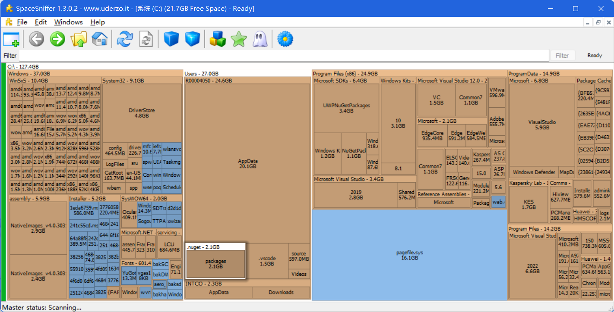
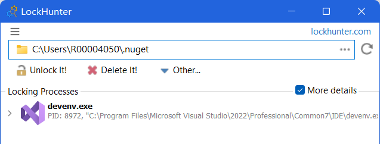
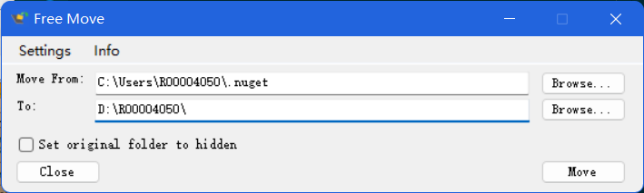

三款软件、按顺序使用即可，无损移动C盘文件至其他盘，不影响使用。

1. [SpaceSniffer 磁盘文件大小可视化分析，找到大文件夹](http://www.uderzo.it/main_products/space_sniffer/download.html)
2. [LockHunter 解除文件进程占用](https://lockhunter.com/download.htm)
3. [FreeMove 建立软链接的方式移动C盘大文件夹至其他盘](https://github.com/imDema/FreeMove/releases)

<!-- more -->

