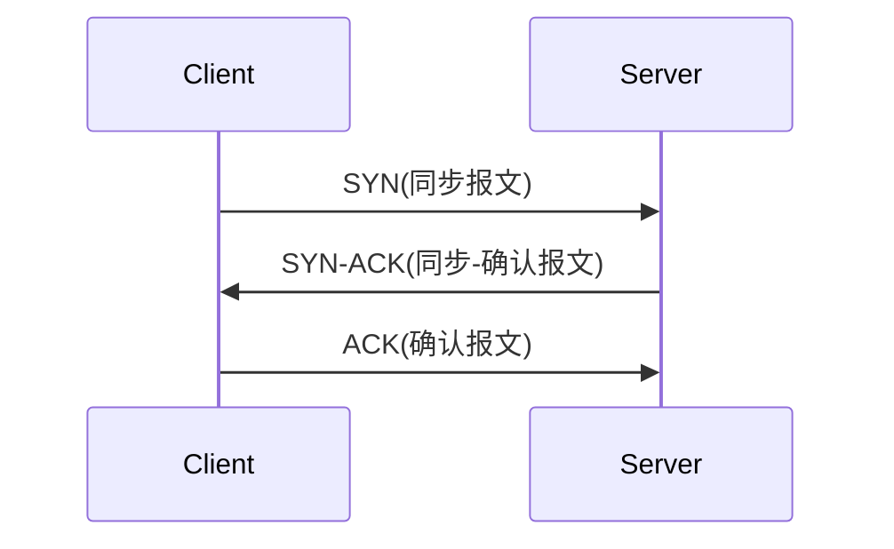
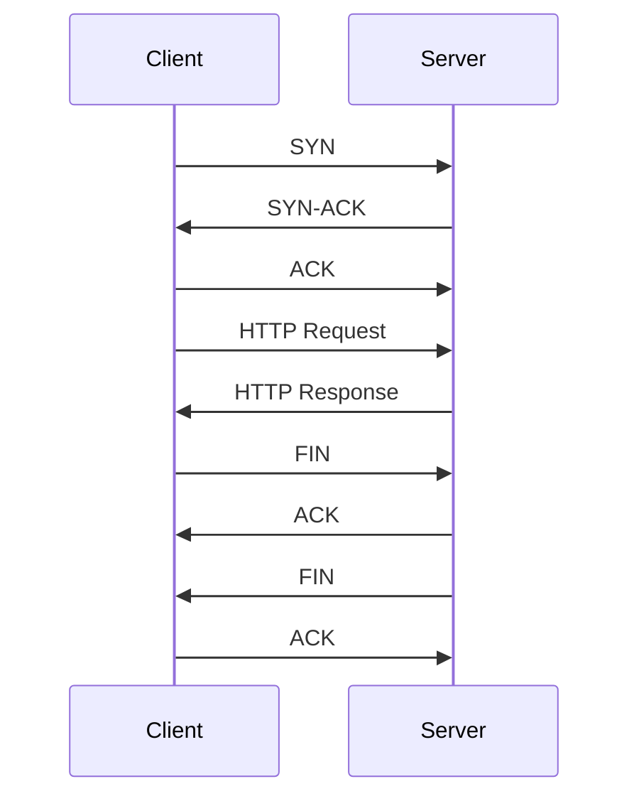
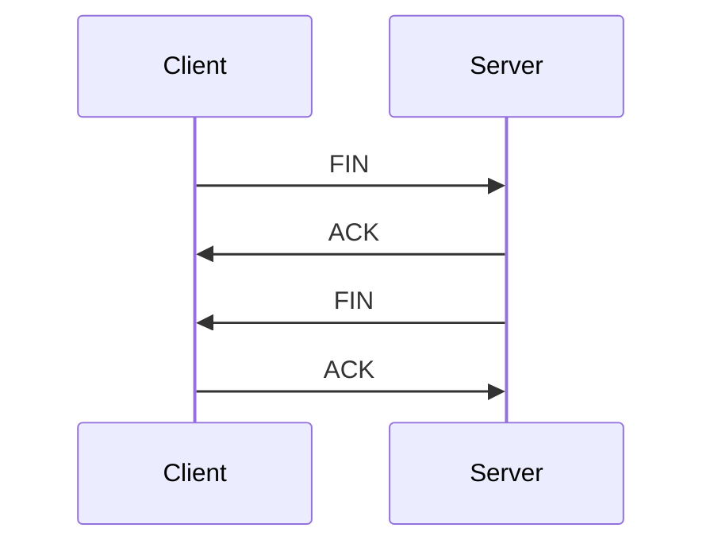
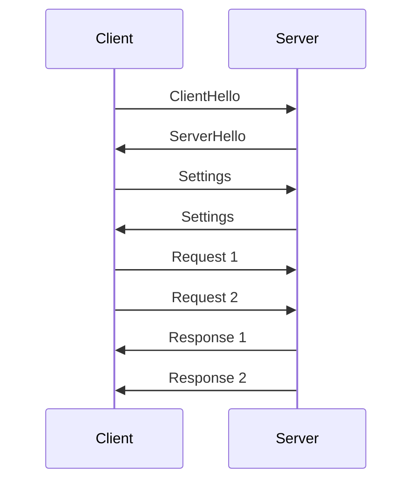
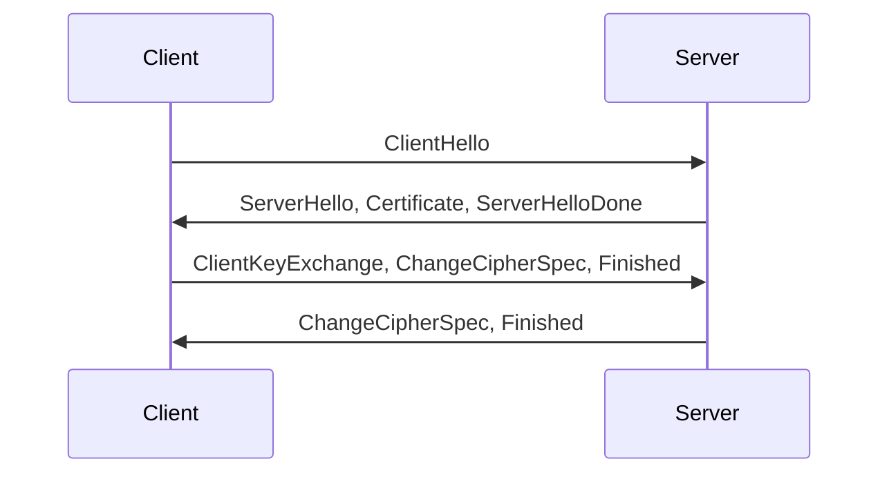
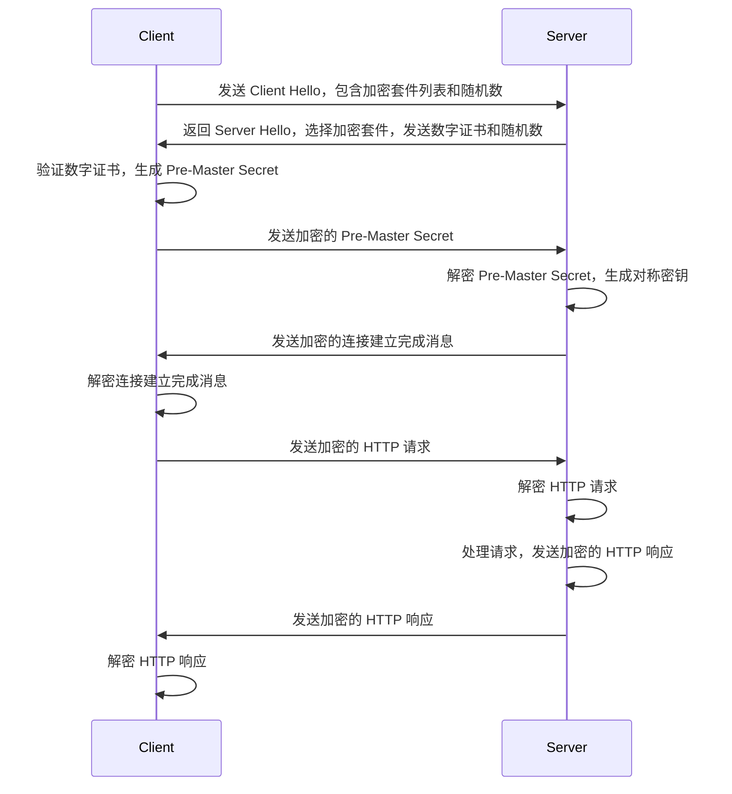

## TCP和HTTP握手

### TCP三次握手建立连接

TCP 是传输控制协议（Transmission Control Protocol）的缩写，用于在计算机之间可靠地传输数据。在建立 TCP 连接时，需要进行三次握手，即客户端发送 SYN 报文，服务器返回 SYN-ACK 报文，客户端再发送 ACK 报文，从而建立连接。这个过程的目的是确保双方都能够接收和发送数据，以保证数据传输的可靠性和完整性。

具体来说，TCP 连接的三次握手过程如下：

1. 客户端发送 SYN 报文：客户端向服务器发送 SYN（同步）报文，请求建立连接，并选择一个随机的初始序列号（sequence number）。
2. 服务器返回 SYN-ACK 报文：服务器收到客户端的 SYN 报文后，向客户端发送 SYN-ACK（同步-确认）报文，表示已收到客户端的请求，并确认客户端的初始序列号。服务器同时也选择一个随机的初始序列号。
3. 客户端发送 ACK 报文：客户端收到服务器的 SYN-ACK 报文后，向服务器发送 ACK（确认）报文，确认收到了服务器的确认，并发送自己的初始序列号。此时，TCP 连接已建立。

以下是 TCP 连接三次握手的 Mermaid 代码和图示：

### 基于TCP的HTTP

<!-- more -->

HTTP 是超文本传输协议（Hypertext Transfer Protocol）的缩写，用于在 Web 上传输数据。HTTP 建立在 TCP 上，因此 HTTP 的建立过程需要先建立 TCP 连接。因此，HTTP 连接的建立过程包含了 TCP 连接的三次握手过程。

在 HTTP/1.1 中，每个连接只能处理一个请求和响应，也就是说，在处理完一个请求和响应后，连接会立即关闭。因此，在 HTTP/1.1 中，每个连接都需要进行一次完整的三次握手和四次挥手。HTTP/2 引入了多路复用机制，可以在一个连接上同时处理多个请求和响应，从而减少了建立和关闭连接的开销。

以下是 HTTP 连接建立过程的 Mermaid 代码和图示：

### TCP四次挥手关闭连接

TCP 连接的四次挥手（Four-way handshake）用于关闭已建立的 TCP 连接，以确保数据的可靠传输。四次挥手的过程如下：

1. 客户端发送 FIN 报文：客户端请求关闭连接，向服务器发送 FIN（结束）报文。
2. 服务器返回 ACK 报文：服务器收到客户端的 FIN 报文后，向客户端发送 ACK（确认）报文，表示已收到关闭请求。
3. 服务器发送 FIN 报文：服务器确认可以关闭连接后，向客户端发送 FIN 报文，请求关闭连接。
4. 客户端返回 ACK 报文：客户端收到服务器的 FIN 报文后，向服务器发送 ACK 报文，表示已收到服务器的关闭请求，并确认可以关闭连接。此时，TCP 连接关闭。

以下是 TCP 连接四次挥手的 Mermaid 代码和图示：

### HTTP协议版本

**HTTP/1.1** 和 **HTTP/2** 都是应用层协议，用于在 Web 上传输数据。它们的主要区别在于传输数据的方式和性能方面。

#### **HTTP/1.1** 和 **HTTP/2** 的区别

| 特性 | HTTP/1.1 | HTTP/2 |
| --- | --- | --- |
| 多路复用 | 不支持 | 支持 |
| 二进制分帧 | 不支持 | 支持 |
| 首部压缩 | 不支持 | 支持 |
| 服务器推送 | 不支持 | 支持 |
| 安全性 | 需要 TLS/SSL | 需要 TLS/SSL |
| 建立连接 | 需要三次握手 | 需要TLS/SSL的加密握手 |
| 请求优先级 | 不支持 | 支持 |
| 语义 | 每个请求都需要一个新的 TCP 连接 | 多个请求可以共享一个 TCP 连接 |
| 性能 | 每个请求都需要一个新的 TCP 连接，带来了较高的延迟和消耗 | 可以在同一个连接中同时处理多个请求，降低了延迟和消耗 |

**HTTP/1.1** 是顺序传输的，每个请求和响应都需要建立一个 TCP 连接，而且每个连接只能处理一个请求和响应。因此，每个请求和响应都需要经过完整的 HTTP/1.1 的三次握手和四次挥手的过程。这样的方式导致了以下问题：

* 每次连接的建立和关闭都需要时间，增加了网络延迟。
* 每个连接都需要消耗服务器和客户端的资源，限制了并发请求的数量。
* 每个请求都需要发送一些重复的数据，例如请求头，增加了数据传输的开销。

**HTTP/2** 引入了多路复用机制，可以在一个连接上同时处理多个请求和响应。HTTP/2 使用二进制协议，将请求和响应的数据划分为多个帧，每个帧都有一个独立的 ID，可以根据 ID 重新组装数据。这种方式的好处包括：

* 可以复用连接，减少建立和关闭连接的开销。
* 可以在一个连接上同时处理多个请求和响应，提高并发性能。
* 可以发送多个请求和响应的数据帧，减少了数据传输的开销。

#### HTTP/1.1和HTTP/2建立连接流程图

下面是使用 Mermaid 绘制的 HTTP/1.1 从建立 TCP 连接到关闭 TCP 连接的流程图：

HTTP/1.1 的流程图可以分为三个主要阶段：建立连接、发送请求和关闭连接。在建立连接阶段，客户端向服务器发送一个 SYN 报文，服务器收到后会回复一个 SYN-ACK 报文，客户端再回复一个 ACK 报文，建立起 TCP 连接。在发送请求阶段，客户端向服务器发送一个 HTTP 请求报文，服务器收到后会回复一个 HTTP 响应报文。在关闭连接阶段，客户端发送一个 FIN 报文表示不再发送数据，服务器回复一个 ACK 报文确认，然后服务器也发送一个 FIN 报文表示不再发送数据，客户端再回复一个 ACK 报文确认。这样连接就被完全关闭了。

下面是使用 Mermaid 绘制的 HTTP/2 的流程图：

HTTP/2 的流程图也可以分为三个主要阶段：建立连接、发送请求和关闭连接。但是 HTTP/2 的建立连接阶段和 HTTP/1.1 不同，需要进行 TLS/SSL 加密握手，建立安全的连接。在发送请求阶段，客户端可以同时发送多个请求，在同一个连接中进行多路复用。在接收请求阶段，服务器可以同时发送多个响应，在同一个连接中进行多路复用。在关闭连接阶段，客户端和服务器都可以发送一个 GOAWAY 帧来关闭连接。

以下是 HTTP/2 的建立连接阶段的流程图，使用 Mermaid 语法：

解释如下：

* 首先，客户端向服务器发送 `ClientHello` 报文，其中包含客户端支持的协议版本、加密套件、压缩算法等信息。
* 服务器收到 `ClientHello` 报文后，会回复一个 `ServerHello` 报文，其中包含协商好的协议版本、加密套件、压缩算法等信息，以及服务器的数字证书和一个 `ServerHelloDone` 报文。
* 客户端收到 `ServerHello` 报文后，会向服务器发送 `ClientKeyExchange` 报文，该报文中包含一个随机数、加密协议中使用的密钥等信息。接着，客户端会发送一个 `ChangeCipherSpec` 报文，告诉服务器接下来的通信会使用协商好的密钥。最后，客户端发送一个 `Finished` 报文，其中包含用于校验通信数据完整性的摘要值。
* 服务器收到 `ClientKeyExchange` 报文后，会根据其中的信息生成一个会话密钥，并使用该密钥对 `ChangeCipherSpec` 报文进行加密。服务器也会发送一个 `ChangeCipherSpec` 报文告诉客户端接下来的通信会使用协商好的密钥。接着，服务器会发送一个 `Finished` 报文，其中包含用于校验通信数据完整性的摘要值。

这样，客户端和服务器就成功建立了安全的连接，并开始进行数据传输。

所以，若有以下问题：

问：HTTP/2 的建立连接阶段需要几次连接？

答：HTTP/2 的建立连接阶段需要一次 TCP 连接，类似于 HTTP/1.1，但是在建立 TCP 连接后，HTTP/2 会使用一些新的协议和技术来优化数据传输，从而提高性能和安全性。具体而言，HTTP/2 采用了二进制协议，引入了多路复用、帧、流等概念，可以更高效地利用一个 TCP 连接来传输多个请求和响应，而不是像 HTTP/1.1 那样每个请求都需要建立一个 TCP 连接。因此，HTTP/2 可以减少网络延迟和资源占用，提高页面加载速度和用户体验。

问：HTTP/2请求需要几次 TCP 连接？

答：在 **HTTP/2 中，一个客户端和一个服务器之间只需要建立一次 TCP 连接，即可进行多个请求和响应的交互**。这是因为 HTTP/2 引入了多路复用技术，通过在一个 TCP 连接上同时进行多个流（stream）的请求和响应，从而避免了 HTTP/1.1 中一个请求需要建立一个 TCP 连接的缺点，提高了网络性能和资源利用率。同时，HTTP/2 还支持服务器推送（server push）等新特性，使得客户端可以在不发送请求的情况下接收服务器主动推送的资源，进一步提高了性能。

## HTTPS协议

HTTPS（Hypertext Transfer Protocol Secure）是在 HTTP 协议基础上加入 SSL/TLS 安全层的加密协议，通过使用 SSL/TLS 加密和认证机制，确保客户端和服务器之间的通信安全。HTTPS 的建立连接流程可以概括为以下几个步骤：

1. **客户端发起 HTTPS 请求**：客户端通过 URL 或者地址栏输入请求地址，并选择 HTTPS 协议。

2. **服务端返回证书**：服务端接收到客户端请求后，会将自己的 SSL/TLS 证书返回给客户端。证书中包含了服务器的公钥、证书颁发机构的信息和证书有效期等信息。

3. **客户端验证证书**：客户端收到服务端的证书后，会验证证书的合法性。首先会检查证书是否过期，然后会查看证书颁发机构是否可信。如果证书未过期且颁发机构可信，则客户端会**使用证书中的公钥加密**一个随机数，并将加密后的随机数发送给服务端。

4. **服务端解密随机数**：服务端接收到客户端发送的加密随机数后，会**使用自己的私钥进行解密**，得到客户端发来的随机数。

5. **客户端和服务端协商加密算法和密钥**：客户端和服务端使用这个随机数作为对称加密算法中的密钥，对后续的通信进行加密。在这一步中，客户端和服务端会协商使用哪种加密算法和密钥长度，以及其他一些安全相关的参数。常用的加密算法有 AES、RC4、3DES 等。

6. **客户端发送加密请求**：客户端使用协商好的加密算法和密钥，对请求进行加密，并发送给服务端。

7. **服务端解密请求**：服务端接收到客户端发送的加密请求后，会使用协商好的密钥和加密算法进行解密，得到客户端发送的原始请求数据。

8. **服务端加密响应**：服务端使用协商好的加密算法和密钥，对响应进行加密，并发送给客户端。

9. **客户端解密响应**：客户端接收到服务端发送的加密响应后，会使用协商好的密钥和加密算法进行解密，得到服务端发送的原始响应数据。

在上述过程中，SSL/TLS 扮演了重要的角色，保证了通信过程的安全。具体而言，**SSL/TLS 通过使用非对称加密算法和数字证书来验证服务器的身份，保证通信双方的身份真实可信**；*通过使用对称加密算法来加密请求和响应数据，防止中间攻击者截取和篡改数据*。下面是具体的过程：

1. 首先，客户端向服务器发送一个加密套件列表，该列表包含客户端支持的加密算法和协议版本等信息。

2. 服务器从加密套件列表中选择一个加密套件，并向客户端返回服务器的数字证书和一些其他的信息，比如服务器支持的协议版本等。数字证书包含了服务器的公钥，以及一些其他的信息，比如服务器的域名等。

3. 客户端收到服务器返回的数字证书后，首先要验证该数字证书的合法性。具体来说，客户端会检查证书的签名是否合法，证书中的信息是否与服务器提供的其他信息一致，证书是否已过期等。如果数字证书合法，那么客户端会提取其中的公钥。

4. 接下来，客户端生成一个随机数（称为 Pre-Master Secret），并使用服务器的公钥将其加密，然后将加密后的 Pre-Master Secret 发送给服务器。

5. 服务器收到客户端发送的加密后的 Pre-Master Secret 后，**使用自己的私钥将其解密**，得到 Pre-Master Secret。接着，服务器和客户端会分别根据一些预定的规则，使用 Pre-Master Secret 和之前的一些信息，生成出用于加密和解密数据的对称密钥。

6. 客户端和服务器双方现在都有了用于加密和解密数据的对称密钥，通信双方将使用这个对称密钥来加密和解密请求和响应数据。

通过上述过程，SSL/TLS 建立了一个安全的通信渠道，确保了通信过程中数据的隐私性和完整性。中间攻击者即使能够截获通信过程中的数据，也由于**缺乏合法的数字证书**和**私钥无法解密和篡改数据**，从而保证了通信的安全。

下面是 HTTPS 的建立连接和数据传输阶段的流程图：

其中，Client 和 Server 分别代表客户端和服务器，在流程图中表示为两个连续的竖直线。流程图中包含两个部分，第一部分为 HTTPS 建立连接阶段，第二部分为 HTTPS 数据传输阶段。在建立连接阶段，客户端和服务器之间交换加密套件列表、数字证书、随机数等信息，最终生成用于加密和解密数据的对称密钥。在数据传输阶段，客户端和服务器使用该对称密钥来加密和解密 HTTP 请求和响应数据。
