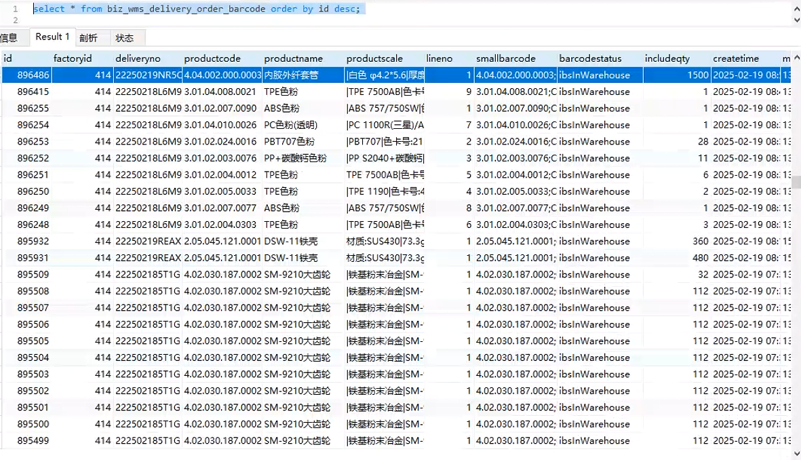

* [问题现象](#问题现象)
* [问题定位](#问题定位)
  * [原sql](#原sql)
  * [原因](#原因)
  * [解决方法](#解决方法)

## 问题现象



- 业务表记录为从SRM同步的送货单相关数据
- 业务表只做插入和更新，没有删除逻辑
- 业务表主键ID自增，`AUTO_INCREMENT`字段
- 业务表出现ID增长不连续、跳跃式增长的现象

```sql
select max(id) from biz_wms_delivery_order_barcode;
-- 913293

select count(id) from biz_wms_delivery_order_barcode;
-- 49314
```

才几万行数据，表ID已经增长到快100万了

## 问题定位

### 原sql

```xml
    <update id="insertDeliveryOrder" parameterType="Map">
        <if test="dataList != null and dataList.size() > 0">
            insert into biz_wms_delivery_order(
            factoryid, deliveryno, deliverytype, purchasetype, status, innervendorcode, lastoperatetime, updatetime, maintainer, createtime)
            values
            <foreach collection="dataList" item="item" open="" close="" separator=",">
                (#{factoryid},#{item.deliveryno},#{item.deliverytype},#{item.purchasetype},#{item.status},#{item.innervendorcode},#{item.lastoperatetime}, #{maintaintime},'sys', #{maintaintime})
            </foreach>
            on duplicate key update deliverytype=values(deliverytype),purchasetype=values(purchasetype),status=values(status),innervendorcode=values(innervendorcode),lastoperatetime=values(lastoperatetime),updatetime=values(updatetime),maintainer=values(maintainer)
        </if>
    </update>

    <update id="insertDeliveryOrderDetails" parameterType="Map">
     <if test="linelist != null and linelist.size() > 0">
         insert into biz_wms_delivery_order_detail(
            factoryid, deliveryno, innervendorcode, innervendorname, lineno, poerpno, polineno, requirementorderno, productcode, productname, productscale,
            deliveryqty, remark, totalpackingqty, packingqty, sendverifystatus, createtime, maintainer, updatetime, status)
            values
         <foreach collection="linelist" item="item" open="" close="" separator=",">
             (#{factoryid},#{deliveryno},#{innervendorcode},#{innervendorname},#{item.lineno},#{item.poerpno},#{item.polineno}, #{item.requirementorderno},#{item.productcode},#{item.productname},#{item.productscale},
                #{item.deliveryqty},#{item.remark},#{totalpackingqty},#{item.packingqty},#{item.sendverifystatus}, #{maintaintime},'sys', #{maintaintime}, #{item.status})
         </foreach>
            on duplicate key update innervendorcode=values(innervendorcode),innervendorname=values(innervendorname),poerpno=values(poerpno),polineno=values(polineno), requirementorderno=values(requirementorderno),productcode=values(productcode),productname=values(productname),productscale=values(productscale),
            deliveryqty=values(deliveryqty),remark=values(remark),totalpackingqty=values(totalpackingqty),packingqty=values(packingqty),sendverifystatus=values(sendverifystatus),updatetime=values(updatetime),maintainer=values(maintainer), status=values(status)
     </if>
    </update>

    <update id="insertDeliveryOrderBarcodes" parameterType="Map">
     <if test="dataList != null and dataList.size() > 0">
         insert into biz_wms_delivery_order_barcode(
            factoryid, deliveryno, productcode, productname, productscale, lineno, smallbarcode, includeqty, createtime, maintainer, updatetime)
            values
         <foreach collection="dataList" item="item" open="" close="" separator=",">
             (#{factoryid},#{deliveryno},#{item.productcode},#{item.productname},#{item.productscale}, ifnull(#{item.dynamicdata.lineNo}, 1) ,#{item.smallbarcode},#{item.includeqty}, #{maintaintime},'sys', #{maintaintime})
         </foreach>
            on duplicate key update productname=values(productname), productscale=values(productscale)
     </if>
    </update>
```

三个表同样的现象，自增ID不连续。

### 原因

使用 `INSERT INTO ... ON DUPLICATE KEY UPDATE` 或 `INSERT IGNORE INTO` 语句的坑。

1. 使用 `INSERT INTO ... ON DUPLICATE KEY UPDATE` 语句：

   即使在唯一键冲突时执行更新操作，没有实际插入数据库，`AUTO_INCREMENT` 计数器仍会递增，导致ID值跳跃。

   ```sql
    insert into biz_wms_delivery_order(
    factoryid, deliveryno, deliverytype, purchasetype, status, innervendorcode, lastoperatetime, updatetime, maintainer, createtime)
    values
    (414, '22241217838N', 1, 1, 2, 4.018, '2024-12-31 10:53:01', '2025-01-02 11:43:11', 'sys', '2024-12-27 15:58:07')
    on duplicate key update deliverytype=values(deliverytype),purchasetype=values(purchasetype),status=values(status),innervendorcode=values(innervendorcode),lastoperatetime=values(lastoperatetime),updatetime=values(updatetime),maintainer=values(maintainer)

   ```

   尤其是在批量操作的时候，假设批量插入100条数据，其中5条插入成功，95条已存在执行更新操作，自增主键ID会在此次语句执行完后增大100而不是5，即使实际上只插入了5条新数据。

   可以手动多执行几次同样的SQL，通过 `show create table` 语句查看表的 `AUTO_INCREMENT` 属性验证。

2. 使用 `INSERT IGNORE INTO` 语句，也是一样。假设批量插入100条数据，其中5条插入成功，另外95条由于主键冲突被忽略，实际 `AUTO_INCREMENT` 增大了100。

表结构，查看 `AUTO_INCREMENT`

```sql
show create table biz_wms_delivery_order_barcode;
--
CREATE TABLE `biz_wms_delivery_order_barcode` (
  `id` int(11) NOT NULL AUTO_INCREMENT,
  `factoryid` int(11) NOT NULL,
  -- ...其他字段
) ENGINE=InnoDB AUTO_INCREMENT=15713 DEFAULT CHARSET=utf8mb4 COMMENT='送货单标签'
```

### 解决方法

> 网上查询可知以上是mysql默认的自增ID分配策略导致的问题，会直接预先分配ID，导致 `AUTO_INCREMENT` 增长。虽然调整 `innodb_autoinc_lock_mode` 配置，可以修改该策略，但是修改该参数会影响并发性能。

因为需要定时从SRM同步，每次执行 `INSERT INTO ... ON DUPLICATE KEY UPDATE` 会有大量已存在的数据需要更新，导致ID跳跃的非常大。

最终还是要修改业务表的插入逻辑，不使用 `INSERT INTO ... ON DUPLICATE KEY UPDATE` ，将其拆分为插入和更新两部分。

**方案**： 在插入前先执行查询，判断记录是否存在；如果存在，则执行更新；如果不存在，则执行插入。

**优点**： 避免了自增ID的跳跃。

**缺点**： 增加了查询和判断的开销，增加了代码，可能影响性能，但影响不大可以接受。
