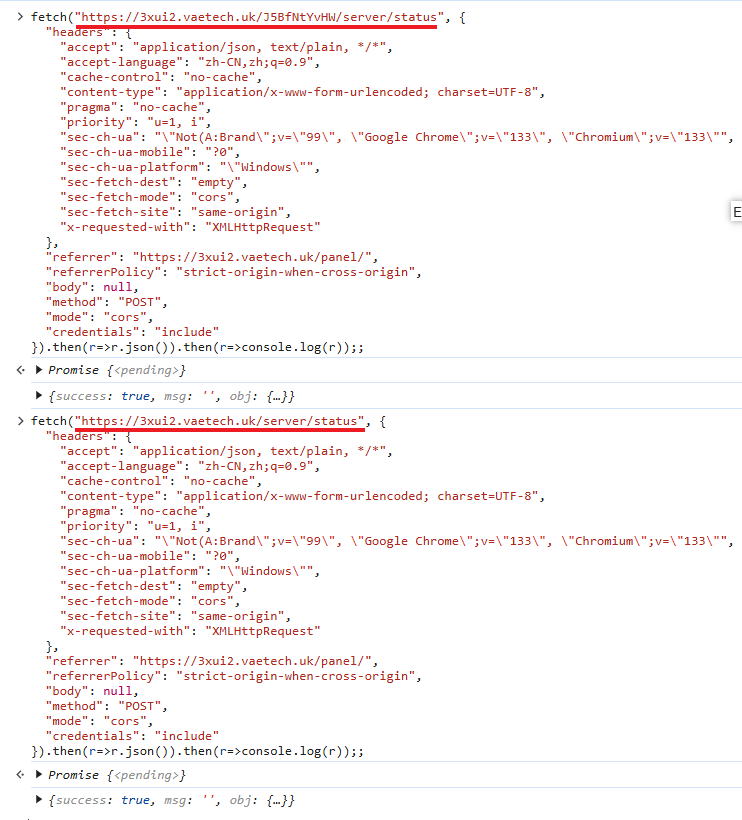

## 要实现的效果



客户端请求路径| 后端接收路径
--|--
`https://域名/J5BfNtYvHW/api` | `http://后端:54321/J5BfNtYvHW/api`
`https://域名/api` | `http://后端:54321/J5BfNtYvHW/api`

要实现 所有客户端请求路径 最终在后端统一映射到 /J5BfNtYvHW/api，可以通过以下两种方案实现：

1. 双路径代理（无重写）
2. 路径重写

### 方案一：路径重写（推荐）

```nginx
server {
    listen 443 ssl http2;
    server_name 3xui2.vaetech.uk;
    ssl_certificate /etc/nginx/ssl/origin/vaetech.uk.pem;
    ssl_certificate_key /etc/nginx/ssl/origin/vaetech.uk.key;

    # 处理 /J5BfNtYvHW 路径的请求
    location /J5BfNtYvHW/ {
        # 重写路径：保留原始请求路径
        proxy_pass http://127.0.0.1:54321/J5BfNtYvHW/;  # 末尾斜杠是关键
        proxy_set_header Host $host;
        proxy_set_header X-Real-IP $remote_addr;
        proxy_set_header X-Forwarded-For $proxy_add_x_forwarded_for;
    }

    # 处理根路径的请求
    location / {
        # 重写路径：强制添加前缀 /J5BfNtYvHW
        rewrite ^/(.*)$ /J5BfNtYvHW/$1 break;  # 通过 rewrite 添加前缀
        proxy_pass http://127.0.0.1:54321;      # 直接转发到后端根路径
        proxy_set_header Host $host;
        proxy_set_header X-Real-IP $remote_addr;
        proxy_set_header X-Forwarded-For $proxy_add_x_forwarded_for;
    }
}

```

路径映射效果：

客户端请求路径| 后端接收路径
--|--
`https://域名/J5BfNtYvHW/api` | `http://后端:54321/J5BfNtYvHW/api`
`https://域名/api` | `http://后端:54321/J5BfNtYvHW/api`

### 方案二：双路径代理（无重写）

```nginx
server {
    listen 443 ssl http2;
    server_name 3xui2.vaetech.uk;
    ssl_certificate /etc/nginx/ssl/origin/vaetech.uk.pem;
    ssl_certificate_key /etc/nginx/ssl/origin/vaetech.uk.key;

    # 处理 /J5BfNtYvHW 路径的请求
    location /J5BfNtYvHW/ {
        proxy_pass http://127.0.0.1:54321/J5BfNtYvHW/;  # 保留原始路径
        proxy_set_header Host $host;
        proxy_set_header X-Real-IP $remote_addr;
        proxy_set_header X-Forwarded-For $proxy_add_x_forwarded_for;
    }

    # 处理根路径的请求
    location / {
        proxy_pass http://127.0.0.1:54321/J5BfNtYvHW/;  # 强制添加前缀
        proxy_set_header Host $host;
        proxy_set_header X-Real-IP $remote_addr;
        proxy_set_header X-Forwarded-For $proxy_add_x_forwarded_for;
    }
}

```

路径映射效果

客户端请求路径| 后端接收路径
--|--
`https://域名/J5BfNtYvHW/api` | `http://后端:54321/J5BfNtYvHW/api`
`https://域名/api` | `http://后端:54321/J5BfNtYvHW/api`
