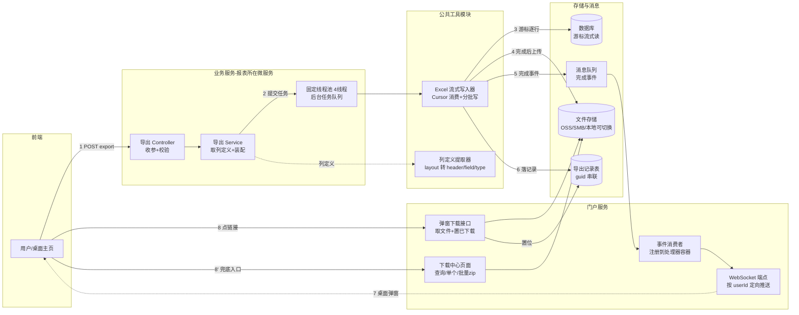
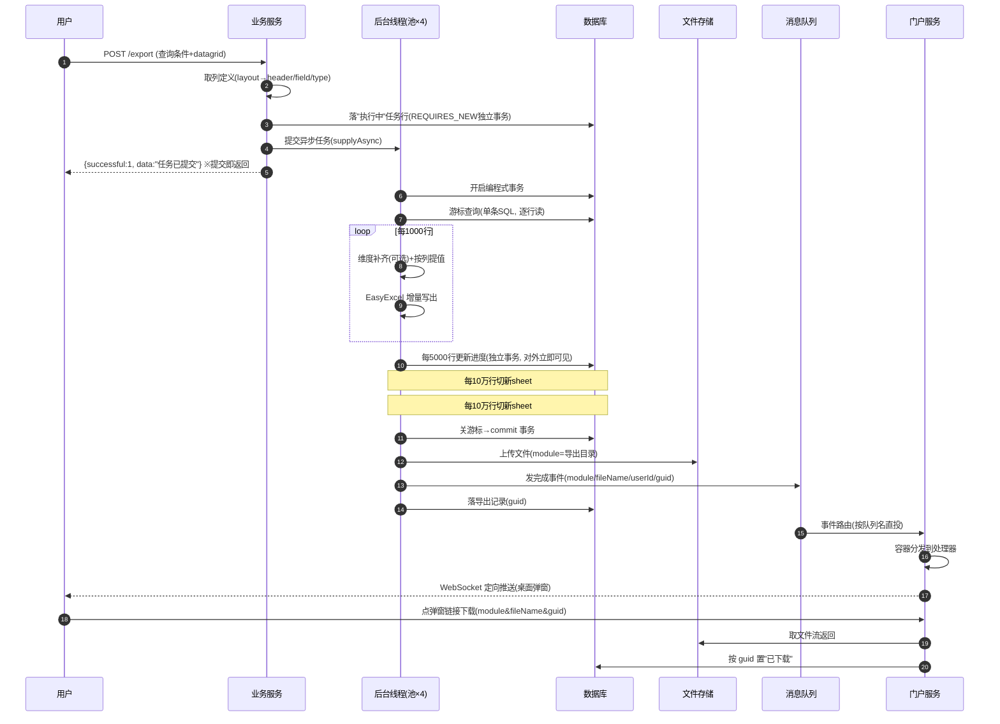

老 MES 系统里"导出"大概是最容易被低估的功能：早期数据量小，一个同步接口把数据查出来写成 Excel 直接回传，皆大欢喜。等到单表日志类数据涨到千万行、报表动辄几十万行时，这条链路开始连环爆雷。本文记录一次完整的导出链路改造：从同步超时丢文件，到「提交即返回 + 游标流式读取 + 异步写入 + 桌面通知取件」的全套架构，包括关键实现细节、踩过的每一个坑，以及清楚留着的优化债。

## 一、同步导出的四宗罪

改造前的链路是典型的"一把梭"：

```
用户点导出 → 请求线程分页循环查全量 → 攒成大 List → 写 Excel → HTTP 响应回传
```

数据量上来后暴露的问题按出现频率排序：

1. **网关超时**：内部走 Ribbon/Zuul 网关，读超时默认 10 秒，导出耗时一超，连接被网关掐断——用户拿到半个文件或一个报错页；
2. **内存压力**：全量行同时驻留 JVM 堆（`List<Map>` + 写缓冲），几个人并发导出大报表，堆直接见顶；
3. **体验差**：用户必须挂着页面等，手一抖刷新就前功尽弃；
4. **不可回溯**：一旦超时，服务端即便把文件写出来了也没法交给用户，白白浪费一次全量查询。

期间打过一层补丁：同步导出超时后转后台继续写，完成后上传文件、发通知。这解决了一部分问题，但"用户先同步等 30 秒"的体验和分页翻页式读取的额外开销还在。于是有了这次彻底的改造。

<!-- more -->

## 二、目标架构

### 2.1 全景：提交即返回，后台干活，干完喊人



三个设计原则：

- **提交即返回**：导出接口不再承载文件流，只负责校验参数、提交任务、返回一句"任务已提交"；
- **流式贯穿**：从 DB 游标到 Excel 写入全程不物化全量数据，内存占用与批次大小（1000 行）成正比，与总行数无关；
- **通知是增强，下载中心是兜底**：MQ 或 WebSocket 任一环故障，记录仍落库、文件仍在下载中心可取，整条链路不因"弹窗没弹"而丢件；
- **任务状态外显**：导出任务本身也是数据——记录表带状态机（执行中/完成/失败/已过期）与行数进度，提交瞬间用户就能在下载中心看到"执行中 N 行"（页面 8 秒轮询），失败也落库标红而非无限等待。异步系统的用户安全感来自可见性，不来自承诺。

### 2.2 一次导出的完整时序



### 2.3 组件分层与部署形态

| 层 | 组件 | 部署位置 | 职责 |
|---|---|---|---|
| 公共工具 | 游标写入器 / 列定义提取器 / 落库 DAO | 公共 jar，全服务依赖 | 异步编排、游标消费、批量写、上传、发事件、落记录 |
| 事件总线 | 系统事件 + 处理器容器 + 监听器 | 公共消息模块 | 事件发布/路由/分发；**消费端需显式配置队列才激活**（条件注解门控） |
| 门户服务 | 事件处理器 / WebSocket 端点 / 弹窗下载接口 / 下载中心入口 | 门户微服务 | 消费完成事件、定向推送、取件 |
| 业务服务 | DAO 游标方法 / 导出 SQL / Service 装配 / 薄 Controller | 各业务微服务 | 按五步套路接入 |
| 前端 | 桌面主页(弹窗+右上角入口) / 报表页导出 JS | 服务端渲染页面 | `$.post` 提交 + 按响应弹提示 |

线程模型：公共工具内置 `Exec.newFixedThreadPool(4)`，任务经 `CompletableFuture.supplyAsync` 提交，**无超时等待**；4 线程全忙时任务排队，前端无感知。代价是每个进行中的任务持有 1 个数据库连接直至游标消费完——并发大导出场景要评估连接池（Druid 默认配置）与队列深度。

### 2.4 guid：串起全链路的一根线

一次导出生成一个 UUID 作为 `guid`：完成事件携带它 → 弹窗下载链接带它 → 下载后按它置"已下载"标记 → 导出记录表以它为关联键。文件名、用户 ID、模块路径在链路各环节传递，但**状态归并靠 guid**。排查问题时拿一个 guid 就能串起日志、记录表和存储对象。

## 三、关键实现细节

### 3.1 Cursor 的工作机制与事务边界

MyBatis 对返回 `Cursor<T>` 的查询走 `queryCursor()` 而非 `query()`：Statement 执行后不遍历 ResultSet，而是把游标包进 `DefaultCursor`，迭代时逐行 `next()` 映射成对象。它的前置条件常被忽略：**游标的生命周期绑定 SqlSession，必须在整个消费期间持有事务**，否则查询方法一返回、会话关闭，迭代时抛 `Cursor is already closed`。

公共工具类里用编程式事务而不是 `@Transactional`——工具方法会被各种上下文调用（有的调用方自身带着事务），注解传播行为不可控，编程式最可控：

```java
TransactionStatus status = txManager.getTransaction(new DefaultTransactionDefinition());
boolean committed = false;
Cursor<Map> cursor = null;
try {
    cursor = (Cursor<Map>) queryMethod.invoke(dao, params);   // 反射调 DAO 的游标方法
    int n = 0;
    List<Map> batch = new ArrayList<>(BATCH);
    for (Map row : cursor) {
        batch.add(row);
        if (++n % 1000 == 0) { writeBatch(batch, ...); batch.clear(); }
        if (n % 100_000 == 0) switchNewSheet(...);            // 规避单 sheet 上限
    }
    if (!batch.isEmpty()) writeBatch(batch, ...);

    cursor.close();
    excelWriter.finish();
    txManager.commit(status);
    committed = true;
    // ↑ 事务到此结束。之后的操作是纯 IO，不再占数据库连接
    fileStorage.upload(module, fileName, localTemp, true);
    mq.send(new SysEvent(EXPORT_DONE, ROUTE_HOME, json{module,fileName,userId,guid}));
    exportRecordDao.save(...);                                 // 含 guid 的记录
    fileStorage.deleteTemp(localTemp);
    return true;
} catch (Exception e) {
    if (!committed) rollbackQuietly(status);   // 已提交后 rollback 会抛 already completed
    return false;                              // 失败现状：仅 ERROR 日志(见优化债 §5.3)
} finally {
    closeQuietly(cursor);                      // 兜底关游标，防连接泄漏
}
```

三个刻意的顺序决策：

1. **上传/发事件/落库放在事务提交之后**：这些 IO 不需要也不应该占着数据库连接；
2. **`committed` 标志**：上传阶段失败时事务已提交，此时再 rollback 会抛 `Transaction is already completed` 二次异常，把真实异常吞掉；
3. **finally 里兜底 close 游标**：正常路径在 try 内关，异常路径由 finally 兜底——游标不关，底层 ResultSet 与连接跟着泄漏。

### 3.2 列从哪来：布局驱动的导出列定义

导出列不写死在代码里，而是从**页面布局配置**（服务端渲染系统的 layout XML）提取：每个 DataGrid 的 Column 节点含 `field`（数据字段）、`title`（i18n key）、`type`（int/string/datetime），导出时遍历可见列（`hidden=false` 且非复选框列）产出 `header/field/fieldType` 三个平行数组。用户在前端配置过列显隐的，还经过一层用户级列过滤（profile），导出与所见一致。

提取接口有两个版本，**按布局根节点二选一**（这是坑，见 §4.2）：

| 布局格式 | 根节点 | 接口 |
|---|---|---|
| 单表格老格式 | `<DataGrid>` | 单表格版（不需要 gridId 参数） |
| 多表格新格式 | `<ViewDefine>` 包裹多个 `<DataGrid>` | 多表格版（须传 `datagrid=<gridId>`） |

### 3.3 维度补齐：别把六七个字典 join 塞进游标 SQL

报表导出常要"编码→中文名"。简单做法是导出 SQL 里 join 字典表——列少无所谓，列多时一个大宽表 join 七八个字典，游标 SQL 的执行计划会明显变差。公共工具提供了第三种姿势：**调用方预先批量查出"维度id → 显示值"的映射，作为参数传给游标导出**，写入器在每个 1000 行批次写盘前做内存补齐：

```java
// enrichment: {row里的维度id字段名 -> {id值 -> {显示列名 -> 显示值}}}
enrichRows(batch, enrichmentMaps);   // putIfAbsent 语义: 只补 row 缺的列, 不覆盖已有值
```

预查是普通分页 IN 批量查询（值域有限），游标 SQL 保持瘦。**注意语义是 `putIfAbsent` 而非覆盖**——SQL 已查出的列优先。

### 3.4 完成事件的投递与消费

事件模型很朴素：一个枚举类型 + 路由键（值即队列名）+ JSON 载荷，发送端用 `RabbitTemplate` 走默认交换机**按队列名直投**。消费端三要素缺一即**静默**失效：

1. 消费服务有配置类继承消息基础配置（启动时声明队列/绑定）；
2. 消费服务配置了监听开关属性（`@ConditionalOnProperty` 门控，不配则监听容器根本不创建）；
3. 注册了该事件类型的处理器（构造器里向单例容器注册，方法名是 `registerHandler`——另外两个业务事件容器叫 `registHandler`，一字之差）。

队列不存在时默认交换机直投的消息会被 broker **静默丢弃**——这正是"后端日志显示已发送、前端永远收不到"的一类根源。

### 3.5 WebSocket 定向推送：从 HttpSession 借身份

推送不是广播。WebSocket 握手是一次 HTTP 请求，框架在握手配置器里从 `HandshakeRequest.getHttpSession()` 取 `userid` 存进 endpoint 的 `UserProperties`；推送时遍历会话按 userid 精确匹配。这决定了部署拓扑的三个硬条件（§4.3 展开）：同 host（cookie 才跟随）、端点直达门户服务（网关不转 ws）、握手请求能解析出 session。

### 3.6 Excel 写入的格式细节

- **列宽**：固定 30 的列宽策略；
- **数值列**：单元格格式 handler 对 `int/float/double/numeric` 类型列，按值里的小数位数动态构造 `DataFormat`（`0` / `0.00`…）并转数值单元格——否则 Excel 里是"看起来像数字的文本"，排序求和全废；
- **HTML 反转义**：数据来自服务端渲染链路时可能带 `&amp;` 之类实体，写盘前 `unescapeHtml`；
- **样式缓存**：CellStyle 按格式串缓存复用（POI 的 CellStyle 有 64000 上限，逐格新建必炸）。

### 3.7 任务状态机与进度

下载记录表上加两个字段：`exportstatus`（0 执行中 / 1 完成 / 2 失败 / 3 已过期，默认 1 兼容存量数据）和 `processrows`（已写行数）。写入器在**提交时**就插入一行"执行中"（拿到自增 id），执行中每 5000 行更新一次进度，完成/失败更新终态——失败时把异常摘要截断后写进预留的 `errormessage` 字段。前端下载中心页面存在执行中任务时每 8 秒轮询刷新，状态列按色渲染（执行中蓝/完成绿/失败红悬停见错误/过期灰）。

看似平淡的设计，坑在事务——见 §4.5。

## 四、踩坑实录

方案不复杂，真正花时间的是下面这些坑——每一个都有通用性。

### 4.1 导出文件"有体积无内容"：两套大小写约定打架

**现象**：导出的 xlsx 有一兆多，但打开后每个单元格都是空白。文件大小说明行都写进去了，内容却是空串。

**排查**：接口实测对比两条路径的字段名——

- 列定义接口返回的 `field` 数组：`['eventid', 'guid', 'sendtime', ...]`，**框架把配置里 PascalCase 的字段名统一小写化后输出**；
- 普通分页查询返回的 rows key：同样全小写——因为查询链路里有一步 key 小写化处理。所以页面显示、老的同步导出都是"双方小写"，匹配无恙；
- **游标路径不经过那步小写化**，Map 的 key 保持 SQL 列标签原样：`EventId`、`GUID`、`SendTime`。

写入时 `map.get(field)` 拿不到 → 走兜底 `getStringFromMap`（大小写敏感、取不到返回空串）→ 每格空白。

**结论**：游标导出 SQL 的所有列别名必须显式小写（`a.EventId as eventid`）。隐蔽性在于：同一条 SQL 供给分页查询完全正常，只有换到游标路径才炸。**任何"同一份数据源，两条消费路径"的设计，都要警惕中间某一环做了单边转换。**

### 4.2 ClassCastException：同名 API 家族不保证行为对称

在老格式（根节点直接是 `<DataGrid>`）页面上调用多表格版取列接口，解析器把根节点强转容器类型，直接 `ClassCastException`。修复是一行——按布局根节点选接口。但它揭示的问题更普遍：**迁移场景下，"目标项目里哪个接口被验证过"比"接口名字看起来更通用"更重要。**

### 4.3 桌面推送收不到：WebSocket 拓扑的三个硬条件

后端日志显示事件消费成功、推送方法已调用，但用户桌面毫无动静——最终定位是 **WebSocket 连接压根没建立过**（服务端连接日志为 0）。三个硬条件：

1. **网关不转发 WebSocket**。Zuul 1.x 本质是 HTTP 转发，不处理 `Upgrade` 握手，ws 端口配置指向网关等于 404。正确做法是 nginx 单独做 upgrade 转发（开发环境也可让浏览器直连门户服务端口）：

   ```nginx
   location /MesWebSocket {
       proxy_pass http://<k8s节点>:<门户服务的NodePort>;
       proxy_http_version 1.1;
       proxy_set_header Upgrade $http_upgrade;
       proxy_set_header Connection "upgrade";
   }
   ```

2. **同 host 才有 cookie，有 cookie 才有身份**。浏览器按 domain 匹配 cookie 且**不区分端口**：门户页面和 WebSocket 端点同 host 不同 port，SESSION cookie 随握手带上，服务端才能从 HttpSession 解出 userId 做定向推送；跨 host 连接 cookie 不跟随，握手拿不到身份，**推送目标匹配不上，静默失败**。

3. **每一环断了都不报错**。端口配错（指向没监听的端口）、host 配错（跨域无 cookie）、消费端缺激活配置（事件直投不存在的队列被 broker 丢弃）——全部无声无息。排查锚点：服务端连接日志出现 `connect ... from userid:` 即握手成功；事件处理日志出现即消息链路通。**给静默链路预埋日志锚点，是异步架构的自保手段。**

### 4.4 一个诚实的边界：JDBC 层并不是真流式

MyBatis Cursor 只是**应用层不物化**。MySQL JDBC 驱动在默认配置下（未设 fetchSize、连接串无 `useCursorFetch=true`）执行查询时，仍会把整个 ResultSet 缓冲在客户端内存里。也就是说这套方案的真实收益是：**异步不断 HTTP + 不建全量 List + Excel 流式写入**——堆压力从 O(全量行数) 降到 O(批次大小)+驱动缓冲。**宣称"彻底解决内存问题"是不诚实的**，边界见 §5.1。

### 4.5 进度永远停在 0：两层事务把状态更新"吞"了

二期加状态机后遇到的最典型的坑：**进度列始终为 0，直到导出完成的瞬间状态直接变成"完成"**——中间过程完全不可见。

两层事务各吞了一半：

1. **"执行中"行的插入跑在调用方的事务里**。业务 Service 普遍带类级 `@Transactional`，工具方法里插入的任务记录成为该事务的一部分——方法返回、请求事务提交之前，这行数据对外不存在。而异步线程拿到 id 后的第一次进度更新往往发生在这之前：`update ... where id = ?` 影响行数为 0，**静默落空**（update 不报错，只是 0 行）。
2. **进度更新跑在游标的长事务里**。游标必须在事务内消费，于是"每 5000 行更新进度"的 UPDATE 也加入了这个未提交的长事务——对外可见性被推迟到游标消费完、事务提交的那一刻。这正是"只在完成时一次性可见"的直接原因。

修复：**任务登记与进度更新一律用 `REQUIRES_NEW` 编程式独立事务**——挂起外层事务、借新连接执行并立即提交。不能用 `@Transactional(propagation=REQUIRES_NEW)` 注解，因为这些方法是被同一个类的私有方法调用的，**同类内部调用不走代理，注解不生效**。

两条可迁移的经验：其一，"A 事务里写的数据想在 A 还没结束时给别人看见"本身就是矛盾，需要可见就必须换事务边界；其二，**UPDATE 影响 0 行不抛异常**——依赖 update 结果的异步流程，0 行更新是比异常更危险的失败模式，因为它无声。

## 五、优化债：已还的与仍欠的

一期上线后，原债单上的三件已经还掉，剩下的继续挂着——留着它们比假装没有强。

**已还的三件**：

- **任务状态机与进度可见**：记录表加 `exportstatus`+`processrows` 两列（默认值兼容存量），提交即落"执行中"、每 5000 行更新进度、下载中心 8 秒轮询展示（详见 §3.7，事务坑见 §4.5）；
- **失败可见性**：失败路径落状态+错误信息，下载中心失败行标红、悬停显示原因——用户至少知道"失败了"而不是无限等待；顺手把"执行中超 1 天"的僵死记录（服务重启残留）由清理任务标为失败；
- **文件保留期制**：下载不再删文件（可重复取），改为保留 N 天（可配置）+ 每日凌晨定时清理（分布式锁防多实例重复执行），下载入口对执行中/失败/过期明确提示。

**仍欠的**：

### 5.1 JDBC 级真流式

游标语句显式设 `fetchSize=Integer.MIN_VALUE`（驱动逐行读）或连接串加 `useCursorFetch=true` + 正 fetchSize（服务端游标，走临时表）。权衡点：前者对**长导出会长时间占用连接且网络往返密集**，后者把内存压力转成服务端临时表 IO。当前量级（几十万行/次、驱动缓冲几百 MB 以内）应用层流式已够用；真到千万行级，这条是第一优先级。

### 5.2 线程池治理

固定 4 线程、无界队列：并发提交大量大任务时排队无上限，DB 侧最多 4 个长连接被占（这个还好），但**任务堆积无告警、无拒绝策略语义**。可优化：有界队列 + 拒绝时落"排队中"记录；或按业务隔离线程池（报表导出与关键链路互不影响）。

### 5.3 消息投递可靠性

默认交换机直投，队列不存在/消费端重启窗口期会**丢消息**（丢的只是通知，文件与记录还在，所以是"通知可靠性"而非"数据可靠性"问题）。要严格可开 publisher confirm + return callback，投递失败降级为落库标记"未通知"，由下载中心消化。

### 5.4 长排序的代价

游标 SQL 带着 `order by` 时，服务端要么走索引有序读（幸运）、要么 filesort/临时表（大结果集代价高）。导出场景"严格有序"常常并非刚需——可评估按主键流式读 + 业务可接受的部分有序，把排序省掉。

### 5.5 下载接口的归属校验

弹窗下载链接凭 module+fileName+guid 即可下载；guid 是随机 UUID 不可枚举，事实上安全，但严格讲**缺归属校验**（拿到链接的任何人可下载）。加一步"记录的 creatorid == 当前会话 userid"判断更闭环。

## 六、小结

回头看，这次改造的技术清单很朴素：线程池、编程式事务、Cursor、批量写、MQ、WebSocket，没有任何新潮组件。真正的工程量在两处：一是把"提交即返回"背后的完整闭环（通知、取件、兜底、回溯）补齐——**异步化从来不是把 `@Async` 一加了事，异步之后用户怎么拿到结果、拿不到怎么自救，才是设计的大头**；二是跨项目迁移时对每一个"看起来一样"的环节做实证——本文四个坑有三个源于"两个项目同源但不相同"。

五条可复用的经验：

1. 同一数据源两条消费路径，警惕单边转换（大小写/编码/精度）；
2. 同名 API 家族不保证行为对称，迁移时以"目标侧被验证过"为准；
3. 异步链路每一环都可能静默失败，预埋日志锚点——**而 UPDATE 影响 0 行是比异常更危险的静默失败**；
4. 想在事务 A 里写数据给别人看，就必须换事务边界（REQUIRES_NEW），且注解在同类内部调用下不生效；
5. 说清"流式"的定义边界，别让方案自己骗自己。
