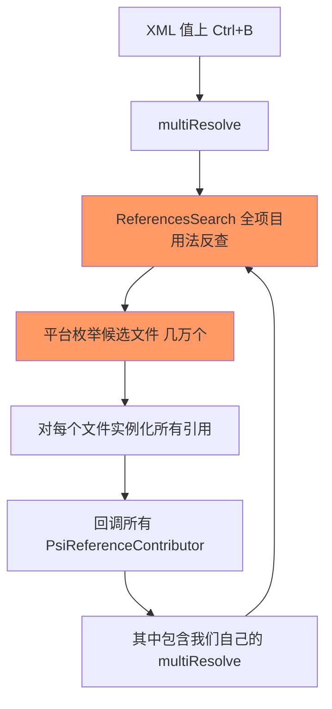
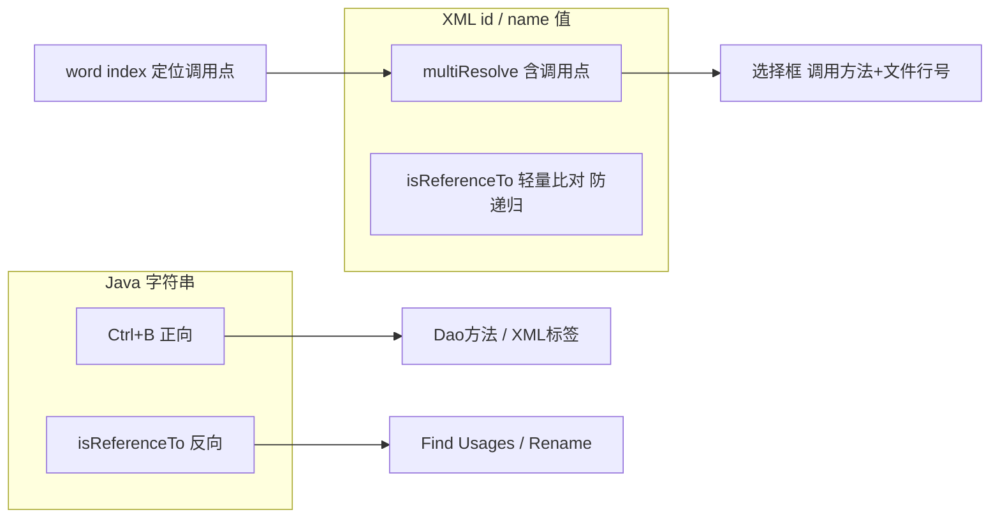

## 需求：让框架式调用也能双向跳转

业务代码里大量存在这种框架式调用——方法名藏在字符串字面量里：

```java
// MyBatis 风格：字符串 = Dao 接口方法名
bizCommonService.queryDaoDataT(iOrderDao.getClass(), iOrderDao, "getOrderScheduleList", params, builder);
// MOC 风格：字符串 = XML 定义名
bizCommonService.insertMocData("OrderMoc", data);
```

IDE 原生对这种字符串无能为力。插件的诉求是四向导航：

| 位置 | 操作 | 期望 |
|---|---|---|
| Java `"getXxx"` 字符串 | Ctrl+B | 跳 Dao 方法 / Moc XML |
| Dao 方法声明处 | Ctrl+B / Find Usages | 反查字符串 |
| Mapper XML `<select id>` | Ctrl+B | 弹「Dao 方法 + 调用点」 |
| Moc XML `name` 属性 | Ctrl+B | 弹 Java 调用点 |

这篇文章记录实现过程中的三次架构演进——每一次都是被真实现象（选择框不弹、进度条死循环、几万文件搜索）逼出来的重新设计。

<!-- more -->

## 基础：IntelliJ 引用体系的单向与双向

先铺清机制，后面所有决策都建立在它上面。

**正向（引用 → 目标）**：`PsiReferenceContributor` 在字面量上注册 `PsiReference`，`multiResolve` 返回目标集合。Ctrl+B 走这里。

**反向（目标 → 引用）**：Find Usages、声明处 Ctrl+B、Rename 用法收集，全部经由 `ReferencesSearch`——平台遍历候选引用，逐个问 `isReferenceTo(element)`。

**Ctrl+B 的隐藏决策**：`resolve()` 非空直接跳；**返回 null 才走 multiResolve 弹选择框**。这个细节后面会两次咬人。

四个功能里，"字符串 → 目标"是正向，其余三个全依赖反向的 `isReferenceTo`。

## 第一次演进：isReferenceTo 为什么不生效

第一版实现了正向引用：multiResolve 返回两个目标（XML 标签 + Dao 方法）。很快发现反向全灭——Find Usages 找不到字符串。

读平台源码定位：引用类继承的是 `PsiReferenceBase` 而非 `PsiPolyVariantReferenceBase`。前者 `isReferenceTo` 的默认实现：

```java
// PsiReferenceBase 默认
public boolean isReferenceTo(PsiElement element) {
    return resolve() == element;   // 只认 resolve() 的单一结果
}
```

而我的 `resolve()` 语义是"多目标返回 null"——双目标下恒为 null，反向判定永远 false。

修复是显式覆写：

```java
@Override
public boolean isReferenceTo(@NotNull PsiElement element) {
    for (ResolveResult result : multiResolve(false)) {
        PsiElement resolved = result.getElement();
        if (resolved != null
                && getElement().getManager().areElementsEquivalent(resolved, element)) {
            return true;
        }
    }
    return super.isReferenceTo(element);
}
```

**一石二鸟**：Find Usages 通了，Rename 也通了——用法找到后平台对每个引用调 `handleElementRename`，字面量的默认 manipulator 会正确替换引号内文本。这是引用体系的"免费赠品"。

## 第二次演进：XML 侧 Ctrl+B 为何不理 isReferenceTo

有了 isReferenceTo，Dao 方法声明处 Ctrl+B 能反查字符串了。但 XML id 上 Ctrl+B 依然只跳 Dao——为什么同一个 isReferenceTo，一边灵一边不灵？

因为两个位置走的是**不同路径**：

- **方法声明处**：名字上没有正向引用，GotoDeclaration 无引用可解析 → 落入用法搜索回退 → isReferenceTo 出场；
- **XML id 上**：注册着正向引用（id → Dao 方法），GotoDeclaration **有引用就直接用解析结果，根本不进回退**——isReferenceTo 没有出场机会。

结论：**isReferenceTo 只喂"用法类"功能；要让 XML 位置的 Ctrl+B 列出调用点，必须把调用点塞进那个引用的 multiResolve 目标集合**。

实现（第一版）：

```java
// XML 侧引用的 multiResolve 里
for (PsiReference ref : ReferencesSearch.search(psiMethod).findAll()) {
    if (ref instanceof MyJavaMethodReference) {
        results.add(new PsiElementResolveResult(ref.getElement()));
    }
}
```

复用刚建好的反向链路反查调用字符串，包装上带展示信息的目标（选择框显示 `queryDaoDataT("getXxx")` + 文件:行号）。

## 第三次演进：进度条死循环——ReferencesSearch 用错了地方

装上测试，Moc XML 侧 Ctrl+B 出现了恐怖现象：**"Resolving references" 进度条反复跑，显示在几万文件中搜索**，跑完一遍再来一遍。

根因是 ReferencesSearch 的成本模型没搞清楚：



**搜索回调引用提供器，引用提供器又触发搜索**——解析与搜索互相点燃。而且对 XML 属性值做用法搜索，平台没有窄索引可预筛，退化为全项目遍历。

修复：换成本就完全不同的 **word index 正向搜索**：

```java
// 1) 倒排索引定位候选文件：只碰文本含该词的文件（通常 1~5 个），毫秒级
searchHelper.processAllFilesWithWordInLiterals(methodName, javaScope, files::add);
// 2) 只在候选文件里遍历字面量，过滤挂了本插件引用的
for (PsiFile file : files) {
    for (PsiLiteralExpression literal : traverser.filter(PsiLiteralExpression.class)) {
        if (!methodName.equals(literal.getValue())) continue;
        if (hasReference(literal, MyJavaMethodReference.class)) { results.add(...); }
    }
}
```

两条路线的对比：

| | ReferencesSearch | word index |
|---|---|---|
| 量级 | O(全项目) | O(含词文件，1~5 个) |
| 单次耗时 | 秒级 + 进度条 | 毫秒级无感 |
| 递归风险 | 有（搜索↔解析互触发） | 无 |
| 完备性 | 平台保证 | 依赖字面量过滤条件 |

trade 掉的完备性：若某个调用字符串因参数结构变化导致引用没注册上，word index 找到字面量但过滤不出引用，会漏。接受这个 trade，因为换来的是交互级速度。

## 防自递归：isReferenceTo 的第二次咬人

换成 word index 后还有一个暗雷：含 ReferencesSearch 的 multiResolve 与基类默认 isReferenceTo 组合会**自递归**——基类默认调 `resolve()` → `multiResolve` → `ReferencesSearch` → 搜索器回调候选引用的 `isReferenceTo` → 又进 multiResolve。

所以 XML 侧引用的 isReferenceTo 必须**显式覆写为轻量比对**（只认 Dao 方法、绝不走 super 的 resolve 链），与 multiResolve 的重搜索解耦。即使换了 word index，这个覆写仍保留——它是防御边界。

## 选择框不弹的最后一坑

功能都通了，最后一个小毛病：XML id 上 Ctrl+B 不弹选择框，直接跳 Dao。

又是 `resolve()` 语义：这个类的原实现是

```java
return results.length >= 1 ? results[0].getElement() : null;  // 恒返回第一个
```

多目标下 resolve() 非空 → Ctrl+B 直接跳第一个。改成标准的"单目标直跳、多目标返回 null"语义后，选择框正常弹出。

**同一个方法、两种写法、两处翻车**——`resolve()` 的返回语义是 poly 引用里最容易埋雷的一行。

## 架构总结

最终形态的分工：



1. **正向目标集合决定跳转体验，isReferenceTo 决定反向能力，两者正交**——都要显式设计；
2. **XML 位置列调用点，平台没有廉价入口**：要么 ReferencesSearch 全项目扫（交互不可接受），要么 word index 自建（几行代码换毫秒级）；
3. **跨引用体系的搜索要防递归**：multiResolve 里跑 ReferencesSearch 的类，isReferenceTo 必须覆写成不走 resolve 链；
4. `resolve()` 的"单目标直跳、多目标 null"是 poly 引用的标准语义，`>= 1` 恒取首个的写法会吃掉选择框；
5. 展示包装类（NavigationItem 委托模式）让裸字符串在选择框里有 `方法名("参数") + 文件:行号` 的完整上下文——细节体验与功能同等重要。
