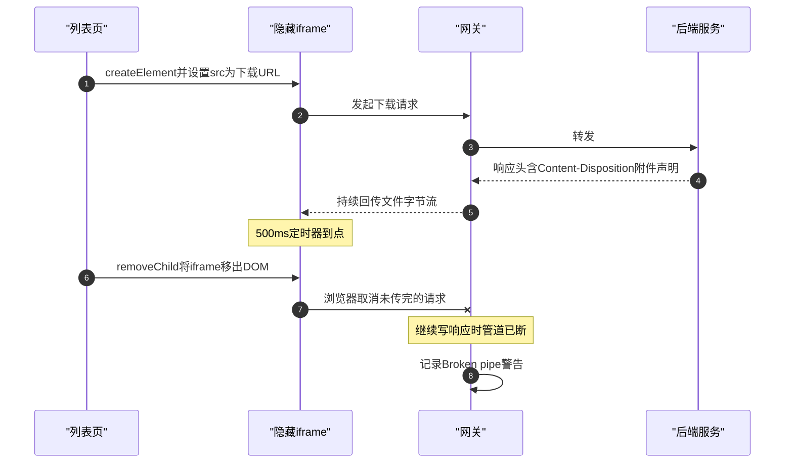

老 MES 系统新上了一套异步导出：后台游标逐行读、流式写 Excel，完成后落下载记录并弹桌面提醒，用户去"下载中心"页面取件。上线当天就收到一条诡异的反馈：

- 几十 KB 的小文件，点击即下，一切正常；
- 72MB 的大文件，**一点下载立刻失败**，下载栏直接飘红。

与此同时，网关（Spring Cloud Netflix Zuul 1.x）日志里躺着与失败时刻精准对应的 WARN：

```
o.s.c.n.z.f.post.SendResponseFilter : Error while sending response to client: java.io.IOException: Broken pipe
```

报错在网关，现象在前端，最后"凶手"却锁定在页面里一行毫不起眼的"善后"代码上。这次排查横跨浏览器、nginx、网关、后端四层，值得完整复盘——因为**每一层的日志都"无罪"，唯一有罪的代码行离报错现场隔了三层**。

<!-- more -->

## 一、先读日志：Broken pipe 是受害者，不是凶手

看到网关 Broken pipe 的第一反应往往是"网关出问题了"或"网关与后端之间断了"。把栈拆开看，结论恰好相反。三个关键证据：

**1. 异常类型是 ClientAbortException**

```
Caused by: org.apache.catalina.connector.ClientAbortException: java.io.IOException: Broken pipe
    at org.apache.catalina.connector.OutputBuffer.realWriteBytes(...)
    at org.springframework.cloud.netflix.zuul.filters.post.SendResponseFilter.writeResponse(...)
```

抛点在 `SendResponseFilter.writeResponse` → `CoyoteOutputStream.write`，即**网关往"请求来源方"写响应体**的那一段。ClientAbortException 的语义非常明确：响应写到一半，**对端先把 TCP 连接挂断了**。网关是被害方。

**2. 栈里出现了 IdentityOutputFilter**

同一个栈里往下翻有 `IdentityOutputFilter.doWrite`——HTTP 定长传输（带 Content-Length、非 chunked）。说明响应头完整、文件总长已下发、字节流正在正常回传。不是响应内容出了问题，是回传途中被掐。

**3. 整个栈里没有后端服务**

如果是网关与后端之间的故障（超时、连接断开），抛的会是 SocketTimeoutException 一类，栈顶在路由过滤器而不是 SendResponseFilter。

三点合起来：**网关正在正常干活，电话是对面先挂的**。排查方向从"网关为什么断"转向"谁掐断了连接"。

## 二、候选假设与决定性反证

"对面"是谁？浏览器，或浏览器与网关之间的任何一跳（内网环境里至少有一层 nginx）。按嫌疑排：

| 候选 | 典型特征 | 取证结果 |
|---|---|---|
| 用户手动取消、浏览器行为 | 偶发、无规律 | 用户确定性点击后必失败，不符 |
| 前置 nginx 响应缓冲临时文件写失败 | 小响应正常、大响应立刻断：超内存缓冲要落盘，写不进去就掐上游 | nginx error log 干净，磁盘与 proxy_temp 权限正常 |
| Content-Length 与实际字节不符 | 浏览器报 ERR_CONTENT_LENGTH_MISMATCH | 同接口小文件正常，不符 |

真正一锤定音的，是一个成本几乎为零的实验：

> 把 DevTools Network 里那条失败请求的 URL 复制出来，**直接在地址栏打开——72MB 秒下成功**。

同一 URL、同一文件、同一条 nginx→网关→后端链路：走地址栏就通，走页面点击就断。整条服务端链路一次性洗清，凶手只能在**前端页面自己的 JS** 里。

顺带记一个分诊词：DevTools Network 里请求的 Type 显示 **`(canceled)`**，唯一含义是"请求被页面侧主动 abort"——不是服务器断连（那是 ERR_CONNECTION_RESET 或 502），也不是内容问题（那是 ERR_CONTENT_LENGTH_MISMATCH）。这一个词把排查空间从四层劈成两半：canceled 只可能来自页面 JS 调了 abort，或发起请求的载体（iframe、标签页、XHR）被销毁。

## 三、根因：500ms 后自毁的隐藏 iframe

翻到下载中心页面里单个文件下载的函数（脱敏后）：

```js
// 单个文件下载
function downloadSingleFile(fileId) {
    var url = getContextPath() + "/basic/downloadSingleFile?id=" + fileId;
    var iframe = document.createElement('iframe');
    iframe.style.display = 'none';
    iframe.src = url;
    document.body.appendChild(iframe);
    $("#recordGrid").datagrid("reload");
    setTimeout(function () {
        document.body.removeChild(iframe);   // ← 凶手在这
    }, 500);
}
```

隐藏 iframe 是 jQuery 时代经典的"**不跳转页面触发文件下载**"手法：iframe 的导航不影响当前页，服务端返回 `Content-Disposition: attachment` 时浏览器直接弹下载，页面纹丝不动。手法本身没问题，问题在那行"善后"：

> 下载发起 500ms 后，把 iframe 从 DOM 里移除。

而浏览器销毁一个 iframe 时，会**取消其中所有未完成的请求**。整条时间线是这样的：



时间线对齐后，所有现象都有了唯一解释：

- **37KB / 8.6MB**：内网传输 500ms 内完成，iframe 移除时下载早已结束——侥幸正常；
- **72MB**：传输需要数秒，500ms 定时器必然先到——必死；
- **网关**：写响应写到一半发现管道断裂，记下 Broken pipe WARN——受害者日记；
- **nginx**：客户端正常握手、正常断开，error log 无感——沉默的旁观者。

这类 bug 最迷惑的地方在于**测试数据决定生死**：开发自测用几百行数据，全过；上线后第一次有人导出全量数据，当场炸。而且报错位置（网关）与案发现场（前端一行清理代码）之间隔了 nginx、网关两层，顺着报错日志找一辈子都找不到。

## 四、修复与"不跳转页下载"的姿势对比

修复是最小改动：**删掉定时移除，空 iframe 留在页面上**（attachment 响应在 iframe 里不渲染内容，无任何副作用），并留注释防止后人把它当垃圾代码"清理"回去：

```js
function downloadSingleFile(fileId) {
    var url = getContextPath() + "/basic/downloadSingleFile?id=" + fileId;
    // 隐藏iframe发起下载后不能移除：定时移除会取消未传完的下载，小文件快于定时器才看似正常
    var iframe = document.createElement('iframe');
    iframe.style.display = 'none';
    iframe.src = url;
    document.body.appendChild(iframe);
    $("#recordGrid").datagrid("reload");
}
```

顺带把"不跳转当前页触发下载"的几种姿势摆在一起，各自的死穴一目了然：

| 方式 | 原理 | 死穴 |
|---|---|---|
| 隐藏 iframe 且不移除 | iframe 导航 + attachment 响应 | iframe 被移除时取消在途下载；并发多文件别复用同一个 iframe 改 src，会掐掉上一个 |
| window.location.href 赋值 | 顶层导航遇 attachment 不离页 | 接口失败若返回 JSON 错误体，页面会整体跳到裸 JSON |
| a 标签 download 属性 | 原生下载 | 同源限制；动态创建的 a 要先入 DOM 再 click，部分浏览器才认 |
| ajax 拉全量转 blob | XHR 完整接收再 createObjectURL | 大文件全量进内存；还受 ajax 全局 timeout 影响——载体超时被销毁，同属一类坑 |

本次保留 iframe 方案而不是改成 `window.location.href`，是因为该接口失败时会返回 JSON 提示（"任务执行中"、"文件已过保留期"之类）：iframe 方案下错误静默、页面不跳；navigation 方案会把用户带到一屏裸 JSON。**选型跟着接口的错误语义走，而不是跟着"哪种写法更新潮"走**。

## 五、小结

值得沉淀的四条：

1. **Broken pipe、ClientAbortException 是受害者的日志。** 读栈先看抛点在哪一跳：`SendResponseFilter.writeResponse` 是网关→客户端方向，对端先断；别顺着这条日志去修网关。
2. **`(canceled)` 是分诊词。** DevTools 里请求类型为 canceled，唯一含义是页面侧主动 abort——方向立即从服务端全链路收敛到前端 JS。
3. **"直开 URL"是下载故障最便宜的分层实验。** 一次地址栏访问洗清 nginx、网关、后端三层，剩下的嫌疑人不用查，就在页面上。
4. **"善后"代码也要问一句：它清理的东西，生命周期结束了吗？** 定时器加 removeChild 这类清理逻辑，时机一旦和被清理对象的真实生命周期（一次可能持续数十秒的传输）脱节，就会变成精确的暗杀装置——而且专挑大文件杀。
