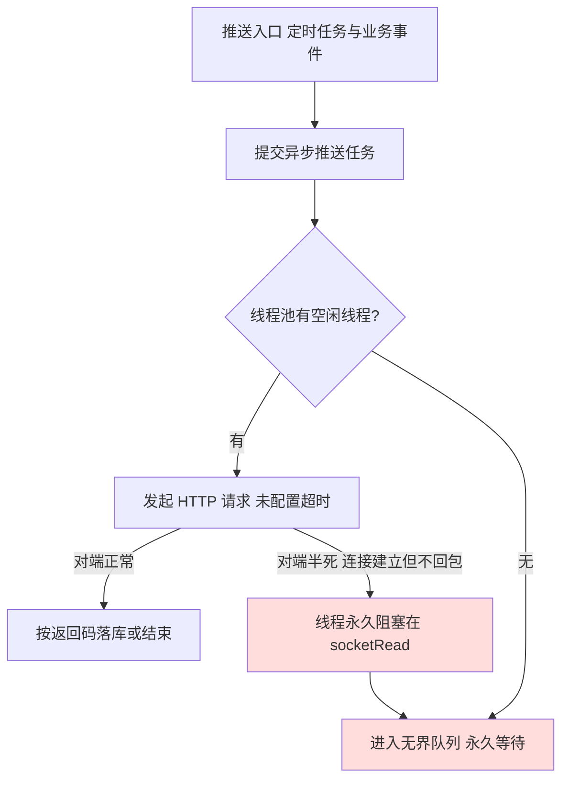

## 概述

T 日下午，一套在产 MES 系统的第三方排产系统（下称 APS）工单状态回写链路发生静默失效：MES 侧所有业务功能（开工、报工、结单）完全正常，但对 APS 的状态推送全部停止，回写失败记录表自当日起不再产生任何新数据。故障持续约两天后被发现，重启服务即恢复，无业务数据损坏。

本文完整记录该故障的定位过程、根因机制、修复方案与验证方法。该故障的典型性在于：**四个各自不算缺陷的设计组合在一起，形成了一个无任何错误输出、无任何自愈可能、且监控系统完全盲区的失效模式**。

- **直接根因**：HTTP 客户端未配置连接与读取超时，第三方接口瞬时半死（TCP 连接建立但不再回包）后，10 个推送工作线程永久阻塞在 socket 读取上；
- **放大因素**：推送经固定大小线程池异步执行、队列无界、异常被静默吞掉；
- **恢复手段**：仅能重启进程（无超时的 socketRead 永不返回，线程无法自行释放）。

<!-- more -->

## 一、故障现象

该回写链路的日常形态是：一个每 10 分钟执行一次的定时任务，将所有未完工单的当前状态与完工数量推送给 APS；同时开工、暂停、结单等业务事件也会触发即时推送。APS 接口日常存在一定比例的业务性拒绝（工单号不存在等），因此失败记录表每天稳定产生数千条记录——**失败记录的持续产生，本身就是这条链路活着的信号**。

T 日之后，这张表的数据归零。而同一时间段内：

- MES 各业务功能正常运转，无任何报错；
- 应用日志中无 ERROR 级别的相关输出；
- APS 侧反馈收不到任何新的状态数据。

三条线索指向同一个问题：推送动作本身消失了，而不是推送在失败。

## 二、定位过程

### 2.1 缩小范围：日志分层签名法

推送链路横跨同步与异步两层，这是一个可以利用的结构性特征。定时任务方法体内的日志（任务开始、逐单循环）由**调度线程同步打印**；而实际的 HTTP 调用发生在**异步工作线程**内，各自产生独立的日志行。两类日志的存亡组合，可以直接指示故障发生在链路的哪一层：

| 同步层日志（任务开始/逐单循环） | 异步层日志（HTTP 请求/响应） | 结论 |
| --- | --- | --- |
| 有 | 有 | 链路整体正常，故障在别处 |
| 有 | 无 | 异步体从未执行——线程池耗尽或队列阻塞 |
| 无 | — | 调度层故障（任务未触发或前置查询异常） |

现场取证结果：任务开始日志正常出现、逐单循环日志每个周期均在迭代约 30 个工单，但当前日志窗口内 HTTP 请求日志为零。**结论：任务在跑、工单在遍历、推送任务已提交，但异步执行体一次都没有运行。** 这将问题从"第三方接口故障""业务数据问题""调度故障"三个方向一次性排除，收敛到线程池本身。

### 2.2 线程栈实锤

对进程发起 `SIGQUIT`（`kill -3`）获取全量线程栈（容器内无 JDK 工具时的标准做法，线程栈输出到 stdout，经 `kubectl logs` 收集）。栈内可见推送线程池的全部 10 个线程，状态一致：

```
"pool-N-thread-1" ... runnable
    at java.net.SocketInputStream.socketRead0(Native Method)
    ...
```

10/10 线程全部 RUNNABLE 且阻塞在 `socketRead0`，调用链即第三方推送。线程池被挂死连接占满，后续所有推送任务（定时任务与业务事件）进入无界队列永久等待——**既不执行，也不失败，因此不产生任何失败记录**。业务线程提交任务后立即返回，业务功能全程无感知。

### 2.3 对端反转与最终定性

此时最可能的叙事是"第三方接口挂了"。但从应用所在容器内直接 curl 第三方接口，**秒回业务响应**——对端当前完全健康。结合进程已连续运行近一个月未重启，完整的因果链得以闭合：

1. T 日发生一次瞬时网络事件（第三方重启或链路抖动，触发源无法追溯）；
2. 当时在途的 10 次 HTTP 调用的连接进入"已建立、无响应"状态；
3. 由于客户端未配置任何超时，这 10 次调用的读取等待**永远不会结束**；
4. 线程池占满，此后所有推送静默积压；
5. 第三方接口随后恢复正常，但**挂死的线程不会因对端恢复而恢复**——这是本故障最反直觉的一点：故障的触发条件是瞬时的，故障本身却是永久的，唯一解是重启进程。

### 2.4 排查命令清单

上述过程用到的命令按用途整理如下（占位符按各自系统替换；应用部署在 Kubernetes 容器内、无 JDK 工具为前提）：

```bash
# —— 同步层：任务是否在跑、是否跑完（缺 end = 卡在前置查询，查数据库锁）——
grep -c "<任务方法> start" <服务日志>
grep -c "<任务方法> end" <服务日志>

# —— 同步层：逐条循环是否在迭代（有输出 = 数据列表非空，排除数据侧原因）——
grep -c "<任务方法> <逐条日志关键字>" <服务日志>

# —— 异步层：HTTP 是否真的发出、是否收到响应（本故障的核心判别项）——
grep "<HTTP请求日志关键字>" <服务日志> | tail -5
grep "<HTTP响应日志关键字>" <服务日志> | tail -5

# —— 重试任务是否正常收尾（start 有 end 无 = 调度线程被同步外呼占死）——
grep "<重试方法名>" <服务日志> | tail -6

# —— 日志窗口与轮转文件（.gz 压缩文件用 grep 查不到内容，需 zgrep）——
ls -lt | head -8
head -2 <服务日志>
zgrep -h "<HTTP请求日志关键字>" <服务日志>* | tail -3

# —— 线程栈：容器内无 jstack/jcmd 时用 SIGQUIT（kill -3 不杀进程，
#    只是让 JVM 把全量线程栈打到 stdout，从容器日志收取）——
ps -ef | grep java
kill -3 <pid>
kubectl logs <pod> -n <namespace> --since=2m > /tmp/td.txt
grep -B1 -A14 'pool-' /tmp/td.txt | grep -E 'pool-|socketRead0' | head -30

# —— 对端验证：在应用所在容器内执行（与业务同网络命名空间），
#    -m 5 给 curl 自己加超时，防止排查命令也被挂住 ——
curl -v -m 5 -X POST -H "Content-Type: application/json" \
  -d '[{...业务报文...}]' http://<第三方接口地址>

# —— 恢复（顺序：先确认对端健康，再重启；对端未恢复时重启会立刻再次挂死）——
kubectl -n <namespace> rollout restart deployment/<服务>
```

数据库侧两条：

```sql
-- 停摆时点与量级（按天分布，确认归零起始日与此前基线）
select date(createtime) d, count(*)
from <失败记录表> where delflag = 0
group by d order by d desc limit 7;

-- 停摆前最后几条失败的形态与精确时间点（用于对齐日志排查窗口）
select id, createtime, retrycount, left(error, 200)
from <失败记录表> where delflag = 0
order by createtime desc limit 5;
```

## 三、根因机制

四个设计点的组合构成了完整故障面：



1. **HTTP 客户端无超时**（`HttpClients.createDefault()` 未设置 `RequestConfig`）：Apache HttpClient 默认 connect/socket 超时为 0，即无限等待。这是根因——其余三点只决定故障的呈现形态。
2. **固定大小线程池**：10 个线程承载全部第三方推送，无隔离、无兜底拒绝策略。
3. **无界队列**：`newFixedThreadPool` 内置 `LinkedBlockingQueue`，任务只进不出，既不触发拒绝异常，也不产生任何可观测信号；内存上积压数万任务也未必触发告警。
4. **异步链路吞异常**：失败记录的落库本身也在异步任务内，外层 `catch (Exception) { /* do nothing */ }` 将落库失败也静默处理——即使链路尚有残存输出，这最后一层也会将其抹掉。

值得强调的是监控盲区的成因：对这类链路，常见的监控思路是"失败率上升则告警"。但本故障中失败数不是上升而是**归零**——在线单量大于零的前提下，第三方回写失败记录长时间零增长，本身就是一个强故障信号，应当纳入反向监控。

## 四、修复与验证

### 4.1 代码修复

两处修改：

其一，为 HTTP 工具类的 POST 方法统一设置请求超时：

```java
private static final int CONNECT_TIMEOUT = 3000;
private static final int SOCKET_TIMEOUT = 10000;

httpPost.setConfig(RequestConfig.custom()
        .setSocketTimeout(SOCKET_TIMEOUT)
        .setConnectTimeout(CONNECT_TIMEOUT)
        .build());
```

超时生效后，原有的失效模式变为：对端半死 → 线程至多 13 秒后超时释放 → 调用返回 null → 走既有的失败落库逻辑 → 线程池自愈，失败记录持续可见。行为变更需注意：此前无限等待的调用现在会快速返回 null，所有调用方必须能容忍 null（本例中调用方本就以 null 为失败分支处理，无适配成本）。

其二，将失败落库外层的静默吞异常改为记录 ERROR 日志。

### 4.2 黑洞验证法

单元测试很难模拟"TCP 连接建立但永不回包"的对端，而用一个极小的 TCP 黑洞进程即可精确复现：

```python
import socket
s = socket.socket()
s.bind(('127.0.0.1', 18770))
s.listen(100)
conns = []
while True:
    conns.append(s.accept())   # 只接受连接，永不回包
```

将测试环境的第三方地址指向该黑洞端口，即得到一个行为完全确定的对端半死环境。验证取得了理想的 A/B 对照：

- **修复前**：触发推送后请求发出、永久沉默，线程栈复现 10 线程挂死——本地完整复现了生产故障；
- **修复后**：同一触发下，请求发出后精确 10.08 秒出现 `SocketTimeoutException: Read timed out`，线程释放，失败记录表产生 `接口返回数据为空` 的新行；
- **压力验证**：连续触发 16 次推送，全部在两轮超时周期（约 20 秒）内完成释放，线程池无积压——排除了"超时后仍然缓慢泄漏"的可能。

一个验证过程中的附带收获：多模块工程中，若启动脚本按单模块运行（依赖从本地仓库解析公共构件），修改公共工具模块后仅 `compile` 不会进入运行时，必须先 `install` 到本地仓库再重启业务模块——否则会在"本地复现不出刚修的 bug"上浪费一轮排查。

## 五、复盘与改进

**外呼必须显式设置超时，且应作为公共组件的强制约束。** 无超时的外部调用在拓扑健康时与有超时的版本毫无差别，其风险完全藏在低概率的瞬时网络事件里，一旦触发即从"性能问题"升格为"可用性问题"。本次排查的 `getByToken` 等方法早已配有超时，同一工具类内 POST 方法遗漏——同类方法配置不一致，比整体缺失更值得警惕，因为它制造了"已有防护"的错觉。

**异步链路应保留最小告警能力。** 异步化的本意是隔离慢调用，但"提交即返回"意味着调用方不再感知执行结果，链路必须自己留下可观测信号：失败落库不可吞异常，队列深度、活跃线程数应可暴露。

**日志的"存亡"与"有无"同等可用作证据。** 本次定位中，决定性的一步不是任何一条日志的内容，而是"同步层日志存在、异步层日志消失"这一组合本身。跨同步/异步边界的链路，两侧日志的存亡矩阵是一个成本低、判别力强的定位工具。

**对"失败驱动的监控"补上"沉默驱动的监控"。** 失败率告警覆盖不了归零型故障。凡满足"业务量 > 0 而输出长期为 0"语义的链路（本例：在制工单存在而回写记录零增长），都值得一条反向规则。

## 结语

这次故障没有复杂的技术难点，每一环都是教科书级的常见配置缺失，但组合起来的失效模式安静得近乎完美：无报错、无日志、无自愈、无告警，业务侧完全无感。它提醒的是：**分布式系统里最危险的往往不是会大声失败的东西，而是被设计成永远不抛异常的东西**。
