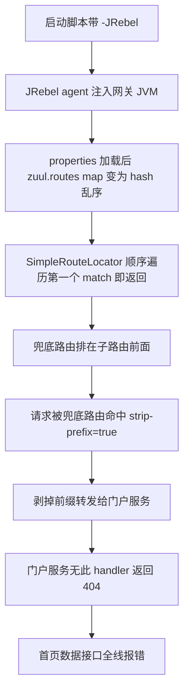
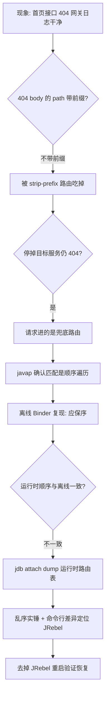

本地开发环境用一键脚本把整套微服务拉起来：网关、注册中心、认证、门户、几个业务服务。打开首页，能正常出登录页、能登录、主框架渲染出来——然后页面上的数据接口开始报错，字典、多语言资源全部拉取失败。直觉说"看网关日志"，打开一看：

**网关日志从启动到现在，零 ERROR、零 Exception，干干净净。**

日志无罪、配置没改过、代码没动过，这种"环境性灵异故障"最考验排查方法论。最终根因落在一个完全意料之外的地方：**网关进程带着 JRebel agent 启动，导致 Zuul 路由表的绑定顺序被打乱，兜底路由抢走了所有通配子路由**。整场排查没有看一行 Zuul 源码仓库、没有重启大法、没有玄学，靠的是判别实验、字节码反编译和一个很多人没用过的 JDK 自带工具——jdb。这篇完整复盘整个过程，并把用到的工具逐一讲透。

<!-- more -->

## 一、现象梳理：哪些正常，哪些不正常

先把拓扑和事实钉死。一套经典的 Spring Cloud 微服务：

- **网关**：Spring Cloud Netflix Zuul（spring-cloud-netflix-zuul 2.1.1 + Spring Boot 2.1.6），context-path 挂在 `/gateway` 下；
- **门户服务**：渲染主页面、菜单；
- **基础服务、辅助服务**：字典、多语言、系统配置等数据接口；
- 所有服务注册到 Eureka，前端统一经网关访问。

用脚本模拟浏览器走完整链路，逐段测下来：

| 请求 | 结果 | 说明 |
|---|---|---|
| `GET /gateway/portal/index` | 302 → 登录页 | 正常，未登录跳转 |
| `POST /gateway/login` | 302 → index | 登录成功，SESSION 建立 |
| `GET /gateway/portal/index`（带 cookie） | 200 | 主页面正常返回 |
| `GET /gateway/portal/server-info` | 200 | 精确路径路由，正常 |
| `GET /gateway/portal/dict/findByCode` | **404** | 通配子路由，挂了 |
| `GET /gateway/portal/i18n/zh_CN` | **404** | 通配子路由，挂了 |

规律非常工整：**精确路径（不含通配符）的路由全部正常，带 `/**` 的通配子路由全部 404**。而且 404 响应体是标准的 Spring Boot 错误 JSON：

```json
{"timestamp":"...","status":404,"error":"Not Found",
 "message":"No message available","path":"/dict/findByCode"}
```

## 二、第一个关键线索：404 里的 path 少了前缀

注意上面 JSON 的 `path` 字段：客户端请求的是 `/portal/dict/findByCode`，服务端记录的却是 **`/dict/findByCode`——`/portal` 前缀没了**。

这个字段是 Spring Boot `BasicErrorAttributes` 记录的"服务端实际收到的请求路径"。前缀凭空消失只有一种解释：**请求经过了一个 `strip-prefix=true` 的 Zuul 路由**，转发前把路由前缀剥掉了。

翻网关路由配置，真相初现。配置里同时存在这两组路由：

```properties
# 精确子路由：各业务路径精确分发，不剥前缀
zuul.routes.dict.path=/portal/dict/**
zuul.routes.dict.service-id=app-basic
zuul.routes.dict.strip-prefix=false

zuul.routes.i18n.path=/portal/i18n/**
zuul.routes.i18n.service-id=app-assist
zuul.routes.i18n.strip-prefix=false

# 兜底路由：/portal/** 下所有未匹配的路径归门户服务，剥掉前缀
zuul.routes.portal-fallback=/portal/**
zuul.routes.portal-fallback.strip-prefix=true
```

`/portal/dict/**` 明明是更精确的路由，为什么被 `/portal/**` 兜底抢走了？404 是门户服务返回的（它收到剥掉前缀的 `/dict/findByCode`，没有这个 handler）。

## 三、判别实验：停掉嫌疑服务

"404 是门户服务返回的"当时还只是推断，用最低成本的实验钉死它：**把基础服务停掉，再发同样的请求**。

- 如果 404 变成 500（Ribbon 找不到可用实例的 ZuulException）→ 说明请求真的在打基础服务；
- 如果 404 原样复现 → 说明请求根本没去基础服务。

实测：停掉基础服务，404 纹丝不动，连响应体都一字不差。**请求 100% 进了门户服务的兜底路由**。

> 这是排查里非常划算的一类实验：改一个环境变量（服务在不在），观察一个二值结果，就能砍掉一半假设树。注意只适用于本地/测试环境，并且做完立刻恢复现场。

## 四、反编译字节码：Zuul 的路由匹配是"顺序遍历"，不是"最优匹配"

接下来要回答"为什么兜底能抢走子路由"。第一反应是 Spring MVC 的常识：`AbstractUrlHandlerMapping` 匹配多个 pattern 时用 `AntPathMatcher.getPatternComparator` 排序，**更具体的 pattern 胜出**。如果走这套逻辑，`/portal/dict/**` 必赢。

但 Zuul 的实际转发目标不是 HandlerMapping 决定的——请求先由 `ZuulHandlerMapping` 交给 Zuul servlet，再由 `PreDecorationFilter` 调 `SimpleRouteLocator.getMatchingRoute()` 算出目标。这个类在第三方 jar 里没有源码，上 `javap -c` 看字节码（下面第八节详讲工具用法），还原 `getZuulRoute` 的循环：

```java
// 从字节码还原的语义
protected ZuulRoute getZuulRoute(String path) {
    if (matchesIgnoredPatterns(path)) return null;
    for (Map.Entry<String, ZuulRoute> entry : getRoutesMap().entrySet()) {
        String pattern = entry.getKey();
        if (this.pathMatcher.match(pattern, path)) {
            return entry.getValue();     // ★ 第一个 match 即返回，没有 comparator
        }
    }
    return null;
}
```

**顺序遍历，第一个匹配的赢。** 也就是说，`getRoutesMap()`（一个 LinkedHashMap）的插入顺序就是路由优先级——兜底 `/portal/**` 只要排在 `/portal/dict/**` 前面，就会抢走请求。

顺手写了个五行小实验验证 Spring 的 comparator 本身没毛病（同版本 spring-core）：

```java
AntPathMatcher m = new AntPathMatcher();
List<String> pats = new ArrayList<>(Arrays.asList("/portal/**", "/portal/dict/**"));
pats.sort(m.getPatternComparator("/portal/dict/findByCode"));
System.out.println(pats.get(0));   // 输出 /portal/dict/** —— comparator 是对的
```

comparator 正确 + 实际行为错误 → **问题锁定在运行时的 map 顺序**。

## 五、离线最小复现：Spring 原生绑定是保序的

那 map 顺序应该是什么？`ZuulProperties.routes` 由 Spring Boot Binder 从 properties 绑定，LinkedHashMap 应保文件序——文件里 `dict` 在前、兜底在后，理论上 dict 会赢。

不猜，直接复现。从本地 Maven 仓库把 spring-boot / spring-core / spring-beans / spring-context / zuul 的 jar 拼个 classpath，写个三十行的 `DumpRoutes`：保序读 properties 文件 → 构造 PropertySource → Binder 绑定成 `ZuulProperties` → 打印路由顺序。

输出（节选）：

```
26: dict      path=/portal/dict/**  svc=app-basic  strip=false
52: fallback  path=/portal/**       svc=app-home   strip=true
```

**保文件序，dict 在兜底前面。** 纯 Spring Boot 2.1.6 的加载绑定链路是正确的。至此排除法收敛：静态世界一切正常，**只有"运行中的那个网关进程"内部是乱的**——而它和离线实验之间唯一的差异，是命令行里多了一段 JRebel agent：

```
-agentpath:C:\...\jrebel64.dll -Drebel.plugins=...
```

（启动脚本开 `-JRebel` 时会给包括网关在内的所有模块注入 agent。）

## 六、jdb 出场：dump 运行时路由表，乱序实锤

离线实验毕竟不是运行时。要一锤定音，得看到**那个进程内存里**的路由表。网关带着 jdwp 远程调试端口跑着，JDK 自带的命令行调试器 jdb 可以直接 attach。

在 `SimpleRouteLocator.getSimpleMatchingRoute` 打断点，后台循环发请求触发，断点命中后 dump map 的 key 顺序：

```
> stop in org.springframework.cloud.netflix.zuul.filters.SimpleRouteLocator.getSimpleMatchingRoute
> print java.util.Arrays.toString(this.routes.get().keySet().toArray())
```

拿到的运行时顺序（87 条路由，节选关键段）：

```
..., /portal/i18n/**, ..., /portal/**, /3rdtools/**, ...,
..., /portal/dict/**, ..., /app-basic/**, ...
```

三个关键位置：

- `/portal/System/**` —— 第 32 位
- **`/portal/**`（兜底）—— 第 52 位**
- `/portal/i18n/**` —— 第 68 位
- `/portal/dict/**` —— 第 71 位

**兜底排在两个通配子路由前面**，整个顺序是明显的 hash 桶乱序而非文件序。顺序遍历 + 兜底在前 → 兜底抢走一切 → 剥前缀转门户 → 404。全部现象闭环。

## 七、验证与修复

修复动作：重启网关，**不带 JRebel**。

| 请求 | 修复前 | 修复后 |
|---|---|---|
| `/portal/dict/findByCode` | 404，path 无前缀 | **200**，字典数据正常返回 |
| `/portal/i18n/zh_CN` | 404，path 无前缀 | 404，但 **path 带完整前缀** |

第二条值得多说一句：i18n 依然 404，但 404 body 的 `path` 是 `/portal/i18n/zh_CN`（带前缀）——说明这次请求**正确路由到了辅助服务**，404 只是因为测试里随手编的子路径本来就不存在。**同一个状态码，path 字段有无前缀，指向完全不同的故障层**。

至此根因闭环：





经验教训很直接：

1. **网关这类基础组件不要带 JRebel 启动**——agent 类工具改变的是"看不见的"运行时行为（这里是 properties→map 的顺序），出的问题完全没有日志可循。热部署留给业务模块，且加 `-SkipBase` 跳过基础包。
2. Zuul 的路由优先级**由 map 插入序决定**，靠"更具体的路径在前"的文件序约定是脆弱的——依赖加载顺序的配置，任何打乱顺序的东西（agent、自定义 PropertySource、动态刷新）都可能翻车。

## 八、工具箱详解

这次排查几乎每一步都靠工具拿实证，逐个讲透。

### 8.1 jdb：JDK 自带的命令行调试器

被严重低估的工具。平时调试用 IDE，但在"**只能看运行中进程**"的场景（服务器、启动脚本拉起的进程、CI 环境），jdb 是零依赖方案——只要目标 JVM 开了 jdwp。

**attach 与基本命令：**

```bash
jdb -connect com.sun.jdi.SocketAttach:hostname=127.0.0.1,port=5503

resume                                                       # attach 后默认挂起所有线程，先恢复
stop in org.example.SimpleRouteLocator.getSimpleMatchingRoute  # 方法断点（写全限定名）
print this.routes.get()          # 断点命中后打印字段（自动展开对象字段）
print java.util.Arrays.toString(this.routes.get().keySet().toArray())  # 执行方法调用拼输出
clear org.example.SimpleRouteLocator.getSimpleMatchingRoute  # 清断点
cont                            # 继续
quit                            # 退出（会 detach，进程继续跑）
```

**脚本化是关键**：断点命中是异步的，交互式手敲来不及。用子 shell 按节奏喂命令——`sleep` 的时长就是留给断点命中的窗口，期间要有后台流量触发断点：

```bash
# 后台循环发请求制造断点命中机会
(for i in $(seq 30); do curl -s localhost:8080/gateway/portal/dict/x >/dev/null; sleep 0.5; done) &

( echo "resume"
  echo "stop in org.example.SimpleRouteLocator.getSimpleMatchingRoute"
  sleep 15                          # 等断点命中
  echo 'print java.util.Arrays.toString(this.routes.get().keySet().toArray())'
  sleep 3
  echo "clear org.example.SimpleRouteLocator.getSimpleMatchingRoute"
  echo "cont"; sleep 1; echo "quit"
) | jdb -connect com.sun.jdi.SocketAttach:hostname=127.0.0.1,port=5503
```

**三个实战坑：**

- **attach 瞬间全线程挂起**。断点默认 suspend-all，dump 完立刻 `clear` + `cont` + `quit`，整个窗口控制在几秒内，否则服务表现为"卡死"。
- **表达式歧义**。`new java.util.ArrayList(collection)` 会报 `Arguments match multiple methods`（构造器重载，jdb 的表达式解析器不按泛型消歧）；换 `java.util.Arrays.toString(x.toArray())` 一次成功。
- **中文输出是 GBK**。Windows 下 jdb 输出混着 GBK 编码的提示，管道里 `iconv -f gbk -t utf-8` 转一下。

**什么时候用 jdb 而不是别的**：想在运行中进程里读一个"没有暴露端点"的内部状态（本文的路由 map、没有 actuator `/routes` 端点）时，jdb 断点 + print 是成本最低的侵入式观测。附带伤害几乎为零，比加日志重启、写 arthas 脚本都轻。

### 8.2 javap -c：没有源码时读字节码

第三方 jar（或反编译源码都找不到的内部框架）里一个方法的真实行为，`javap -c` 三十秒出答案：

```bash
javap -p -c -cp spring-cloud-netflix-zuul-2.1.1.RELEASE.jar \
    org.springframework.cloud.netflix.zuul.filters.SimpleRouteLocator
```

- `-p` 显示 private 成员，`-c` 反汇编方法体；
- 输出的每行行首是字节码偏移，**行尾注释带常量池字符串和被调方法名**——靠这些注释就能还原分支和循环：

```
81: aload_0
85: aload_4                    // pattern
88: invokeinterface PathMatcher.match:(String,String)Z
93: ifeq 106                   // 不匹配 → 跳过
96: aload_3
97: invokeinterface Map$Entry.getValue:()Object
105: areturn                   // ★ 匹配即 return，无排序逻辑
```

上面这段直接证实了"顺序遍历第一个命中即返回"。判断循环边界、方法提前返回点、异常表，看偏移跳转就够，不需要懂全部字节码指令。本次还用它确认了 `DiscoveryClientRouteLocator.locateRoutes()` 不做路由过滤/重排，以及一个 NPE 的抛点。

### 8.3 HTTP 探针与判别实验设计

工具之外，**实验设计**本身是这次排查的主引擎：

- **404 body 的 path 字段是个免费的 tracer**。它记录服务端实际收到的路径——带不带前缀，直接区分"路由错了（被 strip）"和"路由对了但接口不存在"。同一个 404，两种天壤之别的结论。
- **停服务判别法**：二值实验（目标服务在/不在）× 二值结果（500/404），一次就能把请求去向钉死。比抓包、比看 access log 都快。
- **模拟登录链路的 requests 脚本**：整套系统登录走了"下载前端加密 JS → node 执行加密 → POST 登录 → 跟随重定向完成 session"的链路，把它固化成一个 python 脚本后，任何接口都能一键复测，这是后面所有实验的地基。

### 8.4 最小复现实验：classpath 拼装

第五节的离线 Binder 复现，本质是"**把嫌疑组件单独拎出来重放**"。要点：

1. 从本地 Maven 仓库按坐标找 jar（`find repo -name '*.jar'`）；
2. **Windows JVM 不认 Git Bash 的 `/c/...` 路径**，classpath 里要用 `cygpath -m` 转成 `C:/...` 形式；
3. 依赖按 NoClassDefFoundError 报一个补一个（FormattingConversionService→spring-context、Aware→spring-beans、Hystrix 类→hystrix-core），几分钟就能跑通；
4. 复现脚本要**复刻真实机制**（保序 LinkedHashMap 逐行读 properties 模拟加载顺序），偷懒用 `java.util.Properties.load()` 会把顺序信息直接丢掉，实验本身失真。

这类实验的价值在于**隔离变量**：离线（无 agent）保序 + 运行时（有 agent）乱序，两个事实一对照，根因就不用猜了。

## 九、小结

复盘整条证据链，没有一个结论是"想出来"的：

| 结论 | 证据来源 |
|---|---|
| 404 来自门户服务 | 停基础服务仍 404 + path 无前缀 |
| 匹配是顺序遍历 | javap 字节码还原 |
| Spring 原生绑定保序 | 离线 Binder 复现实验 |
| 运行时路由表乱序 | jdb attach dump |
| 根因是 JRebel | 离线/运行时唯一差异 + 去掉后恢复 |

排查"日志干净的故障"时，日志只是起点不是答案。**当纸面推理和现实行为矛盾时，不要继续推理，去拿运行时证据**——jdb、判别实验、最小复现，这三样凑齐，大部分"灵异问题"都撑不过三个回合。而 agent 类工具（JRebel、各种字节码增强）改变的恰恰是最难观测的那层行为，出问题时请第一时间想起它们。
