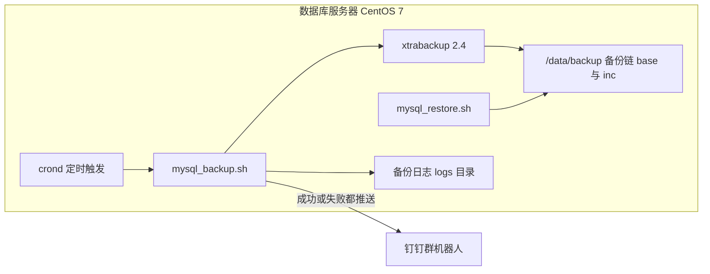

复盘了一次备份链静默断裂 33 天的事故，并给出了翻修后的自动备份脚本全文。但复盘解决的是"为什么这么写"，真正落地时还有一整串问题：生产环境是**离线的 CentOS 7**，装不了公网仓库；XtraBackup 必须和 MySQL 5.7 严格配套；压缩备份的解压依赖 qpress；脚本在 Windows 上编辑过带着 CRLF；定时任务怎么和已有的维护窗口错峰……本文是姊妹篇，从一台裸机开始，把整套物理备份体系装起来：**RPM 离线安装 → qpress → 脚本部署与配置 → 钉钉告警 → 首跑验证 → 定时任务 → 恢复演练**，照着走一遍，半小时落地。

<!-- more -->

## 一、部署形态总览

先看最终形态。所有组件都在数据库服务器本机——这不仅是省事，更是上一篇文章讲过的原则：**xtrabackup 的 `--host` 只是协调端，数据永远从本机 `datadir` 复制，备份体系天生就该部署在数据库同机**。



安装包目录结构（整包拷到服务器 `/usr/local` 下解开即可）：

```text
/usr/local/CentOS7-xtrabackup-qpress-OneClickScripts
├── install_xtrabackup.sh            # 一键安装脚本（第八节）
├── percona-xtrabackup-24/           # 离线 RPM 组件包
│   ├── percona-xtrabackup-24-2.4.29.el7.x86_64.rpm
│   └── 依赖 RPM（libev / numactl-libs / perl-DBI / perl-DBD-MySQL ...）
└── mysql_xtrabackup_scripts/
    ├── mysql_backup.sh              # 自动备份脚本（上一篇文章有全文）
    └── mysql_restore.sh             # 恢复脚本
```

## 二、准备离线安装包

生产机不通公网，所有 RPM 在**一台同版本的联网机**上先下齐。关键是 `yumdownloader --resolve`：它把目标包连同依赖一起拖到本地目录，`yum localinstall` 时同目录内的依赖会被一并解决。

```bash
# 联网机（CentOS 7，已启用 Percona 仓库与 EPEL）
yum install -y yum-utils
mkdir percona-xtrabackup-24
yumdownloader --resolve --destdir=percona-xtrabackup-24 percona-xtrabackup-24
```

两个版本纪律，踩过的人都懂：

- **XtraBackup 8.x 不能备份 MySQL 5.7**，必须用 2.4 系列（本文用 2.4.29）；反过来 2.4 也不支持 8.0。装完第一件事永远是 `xtrabackup --version` 核对；
- 依赖里 `libev` 来自 EPEL，漏掉它 `yum localinstall` 会在离线机上直接报缺依赖，此时只能再回联网机补。

**qpress** 单独说：`--compress` 产出的 `.qp` 文件靠它解压，**恢复机必须装**（备份机不装也能备份成功，这是最容易漏的项——平时无感，恢复时才发现）。它是单文件 C 程序，联网机编译好把二进制随包带走即可：

```bash
gcc -O3 qpress.c -o qpress    # 或直接取现成二进制
cp qpress /usr/local/bin/ && chmod +x /usr/local/bin/qpress
```

## 三、安装 XtraBackup 与 qpress

离线机上执行：

```bash
cd /usr/local/CentOS7-xtrabackup-qpress-OneClickScripts
yum -y localinstall percona-xtrabackup-24/*.rpm
xtrabackup --version        # 应输出 2.4.29
qpress --version 2>/dev/null || echo "qpress 未装，恢复前必须补上"
```

## 四、创建备份专用数据库账号

不要用 root 业务账号跑备份。最小权限集 + 只允许本机来源，与脚本的"只连本机"原则配套：

```sql
CREATE USER 'backup_user'@'127.0.0.1' IDENTIFIED BY '你的密码';
GRANT RELOAD, LOCK TABLES, REPLICATION CLIENT, PROCESS ON *.* TO 'backup_user'@'127.0.0.1';
FLUSH PRIVILEGES;
```

- `RELOAD` / `LOCK TABLES`：执行 FLUSH TABLES WITH READ LOCK 等一致性锁；
- `REPLICATION CLIENT`：取 binlog 位点；
- `PROCESS`：查看服务端状态。
- 账号只授权 `'127.0.0.1'` 来源——配合下一节的 `BACKUP_HOST="127.0.0.1"`，即使这个密码泄露，也无法从其他机器连入。

## 五、部署与配置 mysql_backup.sh

脚本全文见上一篇文章，这里只讲落地必改项。把三个文件传入 `mysql_xtrabackup_scripts/` 后，**Windows 上编辑过的脚本必须过三道关**（CRLF 换行符会让 bash 直接报 `\r: command not found`）：

```bash
dos2unix mysql_backup.sh mysql_restore.sh
bash -n mysql_backup.sh && bash -n mysql_restore.sh   # 语法检查
chmod 700 mysql_backup.sh mysql_restore.sh            # 内含密码与钉钉密钥，只给 root
```

配置区必改项：

| 配置项 | 填什么 | 说明 |
|---|---|---|
| `BACKUP_USER` / `BACKUP_PASS` | 第四节创建的账号 | 密码含 `!` 等特殊字符时，脚本内双引号无需处理；手动命令行测试要用单引号 `-p'...'` |
| `BACKUP_HOST` | **固定 `127.0.0.1`** | 脚本内置本机防呆：非本机地址直接拒绝执行并推送告警 |
| `BACKUP_PORT` | 3306 | 按实际 |
| `BACKUP_DATADIR` | `/var/lib/mysql` | 本机数据目录，按实际 |
| `BACKUP_BASE_DIR` | `/data/backup` | 备份根目录，**预留 ≥ 2 个全量大小的空间** |
| `RETENTION_DAYS` | 90 | 保留 3 个月，按需调 |
| `FULL_BACKUP_INTERVAL` | 7 | 每周一次全量 |
| `DING_WEBHOOK` / `DING_SECRET` | 见第六节 | 留空则关闭推送 |

`mysql_restore.sh` 只需把头部 `BACKUP_BASE_DIR` 指向 `/data/backup`，其余零配置。

## 六、配置钉钉机器人

1. 钉钉群 → 设置 → 机器人 → 添加 → **自定义**；
2. 安全设置选**加签**（不要选关键词/IP 白名单）——创建后会得到一个 Webhook 地址和一个 `SEC` 开头的加签密钥；
3. 分别填入脚本的 `DING_WEBHOOK`（完整 https 地址）与 `DING_SECRET`（`SEC` 开头那串）。

脚本用 `openssl + curl` 完成加签（`base64(hmac_sha256(secret, "timestamp\nsecret"))` 再 URL 编码），不依赖任何第三方客户端。唯一前提：**服务器能出网访问 `oapi.dingtalk.com`**——纯内网机器先把这条链路打通，或者接受留空关闭推送（但请回到上一篇文章看看"静默失败 33 天"再决定）。

## 七、首次手动验证：三个信号齐全才算装好

交给 cron 之前，必须手动跑通一次全量：

```bash
# 1) 回环连通预检：确认本机实例监听 127.0.0.1 且账号授权了本机来源
mysql -h127.0.0.1 -P3306 -ubackup_user -p'你的密码' -e "select 1"

# 2) 手动执行（低峰期）
cd /usr/local/CentOS7-xtrabackup-qpress-OneClickScripts/mysql_xtrabackup_scripts
./mysql_backup.sh

# 3) 看链
./mysql_restore.sh --list
```

**三个信号**缺一不可：

| 信号 | 在哪确认 |
|---|---|
| 日志出现 `备份成功 ✅` | `/data/backup/logs/backup_日期_时间.log` |
| 目录里有 `xtrabackup_checkpoints` | `ls /data/backup/base_日期_时间/` |
| 钉钉收到成功推送 | 群消息 |

第二天再手动跑一次，确认产出的是**增量**（`inc_日期_时间`）且成功——增量链衔接正常，部署才算真正完成。

## 八、定时任务与一键安装脚本

定时任务写入 `/etc/crontab`（root 身份、日志落盘）：

```bash
echo "40 4 * * * root /usr/local/CentOS7-xtrabackup-qpress-OneClickScripts/mysql_xtrabackup_scripts/mysql_backup.sh >> /var/log/mysql_backup.log 2>&1" >> /etc/crontab
```

**执行时间必须与已有维护任务错峰**。这不是洁癖——上一篇文章的整个事故，根因就是备份窗口撞上了凌晨 02:00 档的在线 DDL：MySQL 5.7 免 redo 的 DDL 会让 XtraBackup 主动中止。脚本内置了"等待 30 分钟自动重试"兜底，但重试是兜底不是常规路径，把备份挪到维护任务之后（如 04:40）才是正解。

整套安装可以固化成一个脚本（在原始版本基础上做了两处改进：cron 时间参数化，默认 04:40 不再写死 02:00；脚本权限 700 而非 +x，因为里面存着密码和密钥）：

```bash
#!/bin/bash
# 一键安装部署 XtraBackup 备份组件
# 步骤：安装本地 RPM → 校验 → 脚本执行权限 → 写入定时任务
# 用法：BACKUP_CRON="40 4 * * *" ./install_xtrabackup.sh   # 不传默认每天 04:40
BACKUP_CRON="${BACKUP_CRON:-40 4 * * *}"

echo "====== 开始安装 XtraBackup ======"
BASE_DIR=$(cd "$(dirname "$0")"; pwd)
RPM_DIR="$BASE_DIR/percona-xtrabackup-24"
SCRIPT_DIR="$BASE_DIR/mysql_xtrabackup_scripts"

[ -d "$RPM_DIR" ]     || { echo "❌ 未找到 RPM 包目录：$RPM_DIR";     exit 1; }
[ -d "$SCRIPT_DIR" ]  || { echo "❌ 未找到脚本目录：$SCRIPT_DIR";    exit 1; }

echo "➡ 安装本地 RPM 包（含依赖）..."
yum -y localinstall "$RPM_DIR"/*.rpm || exit 1

echo "➡ 校验 xtrabackup ..."
xtrabackup --version || { echo "❌ 安装失败，请检查 RPM 包"; exit 1; }

echo "➡ 设置脚本权限（内含密码与密钥，仅 root）..."
chmod 700 "$SCRIPT_DIR/mysql_backup.sh" "$SCRIPT_DIR/mysql_restore.sh"

echo "➡ 写入定时任务（$BACKUP_CRON）..."
sed -i '/mysql_backup.sh/d' /etc/crontab    # 先去重，防止重复安装叠加多条
echo "$BACKUP_CRON root $SCRIPT_DIR/mysql_backup.sh >> /var/log/mysql_backup.log 2>&1" >> /etc/crontab

echo "====== 安装与配置完成 ======"
```

装完检查 cron 生效：

```bash
systemctl status crond          # 确认 crond 在跑
tail -f /var/log/mysql_backup.log
```

## 九、恢复演练：部署的最后一步

没有恢复验证过的部署不算完成。挑一个低峰期，在**测试环境**（或停机窗口内的生产）走一遍：

```bash
./mysql_restore.sh --list                       # 看当前可用链
./mysql_restore.sh --date=2026-09-03            # 恢复到指定日期
```

恢复脚本会：交互确认后自动停 MySQL → 把全量复制到 `/tmp` 临时目录（原备份全程不被修改，失败可重来）→ `--apply-log-only` 逐个应用增量 → 最终 prepare → 拷回数据目录并修正 `mysql:mysql` 属主 → 启动 MySQL。恢复后抽查关键业务表，确认数据完整。

两个容量提醒：临时目录模式需要 `/tmp` 有约等于解压后全量大小的空间；链式恢复要求链完整连续——这也是脚本坚持自动清理孤儿增量的原因。

## 十、常见问题排查

| 现象 | 原因 | 处理 |
|---|---|---|
| `yum localinstall` 报缺依赖 | 联网机 `--resolve` 时仓库不全（如 EPEL 未启用，缺 libev） | 回联网机启用对应仓库重下，补进 RPM 目录 |
| 装的是 8.x，备份直接报错 | PXB 8.x 不支持 MySQL 5.7 | 卸载后改装 2.4 系列，`xtrabackup --version` 核对 |
| `too many open files` | 打开文件数上限 | 脚本已内置 `ulimit -n 65536`；仍报错查 `/etc/security/limits.conf` 的 hard nofile |
| 脚本拒绝执行，日志提示 BACKUP_HOST 不是本机地址 | 本机防呆生效，host 填了别的机器 | 改回 `127.0.0.1`——错配备份看似成功实则不可恢复 |
| 备份中止，日志含 `Retry the backup operation` | 备份窗口撞上免 redo 在线 DDL | 脚本会自动等待重试；根治靠错峰（第八节） |
| 恢复时报 `qpress: command not found` | 恢复机没装 qpress | 第二节的方法补装到 `/usr/local/bin` |
| bash 报 `\r: command not found` | 脚本带 Windows CRLF 换行 | `dos2unix` 后 `bash -n` 再跑 |
| 钉钉收不到推送 | Webhook 与 SEC 填反、或服务器无法出网访问 oapi.dingtalk.com | 核对配置；脚本日志会记录推送失败的具体响应 |
| 手动 mysql 测试密码报错 | 密码含特殊字符被 shell 展开 | 命令行用单引号 `-p'密码'`；脚本内双引号无需处理 |

## 十一、升级与卸载

- **升级脚本**：覆盖 `mysql_backup.sh` 后重过三道关（`dos2unix` → `bash -n` → `chmod 700`），手动跑一次增量确认链条衔接；脚本自身的基准有效性校验会自动跳过历史半成品目录，新旧版本产物兼容；
- **卸载**：`sed -i '/mysql_backup.sh/d' /etc/crontab` 移除定时任务，`rpm -e percona-xtrabackup-24` 卸载组件，`/data/backup` 按数据保留要求处置。

## 小结

- **部署清单一条线**：联网机备包（RPM + 依赖 + qpress）→ 离线机安装核对版本 → 建本机专用备份账号 → 脚本三道关（dos2unix / bash -n / chmod 700）→ 配钉钉 → 手动全量三信号 → 错峰 cron → 恢复演练；
- **三个最容易漏的项**：qpress（恢复时才爆）、CRLF（Windows 编辑必踩）、错峰（撞 DDL 窗口的代价上一篇文章已经付过）；
- **备份体系的安全边界和可用边界是一体两面**：只连 127.0.0.1、账号只授本机来源、脚本 700、成功失败都推送——每一条都同时让"被攻破"和"坏了没人知道"更难发生；
- 上线不是"cron 写完了"，而是**手动全量成功 + 钉钉收到 + `--list` 看到链 + 演练恢复过**，四件事做完才算数。
