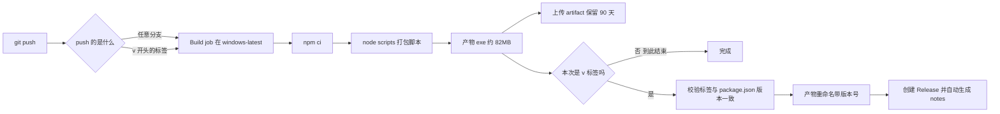
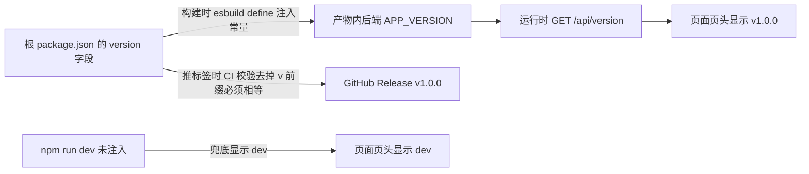

个人项目发版本这件事，很容易一直停留在手工作坊阶段：改完代码本地跑一遍打包脚本、手动改名带版本号、开浏览器传 GitHub Release、版本号在 `package.json`、标签、产物文件名里各写一遍——忘了哪处就漂移。本文以一个真实项目为例，把发版动作收敛成**两条 git 命令**：任意分支 `git push` 自动构建出产物（artifact 下载），`git push --tags` 推一个 `v*` 标签自动校验版本、构建并创建 GitHub Release。项目形态是 Node 全栈（Vue 3 前端 + Express 后端，Node 22 SEA 打包成 Windows 单文件 exe），但流水线设计与语言无关，照搬即可。

<!-- more -->

## 一、最终形态总览

先看要搭成什么样，再动手。核心原则只有一条：**构建逻辑只有一份**——本地手动打包和 CI 跑的是同一个 `scripts/build-exe.mjs`，workflow 里不重写任何构建步骤。CI 与本地共享一条链路，永远不会出现"本地能打包、CI 打不出来"的漂移。



触发矩阵整理成表：

| push 内容 | 构建动作 | 产物去向 |
| --- | --- | --- |
| 任意分支 | 构建 | workflow artifact（保留 90 天，构建页下载） |
| `v*` 标签（如 `v1.0.0`） | 构建（同一 job，不重复跑） | GitHub Release，挂载带版本号的产物 |
| 手动 dispatch | 同分支行为 | 同上 artifact |

## 二、workflow 文件逐段实现

完整文件放在 `.github/workflows/build.yml`，下面按段拆开讲为什么这么写。

### 2.1 触发：branches 与 tags 是"或"的关系

```yaml
name: Build EXE

on:
  push:
    branches: ['**']   # 任意分支：仅构建 + artifact
    tags: ['v*']       # v* 标签：构建 + Release
  workflow_dispatch:   # 手动触发兜底
```

`on.push` 下同时写 `branches` 和 `tags` 时，**任一命中即触发**，不是"分支且带标签"。`branches: ['**']` 匹配所有分支名（含斜杠的也匹配）。不写任何过滤则分支和标签全都触发——那就失去了"只让 v 开头的标签发版"的约束。

### 2.2 并发与权限：两行省一半 runner 时间

```yaml
concurrency:
  group: build-${{ github.ref }}
  cancel-in-progress: true

permissions:
  contents: write
```

`concurrency` 按 ref 分组：连续 push 同一分支时，旧构建自动取消，只跑最新的——个人项目免费 runner 额度有限，这行性价比极高。`permissions: contents: write` 是创建 Release 的必要写权限，放在 workflow 级别声明即可。

### 2.3 构建 job：复用本地脚本，不重写步骤

```yaml
jobs:
  build:
    runs-on: windows-latest
    timeout-minutes: 15
    steps:
      - uses: actions/checkout@v4

      - uses: actions/setup-node@v4
        with:
          node-version: '22'
          cache: npm

      - name: 安装依赖
        run: npm ci

      - name: 构建单 exe
        run: node scripts/build-exe.mjs

      - name: 上传产物
        uses: actions/upload-artifact@v4
        with:
          name: app-exe-${{ github.sha }}
          path: dist-exe/app.exe
          compression-level: 0
```

几个细节：

- **runner 选 `windows-latest`** 是因为产物是 Windows exe；纯跨语言项目按产物平台选即可。
- **`cache: npm`** 依赖根目录的 `package-lock.json` 存在；workspaces 单仓多包时根 lockfile 就够。
- **`npm ci` 而非 `npm install`**：严格按 lockfile 装，可复现。
- **`compression-level: 0`**：80MB 的 exe 是不可压缩二进制，默认 zip 压缩纯浪费时间，跳过能省一分钟。
- **`timeout-minutes`**：卡死的构建默认能挂 6 小时，个人项目 15 分钟足够，早失败早发现。

### 2.4 tag 才执行的步骤：`if` 条件，不是第二个 job

```yaml
      - name: 校验 tag 与 package.json 版本一致
        if: startsWith(github.ref, 'refs/tags/')
        shell: pwsh
        run: |
          $pkg = (Get-Content package.json -Raw | ConvertFrom-Json).version
          $tag = $env:GITHUB_REF_NAME -replace '^v', ''
          if ($pkg -ne $tag) {
            Write-Error "package.json version ($pkg) 与 tag ($tag) 不一致：先改 package.json 再打 tag"
            exit 1
          }

      - name: 产物重命名带版本号
        if: startsWith(github.ref, 'refs/tags/')
        shell: pwsh
        run: Copy-Item dist-exe/app.exe "dist-exe/app-${env:GITHUB_REF_NAME}.exe"

      - name: 发布 Release
        if: startsWith(github.ref, 'refs/tags/')
        uses: softprops/action-gh-release@v2
        with:
          files: dist-exe/app-v*.exe
          generate_release_notes: true
```

这里最容易犯的错是给标签单独写一个 job——那会**把整个构建跑两遍**。正确姿势是一个 job 里用 `if: startsWith(github.ref, 'refs/tags/')` 条件步骤：构建只跑一次，Release 相关步骤按需追加。版本校验放在构建之后、发布之前，**fail fast**——版本对不上直接红，不会产出一个版本号撒谎的 Release。`generate_release_notes: true` 按提交历史自动生成变更说明，个人项目够用。

## 三、版本号单一来源：从 package.json 到页头显示

发版链路通了之后，下一个问题就是版本号写在几处。原则：**根 `package.json` 的 `version` 字段是唯一事实**，其余位置全部由它派生。



### 3.1 构建期注入：esbuild define 的跨 shell 引号

打包脚本把版本号通过 `--define` 编译成常量，后端代码里只需正常读环境变量的写法：

```js
// scripts/build-exe.mjs
const version = JSON.parse(fs.readFileSync('package.json', 'utf8')).version;
execSync(
  `npx esbuild server/index.js --bundle --platform=node --format=cjs ` +
    `--outfile=build/sea-bundle.js --define:process.env.APP_VERSION="'${version}'"`,
  { stdio: 'inherit' }
);
```

```js
// server/config.js
export const APP_VERSION = process.env.APP_VERSION ?? 'dev';
```

`--define` 的值必须是**合法 JS 表达式**，字符串就要带引号——于是命令行上出现了嵌套引号。这里的坑：Node 的 `execSync` 在 Windows 走 cmd.exe，在类 Unix 走 `/bin/sh`，两者剥引号规则不同。上面 `"'1.0.0'"` 的写法两头通吃：**外层双引号被两种 shell 都剥掉，内层单引号都被保留**，esbuild 最终收到 `process.env.APP_VERSION='1.0.0'`。semver 版本号里不会有单引号，所以安全。

esbuild 会把 `process.env.APP_VERSION` 整个表达式替换成字面量，于是 `?? 'dev'` 在产物里变成 `"1.0.0" ?? 'dev'`；本地 `npm run dev` 没有这个注入，自然落到 `'dev'` 分支——**开发态显示 dev、发布态显示真实版本，一行兜底代码解决**。

### 3.2 运行时暴露与展示

后端加一个无平台参数的全局端点，注册在所有动态路由之前，避免被路径参数吞掉：

```js
// server/routes/api.js —— 注册顺序放在 /:xxx/... 路由之前
router.get('/version', (req, res) => {
  res.json({ ok: true, data: { version: APP_VERSION } });
});
```

前端挂载时拉一次，失败静默（版本号只是展示，不阻断界面），页头小字渲染 `v1.0.0` 或 `dev`。

至此闭环：改一处 `version` → 构建注入 → 页面显示 → 标签校验 → Release 文件名，全部自动对齐。

## 四、踩坑实录

### 4.1 打包产物差点入库

打包脚本上库前，`git status` 里躺着两个未跟踪目录：`build/`（打包中间产物，**里面还有本机绝对路径**）和 `dist-exe/`（exe 成品 + 运行期数据 + 日志）。个人项目没有 code review 拦着，一顺手 `git add .` 就进去了。补救就是 `.gitignore` 显式加上这两个目录——打包产物一律不进版本库，Release 和 artifact 才是产物的家。

### 4.2 监控命令的假成功：管道吞了退出码

CI 跑起来后我在本地挂了一条监控命令盯构建状态，收到"exit 0"就以为一切正常——实际上这台机器根本没装 `gh` CLI，命令第一行就失败了。问题出在管道：

```bash
gh run watch $RUN_ID --exit-status | tail -15   # 退出码取自 tail，恒为 0
```

bash 管道的退出码默认取**最后一个命令**，`tail` 永远成功，上游 `gh` 的失败被无声吞掉。要让管道暴露上游失败得 `set -o pipefail`。更根本的教训：**后台监控命令的结论必须读输出文件确认，退出码本身可能撒谎**。

### 4.3 本机查不了 GitHub API：换路子而不是死磕

构建结果想用 API 核实，`curl` 报 schannel 证书链错误、PowerShell `Invoke-RestMethod` 报 PartialChain——本机代理的 fake-IP 模式把 TLS 握手截断了，而 `git push` 走 SSH 完全不受影响。这种环境下查 CI 状态换用外部抓取通道直读 `api.github.com` 的 JSON 端点即可。另一个细节：**列表类端点（`/actions/runs`）有 15 分钟缓存**，刷构建状态要用 run 专属端点（`/actions/runs/<id>`，每个 id 一个唯一 URL）才能拿到新鲜结果。

### 4.4 版本漂移的防御要前移

版本校验放 CI 里而不是靠自觉：标签推上去、版本不一致、构建直接红——比"发完版才发现 exe 页面显示 1.0.0、Release 叫 v1.1.0"好一百倍。**凡是靠人记得住的约束，都该变成流水线上的一道闸。**

## 五、小结

搭完之后，日常发版收敛成三步：

```bash
# 1. 改根 package.json 的 version 字段，随代码一起提交推送
# 2. 打同版本标签并推送
git tag v1.0.0 && git push origin v1.0.0
# 3. 等 Actions 绿了，Release 页面已经躺着带版本号的产物
```

几条可迁移的经验：

- **构建逻辑只写一份**（本地脚本），CI 只负责调它——本地与流水线永不漂移
- **tag 语义用 `if` 条件步骤实现**，不要复制 job，构建不跑第二遍
- **版本号单一来源**，注入-暴露-校验全链路派生，人只写一处
- **并发取消（concurrency）** 是免费额度下最值钱的一行配置
- **所有约束前移到流水线**（版本校验 fail fast），不依赖人的记性
