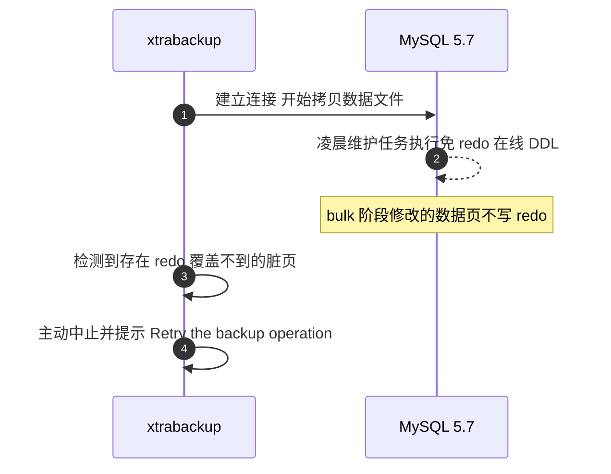
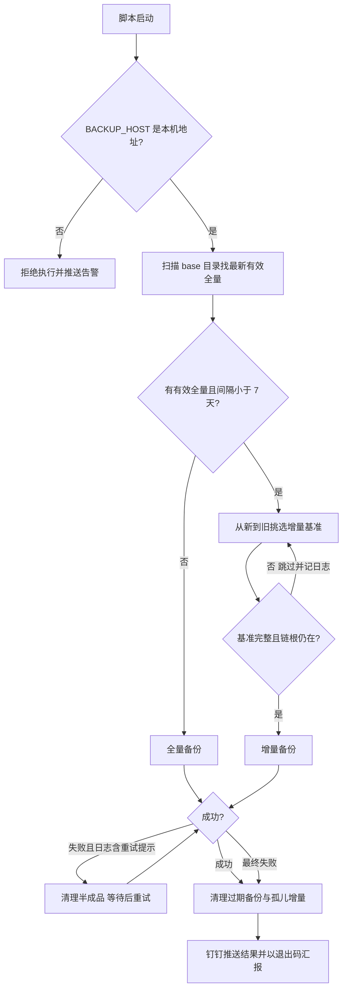
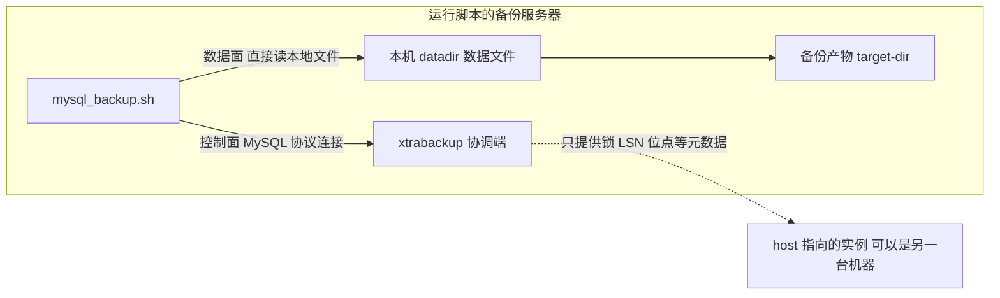

凌晨两点的定时备份，天天在跑、日志天天在写、备份目录天天生成——直到需要恢复的那一刻，才发现最后一个能用的恢复点停在 33 天前。

这是一套跑了很久的 CentOS 7 + MySQL 5.7 + Percona XtraBackup 2.4 组合：每周一次全量、每日增量、qpress 压缩、凌晨 cron 自动执行，看上去是教科书级的配置。但从 8 月 7 日起的每一次备份都失败了，而失败只安静地躺在日志文件里——没有任何推送、任何告警。根因是备份窗口撞上了 MySQL 5.7 免 redo 的在线 DDL，XtraBackup 主动中止；旧备份脚本的几个设计缺陷，又把"一次本可以重试的自中止"放大成了"静默断裂一个月"。

本文完整复盘这次事故，并给出一套翻修后的生产级备份脚本：基准有效性校验、DDL 窗口自动重试、半成品清理、链式维护、钉钉结果推送、本机防呆——外加一个很多人不知道的大坑：**xtrabackup 的 `--host` 参数只是"协调端"，要备份的数据永远从本机磁盘复制**。

<!-- more -->

## 一、事故现场：备份在跑，链早断了

先把环境和事实钉死：

| 项目 | 配置 |
|---|---|
| 操作系统 / 数据库 | CentOS 7 / MySQL 5.7.26 |
| 备份工具 | Percona XtraBackup 2.4.29（适配 MySQL 5.7） |
| 备份策略 | 每周一次全量 + 每日增量，凌晨 02:00 cron 执行 |
| 压缩 | `--compress`（qpress），并行 4 线程 |
| 存储结构 | `/data/backup` 下 `base_日期_时间`（全量）与 `inc_日期_时间`（增量） |

巡检发现的事实同样工整：

| 检查项 | 结果 |
|---|---|
| `base_2026-07-31_020001` | **有效**（目录完整、有 `xtrabackup_checkpoints`） |
| 08-07 之后的每一次备份 | **全部失败**，目录是半成品或干脆没有生成 |
| 失败通知 | 无——旧脚本没有任何推送机制，失败只写日志 |
| 净效果 | 可恢复点停在 7 月 31 日，**RPO 缺口 33 天** |

失败日志里反复出现同一段三行报错：

```text
InnoDB: Last flushed lsn: 636724032437 load_index lsn 4307682970222
InnoDB: An optimized (without redo logging) DDL operation has been performed.
        All modified pages may not have been flushed to the disk yet.
PXB will not be able to make a consistent backup. Retry the backup operation.
```

这里先给出第一个关键认知：**这不是 XtraBackup 的 bug，也不是数据库损坏，而是一次保护性中止**。PXB 检测到自身无法保证一致性时，宁可放弃也不产出一份"看起来成功、恢复时才发现是坏的"的备份。真正的问题在于：中止之后没有任何人知道，也没有任何机制把它救回来。

## 二、根因：免 redo 的在线 DDL 为什么会中止物理备份

### 2.1 XtraBackup 的一致性靠什么

物理备份不是原子快照。备份一个几十 GB 的库要十几分钟，这期间数据页一直在变——xtrabackup 一边拷贝数据文件，一边持续追着复制 redo log，恢复（prepare）阶段用 redo 把"不同时刻拷出来的页"回放到同一个一致点。**一句话：数据文件 + 覆盖备份窗口的 redo = 一致性。**

### 2.2 MySQL 5.7 的"优化 DDL"恰恰绕开了 redo

5.7 对 `ALTER TABLE ADD INDEX` 的 bulk 阶段、`OPTIMIZE TABLE` 等 inplace 操作做了优化：**批量构建索引数据时不写 redo**（几十万页的索引数据写 redo 既慢又占空间），改靠 page cleaner 把脏页刷盘保证持久性。

平时这没有任何问题。但备份窗口里撞上它，PXB 的前提就被打破了：



日志里 `Last flushed lsn`（已刷盘的 LSN）与 `load_index lsn`（免 redo 操作推进到的 LSN）之间的巨大落差，就是"有一段页修改没有落在 redo 里"的直接证据。此时若强行继续，产出的备份在 prepare 阶段必然无法自洽——所以 PXB 选择中止。

### 2.3 结论与工程对策

- **库本身无损**：DDL 不写 redo 是官方设计，靠刷盘保证持久性，不影响业务数据；
- **重试即可**：DDL 结束、脏页刷盘完成后重跑备份就能成功——我们在低峰期手动重试验证过；
- **两个长期对策**：① 备份窗口与维护任务错峰（本文的脚本后来改到 04:40 执行，DDL 任务仍在 02:00 档）；② 让脚本具备"识别这种失败并自动等待重试"的能力，见第四节。

## 三、旧脚本的四个设计缺陷：把"一次中止"放大成"33 天断裂"

拿到生产的脚本和它更早的版本做 diff，定位到四个缺陷。它们单独看都不致命，叠加起来就是"静默断裂一个月"：

| # | 缺陷 | 后果 |
|---|---|---|
| 1 | 过期清理的 `find -regex` 写法在实际方言下**永远匹配不到任何目录** | 保留策略形同虚设，历史目录无限堆积 |
| 2 | 增量基准选择**不做有效性校验**（`ls -1dt ... \| head -1` 直接取最新） | 任何一个半成品目录都会被选为基准，之后的增量连环失败 |
| 3 | 备份失败即 `exit 1` | 脚本尾部的清理段是**死代码**——失败路径永远走不到清理 |
| 4 | 失败不清理半成品、无任何通知 | 磁盘堆积坏目录 + 无人知晓，失败 33 天没人发现 |

第 1 条值得展开，因为它非常隐蔽。旧代码：

```bash
find "$BACKUP_BASE_DIR" -maxdepth 1 -type d \
    -regex ".*/\(base\|inc\)_[0-9_-]+" \
    -mtime +$RETENTION_DAYS -exec rm -rf {} \;
```

GNU `find` 的 `-regex` 默认是 **emacs 方言**——在 emacs 正则里，量词必须转义（`\+` 才是"一个或多个"，裸 `+` 是字面量加号）。于是 `[0-9_-]+` 的真实含义是"字符类里的**一个**字符，后面跟一个字面量 `+`"。目录名里永远不会有 `+`，这条 find 从上线第一天起就没删过任何东西。这也是我后来重构时干脆不用 regex、直接 glob 的原因：

```bash
find "$BACKUP_BASE_DIR"/base_* "$BACKUP_BASE_DIR"/inc_* -maxdepth 0 -type d \
    -mtime +$RETENTION_DAYS -print -exec rm -rf {} \;
```

glob 由 shell 展开，没有方言问题；`-maxdepth 0` 保证只作用于 `base_*`/`inc_*` 本身。

## 四、翻修设计：让链条"断不了、断了也知道"

翻修后的整体决策流程：



### 4.1 有效性校验：`xtrabackup_checkpoints` 是唯一的"完整体"标志

xtrabackup 只在**成功收尾**时才写 `xtrabackup_checkpoints`（内含 `backup_type = full-backuped / incremental` 行）。失败、中断的半成品目录里没有这个文件。于是它就是最可靠的有效性判据：

```bash
is_valid_backup() {
    [ -f "$1/xtrabackup_checkpoints" ] && grep -q "^backup_type" "$1/xtrabackup_checkpoints" 2>/dev/null
}
```

选全量基准时从新到旧扫描，第一个通过校验的才用；半成品自动跳过并记日志。**一个坏目录从此只能损失它自己那一次，毒不到后面的增量。**

### 4.2 增量基准：还要校验"链根"

增量目录有效还不够——它的链根全量必须还在。选择逻辑从新到旧扫全部目录：候选若是 `inc_*`，就反查比它更早的最新有效 `base_*` 是否存在，不存在说明链根已丢，这个增量恢复了也拼不出完整链条，跳过继续找。这条与 4.6 的链式清理配合，保证**被选为基准的目录一定属于一条完整活链**。

### 4.3 DDL 窗口自动重试

第二节结论说"重试即可"，那就让脚本自己重试。判据就是日志里的官方提示串：

```bash
if grep -q "Retry the backup operation" "$LOG_FILE" && [ "$ATTEMPT" -le "$RETRY_TIMES" ]; then
    # 清理半成品 → 等待 RETRY_WAIT_SEC（默认 1800s）→ 重试
fi
```

默认重试 2 次、间隔 30 分钟——足够等一个凌晨 DDL 窗口结束加脏页刷盘。窗口内第 1 次撞上、第 2 次成功，是翻修后最常见的形态。

### 4.4 失败半成品清理

任何一次最终失败（含重试耗尽），都把半成品目录删掉，同时把 `rm -rf` 约束在备份根目录之下，防止配置错误时误删别处：

```bash
case "$TARGET_DIR" in
    "$BACKUP_BASE_DIR"/*) rm -rf "$TARGET_DIR"; log "已清理半成品目录: $TARGET_DIR" ;;
esac
```

### 4.5 失败不中断维护，退出码汇报

旧版"失败即 exit"让清理段变成死代码。翻修后全程只置 `EXIT_CODE=1` 不退出，过期清理照常执行，最后统一 `exit "$EXIT_CODE"`——cron 侧能拿到非零码，清理也不会因为一次失败停摆一个月。

### 4.6 链式清理：孤儿增量

链式备份有一个容易被忽略的维护点。恢复一个增量需要"链根全量 + 之前所有增量"按序应用，所以**链根全量被过期清理后，挂在它链上、比它更晚的增量全部失效**——这些目录留着既占磁盘，又会在人工选链恢复时误导判断。

磁盘上识别它们的方法：**凡是比现存最老全量更早的增量，链根必然已被清理**（增量不可能早于自己的链根，而比它早的全量都已不在了）：

```bash
OLDEST_BASE=$(ls -1dt "$BACKUP_BASE_DIR"/base_* 2>/dev/null | tail -1)
for INC in "$BACKUP_BASE_DIR"/inc_*; do
    [ -d "$INC" ] || continue
    [ "$INC" -ot "$OLDEST_BASE" ] && { log "清理孤儿增量: $INC"; rm -rf "$INC"; }
done
```

注意这里方向别说反：以"被删的全量"为参照，失效的是它**链上更晚**的增量；以"现存最老全量"为参照，待清理的是比它**更早**的增量。两种说法描述的是同一批目录，参照物一换，"更早/更晚"就互换——写文档时值得多看一眼。

### 4.7 钉钉结果推送：把静默失败变成到人告警

这次事故最大的教训不是根因，而是**33 天没人知道**。翻修版内置了钉钉机器人推送，成功失败都推，加签模式只依赖 `openssl` + `curl`，无需任何第三方客户端：

```bash
# 签名 = base64(hmac_sha256(secret, "timestamp\nsecret"))，再 URL 编码
ts=$(date +%s%3N)
sign=$(printf '%s\n%s' "$ts" "$DING_SECRET" \
    | openssl dgst -sha256 -hmac "$DING_SECRET" -binary \
    | base64 | tr -d '\n')
```

推送文本带服务器、备份类型、目录、耗时、日志路径；推送失败只记日志、绝不影响备份流程与退出码。

## 五、最大的坑：`--host` 只是协调端，数据永远来自本机磁盘

翻修过程中还踩到一个更有普遍价值的坑，单独成节。

### 5.1 现象：连的是测试库，备份出来 47GB 生产数据

给一台机器部署脚本时，连接信息（host/账号/密码）误填成了另一套环境的。执行后一切"正常"：日志显示连的是那台小库，钉钉推送里写的也是它——但看备份产物，**47GB**，分明是本机这套大库的体量；那台小库的全量备份才 2.8GB。连的 A 库，备份出来的是 B 库的数据？

### 5.2 原理：xtrabackup 根本不通过 MySQL 连接搬数据

对比一下两类备份工具：

| | mysqldump 等逻辑备份 | xtrabackup 物理备份 |
|---|---|---|
| 数据通道 | MySQL 协议连接（走网络） | **本地文件系统直接读** |
| `--host` 决定什么 | 备份**谁的数据** | 只决定跟**哪个实例协调** |
| 能否备份远程库 | 可以 | **不能**（要远程得配 ssh/stream） |

xtrabackup 的连接只做三件事：版本检查、备份锁（FTWRL / backup locks）、取 LSN 与 binlog 位点等元数据。**要复制的数据文件，永远从运行脚本这台机器的本地 `datadir` 路径读取**：



所以 host 填错环境时：复制的是**本机**的数据文件（47GB 的生产数据），协调的却是**另一台**实例。日志里其实留有证据——`recognized server arguments` 这一行打印在 `version_check Connecting` **之前**，它读的是**本机** `/etc/my.cnf`（里面 32G 的 buffer pool 配置正是这台大库机器的体量），此时还没连任何库。

### 5.3 为什么这种备份"看似成功、实则不可恢复"

- 备份锁加在了错误的实例上，本机实例在备份窗口内照常写入、无人协调；
- LSN、binlog 位点等元数据全部来自错误的实例，与本地数据文件对不上；
- 数据页复制与 redo 跟随发生在本地文件上，所以这种错配**不必然立刻报错**——exit 0 与"可恢复"之间没有任何必然联系。

结论：只要发现 host 指向了别的机器，这次备份无论成败一律按无效处理。

### 5.4 判别实验与防呆

现场判别一条命令就够：在跑脚本的机器上 `hostname -I`，对比 host 是不是本机地址。

但靠人记得检查不叫工程，翻修版把检查写进了脚本——启动时拿 `BACKUP_HOST` 与 `127.0.0.1 / localhost / hostname -I 列出的本机所有网卡 IP` 比对，对不上直接拒绝执行并推送告警：

```bash
if [ -n "$BACKUP_HOST" ]; then
    HOST_IS_LOCAL=0
    for _h in 127.0.0.1 localhost ::1 $(hostname -I 2>/dev/null); do
        [ "$BACKUP_HOST" = "$_h" ] && { HOST_IS_LOCAL=1; break; }
    done
    if [ "$HOST_IS_LOCAL" -ne 1 ]; then
        log "❌ BACKUP_HOST=$BACKUP_HOST 不是本机地址，拒绝执行（防跨环境连错库）"
        send_dingtalk "【MySQL备份】❌ 配置错误拒绝执行 | 服务器: $(hostname) | 请将 BACKUP_HOST 改为 127.0.0.1"
        exit 1
    fi
fi
```

设计上放行"本机任意网卡 IP"（连自己的内网 IP 语义上仍是本机实例），只拒绝真正指向其他机器的情况；校验在任何备份动作之前，不产生半成品。**备份脚本的 `BACKUP_HOST` 应当固定写 `127.0.0.1`，从根上消除跨环境连错的可能。**

## 六、恢复侧：链式应用原理

脚本产出的备份链按下面方式恢复（配套恢复脚本已自动化，这里讲清原理）：


两条铁律：

- **中间每一次 prepare 都加 `--apply-log-only`**：只前滚、不回滚，保持备份处于"可继续追加增量"的状态；
- **链上最后一次 prepare 不加**：回滚未提交事务，把数据推到一致点。

注意事项：增量链必须完整连续，链中任何一个增量缺失，其后的增量全部失效；操作前停 MySQL、清空数据目录；建议全程在临时副本上进行，原备份目录不动，失败还能重来；恢复后修正数据目录属主再启动。**任何备份方案，只有经过恢复验证才算有效**——建议每季度在测试环境演练一次完整恢复。

## 七、完整脚本

以下是翻修后的完整脚本（敏感项已替换为占位符）。依赖仅 `xtrabackup`、`openssl`、`curl`：

```bash
#!/bin/bash
# ===========================================
# MySQL XtraBackup 自动备份脚本（最终版）
# 功能：
#   - 支持指定数据库备份
#   - 支持压缩备份
#   - 支持增量备份（一天内多次）
#   - 自定义全量备份间隔
#   - 可指定 MySQL 主机和端口
# 2026-09-02 修复：
#   - 增量基准有效性校验：缺 xtrabackup_checkpoints 的坏目录自动跳过，
#     不再卡死整条备份链（此前 base 半成品会导致之后每天增量全部失败）
#   - 备份失败自动清理半成品目录：避免坏目录被下次增量误选为基准，同时释放磁盘
#   - 链式清理：链根全量过期被删后，对应的孤儿增量一并清理
#   - 遇 PXB「Retry the backup operation」(备份窗口内有免 redo 的在线 DDL 未刷盘)
#     自动等待并重试，避开 DDL 窗口
#   - 备份失败也执行过期清理（此前失败即 exit，清理段永远不执行，
#     导致历史备份堆积不删）；失败时退出码非零，便于外部监控告警
# 2026-09-03 新增：
#   - 备份结果钉钉机器人推送（成功/失败都推，加签安全模式；
#     配置见 DING_WEBHOOK / DING_SECRET，DING_WEBHOOK 留空即关闭）
#   - 本机防呆：BACKUP_HOST 只允许本机地址（127.0.0.1/localhost/本机任意网卡 IP），
#     指向其他机器直接拒绝执行并推送告警——xtrabackup 复制的是本机 datadir 的文件，
#     host 仅是协调端，连远程 = “本地文件+远端协调”的错配备份
# ===========================================

# 提升当前脚本的最大打开文件数，避免 xtrabackup 报 too many open files
ulimit -n 65536

# ---------------- 配置区 -------------------
BACKUP_USER="backup_user"         # 备份 MySQL 用户
BACKUP_PASS="你的密码"             # 本机实例的密码
BACKUP_HOST="127.0.0.1"          # 只连本机实例！xtrabackup 复制本机 datadir 的文件，
                                 # host 仅是协调端（锁/LSN/binlog 位点）；填成其他机器
                                 # 会做出错配备份（看似成功、不可恢复），脚本将拒绝执行
BACKUP_PORT=3306               # MySQL 端口
BACKUP_SOCKET=""               # MySQL socket，如果使用 TCP 可留空
BACKUP_DATADIR="/var/lib/mysql"   # MySQL 数据目录

BACKUP_BASE_DIR="/data/backup"   # 备份根目录
LOG_DIR="$BACKUP_BASE_DIR/logs"
RETENTION_DAYS=90                # 备份保留天数（默认 3 个月，可配置；按目录 mtime 判断）
FULL_BACKUP_INTERVAL=7           # 每隔多少天做一次全量备份

DBS=""                           # 要备份的数据库，空表示全库

PARALLEL=4   # 并行备份线程数，可配置
COMPRESS_THREADS=4   # 压缩线程数

# 遇 PXB「Retry the backup operation」（备份窗口内有免 redo 的在线 DDL，
# 如 ALTER TABLE ADD INDEX / OPTIMIZE 的 bulk 阶段，脏页未刷盘）时自动重试
RETRY_TIMES=2          # 重试次数（不含首次）
RETRY_WAIT_SEC=1800    # 每次重试前等待秒数，给 DDL 结束/脏页刷盘留时间

# 钉钉机器人推送（备份成功/失败都会推送；DING_WEBHOOK 留空即关闭）
# 机器人安全设置须为「加签」，SEC 开头的密钥填 DING_SECRET
DING_WEBHOOK=""
DING_SECRET=""

# ---------------- 日期时间 ------------------
START_TS=$(date +%s)             # 任务开始时间戳（统计总耗时用）
DATE=$(date +%F)                 # 当前日期
TIME=$(date +%H%M%S)             # 当前时间，保证一天内多次备份唯一目录

mkdir -p "$BACKUP_BASE_DIR" "$LOG_DIR"
LOG_FILE="$LOG_DIR/backup_${DATE}_${TIME}.log"

log() { echo "[$(date '+%F %T')] $*" | tee -a "$LOG_FILE"; }

# 钉钉推送（加签模式）：推送失败只记日志，绝不影响备份流程和退出码
send_dingtalk() {
    local msg="$1" url="$DING_WEBHOOK" ts sign resp
    [ -z "$DING_WEBHOOK" ] && return 0
    if [ -n "$DING_SECRET" ]; then
        # 签名 = base64(hmac_sha256(secret, "timestamp\nsecret"))，再 URL 编码
        ts=$(date +%s%3N)
        sign=$(printf '%s\n%s' "$ts" "$DING_SECRET" \
            | openssl dgst -sha256 -hmac "$DING_SECRET" -binary \
            | base64 | tr -d '\n')
        url="${url}&timestamp=${ts}&sign=$(printf '%s' "$sign" | sed 's/+/%2B/g; s;/;%2F;g; s/=/%3D/g')"
    fi
    msg=$(printf '%s' "$msg" | tr -d '\r\n')   # 文本消息压成单行，保证 JSON 合法
    resp=$(curl -sS -m 10 "$url" -H 'Content-Type: application/json' \
        -d "{\"msgtype\":\"text\",\"text\":{\"content\":\"$msg\"}}" 2>&1)
    case "$resp" in
        *'"errcode":0'*) log "钉钉推送成功" ;;
        *) log "⚠️ 钉钉推送失败: $resp" ;;
    esac
}

echo "===================================================" >> "$LOG_FILE"
log "开始备份，日志输出到 $LOG_FILE"

# ---------------- 本机防呆 ------------------
# 备份脚本永远只连本机实例：xtrabackup 是物理备份，复制的是本机 datadir 下的文件，
# host 只是协调端（版本检查/备份锁/LSN 与 binlog 位点）。host 指向其他机器会产生
# “本地文件 + 远端协调”的错配备份——可能看似成功、实则不可恢复，因此直接拒绝执行
if [ -n "$BACKUP_HOST" ]; then
    HOST_IS_LOCAL=0
    for _h in 127.0.0.1 localhost ::1 $(hostname -I 2>/dev/null); do
        [ "$BACKUP_HOST" = "$_h" ] && { HOST_IS_LOCAL=1; break; }
    done
    if [ "$HOST_IS_LOCAL" -ne 1 ]; then
        log "❌ BACKUP_HOST=$BACKUP_HOST 不是本机地址，拒绝执行（防跨环境连错库）"
        log "   xtrabackup 只复制本机 datadir 的文件，host 仅是协调端；请改为 127.0.0.1（或本机内网 IP）"
        send_dingtalk "【MySQL备份】❌ 配置错误拒绝执行 | 服务器: $(hostname) | BACKUP_HOST=$BACKUP_HOST 不是本机地址，请改为 127.0.0.1"
        exit 1
    fi
fi

# ---------------- 备份目录 ------------------
FULL_DIR="$BACKUP_BASE_DIR/base_${DATE}_${TIME}"   # 全量目录
INC_DIR="$BACKUP_BASE_DIR/inc_${DATE}_${TIME}"    # 增量目录

# ---------------- 基准有效性校验 ------------------
# xtrabackup 只在备份完整收尾时才写 xtrabackup_checkpoints：
# 失败/中断的半成品目录没有该文件，不能作为增量基准
is_valid_backup() {
    [ -f "$1/xtrabackup_checkpoints" ] && grep -q "^backup_type" "$1/xtrabackup_checkpoints" 2>/dev/null
}

# 找最新的【有效】全量目录（新→旧，第一个通过校验的）
latest_valid_base() {
    local d
    while IFS= read -r d; do
        is_valid_backup "$d" && { echo "$d"; return 0; }
    done < <(ls -1dt "$BACKUP_BASE_DIR"/base_* 2>/dev/null)
    return 1
}

# 找比 $1 更早的最新【有效】全量目录（用于判断增量的链根是否还在）
latest_valid_base_before() {
    local ref="$1" d
    while IFS= read -r d; do
        [ "$d" -ot "$ref" ] || continue
        is_valid_backup "$d" && { echo "$d"; return 0; }
    done < <(ls -1dt "$BACKUP_BASE_DIR"/base_* 2>/dev/null)
    return 1
}

# 选择增量基准：全部目录按新→旧找第一个可用的；
# 增量还要求其链根全量仍在且有效（否则恢复了也拼不出完整链条，跳过继续找更早的）
select_inc_base() {
    local d root
    while IFS= read -r d; do
        is_valid_backup "$d" || { log "⚠️ 跳过无效备份目录（缺 xtrabackup_checkpoints）: $d"; continue; }
        case "$d" in
            */base_*)
                echo "$d"; return 0 ;;
            */inc_*)
                root=$(latest_valid_base_before "$d")
                if [ -n "$root" ]; then
                    echo "$d"; return 0
                fi
                log "⚠️ 跳过孤儿增量（链根全量已丢失或无效）: $d"
                ;;
        esac
    done < <(ls -1dt "$BACKUP_BASE_DIR"/base_* "$BACKUP_BASE_DIR"/inc_* 2>/dev/null)
    return 1
}

# ---------------- 计算是否需要新全量备份 ------------------
NEED_FULL=0
LATEST_BASE=$(latest_valid_base)
if [ -z "$LATEST_BASE" ]; then
    NEED_FULL=1
    log "⚠️ 没有可用的全量基准（base_* 缺失或均为半成品），本次执行全量备份"
else
    LAST_DATE=$(basename "$LATEST_BASE" | cut -d_ -f2)
    DAYS_DIFF=$(( ( $(date -d "$DATE" +%s) - $(date -d "$LAST_DATE" +%s) ) / 86400 ))
    log "📌 最新有效全量: $LATEST_BASE（${DAYS_DIFF} 天前）"
    if [ "$DAYS_DIFF" -ge "$FULL_BACKUP_INTERVAL" ]; then
        NEED_FULL=1
        log "ℹ️ 距上次全量已 $DAYS_DIFF 天（≥ $FULL_BACKUP_INTERVAL），本次执行全量备份"
    fi
fi

# ---------------- 备份函数 ------------------
do_backup() {
    local TYPE="$1"       # 全量或增量
    local TARGET_DIR="$2"
    local BASE_DIR="$3"

    CMD=(xtrabackup --backup --user="$BACKUP_USER" --password="$BACKUP_PASS")
    [ -n "$BACKUP_HOST" ] && CMD+=(--host="$BACKUP_HOST")
    [ -n "$BACKUP_PORT" ] && CMD+=(--port="$BACKUP_PORT")
    [ -n "$BACKUP_SOCKET" ] && CMD+=(--socket="$BACKUP_SOCKET")
    [ -n "$DBS" ] && CMD+=(--databases="$DBS")
    [ -n "$BACKUP_DATADIR" ] && CMD+=(--datadir=$BACKUP_DATADIR)
    CMD+=(--parallel=$PARALLEL)
    CMD+=(--target-dir="$TARGET_DIR" --compress --compress-threads=$COMPRESS_THREADS)

    if [[ "$TYPE" == "增量" ]]; then
        if [ -z "$BASE_DIR" ]; then
            log "错误：增量备份需要基备份目录"
            EXIT_CODE=1
            return 1
        fi
        CMD+=(--incremental-basedir="$BASE_DIR")
    fi

    local ATTEMPT=1
    while true; do
        log "执行 $TYPE 备份: $TARGET_DIR (第 $ATTEMPT 次尝试)"
        [ -n "$BASE_DIR" ] && log "基于基准目录: $BASE_DIR"
        "${CMD[@]}" >> "$LOG_FILE" 2>&1
        STATUS=$?

        [ $STATUS -eq 0 ] && break

        # PXB 遇在线 DDL 免 redo 未刷盘会主动放弃并建议重试：等待后重试
        if grep -q "Retry the backup operation" "$LOG_FILE" && [ "$ATTEMPT" -le "$RETRY_TIMES" ]; then
            log "$TYPE 备份失败（在线 DDL 未刷盘），${RETRY_WAIT_SEC}s 后重试"
            case "$TARGET_DIR" in
                "$BACKUP_BASE_DIR"/*) rm -rf "$TARGET_DIR" ;;
            esac
            ATTEMPT=$((ATTEMPT + 1))
            sleep "$RETRY_WAIT_SEC"
            continue
        fi

        log "$TYPE 备份失败 ❌ (exit=$STATUS) 请检查日志 $LOG_FILE"
        # 清理半成品目录：既释放磁盘，也避免坏目录被后续增量误选为基准
        case "$TARGET_DIR" in
            "$BACKUP_BASE_DIR"/*) rm -rf "$TARGET_DIR"; log "已清理半成品目录: $TARGET_DIR" ;;
        esac
        EXIT_CODE=1
        return 1
    done

    log "$TYPE 备份成功 ✅"
}

# ---------------- 执行备份 ------------------
EXIT_CODE=0    # 失败不立即退出：清理段必须照常执行，最后统一以退出码汇报结果
BACKUP_TYPE_DONE="全量"; BACKUP_TARGET_DONE="$FULL_DIR"   # 供结果推送引用
if [ $NEED_FULL -eq 1 ]; then
    do_backup "全量" "$FULL_DIR"
else
    BASE_DIR=$(select_inc_base)
    if [ -z "$BASE_DIR" ]; then
        log "❌ 未找到任何有效基准，自动转为全量备份"
        do_backup "全量" "$FULL_DIR"
    else
        BACKUP_TYPE_DONE="增量"; BACKUP_TARGET_DONE="$INC_DIR"
        do_backup "增量" "$INC_DIR" "$BASE_DIR"
    fi
fi

# ---------------- 清理过期备份 ------------------
log "清理超过 $RETENTION_DAYS 天的备份..."
# 注意：不用 find -regex（emacs/posix 方言差异导致旧写法实际匹配不到任何目录），
# 直接用 glob + maxdepth 0 只作用于 base_*/inc_* 本身
find "$BACKUP_BASE_DIR"/base_* "$BACKUP_BASE_DIR"/inc_* -maxdepth 0 -type d \
    -mtime +$RETENTION_DAYS -print -exec rm -rf {} \; >> "$LOG_FILE" 2>&1

# 链式保护：比现存最老全量更早的增量，其链根已被清理、无法恢复，一并删除
OLDEST_BASE=$(ls -1dt "$BACKUP_BASE_DIR"/base_* 2>/dev/null | tail -1)
if [ -n "$OLDEST_BASE" ]; then
    for INC in "$BACKUP_BASE_DIR"/inc_*; do
        [ -d "$INC" ] || continue
        if [ "$INC" -ot "$OLDEST_BASE" ]; then
            log "清理孤儿增量（链根全量已被清理）: $INC"
            rm -rf "$INC"
        fi
    done
fi

ELAPSED=$(( $(date +%s) - START_TS ))
if [ "$EXIT_CODE" -eq 0 ]; then
    log "备份任务完成 🎉 (总耗时 ${ELAPSED}s)"
    send_dingtalk "【MySQL备份】✅ 成功 | ${BACKUP_TYPE_DONE} | 服务器: $(hostname) | DB: ${BACKUP_HOST}:${BACKUP_PORT} | 目录: ${BACKUP_TARGET_DONE} | 耗时: ${ELAPSED}s | 日志: ${LOG_FILE}"
else
    log "备份任务结束，但本次备份失败 ❌（过期清理已照常执行）"
    send_dingtalk "【MySQL备份】❌ 失败 | ${BACKUP_TYPE_DONE:-备份} | 服务器: $(hostname) | DB: ${BACKUP_HOST}:${BACKUP_PORT} | 详见日志: ${LOG_FILE}（过期清理已照常执行）"
fi
exit "$EXIT_CODE"
```

## 八、部署清单与验证

新机器部署/升级旧脚本时按这个顺序过一遍：

1. **传脚本**：Windows 上编辑过的脚本先 `dos2unix`，再 `bash -n` 过语法，`chmod 700`（内含密码与钉钉密钥，不给其他用户读权限）；
2. **回环连通预检**：`mysql -h127.0.0.1 -P3306 -u<user> -p -e "select 1"` 确认本机实例监听回环、账号授权了本机来源；不行就退而填本机内网 IP（防呆同样放行）；
3. **手动跑一次全量**：低峰期执行脚本，确认日志出现"备份成功"、`xtrabackup_checkpoints` 生成、钉钉收到成功推送——三个信号齐了才交给 cron；
4. **错峰**：cron 时间与已知的维护任务（DDL、批处理）拉开距离，脚本内的自动重试是兜底而不是常规路径；
5. **异机保存**：本机磁盘只是第一道防线，定期把 `/data/backup` 下的目录 rsync 到其他机器，防范服务器本身故障；
6. **恢复演练**：每季度在测试环境做一次完整链式恢复。备份的价值只在恢复的那一刻兑现，没有恢复验证过的备份等于没有备份。

## 小结

- **重新定义"备份成功"**：不是 cron 跑了、日志写了，而是——目录带 `xtrabackup_checkpoints`、失败能推送到人、并且真的演练恢复过；
- **静默失败是最危险的失败**：这次事故的根因（DDL 撞窗）其实无害，致命的是 33 天无人知晓——结果通知和退出码是备份脚本的一等公民，不是可选项；
- **物理备份工具先分清数据面与控制面**：`--host` 只是协调端，数据永远来自本机 `datadir`。填错 host 不会报错，只会产出一份看似成功的废备份——所以把"只连本机"写进脚本做硬校验，防呆优于文档；
- **链式备份的维护成本在"链"不在"份"**：基准有效性、链根完整性、孤儿增量清理，任何一环失守，单份备份再成功也拼不出恢复点；
- **正则方言是隐形雷区**：`find -regex` 默认 emacs 方言下裸 `+` 是字面量，一条"看起来对"的清理规则可以安静地失效几年。能用 glob 解决的事就别用正则。
