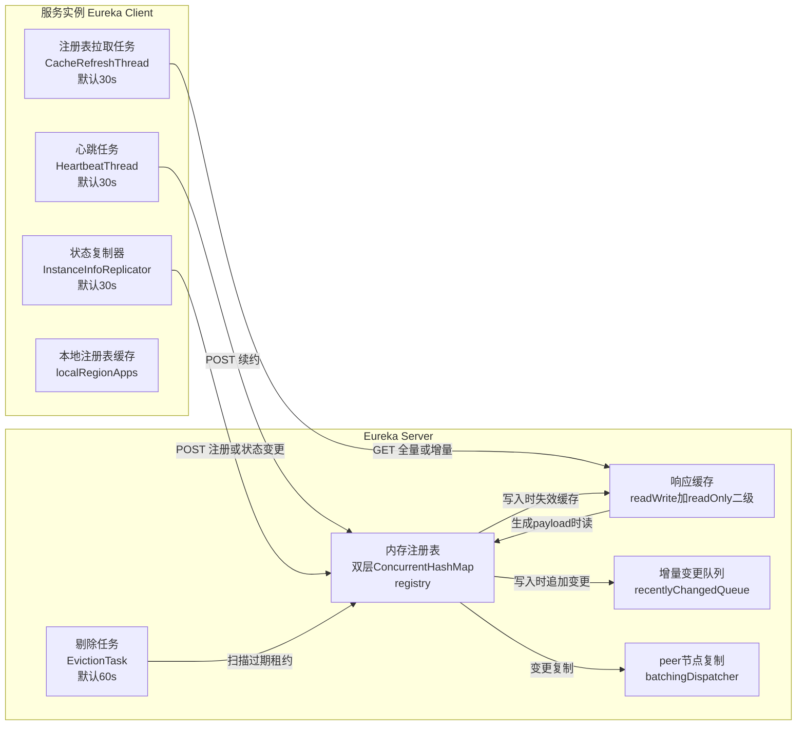
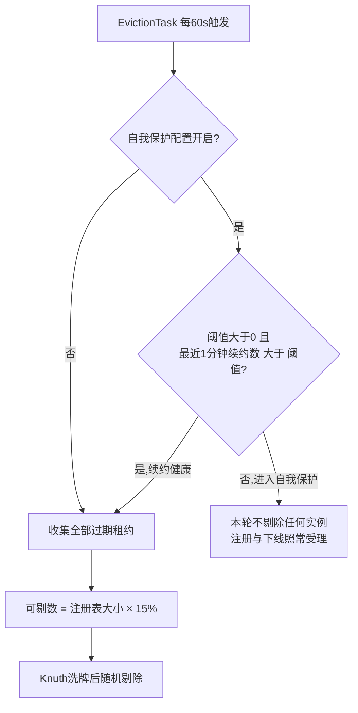
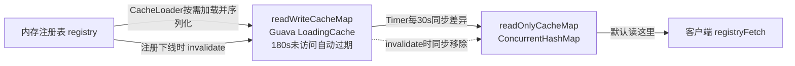
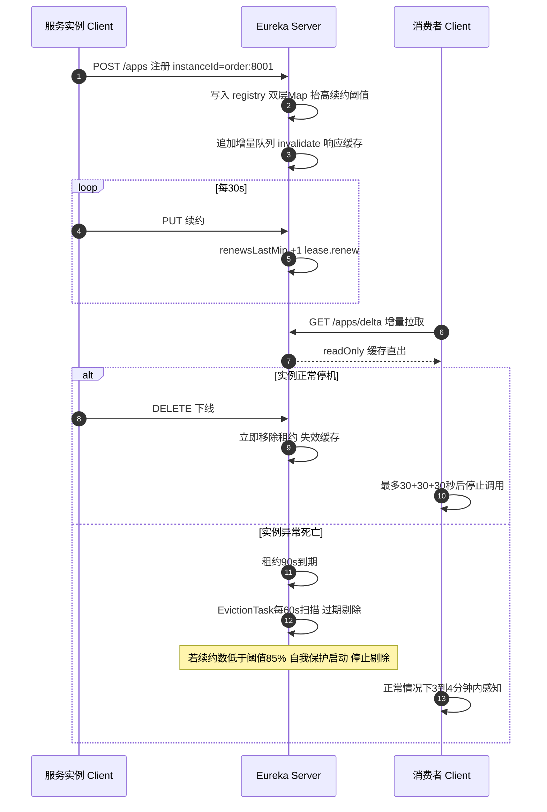

"服务挂了为什么 Eureka 页面上还显示 UP？"、"自我保护的 85% 到底是怎么算出来的？"、"一个服务下线了，调用方最长要多久才感知到？"——这几个问题在面试和线上排查里出现频率极高，但多数回答停在"心跳续约、默认 30 秒"这一层。这篇直接拆开 Eureka 的源码（Netflix eureka-client / eureka-core 1.9.8，对应 Spring Cloud Greenwich 版本线，本地 maven 仓库的 sources 包就是最好的阅读材料），把注册、心跳、下线、剔除、自我保护、多级缓存、增量拉取、集群复制这条完整链路全部走一遍，每个结论都落到具体的类与方法上。

先给一个能贯穿全文的坐标系：**Eureka Server 本质上是一个纯内存的租约登记表 + 一组围绕它运转的定时任务**。理解了"注册表数据结构、租约的过期语义、缓存的刷新节奏"这三件事，所有"灵异现象"都能对号入座。

<!-- more -->

## 一、全景：三层结构、五个后台任务



Client 侧三个后台任务、Server 侧围绕注册表的四个组件，全部在 `DiscoveryClient.initScheduledTasks()` 与 `AbstractInstanceRegistry` / `ResponseCacheImpl` 里。下文按"注册 → 心跳 → 下线 → 剔除与自我保护 → 缓存与增量 → 集群复制"的顺序逐个拆。

## 二、客户端启动：一个方法拉起三大任务

`DiscoveryClient.initScheduledTasks()`（DiscoveryClient.java:1249）是客户端的发动机，逻辑分两段：

```java
if (clientConfig.shouldFetchRegistry()) {
    // 注册表缓存刷新任务，默认 30s 一次
    scheduler.schedule(
        new TimedSupervisorTask("cacheRefresh", scheduler, cacheRefreshExecutor,
            registryFetchIntervalSeconds, TimeUnit.SECONDS, expBackOffBound,
            new CacheRefreshThread()),
        registryFetchIntervalSeconds, TimeUnit.SECONDS);
}
if (clientConfig.shouldRegisterWithEureka()) {
    // 心跳任务，周期取的是实例租约里的续约间隔，默认 30s
    scheduler.schedule(
        new TimedSupervisorTask("heartbeat", scheduler, heartbeatExecutor,
            renewalIntervalInSecs, TimeUnit.SECONDS, expBackOffBound,
            new HeartbeatThread()),
        renewalIntervalInSecs, TimeUnit.SECONDS);
    // 状态复制器：定时 + 事件驱动的双通道
    instanceInfoReplicator = new InstanceInfoReplicator(
        this, instanceInfo, clientConfig.getInstanceInfoReplicationIntervalSeconds(), 2);
    ...
}
```

三个要点：

**1. 注册动作本身极简。** `register()` 就是往 `POST /apps/{appName}` 发一坨 InstanceInfo 元数据（IP、端口、租约配置、元数据），服务端返回 **204 No Content** 即算成功（DiscoveryClient.java:830）。

**2. 状态变更走 InstanceInfoReplicator 的"定时 + 按需"双通道。** 它的 `run()` 先调 `discoveryClient.refreshInstanceInfo()` 刷新本地信息，只有 `instanceInfo.isDirtyWithTime() != null`（即数据真的变脏了）才重新 register（InstanceInfoReplicator.java）。同时客户端注册了一个 `StatusChangeListener`，应用侧调 `setInstanceStatus()`（比如健康检查从 UP 变 DOWN）会立刻触发 `instanceInfoReplicator.onDemandUpdate()` 立即上报——这就是 actuator `/service-registry` 端点背后能秒级改状态的机制。

**3. TimedSupervisorTask 是一个会自我保护的任务包装器。** 所有定时任务都包在它里面，`run()` 的骨架是：提交任务 → `future.get(timeoutMillis)` 限时等待 → **超时则延迟翻倍**（`newDelay = Math.min(maxDelay, currentDelay * 2)`，封顶值是 `timeout * expBackOffBound`，expBackOffBound 默认 10）→ `finally` 里无论成败都按当前延迟重新排自己（TimedSupervisorTask.java:58-99）。效果是：服务端越卡，客户端拉取/心跳的频率自动降下来，服务端恢复后延迟回到初始值，避免雪崩时全体客户端把注册中心打死。

## 三、服务端注册：双层 Map 与"脏时间戳"裁决

`AbstractInstanceRegistry.register()`（AbstractInstanceRegistry.java:191）是整个 Server 最核心的方法。注册表的数据结构是一张双层并发 map：

```java
// appName -> (instanceId -> Lease<InstanceInfo>)
private final ConcurrentHashMap<String, Map<String, Lease<InstanceInfo>>> registry;
```

外层按应用名分组，内层按实例 id 索引到 `Lease`（租约）。注册流程做了几件容易被忽略的事：

**1. 脏时间戳裁决新旧实例。** 同一个 instanceId 重复注册（比如实例重启后快速重新上线），如果已存在租约的 `lastDirtyTimestamp` **大于**新注册请求里的，服务端会反过来用旧的 InstanceInfo 覆盖这次注册（AbstractInstanceRegistry.java:212-217）。脏时间戳是客户端每次变更信息时打的版本戳，"更脏"意味着更新——这个比较是 Eureka 解决"同一实例新旧信息竞争"的核心手段，也是后面心跳校验 `lastDirtyTimestamp` 的伏笔。

**2. 新注册会抬高续约期望值。** 全新实例注册时，`expectedNumberOfClientsSendingRenews` 加一，并立刻重算 `updateRenewsPerMinThreshold()`（AbstractInstanceRegistry.java:220-226）——这个阈值就是自我保护的分母，第五节展开。

**3. 变更登记进增量队列并失效缓存。** `recentlyChangedQueue.add(...)` 把变更记录成 `ActionType.ADDED` 条目（给增量拉取用），随后 `invalidateCache(appName, vip, secureVip)` 把响应缓存里对应的 key 打掉（AbstractInstanceRegistry.java:262-265）。注册表永远是"唯一事实源"，缓存只是它的投影。

**4. overriddenStatus 的恢复。** 注册时会检查 `overriddenInstanceStatusMap` 里有没有这个实例的状态覆盖记录（比如运维手动把实例标记成 OUT_OF_SERVICE 后实例重启了），有则恢复覆盖状态（AbstractInstanceRegistry.java:240-256）。这个 map 是 `setMetadata`/`statusUpdate` 接口的手动状态持久层——**Eureka Server 重启会丢**，因为它也在内存里。

## 四、心跳与租约：90 秒的生存权

心跳入口 `renew()`（AbstractInstanceRegistry.java:344）拿到租约后只做两件实事：`renewsLastMin.increment()`（滑动窗口计数 +1，自我保护的分子）和 `leaseToRenew.renew()`。租约本体 `Lease` 类（Lease.java）只有 6 个字段，语义全靠时间戳：

```java
public static final int DEFAULT_DURATION_IN_SECS = 90;

public void renew() {
    // 注意：这里写的是 now + duration，而不是 now
    lastUpdateTimestamp = System.currentTimeMillis() + duration;
}

public boolean isExpired(long additionalLeaseMs) {
    return (evictionTimestamp > 0 || System.currentTimeMillis()
        > (lastUpdateTimestamp + duration + additionalLeaseMs));
}
```

源码注释自己都吐槽 `renew()` 干了"the wrong thing"（Lease.java:103）——先把过期时刻写到 `lastUpdateTimestamp`，判定时又加一次 `duration`，等价于**每次心跳实际把租期延长了 2 倍 duration**。默认 30s 续约 + 90s 租期下，真实过期窗口约 180s 而不是 90s。这是个已知的历史行为，读源码时会发现这个"错位"，写超时判定相关逻辑时要心里有数。

客户端 `renew()` 还有一个保命设计：心跳返回 **404**（租约没了，常见于 Server 重启丢了注册表、或被剔除后网络恢复）时，不报错也不放弃，而是**立刻把自己标记为 dirty 并重新注册**（DiscoveryClient.java:840-861）。所以 Eureka 客户端和服务端之间的注册关系是自愈的，短暂的全量丢失后客户端会在下一个心跳周期内自动爬回来。

## 五、下线、剔除与自我保护：85% 的来龙去脉

### 5.1 主动下线与被动剔除是两条路

- **主动下线**：进程收到 shutdown 钩子，`DiscoveryClient.shutdown()` 发 DELETE 请求，`internalCancel()` 从 map 移除租约、期望续约数减一、登记增量、失效缓存（AbstractInstanceRegistry.java:297-324）。**立即生效**（缓存延迟另算）。
- **被动剔除**：进程被 `kill -9`、OOM、断网，谁都不通知。此时靠服务端的 `EvictionTask` 定时（默认 **60s** 一次）扫全表，把 `lease.isExpired()` 的实例清掉（AbstractInstanceRegistry.java:1242）。

### 5.2 evict() 的三道保险

剔除任务 `evict()`（AbstractInstanceRegistry.java:579）的完整逻辑值得逐行看，因为它把"批量故障时防止误杀"做进了算法：

```java
if (!isLeaseExpirationEnabled()) {   // 保险一：自我保护总闸
    return;
}
// 先收集所有过期租约
List<Lease<InstanceInfo>> expiredLeases = ...;

// 保险二：本轮最多只能剔 15%
int registrySize = (int) getLocalRegistrySize();
int registrySizeThreshold = (int) (registrySize * serverConfig.getRenewalPercentThreshold());
int evictionLimit = registrySize - registrySizeThreshold;
int toEvict = Math.min(expiredLeases.size(), evictionLimit);

if (toEvict > 0) {
    // 保险三：Knuth 洗牌，随机挑着剔
    Random random = new Random(System.currentTimeMillis());
    for (int i = 0; i < toEvict; i++) {
        int next = i + random.nextInt(expiredLeases.size() - i);
        Collections.swap(expiredLeases, i, next);
        ... internalCancel(appName, id, false);
    }
}
```

注释写得很清楚：大批量过期时如果按序剔除，可能"整窝端掉某个应用"，随机化让杀伤均匀分布（AbstractInstanceRegistry.java:587-589）。

### 5.3 85% 阈值的精确公式

自我保护最常见的误读是把"85% 的实例在续约"当成分子分母都是实例数。**实际上分子分母都是"每分钟续约次数"**，公式在 `updateRenewsPerMinThreshold()`（AbstractInstanceRegistry.java:1192-1195）：

```java
numberOfRenewsPerMinThreshold = (int) (expectedNumberOfClientsSendingRenews
    * (60.0 / serverConfig.getExpectedClientRenewalIntervalSeconds())
    * serverConfig.getRenewalPercentThreshold());
```

翻译一下：

> 每分钟续约阈值 = 期望的注册实例数 × 每实例每分钟续约次数（60 ÷ 30 = 2）× 0.85

比如注册表里有 100 个实例，阈值 = 100 × 2 × 0.85 = **170 次/分钟**。分子是 `renewsLastMin`（`MeasuredRate` 滑动窗口，精确到 1 分钟内的真实续约次数）。判定开关 `isLeaseExpirationEnabled()`（PeerAwareInstanceRegistryImpl.java:478-484）：

```java
if (!isSelfPreservationModeEnabled()) {   // 配置关了自我保护 → 允许剔除
    return true;
}
return numberOfRenewsPerMinThreshold > 0
    && getNumOfRenewsInLastMin() > numberOfRenewsPerMinThreshold;
```

两个细节：

- **阈值是动态的**：每次注册/下线都会增减 `expectedNumberOfClientsSendingRenews` 并重算阈值（register 侧 AbstractInstanceRegistry.java:220-226，cancel 侧对应减一）。Server 集群还有个 15 分钟一次的 `updateRenewalThreshold()` 定时任务，按 peer 同步的实际注册数校准期望值（PeerAwareInstanceRegistryImpl.java:534-539）。
- **`threshold > 0` 这个条件很关键**：刚启动的空 Server（没有从 peer 同步到数据）阈值为 0，此时期租过期**被禁用**——什么都不剔，先等注册进来。这解释了单机 Eureka 重启后的一段时间内"僵尸实例清不掉"。



### 5.4 触发自我保护后的真实行为

自我保护触发时唯一的实际变化就是 `evict()` 第一道闸关闭：**过期实例不再被剔除**。注册、心跳、下线、状态变更全部照常。Eureka 的取舍很直白：网络分区时宁可保留过期数据（可能还活着），也不大批量清空注册表（可用性优先，AP）。代价是：**大面积故障恢复后，已死实例会在注册表里以 UP 状态滞留很久**，直到续约数回升、自我保护退出、下一轮 evict 才清掉。

这也是为什么本地开发环境（频繁重启、强杀进程，续约比例长期低于 85%）几乎必然常驻自我保护状态，页面上顶着一行红字 "RENEWALS ARE LESSER THAN THE THRESHOLD"，停掉的服务半天还挂在列表里。测试/本地环境的标准操作是 `eureka.server.enable-self-preservation=false` + 调小 `eviction-interval-timer-in-ms`，生产环境保持默认。

## 六、多级缓存：所有"延迟感知"问题的答案

"实例下线了，调用方为什么还在调它？"——答案几乎总在缓存链上。Eureka Server 对外提供注册表查询的路径不是直读内存注册表，而是二级缓存（ResponseCacheImpl.java）：



- **readWriteCacheMap**：Guava `LoadingCache`，`expireAfterWrite(180s)`，miss 时由 `CacheLoader.generatePayload()` 从注册表生成序列化 payload（ResponseCacheImpl.java:130-148）。
- **readOnlyCacheMap**：普通 `ConcurrentHashMap`，一个守护 Timer 每 **30s**（`responseCacheUpdateIntervalMs`）把 readOnly 里已有 key 与 readWrite 的值对齐（ResponseCacheImpl.java:155-186）。**默认配置下客户端读的是这一层**——响应可以无锁直出，这是 Eureka Server 能扛大量消费者拉取的原因。
- **失效路径**：注册/下线/状态变更时 `invalidateCache()` 只打掉 readWrite 对应 key 并顺手从 readOnly 移除；但 readOnly 里如果 Timer 刚好同步过旧值，最坏要等下一个 30s 周期才被覆盖。

把全链条的默认延迟加起来，就是"感知延迟"的账本：

| 场景 | 链路 | 量级 |
|---|---|---|
| 主动下线感知 | cancel 立即生效 → readOnly 同步 ≤30s → 客户端拉取 ≤30s → 负载均衡器列表刷新 ≤30s | **最坏 ~90s** |
| 实例异常死亡感知 | 租约过期 ~90s（叠加 Lease 的时间戳错位实际更久）→ evict 扫描 ≤60s → readOnly ≤30s → 拉取 ≤30s → 负载均衡 ≤30s | **最坏 3~4 分钟** |
| 自我保护期间 | evict 被禁 | **无限期，直到续约恢复** |

这张表就是"网关 502 了 Eureka 页面还是全绿"的完整解释。生产上不能指望注册中心秒级故障感知，得靠调用侧的熔断、重试与健康检查兜底——Eureka 的设计目标从始至终是"最终一致的可用性"，不是实时故障检测。

两个常用调优开关也在这层：`eureka.server.use-read-only-response-cache=false` 砍掉 readOnly 层（查询直读 readWrite，牺牲一点吞吐换即时可见性）；`eureka.server.response-cache-update-interval-ms` 调小同步周期。

## 七、增量拉取与对账：appsHashCode 的妙用

客户端每 30s 的 `fetchRegistry()`（DiscoveryClient.java:955）不是每次都拉全量。判断顺序：增量被禁用 / 指定了单 vip / **强制全量标志 / 本地还没有注册表 / 版本号是 -1**（老客户端不支持增量）→ 走 `getAndStoreFullRegistry()`；否则走 `getAndUpdateDelta()`（DiscoveryClient.java:1081）。

增量的服务端实现是 `recentlyChangedQueue`——一个并发链表队列，register/cancel/statusUpdate 都会往里塞带时间戳的变更条目。一个 Timer 每 30s 清掉**超过 3 分钟**（`retentionTimeInMSInDeltaQueue` 默认 180000ms）的旧条目（AbstractInstanceRegistry.java:1321-1335）。这个 3 分钟必须显著大于客户端 30s 的拉取周期，否则增量会漏。

增量机制最精巧的是**对账**：客户端拿到 delta 应用到本地后，重新计算本地的 `appsHashCode`（按 应用名_实例数 拼出来的指纹，如 `APP1_2_APP2_5_`），与服务端 delta 响应里携带的全局 hash 比对，**不一致就触发 `reconcileAndLogDifference` 重新全量拉取**（DiscoveryClient.java:1081-1105）。等于用了一个 O(1) 的校验和，把"增量漏了/乱了"的兜底成本收敛到偶发的一次全量。多线程并发拉取则用 `fetchRegistryGeneration` 的 CAS 保证同一时刻只有一代更新生效。

顺带一个实战坑：如果注册表更新频繁但消费端拉取间隔被调得过大（或服务端 GC 停顿导致 delta 队列清理延迟异常），会观察到客户端周期性"闪断"式全量刷新——就是对账机制在持续纠偏，日志里的特征是反复出现 `The Reconcile hash codes after complete alliance processing does not match` 相关告警。

## 八、Server 集群：尽力而为的 peer 复制

Eureka Server 集群是**对等复制**（无主从），任何写操作（注册/心跳/下线/状态变更）在本地生效后，复制给所有 peer：

```java
private void replicateToPeers(Action action, ...) {
    // 已经是复制流量就不再转发，防止"毒化"循环复制
    if (peerEurekaNodes == Collections.EMPTY_LIST || isReplication) {
        return;
    }
    for (final PeerEurekaNode node : peerEurekaNodes.getPeerEurekaNodes()) {
        if (peerEurekaNodes.isThisMyUrl(node.getServiceUrl())) {
            continue;   // 不复制给自己
        }
        replicateInstanceActionsToPeers(action, appName, id, info, newStatus, node);
    }
}
```

（PeerAwareInstanceRegistryImpl.java:616-636。）复制本身是**异步批量**的：`PeerEurekaNode` 内部有 `batchingDispatcher` 和 `nonBatchingDispatcher` 两套任务分发器（PeerEurekaNode.java:83-84），心跳这类可合并操作进批量队列凑批发送（默认最多 500ms 延迟窗口），注册/下线这类不可合并操作走单独通道。

新 Server 节点启动时从邻居全量"抄表"：`syncUp()` 逐实例 `register(..., isReplication=true)`（PeerAwareInstanceRegistryImpl.java:219-231），抄完 `openForTraffic(count)` 把 `expectedNumberOfClientsSendingRenews` 设为抄到的实例数——这正是自我保护期望值的初始化来源。

要清醒认识的一点：**peer 复制是尽力而为，不是事务**。复制失败重试有限，节点间数据可能短暂不一致；读请求打到哪个节点就看到哪个节点的视图。配合前述的多级缓存，Eureka 从架构上就没打算提供强一致——它是教科书级的 AP 系统，所有设计决策（自我保护、delta 对账、客户端 404 自动重注册）都在为"网络抖动下尽量可用、事后收敛"服务。

## 九、一张时序图收束全流程



## 十、把源码结论翻译成实战清单

最后把全文的源码事实压缩成一张速查表：

| 现象/问题 | 源码级解释 | 处置 |
|---|---|---|
| 停掉的服务在页面上还是 UP | 自我保护触发（续约数 < 85% 阈值），`evict()` 第一道闸关闭 | 本地/测试关自我保护；生产等续约恢复或重启 Server |
| 服务挂了很久才被调用方感知 | 90s 租约 + 60s evict 周期 + 30s readOnly 同步 + 30s 客户端拉取 + 30s 负载均衡刷新，串行叠加 | 调小各周期参数，或调用侧上熔断/主动健康检查 |
| Server 重启后实例全消失、一会儿又回来 | 注册表纯内存，重启即清空；客户端心跳收到 404 自动重注册 | 接受（设计如此），集群部署可从 peer 抄表 |
| 改了 `lease-expiration-duration-in-seconds` 客户端不生效 | 租约 duration 以**注册时**携带的值为准，续约请求不更新它 | 重新注册（重启实例）才生效 |
| 页面续约阈值比实例数 ×2 还多点零头 | 阈值公式 = 实例数 × (60÷30) × 0.85，含 peer 同步的动态校准 | 正常现象，不是配置漂移 |
| 大规模发布时部分新实例"注册不上" | dirty timestamp 裁决：旧租约更"脏"时覆盖新注册 | 保证 instanceId 变化（端口/随机数）或先下线再上线 |

读一遍源码最大的收获，是把 Eureka 从"一个会显示服务列表的组件"变成一组可推理的时间参数与数据结构：**双层 Map 是事实源，Lease 时间戳定义生死，85% 是续约次数比而非实例比，二级缓存决定可见性延迟，一切为 AP 妥协**。带着这个模型再去看任何 Eureka 相关的线上问题，基本都能在源码里找到那行决定行为的代码。

> 源码版本说明：本文引用的行号基于 eureka-client 1.9.8 与 eureka-core 1.9.8（Spring Cloud Greenwich.SR1 依赖线），不同小版本间行号可能有偏移，但类名与方法名稳定，按图索骥即可。
