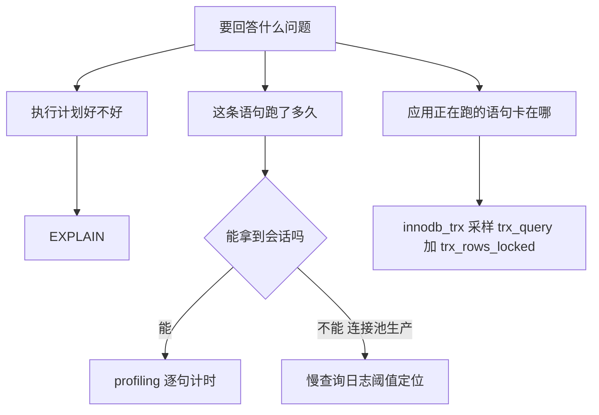

上一篇排查实录里（），为了定位一个多语句大事务里**到底哪条 UPDATE 吃掉了 300 秒**，我用的第一步工具是 MySQL 内置的 profiling——一段 `SET profiling = 1` 加 `SHOW PROFILES`，给脚本里的每条 SQL 单独计时。有读者说从没接触过这个东西，这篇就把它从零讲透：五分钟上手、逐列读懂输出、以及几条不踩不知道的边界——包括它为什么测得出语句耗时、却测不到我最终要找的锁。

<!-- more -->

## 一、它是什么：会话级的语句秒表

profiling 是 MySQL 5.0 时代就内置的查询耗时分析功能：在当前会话里打开开关后，**这个会话执行的每条语句**都会被单独记录耗时，事后逐条查看——相当于给每条 SQL 发一块秒表。

它的生命线要记住：**5.7 里仍可用但已标记废弃（官方提示用 performance_schema 替代），8.0 起被移除**。所以它是"5.6/5.7 存量库的轻量利器"，8.0 的库请直接上 performance_schema（文末选型表）。

## 二、五分钟上手

完整流程四步，全部在 mysql 客户端里完成。下面是我在一个 5.7.26 库上的真实演示，用的两张表来自 `information_schema`，你可以在任何库上直接复现：

```sql
SET profiling = 1;                                    -- ① 打开开关（只影响当前会话）

SELECT COUNT(*) FROM information_schema.TABLES;        -- ② 正常执行要测的语句
SELECT COUNT(*) FROM information_schema.COLUMNS;

SHOW PROFILES;                                        -- ③ 查看每条语句的耗时
SHOW PROFILE FOR QUERY 2;                             -- ④ 钻取某条语句的阶段明细

SET profiling = 0;                                    -- ⑤ 用完关掉
```

第③步的输出长这样（真实数据）：

```
+----------+------------+----------------------------------------------------------------+
| Query_ID | Duration   | Query                                                          |
+----------+------------+----------------------------------------------------------------+
|        1 | 0.04012575 | SELECT COUNT(*) FROM information_schema.TABLES                 |
|        2 | 7.30771575 | SELECT COUNT(*) FROM information_schema.COLUMNS                |
+----------+------------+----------------------------------------------------------------+
```

两条"看起来差不多"的 COUNT，一条 0.04 秒、一条 7.3 秒——**这就是 profiling 最核心的价值：把"感觉慢"变成"哪条慢、慢多少"**。TABLES 只扫库表清单，而 COLUMNS 要逐表打开存储引擎元数据去数列，代价差了两个数量级。EXPLAIN 只能告诉你执行计划长什么样，profiling 直接告诉你每条语句真实跑了多久。

顺手再验证一个特性——它对**任何语句**都计时，包括 `SLEEP`：

```
+----------+--------------+-----------------------------------------------+
| Query_ID | Duration     | Query                                         |
+----------+--------------+-----------------------------------------------+
|        2 | 0.50020575   | SELECT SLEEP(0.5)                             |
+----------+--------------+-----------------------------------------------+
```

0.5 秒的等待被精确到微秒地记了下来。这暗示了一件后文很重要的事：**Duration 计的是"从开始执行到返回"的全部墙钟时间，包括等待**——不只是 CPU 干活的时间。

## 三、钻取明细：SHOW PROFILE 的阶段切片

`SHOW PROFILE FOR QUERY n` 把一条语句的耗时拆到执行阶段。常见的阶段含义：

| 阶段 | 含义 |
|---|---|
| starting / init | 语句解析、初始化 |
| checking permissions | 权限校验 |
| Opening tables | 打开表、读表定义 |
| optimizing / preparing / statistics | 优化器工作、统计信息 |
| executing | 真正执行（UPDATE 常见） |
| Sending data | 读取并发送数据（SELECT 大头常在这） |
| end / query end / closing tables / freeing items / cleaning up | 收尾清理 |
| removing tmp table | 清理中间临时表 |

还可以加参数拿更多信息：`SHOW PROFILE CPU, BLOCK IO FOR QUERY 2;`（CPU 时间、块 IO 次数）。

## 四、第一个坑：明细合计 ≠ 总耗时

上面那条 7.3 秒的 COLUMNS 查询，钻取明细时撞出一个值得单独记录的现象：**把所有可见阶段的 Duration 加起来，不到 0.1 秒**——99% 的耗时消失了。

```
+----------------------+----------+
| Status               | Duration |
+----------------------+----------+
| checking permissions | 0.000005 |  ← 这类行有 90 多条，每张表一轮
| Opening tables       | 0.000031 |
| removing tmp table   | 0.000006 |
| ...                  |          |
| Sending data         | 0.061767 |
| freeing items        | 0.006735 |
| cleaning up          | 0.000039 |
+----------------------+----------+
```

原因是 profiling 的阶段是**硬编码的检查点**，语句在检查点之间花掉的时间不会单独显示。这条查询在 Server 层逐表循环扫描元数据，大量耗时落在无打点区间。结论记两条：

1. **`SHOW PROFILES` 的 Duration 总数是可信的**（整条语句的墙钟时间）；
2. **明细只是切片，不是账本**——阶段合计远小于总数时，说明耗时在"没打点的阶段"，别按明细找问题。

## 五、实战回放：给多语句脚本逐句计时

回到开头那篇排查的场景：一个 MyBatis 多语句 UPDATE 脚本（二十多条 UPDATE 拼成一条 `PreparedStatement`），应用日志只能给出**整段 48.9 秒**的总耗时，没法拆分。

profiling 的用法就是把脚本里的语句搬进 mysql 客户端，前后加开关：

```sql
SET profiling = 1;
SELECT COUNT(*) FROM temp_order a LEFT JOIN plan_order b ON a.orderno = b.orderno
 WHERE a.syncstatus = 'succeed' AND b.id IS NULL;     -- "计划单被删"守卫的 SELECT 等价
SELECT COUNT(*) FROM temp_order a INNER JOIN routing b ON a.code = b.productcode
 WHERE a.routingid IS NULL;                            -- 路由解析的 SELECT 等价
-- ...脚本里每条都转一遍
SHOW PROFILES;
SET profiling = 0;
```

结果：**全部毫秒级**。这个"证据全绿"当时差点让排查走进死胡同，也暴露了 profiling（以及一切 SELECT 等价测试）的盲区：

- profiling 测的这条 SELECT 走 **MVCC 快照读**，不加锁；
- 应用里真正执行的 UPDATE 是**当前读**，要锁定所有扫描过的行，锁等待同样计入 Duration——但这部分成本，只有在你 profile **那条 UPDATE 本身**时才存在。

所以profiling 的正确打开方式是：**能用 UPDATE 原句测就不要换成 SELECT 等价**；只有当原句有副作用不能随便重放时，才退而求其次——并且心里清楚换掉的是"扫描成本"，换不掉的"锁成本"没测到。我那篇排查最终是靠采样 `information_schema.innodb_trx`（`trx_query` 显示事务当前执行的语句、`trx_rows_locked` 显示已锁行数）才把真凶按住的。

## 六、边界清单：用之前必须知道的五条

1. **会话绑定，测不到应用的语句**。`SET profiling = 1` 只影响当前会话。应用走连接池（Druid/HikariCP），你在客户端里开的 profiling 跟应用连接半点关系没有——想看应用真实语句的耗时，这条路是死的。这是它最大的边界；
2. **只保留最近 15 条**。默认 `profiling_history_size = 15`（上限 100），长脚本超过 15 条会把最早的挤掉，分段测或调大变量；
3. **测完关掉**。开着的会话每条语句都记一笔，有轻微开销，长期开着不礼貌也不干净；
4. **UPDATE 的重放要慎重**。给 UPDATE 计时最真实，但重放会改数据——测试库随意，生产库想都别想（这也正是它"测不到生产"的另一面）；
5. **版本**。5.7 及以下可用（废弃警告），8.0 已移除。

## 七、工具选型：什么时候用哪个



| 工具 | 回答的问题 | 侵入性 | 适用版本 |
|---|---|---|---|
| EXPLAIN | 计划怎么走 | 零 | 全版本 |
| profiling | 我这条 SQL 跑多久、阶段分布 | 会话级开关 | 5.7- |
| 慢查询日志 | 哪些语句超阈值 | 服务级配置 | 全版本 |
| performance_schema | 语句级/摘要级全量统计 | 服务级内置 | 5.7+/8.0 |
| innodb_trx 采样 | 事务此刻卡在哪条语句、锁了多少行 | 零（只读查询） | 全版本 |

## 小结

profiling 是存量 5.6/5.7 库上成本最低的"逐句计时器"：一个开关、两条命令，把多语句脚本的总耗时拆到单条。但它的三面边界同样重要——**会话绑定测不到应用、明细切片不是全账本、SELECT 等价测不出 UPDATE 的锁**。工具选型的本质是对准问题：要计划找 EXPLAIN，要耗时开 profiling，要"生产事务此刻卡在哪"就采样 innodb_trx。一把钥匙开一把锁，别指望秒表去量锁。
