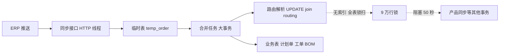

生产环境的数据同步服务连续报了三件事：ERP 订单同步单个任务跑了 **317 秒**；任务执行期间，产品同步接口直接 **Lock wait timeout**（等锁 50 秒超时）；再往前翻，还有一次 200 秒级别的**死锁**，innodb 状态转储里躺着 95 万行锁。三件事指向同一片代码，但三次现场的长尾耗时各不相同——130 秒、305 秒、317 秒，波动大得像玄学。

排查下来是两层问题叠在一起，彼此掩护：

1. **代码里满屏的 `@Async` 是个摆设**——整个模块没有 `@EnableAsync`，所有"异步任务"实际同步跑在 Tomcat 的 HTTP 请求线程里；
2. **一张 2000 行的小表没有二级索引**，让一条多表 JOIN 的 UPDATE 走了全表锁定读，3000 行的批次锁了 **9.3 万行**。

最终修复只有两条 DDL 和一个配置类，本地实测单步耗时 **48.9 秒 → 0.33 秒（约 150 倍）**，生产 7568 单全量同步从 317 秒回到 **15.2 秒**。这篇完整复盘两层问题的发现过程——尤其是中间那次"所有 EXPLAIN 都是毫秒级"的证据反转，差点让排查拐进死胡同。

<!-- more -->

## 一、链路与现象：先把拓扑钉死

同步链路本身很常规：ERP 侧推 JSON 到同步服务的 HTTP 接口，接口把数据落进**临时表**（temp 表，带 `syncstatus` 生命周期：`NULL → syncing → succeed/failed`），然后触发一个"异步任务"，在**一个大事务**里做多语句校验（产品存在性、工艺路由解析、状态流转），再把校验通过的行合并进业务表（计划单、工单、BOM）。



生产日志里那次 317 秒任务的耗时分解，长这样：

| 阶段 | 耗时 | 说明 |
|---|---|---|
| 退化数据圈定（只读） | 2.7s | 扫历史子件临时表 |
| **多语句校验脚本** | **305.8s** | **96% 的时间在这** |
| 业务表合并（7568 单更新） | ~9s | 必要写入 |

96% 的时间集中在一个 MyBatis 多语句 UPDATE 脚本上——这个脚本由二十多条 UPDATE 拼成，一次 `PreparedStatement` 发给 MySQL，在同一个事务里顺序执行。优化目标就此锁定：**这个脚本里到底哪条语句吃了 300 秒**。

## 二、第一层：@Async 是个摆设

动手优化前先看执行模型，结果在日志的**线程名**上撞见第一个问题。

"异步任务"的日志全打在 `http-nio-8082-exec-N` 线程上——**Tomcat 的工作线程**。也就是说 `asyncTaskService.syncBizOrderAndOrderBom(params)` 这个标了 `@Async` 的方法，从头到尾跑在调用方的 HTTP 请求线程里，接口响应要等整个大事务跑完才返回。

原因一句话：**模块里没有任何地方开 `@EnableAsync`**。Spring 的 `@Async` 注解依赖 `@EnableAsync`（或等价的 XML 配置）激活代理，没开的话注解就是个装饰，方法按普通调用执行。这类"注解失效"没有启动报错、没有运行时警告，唯一的证据就是线程名——**日志线程名是验证执行模型最便宜的手段**，比看一百行配置都可靠。

### 修复：自定义线程池，但先盘点注解面

修复方向明确：`@EnableAsync` + 自定义 `ThreadPoolTaskExecutor`。但 `@EnableAsync` 是**全局开关**——开启后，上下文里所有 `@Async` 注解都会真正生效。盘点之下发现危险之处：这个模块的任务类上有 **16 个 `@Async` 方法，其中 15 个返回 `int`，且调用方全部是这种写法**：

```java
affected += asyncTaskService.syncOrder(params);   // 15 处，全靠返回值拼响应文案
```

`@Async` 代理对非 `Future` 返回类型会**立即返回 null**——这 15 处 `int` 拆箱直接 NPE，运行时才炸。这些方法从上线第一天起就是同步执行的，调用方的语义依赖"同步拿返回值"，根本不能异步化。

所以正确的修法不是"开开关"，而是**收口**：

1. 删掉类级 `@Async` 和全部方法级 `@Async`（共 20 处），**只给真正该异步的一个 void 方法保留注解**——它天然 fire-and-forget，且内部有 `AtomicBoolean` 单飞守卫；
2. 新增配置类提供自定义线程池（任务有单飞守卫，核心 1 线程就够，队列兜突发）：

```java
@Configuration
@EnableAsync
public class SpringAsyncConfig implements AsyncConfigurer {
    @Override
    public Executor getAsyncExecutor() {
        ThreadPoolTaskExecutor executor = new ThreadPoolTaskExecutor();
        executor.setCorePoolSize(1);
        executor.setMaxPoolSize(2);
        executor.setQueueCapacity(200);
        executor.setThreadNamePrefix("mom-sync-");
        executor.setWaitForTasksToCompleteOnShutdown(true);
        executor.setAwaitTerminationSeconds(120);
        executor.initialize();
        return executor;
    }
}
```

3. 剩下 15 个方法**保持同步**——与修复前行为完全一致，零语义漂移。

上线后日志线程名变成 `mom-sync-1`，接口 22ms 就返回，任务真正后台化。这一步的通用教训：**开启任何"全局功能开关"前，先盘点它的全部作用面**；`@Async` 这种"沉默失效"的注解，失效时无人报警，激活时才会把历史问题一次性引爆。

但异步化只是让 HTTP 不再被 5 分钟任务占死——任务本身还是 300 秒。真正的硬骨头在第二层。

## 三、第二层：一次"证据全绿"的大反转

定位慢语句的第一个念头是 EXPLAIN——把多语句脚本里的每条 UPDATE 改写成等价 SELECT，逐条计时。结果出乎意料：

| 语句 | SELECT 等价耗时 |
|---|---|
| 计划单被删守卫（LEFT JOIN 业务表） | 26ms |
| 六条路由解析（JOIN 路由表） | **全部 < 2ms** |
| 子件五表 JOIN 重校验 | 130ms |
| 全量兜底扫（NULL 置位、failed 重试） | 全部 < 1ms |

**所有语句毫秒级，加起来不到 0.2 秒。** 但真实的 UPDATE 路径实测（本地推 3000 单）要 **48.9 秒**——差了三个数量级。如果在这里信了 EXPLAIN，排查就进死胡同了：索引都在、扫描路径都健康，"没毛病"。

反转的钥匙在 InnoDB 的两种读：

- **SELECT（快照读）**：走 MVCC，读一致性视图，**不加锁**，优化器还能做半连接优化；
- **UPDATE（当前读）**：必须读最新版本并**锁定所有扫描过的行**——注意是"扫描过的"，不是"最终匹配的"。

当 JOIN 的一侧无索引可用时，SELECT 走 Block Nested-Loop 缓存扫描，快照读无锁所以飞快；UPDATE 同样的执行路径，却要给扫过的每一行上锁。**EXPLAIN/SELECT 证明的是"找数据不慢"，证明不了"UPDATE 不慢"**——锁的成本和扫描路径绑定，而不是和结果集绑定。

## 四、真凶：0.4 秒一次的事务采样

既然语句级日志没有（MyBatis 多语句一条 `PreparedStatement` 打一个耗时），就自己造：**一边重推 3000 单压测，一边每 0.4 秒采样一次 `information_schema.innodb_trx`**。这张表有两个黄金字段：

- `trx_query`：事务**此刻正在执行**的 SQL；
- `trx_rows_locked`：事务此刻已锁定的行数。

127 个采样点的直方图触目惊心：

```
98% 的采样点卡在同一条语句：
update temp_order a
inner join routing b on a.cInvCode = b.productcode
    and b.type = 'rtRoutingBOM' and b.isdefault = '1' ...
set a.routingid = b.id, ...
where a.routingid is null and a.cDepName = '注塑车间' ...

trx_rows_locked: 90953 → 一路涨到 93023
```

三个事实同时落地：

1. **3000 行的批次，锁了 9.3 万行**——远远超过本批数据量；
2. 慢的正是路由解析那条 JOIN UPDATE，`EXPLAIN` 里它只有 1.4ms；
3. 锁数随时间线性爬升——这是"逐行扫描逐行加锁"的典型形态。

查一下路由表的索引，真相大白：**2066 行的小表，只有主键，没有任何二级索引**。JOIN 条件 `a.cInvCode = b.productcode` 在路由表侧无索引可用，优化器只能全表扫 + BNL，UPDATE 的当前读把扫过的行全部锁住——本批 3000 行、临时表全量 3.6 万行、路由表 2066 行，锁面滚到 9 万。同构的路由解析语句有六条，每条都这样。

这也解释了此前所有"灵异"现场：

- **产品同步 Lock wait timeout**：大事务持 9 万行锁 300 秒，产品同步的 INSERT/UPDATE 撞上硬等 50 秒超时；
- **95 万行锁的历史死锁**：另一个大事务与这批锁交叉互等；
- **耗时波动（130s/305s/317s）**：锁等待占比随并发负载浮动，纯扫描部分其实是稳定的。

顺带一提，`innodb_trx` 采样这个手法是**零侵入**的：不需要开 general log、不需要 performance_schema 的 consumer、不需要重启，一个只读 SQL 循环就能把"哪条语句在吃时间"钉死，生产环境随时可用。

## 五、修复：两条 DDL，150 倍

路由表补两个单列索引，覆盖六条路由解析语句的全部 JOIN 键：

```sql
alter table routing add index idx_productcode(productcode);
alter table routing add index idx_code(code);
```

2000 行的小表，DDL 秒级完成。本地同批次（3000 单、同一代码路径）前后对比：

| 指标 | 加索引前 | 加索引后 | 提升 |
|---|---|---|---|
| 多语句校验脚本 | 48898ms | **332ms** | **~150 倍** |
| 任务总耗时 | 50781ms | **3373ms** | ~16 倍 |
| 事务锁行数 | 93000+ | 本批行数 | 死锁风险同步消除 |

生产次日的全量同步（7568 单，比出事那次还多 700 单）：多语句校验 **305.8s → 2.0s**，任务总耗时 **317.5s → 15.2s**（剩余为 7568 单业务表合并的必要写入，约 2ms/单，已是健康水位）。锁面缩回本批行后，产品同步锁超时、跨事务死锁两类问题随之消失——**一条 DDL 同时治了三个病**。

## 六、方法论小结

这场排查没有用任何冷门工具，赢在几个关键判断上：

1. **日志线程名是执行模型的第一证据**。怀疑异步/线程池问题，先看日志里打日志的线程名，一行字顶一百行配置审查；
2. **开启全局开关前盘点全部作用面**。`@EnableAsync`、`@EnableScheduling`、`@EnableCaching` 都属此类——激活成本不是写配置，是它 retroactive 作用于所有历史注解的那一刻；
3. **SELECT 快照读证明不了 UPDATE**。给多语句脚本做性能取证时，EXPLAIN 和等价 SELECT 只能排除"扫描慢"，排除不了"锁慢"；UPDATE 的成本 = 扫描 + 锁定，后者与索引直接绑定；
4. **`innodb_trx.trx_query` + `trx_rows_locked` 高频采样**是定位"事务内哪条语句在吃时间"的零侵入手段，对 MyBatis 多语句这种"一条 PreparedStatement 打一个总耗时"的场景尤其有效；
5. **小表无索引照样毁全库**。2066 行的路由表自己怎么扫都快，但它作为 JOIN 内表出现在别表的大事务 UPDATE 里时，无索引意味着锁定读的全表锁扫——索引不是给"这张表"加的，是给"每一条 JOIN 到它的语句"加的。

排查顺序上还有一个反直觉的体会：先修 `@Async` 这个"看起来最急"的问题，恰恰是它把任务推向后台线程池后，线程名、耗时日志、锁采样才变得清晰可读——**把执行模型修正后，性能问题自己会走到聚光灯下**。
