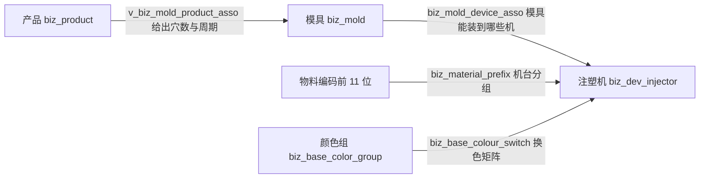
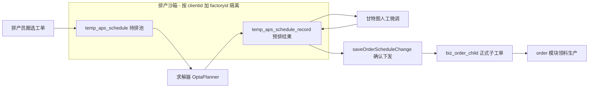
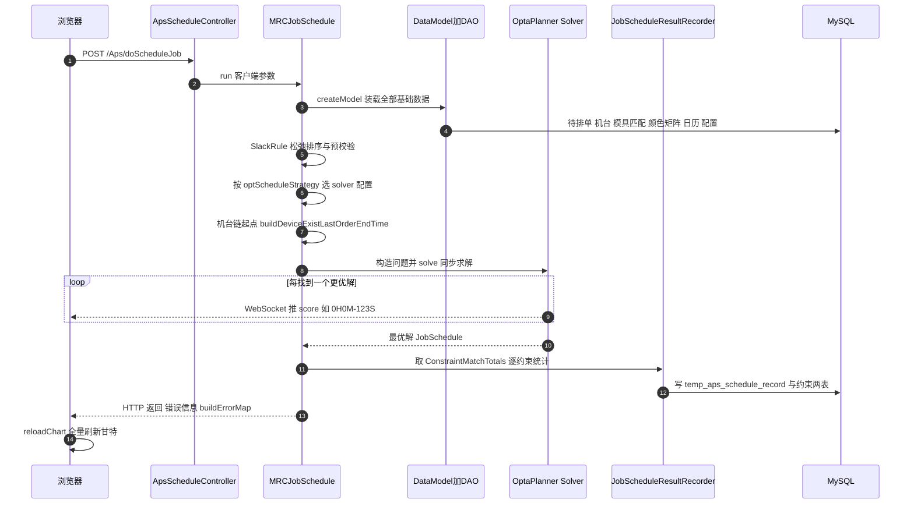

# 0. 引言与阅读地图

这篇是对 seaway2 MES 项目里 **APS 辅助排产模块**（帅威负责的模块）的一次全景式拆解，目标读者是对 APS 零认知、但要做维护/二次开发的工程师。全文基于源码逐文件核实，所有结论都带 `文件:行号` 证据。

**模块坐标**：`springboot/app/com.zhiyin.mes.app.seaway2.aps`（下文简写 `APSROOT`），独立 Spring Boot 应用，应用名 `app-aps`，端口 **8103**（`src/main/resources/bootstrap.properties:2-3`）。

**一句话业务定位**：注塑车间的排产员面对一堆工单、一堆注塑机、一堆模具，APS 用约束求解器（OptaPlanner）算出一版"每台机上排哪些单、用什么模、几点到几点"的预排方案，画成甘特图；排产员在图上人工微调（拖拽换机、调顺序、锁定），满意后一键确认，预排结果才变成正式生产任务下发。**机器算 + 人改 + 确认才生效**——这就是"辅助"二字的含义。

全文结构：

1. 业务背景：排产到底在排什么
2. 模块技术底座与代码地图
3. 领域概念与数据模型（表级全景）
4. 排产主流程：一次"开始排产"的完整旅程
5. OptaPlanner 求解器建模详解
6. 甘特图工作台与九种手动操作
7. 确认下发：临时表到正式工单
8. 周边业务：产能分析 / mock / 导入导出 / 基础数据
9. 历史引擎考古：GA、规则引擎、多工序 CPM
10. 架构观察与已知的坑
11. 新人上手清单

<!-- more -->

# 1. 业务背景：排产到底在排什么

## 1.1 注塑车间的生产要素

注塑行业的产品生产过程高度同质化：**塑料粒子加热 → 模具合模注塑 → 冷却出件**。一台上千吨的注塑机（`biz_dev_injector`）装上某个模具（`biz_mold`），就能生产某个产品（`biz_product`）。三者是**多对多匹配关系**：



排产要回答的核心问题：**N 张工单，每张放到哪台机、用哪副模、什么时间开始结束**。约束和优化目标都来自物理现实：

- **匹配硬约束**：模具必须属于产品的可用模具集；模具只能装到关联机台上；某些物料只能上特定机台组
- **换模成本**：相邻两单模具不同要换模，有换模停机时间（全局配置 `optSwithMoldDelayTime`，可按机台覆写）
- **换料/换色成本**：注塑机换材质要洗机、换色要清洗料筒，颜色切换有代价矩阵（浅色→深色便宜，深色→浅色贵）
- **交期**：每张工单有 `planenddate`，超期要罚
- **负载均衡**：别把活全压一台机
- **模具碎片化**：同一副模的单尽量连着干，别反复装卸

## 1.2 为什么叫"辅助"排产

纯粹的手工排产靠老师傅脑力，纯自动排产又不敢直接下发（车间现实比模型复杂：急单插队、模具在修、机台状态）。所以本模块的产品形态是**人机协同**：

1. 排产员圈选待排工单 → 机器求解一版方案（几秒到半小时）
2. 方案以甘特图呈现，排产员审查、手动微调
3. 每次微调机器重算受影响机台的时间链（换模、日历都算进去）
4. **确认之前一切都在临时表沙箱里**，随时撤销重排，不影响正式工单
5. 满意后"保存排产变更"，才落正式表

后端审计注解直白地写着这个业务的身份——`doScheduleJob` 方法上 `@SysLogger(OperationDescription = "辅助排产：开始排产")`（`APSROOT/src/main/java/com/zhiyin/controller/mes/aps/ApsScheduleController.java:61`）。

## 1.3 排产员的一天（操作主流程）

从页面跳转关系还原的实际操作序（页面细节见第 6 章）：

```
维护基础数据(低频)
  排产主资源/辅助资源/产品资源关联/颜色/物料前缀
    ↓
打开排产工作台 OrderPreScheduleView
  页面加载即连 WebSocket、取参考基准时间、渲染甘特(已排/在制)
    ↓
"选择工单" 圈选本次要排的单(写 temp_aps_schedule 待排池)
    ↓
按需配置: 排产参数 / 约束权重 / 过滤机台(检修中的机排除)
    ↓
点"开始" → POST /Aps/doScheduleJob
  求解期间工具栏 gif 进度条 + WebSocket 实时推收敛分数
  可点"暂停"提前终止取当前最优解
    ↓
看结果: 排产明细 / 约束匹配结果 / 右侧产品模具联动分析栏
    ↓
甘特图上微调: 拖拽转机台 / 调顺序 / 提前推后 / 锁定
  不满意 → "撤销操作"整体回滚(savepoint)
    ↓
"保存排产变更" → 预排转正式子工单 biz_order_child 下发
```

# 2. 模块技术底座与代码地图

## 2.1 运行形态

| 项 | 值 | 证据 |
|---|---|---|
| 应用名/端口 | `app-aps` / 8103 | bootstrap.properties:2-3 |
| 注册/配置 | Eureka + ConfigCenter（profile `commonaps`） | bootstrap.properties:6-14 |
| MQ | 仅框架继承（队列 `zhiyin.mes.queue.aps`），本模块无自定义监听 | bootstrap.properties:16-18; config/RabbitConfig.java:7 |
| 启动类 | `AppApsApplication`，`@MapperScan("com.zhiyin.dao")`，强制时区 Asia/Shanghai | AppApsApplication.java:23-41 |
| 模型加载 | `ApsActivatar` 启动后延迟 5s 异步加载 MOC 模型与 i18n | aps/startup/ApsActivatar.java:31-63 |

**最重要的架构事实：本模块没有任何 Feign 调用**。`com/zhiyin/feign/` 和 `controller/mes/rest/` 都是空目录，全工程无 `@FeignClient`。它读 order/device/mold/basic/wms 各模块的表（`biz_order*`、`biz_dev_injector`、`biz_mold*`、`biz_base_*`、`biz_wms_inventory_report_summary`）全靠**共享数据库直连**，正式下发也直接写 order 模块的 `biz_order_child`。微服务是假的，单体是真的——排障时别去找服务间调用链。

## 2.2 技术栈

| 层 | 技术 | 版本/说明 | 证据 |
|---|---|---|---|
| 求解器 | OptaPlanner | 7.10.0.Final（core + persistence-xstream） | pom.xml:94-103 |
| 规则引擎 | Drools | 7.10.1.Final（编译 .gdrl 打分规则） | pom.xml:89-93 |
| 运行时 | Java 8 + Spring Cloud Greenwich | | pom.xml:13-18 |
| 前端 | EasyUI + visavail 深度二开 | UMD 包内嵌 d3 v5.16.0 + moment | resources/gantt/Aps/visavail.umd.js:42 |
| 实时通信 | JSR-356 原生 WebSocket | 端点 `/ApsGuiWebSocket` | service/jss/websocket/GuiWebSocketHandler.java:36 |

## 2.3 代码地图（包→职责）

```
APSROOT/src/main/java/com/zhiyin/
├─ controller/mes/
│   ├─ aps/          ApsScheduleController(排产执行) GanttOperateController(甘特手动操作)
│   │                ApsConfigController(参数/权重/过滤机台) MaterialPrefixController(物料前缀)
│   ├─ order/        OrderController(965行,工单查询/甘特数据/视图管理/导入导出/确认下发)
│   ├─ model/        BaseColour*Controller(颜色族) ResourceController(976行,主辅资源/产品资源)
│   ├─ analysis/     CapacityAnalysisController(产能分析)
│   └─ mock/         MockSchduleDataController(模拟数据)
├─ service/
│   ├─ ApsScheduleService(排产门面) GanttOperateService(甘特操作门面,按客户端加锁)
│   ├─ ga/           第一代 GA(旧)
│   └─ jss/          ★调度引擎本体(Job Shop Scheduling)
│       ├─ schedule/ MRCJobSchedule(主引擎,OptaPlanner) MPRCSchedule(多工序)
│       │            MRCSchedule(规则引擎,停用) MRCGaSchedule(GA,停用)
│       ├─ domin/    OptaPlanner 领域模型 Job/Device/Mold/JobSchedule + solver/ 影子变量监听器
│       ├─ input/    DataModel(数据装载) ParaConfig(参数) 各种资源管理器
│       ├─ strategy/ inject 策略(选 solver 配置)
│       ├─ solve/    SolutionInitializer(自定义阶段) 监听器/移动过滤器
│       ├─ operator/ 甘特手动操作 9 个算子
│       ├─ assist/   落库器/错误管理/撤销重做/指标
│       ├─ rule/     SlackRule(松弛排序) 等
│       ├─ algorithm/ cpm(关键路径) ga(第二代 GA)
│       ├─ constraint/ 资源占用台账(注意:与求解器约束无关,名字撞车)
│       ├─ websocket/ GuiWebSocketHandler
│       └─ entity/calendar/ 工作日历模型
└─ maps/             MyBatis mapper 接口(对应 XML 在 maps/ 同名 .xml)
```

前端资源：`APSROOT/src/main/resources/gantt/Aps/`（visavail 库 + silder.js 缩放滑块 + utils.js WebSocket 工具）；页面在 `src/main/webapp/WEB-INF/view/MesRoot/Aps/`，EasyUI 布局/列配置在 `WEB-INF/etc/business/layout/Aps/`，MOC 模型(表元数据)在 `WEB-INF/etc/business/model/Aps/`。

# 3. 领域概念与数据模型

## 3.1 核心业务表

**工单侧**：

| 表 | 含义 | 关键点 |
|---|---|---|
| `biz_order` | 计划工单主单 | orderno、type(otInject注塑/otAssembly装配)、state(osInit待排→osPreSchedule→osWork→osDone)、quantity、planstartdate/planenddate、ordergroup(多腔组) |
| `biz_order_work` | 工单工序任务 | 多工序排产的对象 |
| `biz_order_child` | **子工单 = 机台级任务**，正式排产结果落这里 | orderchildno、deviceid、moldid、quantity、status(17种)、planstarttime/planendtime、multicavityflag、ordersort |
| `biz_order_child_oplog` | 子工单操作流水 | 16 种 operation（CreateOrder/PullDownOrder/StartOrder…） |

**资源侧**：

| 表 | 含义 |
|---|---|
| `biz_dev_injector` | 注塑机（车间 workshopid → 日历入口） |
| `biz_mold` / `biz_mold_device_asso` / `v_biz_mold_product_asso` | 模具、模具-机台关联、模-产品关联视图（realholesnum 实际穴数、producecycle 周期） |
| `biz_product` / `biz_product_bom` / `biz_product_group*` | 产品、BOM、产品组(多腔) |
| `biz_base_colour` / `biz_base_color_group(+_rel)` / `biz_base_colour_switch` | 颜色、颜色组(优先级渐变序)、换色矩阵(start组→end组切换耗时) |
| `biz_material_prefix` / `biz_material_prefix_dev_rel` | 物料前缀 → 可用机台组 |
| `biz_base_workcalendar*`（8 张） | 工厂日历：日历/日/班制/班次/班次时段/异常日(休息/加班) |
| `biz_base_station` | 工位（多工序排产的"主资源"实际挂工位表） |

**配置侧**：

| 表 | 含义 |
|---|---|
| `biz_schedule_config` / `biz_schedule_config_user` | 排产参数键值对；用户级覆盖系统级（`ifnull(c.value,a.value)`，ApsConfigMapper.xml:140-149）；factoryid=-1 是模板 |
| `biz_schedule_constraint(_user)` / `biz_schedule_weight(_config)` | 约束项（强制/可选）与权重 |
| `biz_schedule_filter_device` | 不参与排产的机台黑名单 |
| `biz_schedule_operate_log` | 每次排产审计（工单数/机台数/耗时） |

## 3.2 排产沙箱：两段式 + clientid 隔离（本模块最核心的设计）



- **`temp_aps_schedule`（待排池）**：勾选进本次排产的订单，附带已有排产快照（IsSchedule=-1）
- **`temp_aps_schedule_record`（预排结果）**：求解器输出 + 人工微调结果。所有行带 `ClientId`（= `sessionId@ip`）——**多个排产员互不干扰，各自玩自己的沙箱**
- 预排结果里新合成的子单 `orderchildid` 用负数 `-(deviceid*100)+seq`，`IsSchedule`=1(新增)/2(变更)（`JobScheduleResultRecorder.java:458-466`）
- 确认后才写 `biz_order_child`（第 7 章）
- **沙箱有生命周期**：每小时定时任务 `deleteHistroyData`（`@Scheduled(cron="0 0 */1 * * ?")`，ApsScheduleService.java:387-396）删掉 1 天前的 temp 数据——隔夜的"半成品排产"会消失

配套的撤销/重做表：`temp_aps_schedule_op_point`（存档点指针 SavePoint/MaxSavePoint）、`temp_aps_schedule_op`（操作前后像，OperType=1 改前/4 改后）、`temp_aps_order_lock(_op)`（锁定及锁定操作的前后像）、`temp_aps_schedule_record_constraint(+_constrobj)`（约束命中统计与明细，constrobj 存 JSON 大对象）。

## 3.3 工时的两个口径（易混！）

- **求解器内部**：`duration = quantity × cycletime / realholesnum`（数量×周期÷穴数，StartTimeUpdatingVariableListener）——**纯相对毫秒时间轴，不含班次休息**
- **落库/甘特显示**：经 `WorkCalendar` 转成墙钟时间——跳过非工作日与非工作时段，动态前后扩 10 天找工作时间片（WorkCalendar.java:484-526,570-609）

即求解打分里的"交期延迟分钟"是相对时间口径，和甘特上看到的日历时间可能有差异。日历绑定链：机台 → 车间 workshopid → calendarid → 日历；无日历机台退化为纯墙钟加减（DefaultWorkCalendar，entity/calendar/DefaultWorkCalendar.java:17-55）。

# 4. 排产主流程：一次"开始排产"的完整旅程

## 4.1 入口与门面

```
POST /Aps/doScheduleJob  (ApsScheduleController.java:59-93)
  clientid = sessionId@clientIp, userid 取 session
    ↓
ApsScheduleService.doScheduleJob (ApsScheduleService.java:232-261)
  new MRCJobSchedule(factoryid, clientId)
  clientJobScheduleMap_ 是 Hashtable<clientId, MRCJobSchedule> —— 每个浏览器会话持有
  自己的求解器实例(供暂停用)
  按 biz_schedule_config 分流:
    optMockEnable=1  → jobSchedule.runMock   假数据排产
    其他             → jobSchedule.run       ★生产主线
```

暂停：`POST /Aps/suspendScheduleJob` → `jobSchedule.suspend()` → `solver_.terminateEarly()`（MRCJobSchedule.java:673-675）——OptaPlanner 提前终止并返回当前最优解，不是 kill。

## 4.2 MRCJobSchedule.run 主引擎十步

`APSROOT/src/main/java/com/zhiyin/service/jss/schedule/MRCJobSchedule.java:554-671`：



逐步展开：

**① 构建输入 DataModel**（input/DataModel.java:144-182）。一次排产要把这些全装进内存：

| 数据 | 装进 | 来源 SQL |
|---|---|---|
| 待排工单 | OrderDemands（数量=订单数-已排数，OrderDemands.java:68-74） | `queryToScheduleOrderList`（temp_aps_schedule join biz_product/BOM/颜色） |
| 机台 | DeviceResourceMgr（排除黑名单） | `queryAvailDeviceList`（biz_dev_injector 排除 biz_schedule_filter_device） |
| 产品-模具关联 | ProductMoldGroup | `queryProductMoldAssoList`（v_biz_mold_product_asso） |
| 模具-机台适配 | MoldDeviceGroup | `queryMoldDeviceAssoList` |
| 颜色切换代价 | ColorResourceMgr（色对→分钟、颜色组优先级） | `queryColorSwitchList`/`queryColorGroup` |
| 材料组/材料机台组 | MaterialGroupMgr/MaterialDeviceGroupMgr | 物料编码前 11 位分组 |
| 机台在制/已排 | DeviceLastProductMoldUses 等 4 个管理器 | |
| 甘特锁定信息 | JobLockInfoMgr | temp_aps_order_lock |
| 班次日历 | WorkCalendarWrapperMgr | 8 张日历表 |
| 全部开关参数 | ParaConfig | biz_schedule_config(_user) |

**② SlackRule 松弛排序 + 预校验**（rule/SlackRule.java:43-117）。对每单算 `松弛度 = 交期 - 最快生产小时 - 基准时间`，升序（越紧越先排）。预校验踢掉三种单并写入错误管理器：交期早于基准时间（"无法满足交期"）、产品未关联模具、关联机台全被过滤。**这一步决定了求解器看不到烂单——排产失败的单在这就报了**。

**③ 选策略**（MRCJobSchedule.java:567-580）。读配置 `optScheduleStrategy`：`InjectMaterialColor`/`InjectMaterialDeviceColor`/默认 Basic → 分别加载三个 solver XML 之一（第 5 章）。

**④ 机台链起点**（assist/JobScheduleResultRecorder.java:48-112）。每台机的"时间零点" = 当前时间 + 已排工单剩余工时 + 换模延迟，写进 `Device.lastExistOrderEndTime_/lastExistOrderMoldId_`。这就是"注入式"排产：**已排/在制不重排，新单从链尾往后接**。

**⑤ 构造 OptaPlanner 问题**（createOnlyNewJobSchedule，:136-260）。每台机建一个 `JobOnWork` 在制锚点（正在做什么产品/模具）绑到 Device——它参与打分（新首单与在制同模同材质可免惩罚）但不可移动；待排 Job 从 SlackRule 结果构建。

**⑥ 求解**：`solverFactory.buildSolver()` + 注册 `JobScheduleSolverEventListener` + 同步 `solve(unsolved)`。每次 best solution 变化，监听器把分数串（如 `[0H/0M/-123S]`）经 WebSocket 推给发起排产的那个浏览器（solve/solution/JobScheduleSolverEventListener.java:31-67）。

**⑦ 后处理**：用 `ScoreDirector.getConstraintMatchTotals()` 拿每条约束的违反明细（约束名/次数/得分/命中工单）。

**⑧ 落库**（JobScheduleResultRecorder）：
- `recordScheduleJob`（:408-516）：先按 factoryid+clientid 清空 `temp_aps_schedule_record` → 逐台机重写已存在单（isschedule=2）→ 沿 `device.getNextJob()` 链逐单写新单（isschedule=1，orderchildid 负数合成）。起止时间走工作日历，换模处插入延迟（支持按机台覆写）
- `recordScheduleConstraint`（:615-676）：约束命中写 `temp_aps_schedule_record_constraint` + `_constrobj` 两表（`noPlanEndDelayJob` 交期延迟约束还会附实际结束 vs 交期时间，:655）
- `recordOperateLog`：审计写 `biz_schedule_operate_log`

**⑨ 返回**：`ScheduleErrorMgr.buildErrorMap()` 把错误拼成文本放 HTTP 响应 `error` 字段——前端弹"排产错误"对话框就是它。

**⑩ 前端** reloadChart 全量刷新甘特。

## 4.3 求解时长控制（setTerminationConfig，MRCJobSchedule.java:417-454）

- `optStopMode=auto`：按待排工单数分档——≤5 单 10s、>100 单 1800s（30 分钟），中间线性分档
- 手动模式：`optStopSpentLimit` 秒（限 0<x<200，默认 100s）
- solver XML 里还有个 OR 兜底：`bestScoreLimit=0hard/0medium/-10soft`——软惩罚压到 ≤10 就提前收工

# 5. OptaPlanner 求解器建模详解

## 5.1 链式建模（学过车辆路径问题 VRP 的秒懂）

OptaPlanner 官方教程用 VRP 讲 chained model，这里完全同构：

| VRP 世界 | 排产世界 |
|---|---|
| 车辆（链锚点） | **注塑机 Device** |
| 客户（链节点） | **工单 Job** |
| 下一站去哪 | **previousChainObject**（排在哪台机的哪个位置） |
| 用哪辆车额外属性 | **mold**（每单选哪副模具） |

`Job` 是 `@PlanningEntity`，两个规划变量（domin/Job.java）：

```java
@PlanningVariable(valueRangeProviderRefs={"moldRange"})
getMold()                                    // Job.java:604-607 选模具

@PlanningVariable(valueRangeProviderRefs={"deviceRange","jobRange"},
                 graphType=PlanningVariableGraphType.CHAINED)
getPreviousChainObject()                     // Job.java:631-635 链位置(机台或另一Job)
```

`JobSchedule` 是 `@PlanningSolution`，分值 `HardMediumSoftScore`（硬/中/软三级）。

## 5.2 影子变量：增量推导的精髓

链上一动，"这单几点干完、在哪个机、和前驱同不同材质"全得重算。OptaPlanner 的 shadow variable + 变量监听器让每个 move 只做增量更新（domin/solver/）：

| 监听器 | 维护的影子变量 | 干什么 |
|---|---|---|
| StartTimeUpdatingVariableListener (:51-106) | `endTime` | `结束 = 前驱结束 + (换模? +换模分钟) + 数量×周期÷穴数`，并沿链级联更新后续所有 Job |
| ColorSwitchUpdatingVariableListener (:262-489) | `colorSwitchWeight` | 首单衔接权重：与在制同材质组且同色组=0；同材质不同色=50；不同材质=500。顺带维护连续材质/模具段 |
| PossibleMoldOrderDiffVariableListener (:26-120) | `possibleMoldOrderDiff` | 模具承载均衡：当前模具承载量 vs 其它可选模具之差；维护"与在制同产品却不同模"惩罚 10/5 |
| DeviceChangeVariableListener (:46-62) | `device` | 锚点变化后重建连续材质组标记 |

这就是为什么几百万次 move 的局部搜索能跑得动——**没有全量重排，全是增量**。

## 5.3 搜索配置（三个 solver XML 共同结构）

以 `solver/jobInjectSimpleSolverConfig.xml` 为例：

1. **构造启发式**：`FIRST_FIT_DECREASING`——按工单难度从紧到松贪心插入初始解
2. **自定义阶段** `SolutionInitializer`（solve/solution/SolutionInitializer.java:16-27，`forceUpdateBestSolution=true`）：对每个 Job 触发一轮变量监听器，把影子变量全部刷成有效态
3. **局部搜索**（late acceptance，`lateAcceptanceSize=600`、`acceptedCountLimit=4`）五种 move：
   - `changeMove(previousChainObject)`：把单挪到别的链位置（换机/换序）
   - `changeMove(mold)`：换模具
   - `swapMove` + **DifferentDeviceSwapMoveFilter**（只允许跨机台的两单互换，同机交换交给子链 move，剪枝）
   - `subChainChangeMove` / `subChainSwapMove`：长度 2~40 的连续段搬移/对换，允许整段反转

## 5.4 三个策略与加密的打分规则

| 配置 optScheduleStrategy | solver XML | 额外秒级时限 | 业务侧重 |
|---|---|---|---|
| 默认 | jobInjectSimpleSolverConfig.xml | 30s | 排得下、别延期：匹配硬约束 + 交期/换模/模具效率/负载均衡 |
| InjectMaterialColor | jobInjectMaterialColorSolverConfig.xml | 10s | 加：同材质聚簇连续 + 换色成本最小（0/50/500 权重体系 + 换色矩阵） |
| InjectMaterialDeviceColor | jobInjectMaterialDeviceColorSolverConfig.xml | 10s | 再加：材质→机台组硬约束 + 在制产品/模具一致性。文件最新（2026-04-28 改） |

**关键事实：三份打分规则 `solver/gdrl/*.gdrl` 是加密二进制**。文件头魔数 `3N2\n`（十六进制 `33 4E 32 0A`），7~12KB 密文；源目录与 target/classes 副本完全相同（构建不解密）；全工程无任何解密代码；pom.xml:210-221 还特意把 `gdrl` 加进 `nonFilteredFileExtension` 防止 Maven 资源过滤破坏密文。推断由定制的 OptaPlanner 依赖在运行时解密加载。**后果：约束权重逻辑不可 code review，排产结果异常只能靠 `temp_aps_schedule_record_constraint` 落库的约束名反推**。

从 Java 支撑层能确认/高置信推断的约束清单：

- **硬约束**：产品-模具匹配（`getNoMatchMoldProduct`）、模具-机台匹配（`getNoMatchMoldDevice`）、（DeviceColor 策略）材质-机台组（`getNoMatchMaterailDeviceGroup`，Job.java:782-821）
- **软约束**：交期延迟（**唯一确认名字的规则 `noPlanEndDelayJob`**，JobScheduleResultRecorder.java:655）、换模次数（`getIsNextJobMoldDiff`）、模具效率（`moldEfficiency`=cycletime/holes）、模具碎片化（`moldSameCountOfDevice`）、机台负载（`Device.getLastJobEndTime/getJobCount`）、模具承载均衡（`possibleMoldOrderDiff`）、材质/颜色聚簇（`materialSameCountOfDeviceMaterial`/`colorSameCountOfDeviceMaterial`，Job.java:948,1012）、在制衔接（weight 0/50/500）

排产结果指标（换模次数/时长、换色次数/时长、机台最长最短工时、产能均衡度、模具跨机台数、模具不连续生产个数）在 assist/Indicators.java:8-99 有完整键值定义——软约束优化的就是这些量。

# 6. 甘特图工作台与九种手动操作

## 6.1 页面家族（谁是谁）

| 页面 | 角色 | 要点 |
|---|---|---|
| **OrderPreScheduleView.html（4336 行）** | **当前主力排产工作台** | 唯一有"选择工单/开始/暂停"实体按钮的页（html:3519-3521）；controller 注入了 serverHost/wsPort 供 WebSocket（OrderController.java:294-307）；带"甘特图表/排产明细"两个 Tab |
| OrderGanttView.html（4156 行） | 查看+微调页 | 开始/暂停按钮已从 HTML 注释掉（html:3414 附近，JS 残留在 648-693）；且 controller 没注入 serverHost/wsPort——WS 会拼出 `ws://:undefined/` 连不上（OrderController.java:309-316） |
| OrderPreScheduleDialog(.html/1/2) | 旧入口的弹窗版甘特 | Dialog 版启用锁定三按钮（html:2243-2245）；Dialog2 只读 |
| OrderSchedule.html（2704 行） | 工单排产准备页（旧版主入口） | 列表勾选→插临时表→iframe 打开 Dialog |
| DeviceOrderDialog.html | 单机台工单预览 | 甘特机台行右键打开 |
| CapacityAnalysis.html | 产能分析 | 表格非图表，绿色百分比条 |

## 6.2 工具栏按钮 → 后端 → 效果（主工作台）

| 按钮 | 后端 | 效果 |
|---|---|---|
| 同步设备工单 | POST `/Aps/upadateDeviceExistLoad` | 重建机台已有负荷（重写 temp 排产数据） |
| 选择工单 | queryOrderPreSchedule + insertTempOrderSchedule | 圈单进待排池 |
| 开始 | findDefaultReferenceStartTime → POST `/Aps/doScheduleJob` | 求解；gif 进度条 + WS 分数 |
| 暂停 | POST `/Aps/suspendScheduleJob` | terminateEarly 取当前最优 |
| 排产参数配置 / 约束权重配置 / 约束匹配结果 | Config 系列 / queryApsScheduleRecordConstraint | 配置与结果查看 |
| 撤销 / 恢复 | undoAllMoveOperate / redoAllMoveOperate | savepoint 整体回滚/重放 |
| 转移机台 | changeDeviceMoveOperate | 选中块→点目标机台行 |
| 调整顺序 | changeOrderSeqMoveOperate | 同机台内前移/后移 |
| 提前/推后/连续紧后 | timeAxisMoveOperate | 平移 N 个 H/M/D 并重算后续 |
| 甘特缩放滑块 | 无（前端） | 自研 ZUI.silder → amplification/reduce |
| 产能分析 | iframe `/Aps/CapacityAnalysis` | 见 8.1 |

甘特块交互：单击→南侧状态栏显示工单详情；双击→动态字段详情表单（queryScheduleDialogConfig 配置）；右键→机台排产预览/模具历史记录/调换生产机台；框选多块；搜索框按工单号/机台定位。东侧四个联动 grid：产品/模具/子工单/可用设备模具——选中产品行会高亮甘特上该产品的所有块。

## 6.3 九种手动操作的实现（GanttOperateController → operator 包）

控制器 9 个 URL（GanttOperateController.java:30-228）全部落到 `service/jss/operator/` 的算子，公共骨架 `GanttMoveBaseOperator`：

1. **prepareData**：读当前预排结果 + 已存在单 → 写临时表 → 组装 `DeviceResConstraint`（每台机一条 JobUse 双向链表 + 锁类型 + 换模时间 + 日历）
2. **process**：各算子的确定性重排逻辑（**不是求解器 move，是人工拖拽的确定性计算**）
3. **落库**：`ScheduleResultRecorder.updateIncScheduleJob` 增量更新；每次操作前 `ScheduleUnRedoMgr.saveModifyRestoreData` 双写改前(OperType=1)/改后(OperType=4)镜像，savepoint+1
4. `operate()` 整体包在 `PROPAGATION_REQUIRES_NEW` 编程式事务里（GanttMoveBaseOperator.java:254-270）；服务层按 `factoryid-clientid` 对象加 `synchronized` 串行化同一客户端的操作（GanttOperateService.java:27-39）

| 操作 | URL | 算子与要点 |
|---|---|---|
| 锁定时间 | lockOrderTimeOperate | GanttOrderLockTimeOperator：locktype=1，已锁定跳过。"锁定的工单无法操作且重排时不参与重排" |
| 锁定机台 | lockOrderDeviceOperate | locktype=2，"重排时仍分配在当前机台" |
| 解锁 | unlockOrderOperate | locktype=0 |
| 拖拽转机台 | changeDeviceMoveOperate | GanttMoveChangeDeivceOperator：校验已开工/锁定/模具-机台不匹配三类报错；目标机重排并按换模+日历重算 |
| 菜单转机台 | changeDeviceMenuOperate | GanttMenuChangeDeivceOperator：右键单工单转移到指定机台尾部 |
| 调整顺序 | changeOrderSeqMoveOperate | GanttMoveChangeOrderSeqOperator："无法将工单调整到已开始工单前"（:215） |
| 时间轴移动 | timeAxisMoveOperate | GanttMoveTimeAxisOperator：D/H/M 换毫秒平移，重算同机后续。成功后前端 **reloadLocalChart 只局部刷新该机台行**（OrderGanttView.html:1311-1342） |
| 移到当前时间 | moveWorkOrder2CurrentTime | 以当前时间重排未开始单；在制单按完成量回推 start |
| 推后到参考时间 | movePulldwonOrder2ReferenceTime | 按参考基准时间整体重排下拉单 |

**撤销/重做**（ScheduleUnRedoMgr.java:52-104）：`temp_aps_schedule_op_point` 存当前 SavePoint/MaxSavePoint；undo 用 OperType=1 镜像回滚（savepoint-1），redo 用 OperType=4 重放（savepoint+1）；到边界报"没有可撤销的移动数据"。注意是**整体快照式**，不是单步块级 undo。

## 6.4 甘特渲染数据结构与 WebSocket

后端 `queryOrderScheduleRecordChartData`（OrderService.java:388-525）返回每机台一行：

```
rows: [
  { "measure": "[设备id]设备编码",          // y 轴行标题
    "data": [                              // 块序列
      { "startTime1"/"endTime1": 计划起止,  // 主条位置宽度
        "startTime2"/"endTime2": 实际起止,  // 子条
        "produceRate": 0-100,              // 进度条按比例截宽
        "stateClass": rect_data_add(新排)|rect_plan_data...,
        "orderlocktime"/"orderlockdevice": "true",  // 锁类型
        "backbarcolor": 物料色背景条, "productcolour": 产品色,
        "hasline"/"nextlineids": 工单组连线 },
      { "id":"MS-xxx","label":"换模:模号", "stateClass":"rect_data_mold_switch" } // 换模块
    ],
    "griddata": [ 休息日灰色背景时段 ] }
]
```

visavail 二开版（`new VisavailChart(options, dataset)`）纯 SVG 渲染：d3.scaleTime 比例尺 + 每机台一个 `g` 行 + 每单一个 rect（最小宽 10px 保可见）。

**WebSocket**：JSR-356 端点 `/ApsGuiWebSocket`；握手时从 HttpSession 取 `clientKey=sessionId@ip` 放进 userProperties（与 doScheduleJob 组的 clientid 完全同构，保证分数只推给点按钮的人）；前端 utils.js 30s 发 `{"type":"ping"}` 心跳（后端忽略）；**唯一业务消息是求解 score**——甘特本身不走 ws 增量刷新，靠 HTTP 返回后 reloadChart。两个小坑：onOpen 会发一条纯文本欢迎语，前端 `JSON.parse` 会抛 SyntaxError（无 try-catch）；OrderGanttView 页没注入 serverHost/wsPort 连不上 ws（见 6.1）。

# 7. 确认下发：临时表到正式工单

`POST /Aps/OrderSchedule/saveOrderScheduleChange`（OrderController.java:412 → OrderService.java:1176）：

- **IsSchedule=1（新增）**→ `scheduleOrderAdd`（:1218-1354）：
  - MOC 框架 `insertMocData(orderchild,"OrderChild")` 写 **`biz_order_child`**（合成负数 orderchildid 在此换成真 ID）
  - 写 `biz_order_mold_asso`（子单-模具快照）、`biz_order_child_oplog`（CreateOrder；autoPullDown=1 再补 PullDownOrder）
  - 回写 `biz_order_work` 状态、`refreshOrderSort` 重排生产顺序号
- **IsSchedule=2（变更）**→ `scheduleOrderChange`：update biz_order_child

从此工单进入 order 模块的生产执行流（首检/领料/开工上报……不在本模块）。**这是 APS 与执行系统的分界线**。

# 8. 周边业务

## 8.1 产能分析

`/Aps/CapacityAnalysis` 页（表格 + 绿色百分比条）→ `CapacityAnalysisService.queryCapacityAnalysis` → `DeviceCapacityAnalysiser`（service/analysis/capacity/）：

- prepareData（:70-127）：读预排结果 + 已存在单，工时 = quantity/yieldHour，按机台分组
- buildData（:129-226）：对每台机逐天把每个工单的 [planStart, planEnd] 与当天窗口做**区间交集**（6 种包含/跨界分支），累加落入当天的秒数 ÷ (24×3600) = 负荷率
- **口径注意：分母是 24h 自然日不是班次时长**——两班制的机台负荷率天花板只有 ~67%，看板解读时别误判（代码日志自己都提示超 24h，:200-202）
- 查询跨度限制 ≤30 天

## 8.2 mock 排产链路（压测/演示）

开关 `optMockEnable=1` 后：甘特数据源切 `IMockDataDao`（OrderService.java:407-425）、求解走 `runMock`、拖拽切 mock dao。入口是个图标像"产能分析"但 title 也写"设备产能分析"的按钮（图标复用混乱）→ MockProductGrid 选产品填数量 → `buildMockData` 生成 `temp_aps_mock_order(_child)`。配套 Excel 导入导出（importMockOrderData：col1-10 = 工单号/组/产品/日期/数量/模具/机台）。

## 8.3 Excel 导入清单

| 导入 | 接口 | 暂存表 → 目标表 |
|---|---|---|
| 预排工单 | importOrderPreSchedule（col1=orderno） | → temp_aps_schedule（校验 biz_order_work 后入池） |
| 产品排产属性 | importProductExcel（采购提前期/隔离期/颜色…） | temp_imp_aps_product → biz_product |
| 颜色 | importBaseColour | temp_imp_biz_base_colour → biz_base_colour |
| 颜色组 | importColourGroup | temp_imp_biz_base_color_group → biz_base_color_group(+_rel) |
| 物料前缀 | importMaterialPrefix（前缀+设备编号） | temp_imp_material_prefix_dev → biz_material_prefix(+_dev_rel) |
| mock 单 | importMockOrderData | → temp_aps_mock_order* |

机制：`excelImportService.getImportMapper(XxxService.class, factoryId, name)` 按 "Imp/Import+name+Mapper.xml" 约定解析列映射（WEB-INF/etc/business/Aps/Imp*.xml）。

## 8.4 基础数据维护页

- **颜色族 4 页**：BaseColour（颜色）、BaseColourGroup（颜色组）、BaseColourGroupAsso（组-颜色项-换色矩阵联动维护）、BaseColourSwitch（切换颜色记录）。颜色组带优先级（透明→黑渐变序），换色矩阵存组到组的切换分钟数
- **MaterialPrefix**：物料编码前缀 ↔ 机台组（决定"这种料只能上哪些机"）
- **ResourcePrimary / ResourceAuxiliary**：排产主资源（=工位 biz_base_station，绑日历/工序/设备）/辅助资源（人力等）
- **ProductResourceAsso**：五格联动（产品→工序→主/辅资源关联→BOM），有"生成注塑产品工序资源"批量按钮

## 8.5 多工序排产（预留，前端未启用）

`/Aps/doMultiProcessScheduleJob` → `MPRCSchedule`（schedule/MPRCSchedule.java:35-66）：`SlackMultiProcessRule`（松弛度用 CPM 关键路径单件工时估算）+ **CPMSolver**（algorithm/cpm：BOM+工艺路线建 AOE 网，正推 te 取 max、逆推 tl 取 min，边关键 ⟺ 三条件同时成立，支持多条关键路径）+ `ScheduleMultiProcessRule`（关键工序先排、非关键挂依赖窗口）→ `recordScheduleProcessJob` 落库（带 processid/routingid）。

注意：**CPM 纯属算法内部使用**——全仓无任何接口把关键路径输出给前端；甘特工具栏那个"关键路径"按钮（btn-icon-guanjianlujing）是 `display:none` 的预留壳。

# 9. 历史引擎考古与现状结论

代码里叠了**五代排产实现**，当前生产只有一条活路：

| 引擎 | 状态 | 说明 |
|---|---|---|
| `service/ga/GAlgorithm` | 演示接口在 | `/Aps/orderSchedule` 旧 GA：染色体=4 平行数组（机台/机内序/模具/模内序），适应度=单一 makespan；samples/basic.html 演示页 |
| `MRCSchedule` + `ScheduleConfigMoldRule` | **死代码** | 规则引擎：三级匹配贪心（复用上单模具→沿用历史→按 yieldHour 降序试新）+ SameMoldOptimizer 同模聚簇；入口在 ApsScheduleService.java:298 被注释 |
| `MRCGaSchedule` + jss/algorithm/ga | **死代码** | 第二代 GA：顺序编码染色体、三目标适应度（延期 0.7+换模 0.2+负载均衡 0.1）、种群 30/200 代/变异率 0.8；`MRCJobSchedule.run` 里"OP 求解后再 GA 精排"的混合方案整段注释（:645-669） |
| `MPRCSchedule`（多工序） | 半预留 | 前端无入口按钮 |
| **`MRCJobSchedule`（OptaPlanner）** | **唯一生产路径** | 本文第 4-5 章 |

调参/排障前先确认走的是哪条链——大量配置项（optScheduleMode/optMoldOrderSeq/optDeviceSeq）只有死引擎消费，改了没效果是正常的。

**活着的配置项速查**（biz_schedule_config，用户级覆盖系统级）：

| item | 含义 | 消费点 |
|---|---|---|
| optScheduleStrategy | Basic / InjectMaterialColor / InjectMaterialDeviceColor | 选 solver（MRCJobSchedule.java:568-580） |
| optStopMode / optStopSpentLimit | auto 分档 / 手动秒数 | 求解终止 |
| optUpdateOrderTime | 1 全量重排 / 0 只排新单 | run 分支（isOnlyNewJob） |
| optSwithMoldDelayTime | 换模分钟（可按机台覆写） | 换模延迟 |
| optMockEnable / optColorBarDefaultShow | mock 开关 / 甘特色条默认显示 | 前端与 runMock |
| optReferenceStartTime | 排产基准时刻 | 无参时的默认基准 |
| optConstraintMaterialColor / optColorConstraint / optDeviceStatusConstraint / optMoldStatusConstraint | 约束开关 | 打分与规则 |
| optSingleInjectProcess | 单注塑工序标志 | 流程分支 |

锁定不是配置而是甘特手工操作（temp_aps_order_lock，重排时锁时间单不动、锁机台单不换机）；色粉/色母库存齐套检查在 order 模块侧（OrderService.java:909-1060 读 WMS 库存汇总表）。

# 10. 架构观察与已知的坑

1. **打分规则不可审计**：gdrl 加密意味着约束权重（业务最核心的权衡逻辑）无法 code review；排产结果异常时唯一的窗口是 `temp_aps_schedule_record_constraint(_constrobj)` 落库数据
2. **求解相对时间 vs 落库日历时间**：打分里的延期分钟与甘特墙钟时间口径不同，对账时注意
3. **MaterialDeviceColor 策略疑似半成品**：支撑它的 `DeviceSwitchUpdatingVariableListener` 未接线（Job.java:6 import 被注释）、`materialDeviceOrderCountMap` 是死数据——"材质跨机台集中"可能没达到设计意图
4. **无 Feign 共享库直连**：APS 直接写 order 模块的 biz_order_child；表结构变更跨模块无编译期保护
5. **调试残留**：`if (deviceid == 6682) System.out.println("find 113")` 式断点（MRCJobSchedule.java:333、JobScheduleResultRecorder.java:427、Job.java:904 的 deviceCode=="5" 打印）生产会刷噪声日志；`Job.getIsNextJobMoldDiff()` 在 getter 里做写操作（:160-165），DRL 高频调用下有副作用风险
6. **两套落库器互为副本**：JobScheduleResultRecorder 与 ScheduleResultRecorder 同名方法基本复制（历史演进），改一处忘另一处
7. **WS 小 bug 两枚**：onOpen 欢迎纯文本会被前端 JSON.parse 炸（无 try-catch）；OrderGanttView 未注入 serverHost/wsPort 连不上 ws（该页本来也没开始按钮，属配套废弃）
8. **并发**：同一客户端甘特操作有 synchronized 串行化；但 `PrimaryResourceMgr` 实例缓存无同步且跨 DataModel 复用，多客户端同时排产有串扰风险；`exportOrderSchedule` 是半成品（只拼文件名没写文件）
9. **沙箱 1 天生命周期**：temp 表每小时清 1 天前数据；隔天继续调昨天的预排会"消失"，重排即可
10. **页面图标复用混乱**：mock 按钮用产能分析图标、title 也写"设备产能分析"，实为 mock 数据生成入口（OrderGanttView.html:3375-3381）

# 11. 新人上手清单

1. **跑通一遍**：本地起 app-aps（8103，依赖 Eureka/Config/MySQL/RabbitMQ）→ 打开 OrderPreScheduleView → 选 2-3 张 osInit 状态的注塑单 → 默认参数点开始 → 甘特出图 → 拖一块转机台 → 撤销 → 保存排产变更 → 去 biz_order_child 验证新行
2. **查错三板斧**：HTTP 响应的 error 字段（ScheduleErrorMgr 拼装，含预校验错误）→ `temp_aps_schedule_record_constraint` 看哪些约束被罚了多少分 → app-aps.log 搜 doScheduleJob 耗时与 Exception
3. **调策略**：biz_schedule_config 的 optScheduleStrategy 切三档对比 `0H/0M/-xxxS` 收敛分数与约束命中
4. **读懂一条链**：从 `ApsScheduleController.doScheduleJob` 断点进去，沿 MRCJobSchedule.run 十步走一遍，比读十遍文档有用
5. **改打分逻辑前**：先确认 gdrl 加密不可改的现实——能调的只有 Java 侧影子变量权重（ColorSwitchUpdatingVariableListener 的 0/50/500 等）与 biz_schedule_constraint 权重表

---

**勘误约定**：文中行号基于 2026-09 工作副本（SVN），后续提交会漂移，按符号名搜索为准。
