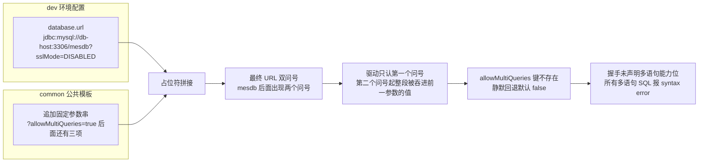
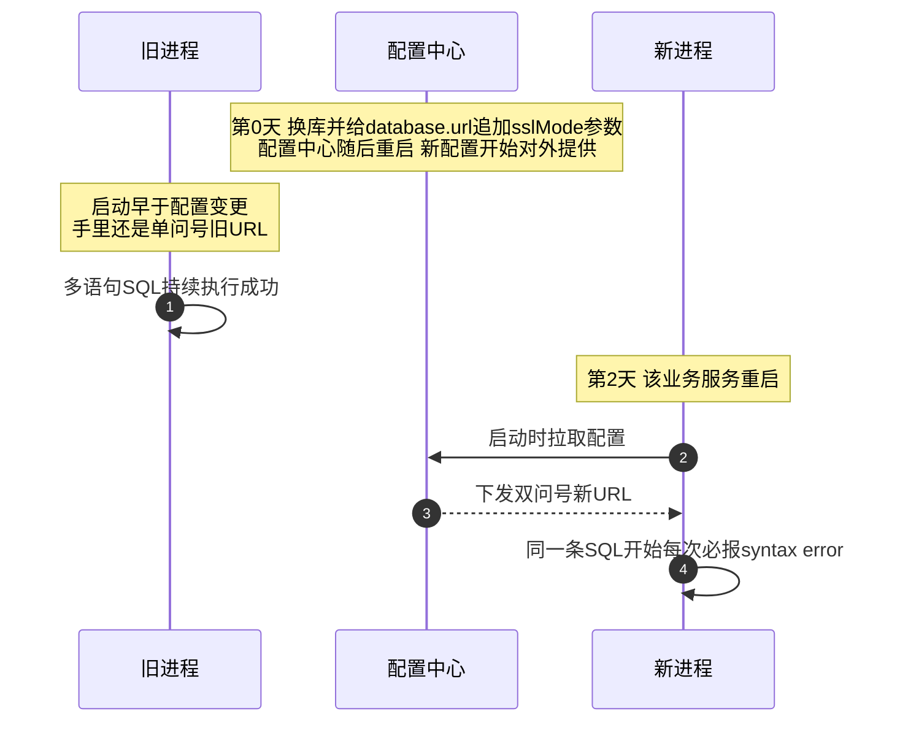

一套 Spring Cloud 微服务 MES 里，一个"检验暂存"接口突然全量报错。报错很吓人：MyBatis 抛 `BadSqlGrammarException`，底层是 `MySQLSyntaxErrorException: You have an error in your SQL syntax`——**语法错误**，直指 mapper 写错了。但这条 SQL 在代码库里已经跑了很久，一行没改，而且"之前测试都是正常的"。

事后看，SQL 本身没有任何问题，问题出在 JDBC 连接串：换数据库时给 `database.url` 加了一个 `?sslMode=DISABLED` 参数，和公共配置里追加的 `?allowMultiQueries=true` 拼出了**两个问号**。驱动解析 URL 时只认第一个问号，第二个问号后面的整段参数被吞进前一个参数的值里——`allowMultiQueries` 这个键从未存在过，静默回退默认值 `false`，所有多语句 SQL 集体阵亡。

这个坑的迷惑性在于三层错位：**报错在 mapper 层，根因在配置层；丢失的参数只有一个，其余功能全部正常；配置改完不会立刻炸，等到服务重启那天才引爆**。这篇复盘把三层错位逐一拆开，重点讲清楚多语句 SQL 为什么天生依赖连接参数、双问号是怎么静默废掉它的。

<!-- more -->

## 一、现象：错误长什么样，为什么第一眼会被带偏

页面点暂存，接口 500。链路是 页面 → 网关 → 移动端服务（feign 转发）→ 质量服务。转发层日志只有一句 `HystrixRuntimeException: ... failed and no fallback available`，真正有信息量的是下游质量服务日志：

```text
### Error updating database.  Cause: com.mysql.jdbc.exceptions.jdbc4.MySQLSyntaxErrorException:
You have an error in your SQL syntax; check the manual that corresponds to your MySQL server
version for the right syntax to use near 'delete from t_check_item where pid = 43 and
factoryid = 3' at line 2
### SQL: delete from t_check_group where pid = ? and factoryid = ?;
        delete from t_check_item where pid = ? and factoryid = ?
```

出事的 mapper 长这样：一个 `<delete>` 节点里用分号拼了两条 delete（先删分组表、再删明细表，服务层按传入表名复用）：

```xml
<delete id="deleteCheckGroupItem" parameterType="Map">
    delete from ${tablename1} where pid = #{pid} and factoryid = #{factoryid};
    delete from ${tablename2} where pid = #{pid} and factoryid = #{factoryid}
</delete>
```

第一直觉当然是对的：多语句 SQL 需要 `allowMultiQueries=true`。但马上被"事实"反驳——这条语句昨天还在成功执行，服务里同样的多语句写法不止一处，谁也没动过。**"代码没变"恰恰是最大的干扰项**：它把注意力从代码拉走的同时，也让人下意识去怀疑数据库本身（版本？权限？），而不是连接串。

## 二、原理：多语句 SQL 为什么天生依赖连接参数

要理解这个坑，得先知道 MySQL 客户端协议的一个基本约定：**一次请求（一个 COM_QUERY 包）就是一条语句，分号在协议层不是语句分隔符**。拆分多条语句、逐条发送，是客户端（mysql 命令行、JDBC 驱动）自己的职责。想把分号隔开的多条语句塞进一个包里发给服务器，客户端必须在握手时声明 `CLIENT_MULTI_STATEMENTS` 能力位，服务器才会按"多条"去解析。

对 MySQL Connector/J 5.1.48 来说，**只有 URL 里带了 `allowMultiQueries=true`，驱动才会在握手中置这个能力位；默认是关的**（防 SQL 注入放大：`; DROP TABLE` 这类注入在多语句关闭时无处遁形）。于是链条是：

```text
URL 有 allowMultiQueries=true
  → 握手声明 CLIENT_MULTI_STATEMENTS
    → 服务器接受一个包里的多条语句
      → mapper 里的双 delete 正常执行
```

任何一环断了，服务器就把整包当**一条**语句解析。这个报错的形状恰好是它的指纹：MySQL 语法允许语句结尾跟分号，解析器吞掉第一个分号后，撞上了紧随其后的第二条 `delete`——所以 `near` 引用的是**第二条完整语句**、行号是 **at line 2**。看到"near 第二条语句 + at line 2"，基本可以直接判定：多语句 SQL 撞上了没开能力位的连接。

还有一层迷惑性：能力位只影响多语句解析，单条语句完全不受影响。所以服务 99% 的接口照常工作，只有寥寥几条多语句 mapper 全炸——"个别接口报语法错误"这个表象，几乎必然被当成那几条 SQL 自己的问题。

## 三、URL 是怎么被拼坏的

这套系统的数据源 URL 不写在各服务里，而是配置中心统一组装：公共模板负责追加驱动参数，环境配置只提供库地址：

```properties
# common 公共模板（所有环境共用）
spring.datasource.url = ${database.url}?allowMultiQueries=true&useSSL=false&useUnicode=true&characterEncoding=UTF-8

# dev 环境配置——换库时给地址加了 sslMode 参数
database.url = jdbc:mysql://db-host:3306/mesdb?sslMode=DISABLED
```

占位符替换后，最终 URL 带上了两个问号：

```text
jdbc:mysql://db-host:3306/mesdb?sslMode=DISABLED?allowMultiQueries=true&useSSL=false&useUnicode=true&characterEncoding=UTF-8
```

而 Connector/J 解析 URL 时**只按第一个问号切分参数串**，之后按 `&` 拆键值对。于是实际解析结果是：

| 驱动看到的键 | 驱动看到的值 |
|---|---|
| `sslMode` | `DISABLED?allowMultiQueries=true` |
| `useSSL` | `false` |
| `useUnicode` | `true` |
| `characterEncoding` | `UTF-8` |

`allowMultiQueries` 作为独立键**根本不存在**，静默取默认值 `false`。主机、库名、账号都在问号之前，完好无损；其余参数在 `&` 切分后也各就各位——连接正常建立、单语句正常执行、驱动对未知参数不报任何警告。**整条链路没有任何报错，只有一个功能特性被无声没收了。**



顺带一提 `sslMode` 本身：这是 Connector/J **8.x** 的参数，5.1.48 并不认识它（5.1 用 `useSSL`），加上公共模板里本来就有 `useSSL=false`，这个参数纯属多余——但"多余"不等于"无害"，它就是这次事故的导火索。

## 四、为什么"之前测试都正常"：三个时间点错开引爆

配置中心从自己打包的 classpath 提供配置，各服务**只在启动时拉取一次**。于是改配置到故障爆发之间隔着三个错开的时间点：



日志给了铁证：前一天旧进程（旧 PID）里同一条 SQL 以 `<== Updates` 正常返回；当天服务重启换了新 PID，从 14:15 起**每一次**调用都是同一个语法错误，无一例外。代码没变、数据库没变、变的只有"进程手里的那份 URL"——所以"之前测试都正常"和"现在全量报错"都是真的，两句之间隔了一次重启。

这也是这类配置事故最阴的地方：**改动本身不生效时人会产生"这个改动是安全的"的错觉**。加 `?sslMode=DISABLED` 那一刻所有服务都还跑着旧配置，什么都没发生；两天后一次例行重启，雷才炸。

## 五、修复与验证

修复很小：dev 配置的 `database.url` 去掉 `?sslMode=DISABLED`，恢复成不带任何查询参数的纯地址（禁 SSL 的诉求由公共模板里的 `useSSL=false` 覆盖）。生效路径是 配置中心重启 → 业务服务重启重新拉取。

验证要走到落库，不能只看接口返回码——多语句 mapper 涉及"删旧再插新"，之前还踩过"接口成功但明细被静默丢弃"的坑，所以验证三件套：

1. 重放出错的原始请求：HTTP 200，`successful: 1`；
2. 查库断言：明细表两条记录、分组表一条记录、主单状态停在"检验中"（暂存语义）；
3. 对比当天的报错日志：同参数请求从"每次必炸"变为一次通过。

## 六、小结：三层教训

**报错位置不等于根因位置。** "SQL syntax error" 把手电筒照向 mapper，根因却在两层之下的 URL 组装。报错文案描述的是"服务器在哪解析失败"，不描述"谁把连接弄坏的"。定位时多问一句：这个错误的形状是哪类问题的指纹？——"near 第二条语句 + at line 2"就是多语句撞上未开启能力位的指纹。

**模板拼接 URL 的铁律：base 必须零查询参数。** 只要公共模板用 `?` 硬拼参数串，任何人在环境配置里加一个带 `?` 的参数都会重演这次事故，而且无声无息。更稳的做法任选其一：模板改为要求 base 提供纯地址并在文档里写死约定；或环境配置直接覆写完整的 `spring.datasource.url`，不走拼接。如果 `sslMode` 真有必要，应该作为一项追加进公共模板的参数串，用 `&` 接在正确的位置。

**多语句 SQL 本身就值得克制。** 它把"一个语句"的契约扩大成"一串语句"：影响行数只返回第一条的、预编译复用被绕过、还和连接参数强耦合——本例里整个系统的多语句 SQL 共用一条命，一个参数丢失全体阵亡。MyBatis 里拆成两个 `<delete>` 节点、服务层顺序调用，代价几乎为零，换来的是不依赖任何连接参数的确定性。
