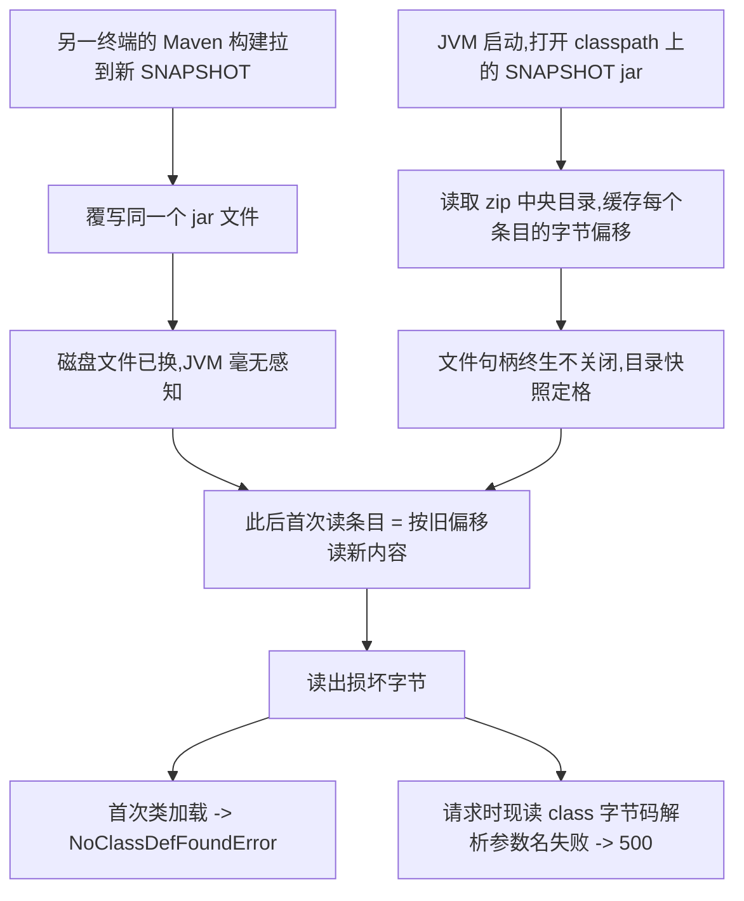

一个平静的下午，测试环境的报表页面突然打不开，接口 500。报错是 Spring 的参数名解析失败——而相关代码（一个所有微服务共享的框架 jar）已经几周没人动过。更玄学的是：同一个 URL 两种异常交替出现；部署着完全相同 jar 的其他服务，同款请求全部 200。

最后定位到的根因与代码无关：一次再普通不过的 Maven 构建，把本地仓库里的 SNAPSHOT 依赖 jar **原地覆写**成了新构建，毒化了所有在覆写之前启动的 JVM。这篇文章完整记录排查链路、毒化机制（JVM 为什么会"握着旧文件视图"）、修复过程，以及顺手踩到的 Windows 临时端口坑。

<!-- more -->

## 一、症状：一个"不可能"的报错

页面请求一个 i18n 资源接口，返回：

```json
{
  "status": 500,
  "message": "Name for argument type [java.lang.String] not available,
              and parameter name information not found in class file either."
}
```

这个报错的语义是：Spring MVC 在解析 `@PathVariable` / `@RequestParam` 注解的参数时，注解上**没有写显式参数名**（如 `@PathVariable String mould`），于是框架退回去从字节码里反推参数名——反射（需要编译时带 `-parameters`）和 LocalVariableTable 调试信息（需要编译时带 `-g`）两条路**都失败**了，才会抛这个错。

反编译框架 jar 确认：这个方法确实是裸写 `@PathVariable String mould`，但 class 文件里 LVT（局部变量表，含参数名）**完好存在**。也就是说按理说不可能报这个错。

还有两个加重玄学色彩的细节：

- **同一接口两种异常交替**：前端看到的报错是上面的参数名错误，但服务的接口监控日志表里记录的 errmsg 却是 `NoClassDefFoundError`——某个框架内部类加载失败；
- **同 jar 不同命**：微服务架构下十几个服务共享部署这个框架 jar，其中四个服务收到完全相同的请求，全部正常返回，唯独报表服务炸。

## 二、排查：三条线索收敛

### 线索1：反编译排除"新构建丢了调试信息"

第一反应是怀疑框架组的新构建没带调试信息。把本地仓库里新旧两个 SNAPSHOT 构建的 jar 拉出来对比：出问题的类文件 **md5 完全一致**，LVT 齐全。排除。

这一步很关键——它证明磁盘上的 jar 是好的，问题必然出在**运行中的进程眼里**。

### 线索2：同一请求两种异常 = 类加载损坏

一个 handler 方法，要么参数解析失败（IllegalArgumentException），要么进入方法体后类加载失败（NoClassDefFoundError），二者本来不可能同时出现。而监控日志显示同一 URL 先后抛出这两种异常——这是**运行时类加载视图损坏**的典型特征，与注解写法无关。

### 线索3：时间线拼图，凶手浮出水面

把三个时间戳摆在一起，答案自己跳了出来：

| 时间 | 事件 |
|---|---|
| 11:49 | 报表服务进程启动（本地开发，`mvn spring-boot:run` 直跑） |
| 14:17 | 某次构建刷新了 SNAPSHOT 更新策略（默认 daily），拉取到框架组当天中午发布的新构建 |
| **14:18** | **本地仓库的 `xxx-1.0.0-SNAPSHOT.jar` 文件被原地覆写为新构建** |
| 14:33 | 该服务进程生命周期内**第一次**调用 i18n 接口 → 炸 |

进程启动早于 jar 覆写，覆写早于首错。嫌疑锁定。

## 三、根因：jar 在 JVM 眼里被"偷梁换柱"



### JVM 为什么会"握着旧文件视图"

这是整个案例最值得写明白的部分，四个事实叠出这颗延时炸弹：

**事实1：zip 的读取方式决定了"打开即快照"。** JDK 里 classpath 上的每个 jar 由 `java.util.zip.ZipFile` 表示。它打开时只做一件事：从文件尾部读出 zip 的中央目录——每个条目的名字和它在文件中的**字节偏移量**，缓存在一个数组里；之后每次 `getInputStream()` 都按这些偏移量 seek 过去直接读数据。也就是说，**JVM 对这个 jar 的全部认知（里面有哪些类、每个类的数据在文件哪个位置），在打开那一刻就定格成内存里的快照了**。

**事实2：这个句柄终生不释放。** 应用类加载器持有 `URLClassPath`，每个 jar 对应一个 `JarLoader` 包着的 `ZipFile`，从打开到进程退出从不 close。JVM 没有"文件变了就重新打开"的机制——classpath 本质上是启动命令里的一串**文件路径**，JVM 默认这些路径背后的内容永远不变。

**事实3：Maven 的覆写对运行中进程是静默的。** SNAPSHOT 新构建落地时，Maven 用"临时文件 + rename/copy"把新内容写进**同一个文件名**。对已经打开这个文件的进程来说，这是一次毫无通知的偷换：

- 若 rename 替换成功：旧句柄仍指向旧数据块，读到的是"旧字节"；而磁盘路径已经指向新文件。新旧两套认知并存；
- 若原地覆写：句柄没变、内容变了——内存里缓存的偏移量是按旧文件布局算的，读到的却是新文件的字节，**偏移错位，读出来的就是垃圾**。

两种方式的共同点：**JVM 内存里的目录快照与磁盘真实内容脱钩，且没有任何报错、任何日志**。你不会收到一个警告说"classpath 上的文件变了"。

**事实4：崩溃只发生在"覆写之后的第一次读取"。** 已经加载过的类，`Class` 对象常驻方法区，不再需要碰 jar——这就是毒化之后服务看起来一切正常的原因。而覆写之后才发生的**首次**读取才会撞上坏数据：第一次加载某个此前没用过的类（→ NoClassDefFoundError），或框架在请求到来时才现读 class 字节码的路径（→ 参数名解析失败）。

### 为什么炸的是参数名解析

Spring 5.x 的 `LocalVariableTableParameterNameDiscoverer` 拿参数名的方式出人意料：它不是从已加载的 `Class` 对象获取（反射拿不到，除非编译带 `-parameters`），而是 `clazz.getResourceAsStream(类文件名)` **把 .class 文件字节重新读一遍**，用 ASM 解析其中的 LocalVariableTable。

这个"重新读"走的就是上面已被毒化的 jar 视图——读出坏流，解析不出参数名，返回 null；而 `@PathVariable String mould` 没写显式名，两条兜底路全断，于是抛出开头那个"不可能"的报错。**一个和接口参数毫无关系的 jar 替换，引爆点却是参数解析**，这正是它玄学的原因。

### 为什么拖到 14:33 才爆、为什么别的服务没事

- 前端 i18n 预载脚本有 4 小时的 localStorage 缓存，14:33 恰好是缓存过期后该浏览器会话的第一次回源，也是这个进程生命周期内第一次调此接口——炸弹等到第一次有人踩才响；
- 其他正常的服务分两类：一类是在 jar 覆写**之后**才启动的（打开的就是新文件，干净）；另一类虽然启动得早，但 Spring 的 `namedValueInfoCache` 早就把参数名解析结果缓存了，不再现读 jar——它们只是**还没炸**，任何一次未加载类的首次触碰同样会炸。

## 四、修复与一个小插曲

**修复判定规则**只有一条：`进程启动时间 < jar 文件 mtime` 且该模块 classpath 里有这个 jar → 中招，重启；覆写之后启动的模块不用动。按此规则重启了 8 个模块，复测原接口 200，问题关闭。

**插曲**：重启认证服务时，仓储服务被启动脚本误杀了。原因是认证服务监听的端口（5000）恰好落在 Windows 默认临时端口段（49152–65535）内，仓储服务的一条出站连接被系统分配了 5000 作为**源端口**；启动脚本发现"端口被占"，按清理策略把占用进程整个杀掉了。两点教训：

- 服务监听端口尽量避开系统临时端口段（Linux 默认 32768+，Windows 默认 49152+，均可调）；
- 自动化脚本清理端口前，应区分"监听占用"与"出站连接源端口占用"——前者才需要清理。

## 五、经验清单

1. **SNAPSHOT + 长驻进程 = 隐形炸弹。** 本地起着的开发服务，任何一次拉新 SNAPSHOT 的构建（哪怕是别的模块在编译）都可能静默毒化它们。拉到新框架构建后，把在跑的服务重启一遍；或者本地编译加 `-o`（离线）、锁死版本号。
2. **多实例对比是最好的照妖镜。** 同一个 jar 多处部署时，"只有一处炸"几乎总意味着那一处的运行环境（类加载器、文件视图、缓存状态）有问题，而不是代码。
3. **别只信前端看到的报错。** 这个案例里前端看到的是参数名错误，服务端监控日志记录的却是 NoClassDefFoundError——两种异常并存直接指明了类加载损坏的方向。
4. **时间线拼图法**：进程启动时间、文件 mtime、首错时间，三个时间戳摆在一起往往凶手自现。
5. **写 Spring 注解永远带显式名**：`@PathVariable("mould") String mould`。把参数名从"运行时反推字节码"变成"编译期常量"，零成本免疫这一整类环境问题。
6. **理解 classpath 的真实语义**：它是一串文件路径的快照，JVM 假设其内容终身不变。任何在运行中替换这些文件的操作，都是在 JVM 不知情的情况下改写它的记忆。
