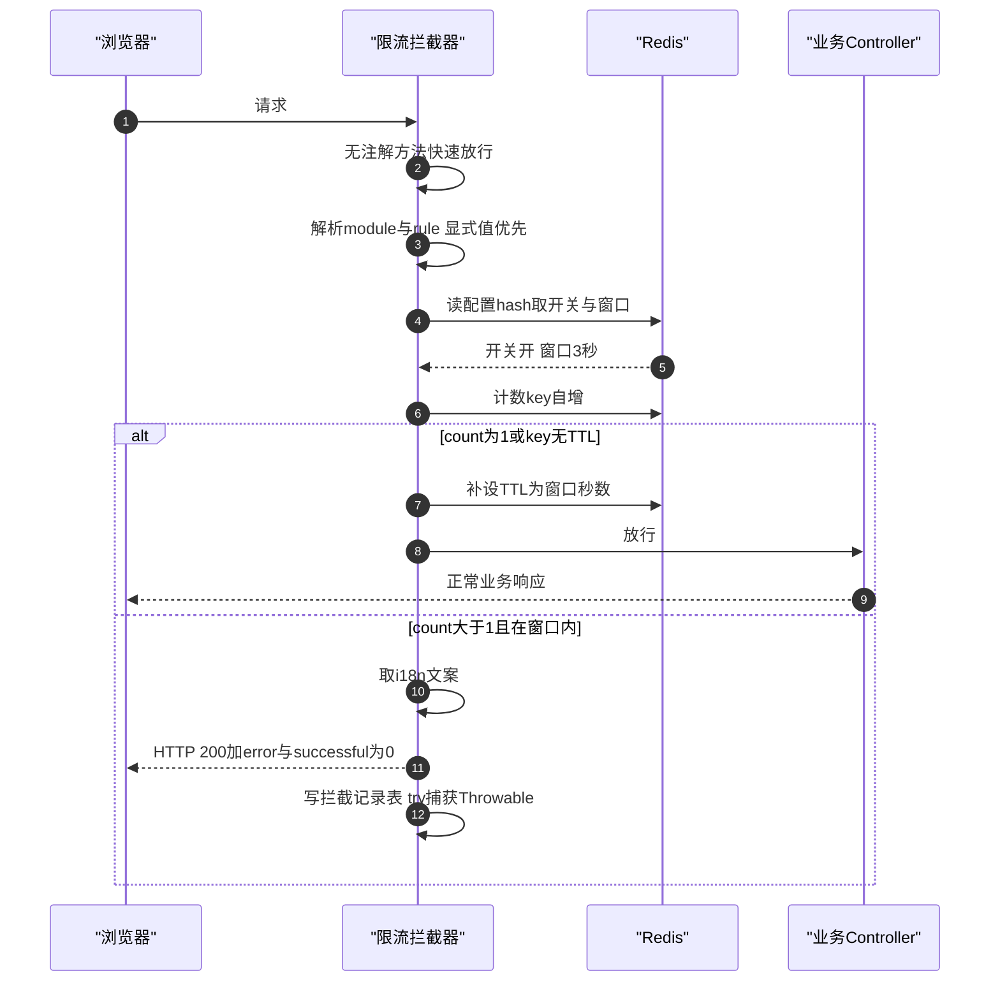

最近在一套服务端渲染的制造执行系统（Spring Boot 2.1 + Spring Cloud 老版本微服务，JSP + EasyUI 前端，十几个业务服务）里做了一个统一接口限流组件。起因不是优化诉求，是一次生产事故：疑似客户侧用脚本对系统做批量数据查询，请求洪峰把业务服务直接打死了。复盘时发现这类风险早有伏笔——一条库存流水查询接口带全表聚合，页脚汇总要六秒多，人手连点就能把它拖垮；另一个条码查询接口早被脚本连点过，业务同事在 Service 里手写了一段"十五秒内只许查一次"的私有判断，散落在业务代码里。事故只是把这些既有脆弱点一次性引爆。

做完整个工程回头盘点，一个感受越来越清晰：**Redis 固定窗口计数是全部工作里最简单的部分，两个小时就写完了；真正花时间、真正值得复盘的，是算法之外的一切**——拦截器在哪类应用里会静默失效、限流键从哪取身份、被拦的响应长什么样、Redis 挂了限流器怎么办、运维怎么不重启调参、前端怎么消化"被限流"这个新的失败模式。

市面上九成的限流文章在对比算法：固定窗口的边界突刺、滑动窗口的内存开销、令牌桶的突发容忍、再补一段 Lua 脚本保证原子性。这些内容对，但它们回答的是"怎么实现一个限流器"，而不是"怎么在一个跑了十年、前后端契约刻在化石里的系统里落地限流"。这篇文章讲后者。

<!-- more -->

## 一、先定威胁模型，再谈算法：为什么固定窗口就够

教科书对固定窗口的批评是标准的：窗口交界处可能放进 2N 个请求——第一窗口末尾 N 个、第二窗口开头 N 个，限了等于没限。于是结论总是"生产环境应该用滑动窗口或令牌桶"。

这个推理跳过了一步：**你的敌人是谁？**

我们的威胁清单里没有 DDoS——那是网关和边缘层的事，应用层限流防不了也不该防。应用层限流真正要防的是：手快连点的用户、没有节流的前端轮询、把接口当数据源批量拉数的脚本（这次事故的元凶，一个持有合法账号的"好用户"）、以及"查询本身很贵，谁都点不起"的接口。对这类威胁，固定窗口的边界突刺完全无害：3 秒窗口最坏情况某用户 3 秒内进了 6 次而不是 3 次，业务无损。而为消除这个理论上无害的突刺，滑动窗口要付出每次请求多个计数器往返、令牌桶要付出 Lua 脚本和时钟语义——在这个威胁模型下，这些复杂度是负资产。

同理，限流键的维度也不是理论题。按 IP 限？内网系统所有请求都经网关转发，后端看到的 IP 要么是网关的、要么全公司一个出口——按 IP 限等于全公司共享一个配额，第一个人点三下，所有人都被拦。所以键维度只能是**业务用户标识**，粒度问题到此为止，不需要更多论证。

算法选型真正需要的是威胁模型四问，而不是算法对比表：

1. 防谁——人、脚本、还是自己系统的缺陷？
2. 按什么键限——IP、用户、租户、还是接口？
3. Redis 挂了怎么办——fail-open 还是 fail-closed？
4. 被拦的响应长什么样——前端能不能消化？

顺便说清楚什么**不该**用这个限流器：导出接口（点击一次跑一个长任务，限点击频率不解决任何问题，配套手段是分页大小上限和异步导出）；服务间 Feign 内部调用（无会话身份，且内部调用的"频率"由上游业务节奏决定，限它只会断自己）。

## 二、组件形态：注解驱动 + 约定优于配置

组件放在公共 utils 模块，业务侧的接入目标是一行注解：

```java
// module/rule 缺省自动取值，只需声明窗口与文案
@RateLimit(interval = 3,
           messageKey = "com.xxx.inventoryoplog.ratelimit.frequent")
public String queryInventoryOpLogList(...) { ... }
```

两个标识都不用手填：

- **module** 取 `spring.application.name` 去掉统一前缀（`app-wms` → `wms`）；
- **rule** 取 `Controller 简名.方法名`（`WmsInventoryController.queryInventoryOpLogList`），应用内天然唯一，零命名成本。

这版设计是评审改出来的。第一版注解里要显式写 `module = "wms", rule = "oplog"`，被挑战"这两个值为什么还要人填"——确实，appName 配置里有，方法签名上有，手填引入的只是抄写错误这一整类 bug（拼错、复制粘贴忘改、两个接口撞名）。改成自动解析后，配置键可以从代码推导（运维看到日志里的规则名，反手就能 HGETALL 到对应配置），显式赋值的口子仍然保留给特殊口径。

整体链路：



Redis 侧就两个结构：计数用 `ratelimit:<module>:<rule>:<user>` 的 hash（字段 `count`，窗口首请求补 TTL）；配置用另一个 hash，字段 ` <module>.<rule>.check` / `.interval`，外加一个全局落库开关 `log.check`。

## 三、与宿主环境的五场战争

这部分是全文的主体，也是其他限流文章不讲的部分。

### 3.1 拦截器自动挂载的静默失效

标准姿势是写一个 `WebMvcConfigurer` 把拦截器注册到 `/**`，组件在公共包里，各业务服务靠组件扫描自动生效——标准应用确实零配置就挂上了。

但有一类应用继承了 `WebMvcConfigurationSupport`（为了接管 MVC 配置的老应用很常见），此时 Spring Boot 的 MVC 自动配置整体退位，**你的 WebMvcConfigurer 根本不会被调用**。没有报错，没有日志，拦截器就是不注册——这类应用拿到的限流保护是零，而所有人都以为组件已经全覆盖了。

对策只有两条：文档里写死这类应用的显式挂载方式（在该应用自己的配置类里 `addInterceptors`），并把"哪些应用继承了 WebMvcConfigurationSupport"列为接入核对清单。教训泛化一下：**任何依赖自动配置的横切组件，都必须列出"自动配置不生效"的应用类目清单，否则覆盖面是一个幻觉**。

### 3.2 身份从哪来

限流键要用用户标识，但用户标识藏在哪？这套系统的现实是：框架每请求把 usercode 注入参数Map，登录态在 session 里，而网关转发的内部调用两者皆无。于是解析顺序是：**请求参数 → session → 都取不到则不限，直接放行**。

"取不到就放行"听起来纵容，其实是对身份体系现实的妥协：按 IP 限会误伤（见第一节）；把无身份请求拦掉会斩断内部调用链。限流器的身份解析必须顺着宿主系统的身份体系走，而不是自带一套理想化的。

### 3.3 响应契约：HTTP 429 是正确的，也是错位的

REST 语义下被限流应该返回 `429 Too Many Requests`。但这套系统的前端是 EasyUI datagrid，它理解的失败契约是 **HTTP 200 + `{"error": "文案", "successful": 0}`**——全系统十几年的前端都按这个契约写。返回 429 意味着每一个接入限流的页面都要加一层对新型失败响应的处理。

结论：限流器是客人，别让全系统的前端为你改契约。被拦响应就按宿主契约返回 200 + error，文案走 i18n（这套系统四语言），messageKey 由注解声明、各模块资源包自持，i18n 取值异常兜底返回 key 原串——不能让文案系统故障把拦截响应变成 500。

### 3.4 fail-open，但必须吵闹

Redis 故障时限流器怎么办？fail-closed（拒绝所有请求）把一个防护组件升级成了单点故障源；我们的选择是 fail-open——开关读不到按开启、计数失败按放行。理由很朴素：**限流是保护措施，不是安全控制；保护措施失效不应该变成业务中断**。

但 fail-open 必须配 error 级日志。静默的 fail-open 是暗雷：某天 Redis 悄悄挂了两小时，限流保护实际为零，而没有人知道。降级可以，降级必须留下证据。

### 3.5 遥测不能成为新的故障源

每次拦截写一条记录表（谁、哪个规则、哪个接口、窗口多大），这张表后来长出了一个统计报表。但落库代码在拦截路径上，于是两个防御：

- DAO 用 `@Autowired(required = false)` 注入——组件在公共 jar 里，宿主应用里有的没开 MyBatis 扫描，强注入会让这类应用启动失败；注入不到就降级为只拦不记；
- 落库调用包 `try-catch (Throwable)`——记录写失败绝不影响拦截响应本身。

遥测是防护的一部分，但遥测故障绝不能变成新的故障源。

## 四、运维性：限流器的下半场在生产环境

写完组件只是上半场。限流器的生命周期大半在生产环境，三个设计决定了它好不好运维：

**配置自初始化**。配置 hash 第一次被读时，把缺省值写回去。效果是运维 `HGETALL` 一下就能看到全部可调项——配置是可发现的，不需要翻代码或文档才知道有哪些开关。配置可发现性这个属性平时没人提，事故时价值连城。

**不重启调参**。某接口被脚本盯上的半夜，运维 `HSET` 把 interval 从 3 改到 30，下一个请求即生效。如果调参要发版，那这个参数等于不可调。

**开关缺省开、仅显式关**。规则开关的语义设计成"缺省开启，仅显式 `false`/`0` 关闭"。这是反向的 allow-list：新接入的注解立即受保护，不需要先去配置中心登记；而"谁关了哪个规则"这件事在 Redis 里留有痕迹，可审计。反过来设计（缺省关、要显式开）会让一半接入点在"等配置"的过渡期裸奔。

顺带一个量级判断：记录只在被拦时落库，正常放行一条不写。内部管理系统的防连点场景里，被拦本身就是异常路径（人手滑多点两下 = 一两条记录），量级天然小，同步 insert 足够；真被脚本打爆时还有 `log.check` 全局开关可以只停落库不停限流。不需要队列削峰。

## 五、前端配套：限流改变的是系统的失败模式

接入限流后，"查询太频繁"从一种服务端隐忍变成了前端会真实收到的错误响应。这意味着前端必须把它当成一种**正常失败模式**处理，三件事配套做：

1. **查询防抖对齐后端窗口**：后端 3 秒窗口，前端查询按钮防抖 3 秒，正常操作下用户根本撞不到限流——限流兜的是脚本和异常路径，不该惩罚正常用户；
2. **翻页被拦的兜底**：datagrid 翻页请求被限流时，loadFilter 里把页码回退到最近成功值、表格保持原数据、弹出后端 i18n 文案。没有这个兜底，用户的体验是"翻页偶尔卡死"，没人会联想到限流；
3. **错误文案说人话**：`operate_too_frequent` 的文案是"操作过于频繁，请稍后再试"，不是"限流触发"。

每一条被拦的响应都是一次 UX 事件。前端不配套，限流器就是在给用户埋雷。

## 六、实现细节里真正的坑

### 6.1 无 TTL 孤儿 key：比窗口边界突刺严重得多的正确性问题

计数实现是教科书套路：INCR 后如果是首个请求（count == 1）补设 TTL。非原子，两步之间进程崩溃就留下一个**没有 TTL 的计数 key**——它永远不过期，计数只增不减，该用户该接口**从此被永久拦截**。

教科书忙着批评固定窗口的"边界双倍"，但边界双倍无害；真正的正确性风险是这个孤儿 key 的永久误拦。解法不必上 Lua：每次自增后检查 `count == 1 || TTL == -1` 就重设 TTL，孤儿 key 在下一次请求到达时自愈。一行防御，换来的是"最坏情况退化一个窗口"，而不是"最坏情况永久拦截某个用户"。

### 6.2 INCR/EXPIRE 要不要 Lua 化

有了 6.1 的分析，这个问题的答案就清楚了：Lua 化消灭的是两步之间的崩溃窗口，代价是每个请求多一层脚本调用与维护成本；而自愈检查已经把崩溃窗口的后果降为"多拦一个窗口"。又回到威胁模型——这不是并发竞态问题（同一用户同接口的并发突刺无害），是崩溃恢复问题，防御性检查比原子性更对症。

### 6.3 拦截器挂在 /** 上的性能声称

拦截器注册在 `/**`，每个请求都要过一遍。对未标注方法是"一次 instanceof + 一次注解查找后放行"——这个快路径的开销要诚实评估：注解查找在方法对象上有缓存，实测纳秒级，可忽略；但结论是"测过可忽略"，不是"理论上零开销"。横切全路径的组件，性能声称必须带测量。

## 小结：给遗留系统加限流的决策清单

复盘成清单，按顺序问：

1. **威胁模型四问**：防谁？按什么键限？Redis 挂了 open 还是 closed？被拦响应长什么样？——答完这四问，算法大概率自己选好了，且大概率是固定窗口。
2. **宿主环境核对**：MVC 配置方式（有没有自动配置失效的应用）？身份体系（限流键从哪取、取不到怎么办）？前端失败契约（429 还是 200+error）？i18n？公共组件的宿主差异（依赖注入可不可以失败）？
3. **运维三件套**：配置可发现（自初始化）、不重启调参、拦截遥测 + 统计报表。
4. **前端配套**：防抖对齐窗口、被拦当成正常失败模式处理、文案说人话。
5. **明确不覆盖什么**：导出、内部调用、真正的流量攻击——各归其位，别让应用层限流背 DDoS 的锅。

算法文章教你造一个限流器，这份清单帮你把它落进一个系统。后者才是工作量所在。
