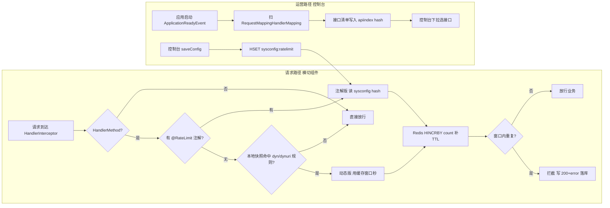

前面两篇分别讲了和。这一篇换一个角度：把整套实现"拆零件"，逐个讲清楚**代码里到底用到了哪些技术、为什么这么用、哪些是踩出来的**。不堆概念，全部对应当时项目里的真实实现（`@RateLimit` 注解、`RateLimitInterceptor`、`RateLimitService`、`RateLimitRuleCache`、`RateLimitApiIndexReporter` 等）。

<!-- more -->

## 一、整体架构：一条横切请求 + 一条运营配置

限流要"横切所有接口、可运营、不重启生效"，所以它天然分成两条线：

- **请求路径（防护面）**：每个请求先过 `HandlerInterceptor`，决定放行还是拦截；限流计数落在 Redis。
- **运营路径（配置面）**：应用启动时把接口清单上报到 Redis，控制台读清单 + 写配置，配置实时驱动拦截器。



下面把这张图里的每一块技术拆开讲。

## 二、请求路径用到的技术

### 2.1 Spring `HandlerInterceptor` + `WebMvcConfigurer`：零配置横切

限流是典型的**横切关注点**，最干净的做法是拦截器而非在业务代码里手写判断。`RateLimitWebConfig` 实现 `WebMvcConfigurer`，一行注册覆盖全路径：

```java
@Override
public void addInterceptors(InterceptorRegistry registry) {
    registry.addInterceptor(rateLimitInterceptor).addPathPatterns("/**");
}
```

关键点：这个 `@Configuration` 放在公共 `utils` 包里，业务 app 的启动类扫到 `com.zhiyin` 根包就会自动生效 —— **业务模块零配置接入**。全路径 `/**` 也没有性能问题，因为无注解的方法在 `preHandle` 里只做一次 `instanceof HandlerMethod` + 取注解就快速放行：

```java
public boolean preHandle(HttpServletRequest request, HttpServletResponse response, Object handler) {
    if (!(handler instanceof HandlerMethod)) {   // 静态资源/健康检查等，直接放行
        return true;
    }
    ...
}
```

### 2.2 自定义注解 + 运行时反射：声明式限流

`@RateLimit` 是挂在 Controller 方法上的**运行时注解**（`@Retention(RUNTIME)`），拦截器在运行时用 `handlerMethod.getMethodAnnotation(RateLimit.class)` 读取。`module`/`rule` 缺省空串，由拦截器自动取值（取 `spring.application.name` 去 `app-` 前缀作 module、取 `Controller简名.方法名` 作 rule），**免手工命名、避免撞车**。

```java
@Target(ElementType.METHOD)
@Retention(RetentionPolicy.RUNTIME)
public @interface RateLimit {
    String module() default "";
    String rule() default "";
    int interval() default 1;
    String messageKey();   // 被限流时返回的 i18n 文案 key
}
```

这是"声明式编程"的最小实践：把"要不要限流、限多少"从代码逻辑里抽成**方法上的元数据**，业务无感。

### 2.3 固定窗口限流算法 + Redis `HINCRBY`/`EXPIRE`

计数 key 形如 `mes:zhiyin:<app>:ratelimit:<module>:<rule>:<usercode>`，用 Redis hash 的 `count` 字段存窗口内请求数，key 的 TTL 就是窗口长度：

```java
long count = RedisTemplateUtils.incHashKey(key, "count", 1);   // HINCRBY，原子自增
if (count == 1 || RedisTemplateUtils.getExpire(key) == -1) {
    RedisTemplateUtils.expire(key, interval, TimeUnit.SECONDS); // 首请求或孤儿 key 补 TTL
}
return count <= 1;   // 窗口内第一次放行，后续拦截
```

**为什么选固定窗口而不是令牌桶/漏桶？** 因为这个场景要的是"同一用户短时间疯狂重复点同一个接口才拦"，固定窗口实现极简、不依赖 Lua 脚本、进程崩溃后 key 到期自动消失即可恢复 —— 足够且最稳。它唯一的代价是**窗口边界突刺**（窗口切换瞬间可能放行两倍），对这个防重复点击的场景完全可接受。

### 2.4 原子自增 + 孤儿 key 自愈：正确性优先于原子性

`INCR` 和 `EXPIRE` 是两步，非原子。如果进程在 `INCR` 之后、`EXPIRE` 之前崩溃，就会留下一个**没有 TTL 的计数 key** —— 它只增不减，该用户该接口被永久拦截。比窗口突刺严重得多。

解法不是上 Lua 把两步做成原子（代价是每次请求多一层脚本），而是每次自增后判断 `count == 1 || TTL == -1` 就重设 TTL：孤儿 key 在**下一次请求到达时自愈**，最坏退化成一个窗口的误拦，而不是永久误拦。这又是一次"先想清楚这是崩溃恢复问题、不是并发竞态问题"的判断 —— 防御性检查比原子性更对症。

### 2.5 Redis Hash 当字段级配置中心：免重启生效

限流开关/窗口全放在一个 Redis hash（`sysconfig:ratelimit`）里，字段级配置，运维 `HSET`/`HDEL` 即时生效，无需重启：

- `global.check`：总开关
- `<module>.<rule>.check`：规则级开关
- `<module>.<rule>.interval`：窗口秒
- `log.check`：拦截记录落库开关
- `dyn.<module>.<rule>` / `dynuri.<pattern>`：动态规则（见 2.6）

读缺失字段时把缺省值**写回** hash，相当于"配置自初始化" —— 运维 `HGETALL` 就能看到全部可调项。但要注意：**动态规则字段严禁走这个写回逻辑**（见 2.6），否则每个无注解接口的每次调用都会往 hash 里塞新字段，把配置撑爆。

### 2.6 本地快照缓存（`volatile` + 懒过期）：横切组件的稳态零 Redis 调用

动态规则（`dyn.*` / `dynuri.*`）是给"没标注解的接口"临时限流用的。如果每次请求都去 Redis 查配置，这个挂在 `/**` 的组件会把系统常态 Redis QPS 翻倍。做法是 `RateLimitRuleCache` 把整个配置 hash **每 30 秒 `HGETALL` 一次**，解析成不可变快照：

```java
private volatile RulesSnapshot snapshot = RulesSnapshot.EMPTY;   // volatile 引用整体替换，读侧无锁
```

- **读侧无锁**：`volatile` 保证引用替换的可见性，查询时只读这个不可变 snapshot，无需加锁。
- **懒过期**：不用 `@Scheduled`（各 app 是否启用调度不确定），过期后的第一个请求同步刷新，其余请求纯本地计算。
- **fail-open**：刷新异常保留旧快照；首次加载失败 = 空表全放行。

结果：快照未过期时，动态规则的查询（含 Ant 路径匹配）**零 Redis 调用**，横切组件的稳态成本被钉死在本地。

### 2.7 `AntPathMatcher` 路径匹配：URL 级规则按最特异命中

URL 级动态规则 `dynuri.<pattern>`（`/wms2/inventory/**` 这类 Ant 风格）用 Spring 自带的 `AntPathMatcher` 匹配（和 Spring MVC 路由同款）。注意两点：

1. **共享静态实例**：`AntPathMatcher` 内部有并发安全的模式缓存，用 `static final` 全局复用，**严禁每请求 new**。
2. **多命中取最特异**：用 `getPatternComparator(uri)` 排序取第一（实测 `/a/b` > `/a/*` > `/a/**`），保证 `**` 这种宽规则不会盖掉精确规则。

### 2.8 身份来源与 fail-open 防御纵深

- **身份（usercode）**：优先取请求参数 `usercode`，其次取 session 属性（Spring Session 透明）；都取不到（网关/Feign 内部调用、非正常登录态）就**放行不限制** —— 限流只对真实用户生效。
- **fail-open 落到每一层**：Redis 异常 → 放行；落库 DAO 用 `@Autowired(required = false)` 注入（没开 MyBatis 扫描的应用也能启动，降级成"只拦不记"）；落库调用包 `try-catch(Throwable)`（记录失败绝不影响拦截）；配置读取异常按缺省返回且**不写回**。任何一层漏了，限流器就从"保护措施"退化成"新的故障源"。

### 2.9 前端失败契约：`200 + error + ratelimit:1`

被限流时**不返回 4xx**，而是返回 HTTP 200 + JSON `{"error": 文案, "successful": 0, "ratelimit": 1}`。原因：

- `error`/`successful` 对齐框架 `DaoResultBuilder.wrapAffectedError` 契约，老前端（EasyUI 网格）本来就读 `error` 字段弹提示，零改动即可识别；
- `ratelimit:1` 这个专用标识，让平台前端（统一拦截层）**精确识别限流响应**做统一弹窗，不复用 412 的业务语义 —— 否则正常业务校验的 412 会被误判成限流。

这一点是踩过"拦了但前端毫无反应"的坑才定下来的（详见落地复盘）。

## 三、运营路径用到的技术

### 3.1 `ApplicationReadyEvent` + `@EventListener`：启动上报接口清单

控制台要能"下拉选接口"来配动态规则，得先知道有哪些接口。`RateLimitApiIndexReporter` 在应用启动完成后（`ApplicationReadyEvent`，一次启动只触发一次）扫 `RequestMappingHandlerMapping`，把全部 handler method 写入 Redis hash：

```java
@EventListener(ApplicationReadyEvent.class)
public void reportApiIndex() {
    for (Map.Entry<RequestMappingInfo, HandlerMethod> e : requestMappingHandlerMapping.getHandlerMethods().entrySet()) {
        String field = module + "." + interceptor.resolveRule("", e.getValue()); // 与拦截器同口径
        index.put(field, resolvePrimaryPattern(e.getKey()));
    }
    // 清旧 + 整批写
}
```

- **module/rule 取值复用拦截器的 `resolveModule/resolveRule`**：保证清单 field 和动态规则 `dyn.<module>.<rule>` 寻址**严格同口径**，不另写一套（否则控制台选的接口对不上真实规则，是静默 bug）。
- **写前清旧**：删除/改名的接口重启后自动摘除旧条目。
- **fail-open**：整体 `try-catch(Throwable)`，上报失败只记日志，**绝不拖慢应用启动**。

### 3.2 控制台（运营面）的技术

运营面是一个 EasyUI 报表页（`RateLimitLogReport`）：

- **参数设置弹窗**：读配置 hash 展示全部可调项，保存即 `HSET` 回写，**免重启生效**；刚完成的一个小改进是给弹窗加了最大化（右上角按钮，最大化时放开两个列表的限高），方便接口多时查看。
- **接口清单下拉**：读上面上报的 `apiindex` hash，F7 触发，选完自动拼出 `dyn.<module>.<rule>`。
- **三张报表 + 趋势**：拦截明细流水、按人 TOP、按规则分布，加一张按日趋势（ECharts 柱图）；明细支持 EasyExcel 导出，且**列头直接复用页面 datagrid 的列定义**，单一来源不维护两份。
- **数据表**：拦截流水落 `biz_sys_ratelimit_log`（系统级、无租户过滤），记录 usercode/module/rule/uri/ip/当时窗口秒，供按人按规则排查和调阈值。

## 四、踩坑实录（精要版）

这些坑在前两篇展开过，这里用一句话对应到技术点：

| 坑 | 对应技术点 |
| --- | --- |
| 加了注解没生效（MVC 静默失效） | 2.1 拦截器注册 / 包扫描根 |
| 取不到 usercode 导致内部调用被误拦 | 2.8 身份来源 |
| 拦了但前端毫无反应 | 2.9 响应契约 200 + error |
| fail-open 但静默，没人知道限流挂了 | 2.8 每层独立 fail-open |
| 崩溃后用户被永久拦 | 2.4 孤儿 key 自愈 |
| 无注解接口把配置 hash 撑爆 | 2.5/2.6 动态字段严禁写回 |
| INCR/EXPIRE 非原子留孤儿 key | 2.4 |
| 拦截器变成全系统瓶颈 | 2.6 本地快照零 Redis 调用 |
| 控制台选的接口对不上真实规则 | 3.1 解析同源 |
| 配置项看不见、不会自动补全 | 2.5 配置自初始化 |
| 前端把正常校验 412 误判成限流 | 2.9 ratelimit 专用标识 |
| 控制台接口多时列表看不全 | 3.2 弹窗最大化 |

## 五、小结：一套生产级限流用到哪些技术

把上面串起来，这套"不重启、能运营、不污染、横切全路径"的限流，核心技术清单是：

1. `HandlerInterceptor` + `WebMvcConfigurer`：横切全路径、零配置接入；
2. 自定义运行时注解 + 反射：声明式限流；
3. 固定窗口算法 + Redis `HINCRBY`/`EXPIRE`：简单可恢复；
4. 孤儿 key 自愈：`count==1 || TTL==-1` 重设 TTL；
5. Redis Hash 字段级配置：免重启生效 + 配置自初始化；
6. `volatile` 本地快照 + 懒过期：横切组件稳态零 Redis 调用；
7. `AntPathMatcher` + 最特异匹配：URL 级动态规则；
8. `ApplicationReadyEvent` 启动上报：接口清单自动同步；
9. `@Autowired(required=false)` + `try-catch(Throwable)`：fail-open 防御纵深；
10. `200 + error + ratelimit:1` 响应契约：前端零改动识别；
11. 多语言 i18n：文案四语言；
12. EasyUI 报表 + ECharts + EasyExcel：运营面与可视化。

算法本身只是第 3 条，剩下的 11 条才是"限流真正活在生产里"的功夫。如果只想读结论，和更轻量。
