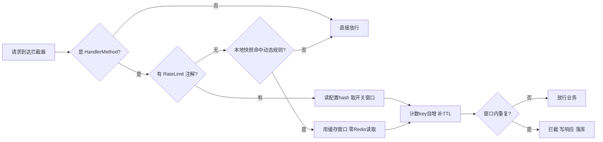

上一篇《接口限流落地复盘》从工程师视角把"算法之外的一切"拆了个遍：拦截器在哪类应用会静默失效、身份从哪取、响应契约怎么对齐、Redis 挂了怎么办、落库不能成为新故障源。那是一篇"怎么做"的复盘。

这篇换三个座位重讲同一件事：**架构师的视角**负责问"该不该做、边界画在哪、哪些必须说 No"；**产品经理的视角**负责问"做了之后谁用、怎么用、能不能运营、价值怎么衡量"；**高级工程师的视角**负责问"落到代码里，哪些地方写着写着就会悄悄烂掉"。前两者决定方案成立与活下来，第三者决定它经不经得起十年老系统天天被每个请求穿过。

如果只把限流写成一个 `RateLimiter` 类，它只会躺在公共包里等人调用；只有把它做成"可运营的能力"、并用经得起磨损的工程手艺实现，它才会真正改变系统的可靠性水位。下半场不在代码里，在架构、产品与工程这三重视角里。

<!-- more -->

## 一、架构师视角：把限流当成可靠性基建，而不是应急补丁

### 1.1 事故的真正含义不是"被攻击"

一次生产事件把系统打挂，复盘时容易把它归因为"需要限流"。但更准确的解读是：**系统的可靠性等于"最贵的那条查询"乘以"最没耐心的那批用户"**。任何一条带全表聚合的查询接口，只要被一个连点的手或一段脚本盯上，就会变成系统性风险点。

之前我们就在两个接口上见过这个伏笔：一条库存流水查询的页脚汇总要六秒多，人手连点就能拖垮它；另一个条码查询接口，业务同事在 Service 里手写了一句"十五秒内只许查一次"的私有判断，散落在业务代码里。事件只是把这些既有脆弱点一次性引爆。

架构师该做的不是给这两个接口打补丁，而是建一条**可复用的安全护栏**：未来每新增一条昂贵接口，默认就继承保护，而不是等出事再各自手写。这是基建思维，不是补丁思维。

### 1.2 边界纪律：说 No 也是一种架构决策

关于"限流能防什么"，真正的架构判断在于明确**不覆盖什么**：

- **DDoS / 真实流量攻击**：那是网关和边缘层的职责，应用层限流防不了也不该防。让应用背这口锅，是把不该它扛的威胁模型塞进来，只会稀释它的本职。
- **导出接口**：点击一次跑一个长任务，限点击频率不解决任何问题。配套手段是分页大小上限和异步导出，各归其位。
- **服务间内部调用（Feign）**：内部调用没有会话身份，且"频率"由上游业务节奏决定，限它只会斩断自己的调用链。

能清楚地划出边界，方案才算立住了。把不该它管的赶出去，它才能把该管的管好。

### 1.3 算法选择由威胁模型决定，不由算法对比表决定

这一条上篇已经论证过，这里只收口一句话：当你的敌人是"手快的人、没节流的前端、把接口当数据源的脚本、以及本身就很贵的查询"，**固定窗口就够了**——它的边界突刺对这类威胁无害，而为消除突刺引入的滑动窗口/令牌桶复杂度，在这个威胁模型下是负资产。算法选型是威胁模型四问（防谁、按什么键限、Redis 挂了 open 还是 closed、被拦响应长什么样）的结果，不是开头。

## 二、产品经理视角：防护能力必须可运营，否则等于没做

这是本篇最重要的观点，也是大多数限流文章不讲的部分。**一个只能靠 `redis-cli` 改参数的限流器，等于一个没有 UI 的产品**——它真实存在于系统里，却没有人能在出事时快速、可靠地操作它。

我们把限流做成了一个可运营的能力，落到三个产品能力上：

### 2.1 防护即配置，不重启、不动代码

限流有两层入口，对应两类 owner：

- **注解层**：代码里显式声明 `@RateLimit(interval = ...)`，带自定义文案，给"代码归属清晰、需要专属提示"的接口用；
- **动态规则层**：运维直接在配置里写一条规则（方法级 `dyn.<module>.<rule>` 或 URL 级 `dynuri.<模式>`），**无需改代码、无需发版、下一个请求即生效**。

第二层是产品能力的核心。它把"给某个接口加保护"从一次开发排期，变成了运维一次配置操作。半夜某接口被脚本盯上，直接调窗口即可，不必等发版。

> 设计上的一个小哲学：动态规则"字段存在才启用，缺失就是无规则"，且**绝不把缺省值写回配置**。理由是——运维看到的就是真实配置，HGETALL 出来的视图必须与系统实际行为一致。一个会自动往配置里偷偷塞默认值、把视图搞脏的限流器，会让 operator 丧失对系统的真实掌控。

### 2.2 一个真实的运维控制台，而不只是命令行

我们给限流配了一个设置弹窗和一张拦截日志报表，把它从"基础设施"变成"自服务能力"：

- **接口清单自动上报**：每个应用启动时把全部接口扫进 Redis（module、Controller 简名.方法名、主 URI），控制台下拉直接选接口，不用手敲一长串标识；
- **设置弹窗**：选接口、设窗口秒数、开关规则、增删动态规则，所见即所得；
- **拦截日志报表**：按用户、按规则、按日趋势三个视图统计"谁被拦了、哪个接口被拦得最凶"——这张表本身就是一张**滥用态势图**，让运维第一次能看见威胁。

### 2.3 可观测性是一等交付物，不是事后补丁

PM 视角的铁律：**你无法运营你看不见的东西**。限流拦截记录从一开始就被当成一张要被报表消费的表来设计，而不是"先拦着，以后再说"。被拦即落库（仅异常路径写，正常放行一条不记），再长出统计报表。量级天然小——内部管理系统的防连点场景里，被拦本身就是异常路径；真被脚本打爆时还有全局开关可以只停落库不停限流。

## 三、高级工程师视角：手艺藏在"不该出错"的地方

架构定了边界，产品定了可运营性，但真正决定这套东西在十年老系统里"天天被每个请求穿过"还能不烂的，是落在代码里的工程手艺。几个地方写着写着就会悄悄出错，资深工程师的价值就是提前把它们在设计里钉死。

### 3.1 快路径上不能悄悄长出远程调用

限流拦截器挂在 `/**` 上，意味着它坐在**每一个请求**的路径上。如果动态规则每次都去 Redis 查一次配置，这套横切组件会把系统常态的 Redis QPS 凭空翻倍。我们的做法是：整个配置 hash 每 30 秒由后台 HGETALL 一次，解析成进程内 `volatile` 快照（读侧无锁），拦截器的动态规则查询只剩一次本地 map 查找或一次 Ant 路径匹配——**快照未过期时，正常路径上零 Redis 调用**。

一个横切全路径的组件，它的稳态成本必须由"测量"得出，而不是由"它逻辑上不复杂"得出。这是 senior 与 junior 在这类组件上最明显的分水岭。

### 3.2 动态规则"绝不写回"：别让优化泄漏状态

动态规则的设计语义是"字段存在即启用，缺失即无规则"。这要求读取动态字段时**绝不能把它缺失的缺省值写回配置 hash**——否则每个无注解接口的每次调用，都会借道那个"读不到就补默认"的配置读取器，往配置里偷偷塞新字段，久而久之把 hash 撑爆，运维的 HGETALL 也再分不清哪些是真的规则。

这条纪律的本质是：**一个为了性能做的优化（本地快照），不能反向污染它读取的那份真实配置**。资深工程师会盯着"状态从哪来、往哪去"，而不是只盯着"这次请求快不快"。

### 3.3 两套解析逻辑必须同源，否则控制台会悄悄失灵

接口清单（启动上报，供控制台下拉选接口）和拦截器（动态规则寻址 `dyn.<module>.<rule>`）都需要把"当前接口"翻译成 `module.rule`。这两处的解析若各写一套，只要有一处不一致，控制台选出来的接口就永远对不上真实生效的规则——一个没有报错、却让整个控制台失效的静默 bug。

做法直接但关键：**上报组件复用拦截器的 `resolveModule`/`resolveRule`**，不另写第二份。能删掉的重复逻辑，就是能删掉的潜在不一致。

### 3.4 fail-open 必须落在每一层，而不是只落在 Redis 层

"Redis 挂了就放行"只是第一层。真正的防御纵深是每一层都独立 fail-open：

- DAO 用 `@Autowired(required = false)` 注入——公共包里有的应用没开 MyBatis 扫描，强注入会让它启动失败；注入不到就降级成"只拦不记"；
- 落库调用包 `try-catch (Throwable)`——记录写失败绝不能影响拦截响应本身；
- 配置读取 Redis 异常按缺省返回且**不写回**（此时写同样会失败）。

任何一层忘了这一点，限流器就会从"保护措施"退化成"新的故障源"。

### 3.5 正确性优先于原子性：孤儿 key 自愈

计数实现是 INCR 后首请求补 TTL，两步非原子，进程在中间崩溃会留下一个**没有 TTL 的计数 key**——它只增不减，该用户该接口从此被永久拦截。比固定窗口的边界突刺严重得多。

解法不是上 Lua 做原子化（代价是每个请求多一层脚本），而是每次自增后检查 `count == 1 || TTL == -1` 就重设 TTL：孤儿 key 在下一次请求到达时自愈，最坏情况退化成一个窗口的误拦，而不是永久误拦。又回到威胁模型——这是崩溃恢复问题，不是并发竞态问题，防御性检查比原子性更对症。（这一条在工程师视角的落地复盘里展开过，这里只作为"正确性先于花哨"的一个注脚。）

## 四、架构师与产品经理共同拍板的一个决策：fail-open 是风险取舍，不是技术偷懒

Redis 故障时限流器怎么办？这是两个视角必须一起拍板的决策，不能丢给工程师自己定。

- **fail-closed**（拒绝所有请求）会把一个"保护措施"升级成"单点故障源"——缓存一挂，业务全断。对"防连点"这种保护性质的需求，这是不可接受的。
- 我们选 **fail-open**：开关读不到按开启、计数失败按放行。但 **fail-open 必须吵闹**——每次降级都留 error 级日志。静默的 fail-open 是暗雷：Redis 悄悄挂两小时，限流保护实际为零，却没人知道。

这是一次明确的**可用性优先于严格执法的风险取舍**，由架构（技术可行性）和产品（业务中断不可接受）共同背书。降级的代价是可接受的"暂时失去一层防护"，而不是"雪崩"。

## 五、把"可靠性"做成可继承的能力，才是 ROI

做一次限流的 ROI 不在"挡住了一次攻击"，而在**未来每一条新接口自动继承保护**。

反面的代价我们已经付过：在限流组件出现之前，防护是散落的——有的接口在 Service 里手写私有判断，有的接口裸奔。组件化之后，新接口只要在公共包生效范围内，声明即受保护。更隐性的一笔收益是**配置即文档**：配置 hash 第一次被读就把缺省值写回，运维 `HGETALL` 一下就能看到全部可调项，不必翻代码或文档才知道有哪些开关。可发现性这个属性平时没人提，事件来时价值连城。

## 六、给同类系统的三条一句话建议

- **架构师**：先写威胁模型四问，再写限流器；并且把"自动配置不生效的应用清单""身份取不到怎么办""前端失败契约"列为方案必答项——算法是最不值得讨论的部分。
- **产品经理**：把限流当产品交付，必须有三件套——防护即配置（不重启）、真实控制台（能选能设能看）、拦截遥测（能统计）。没有这三件，它只是工程师电脑里的一段代码。
- **高级工程师**：横切组件先算稳态成本（快路径零远程调用）、让优化不污染状态（动态规则绝不写回）、能复用的逻辑绝不写第二份、每一层都独立 fail-open——手艺不在算法，在"不会悄悄烂掉"的地方。

可靠性不是一次事故后的补丁，而是一种可以被继承、被运营、被看见、且经得起磨损的能力。把它做成产品、做成经得起十年磨损的工程，它才配叫基建。


