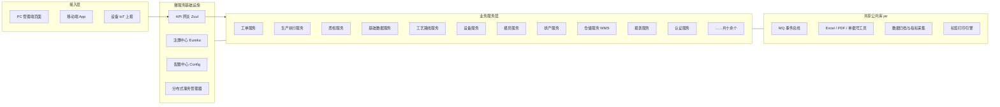
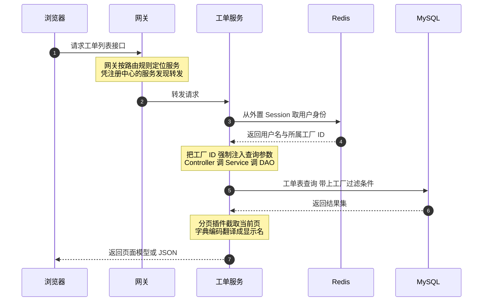

面试官问"介绍一下你最有代表性的项目"，很多人的第一反应是把技术栈从前往后背一遍："Spring Boot、Spring Cloud、MyBatis、Redis、RabbitMQ……"背完就冷场了。技术栈是名词，不是项目；面试官想听的是**这套系统在解决什么问题、被拆成了什么形状、难题是怎么解的**——而这恰恰是最难临时抱佛脚的部分。

所以我准备写一个"MES+WMS 面试备战"系列，把我手里这套跑了多年的制造执行系统（MES）加仓储管理系统（WMS）当成标本，由上至下拆架构、由下至上拆机制，翻来覆去把它讲透：每个模块为什么存在、每个技术选型解决了什么痛点、每个机制点背后埋着哪些面试考点。系列里大部分篇目会配真实的踩坑复盘，本文是第一篇——**全景篇**，目标是让读者不接触任何一行代码，也能在十分钟内回答"这套系统在做什么、长什么样、一个请求怎么走完全程"。

即使你做的不是制造业系统也没关系：多服务拆分、多租户隔离、状态机、异步事件、跨库数据一致性，这些问题的形状在任何行业的后端系统里都是一样的。本文做了脱敏处理，公司、客户、内网地址均不涉及。

<!-- more -->

## 一、业务背景：这套系统在工厂里管什么

先补一块制造业常识，这是后面所有讨论的地基。一家做离散制造（比如注塑加工）的工厂，通常挂着三套系统，各管一段：

| 系统 | 一句话职责 | 典型问题 |
|---|---|---|
| ERP | 管钱和单：订单、采购、财务 | "这批货卖给了谁、赚了多少钱" |
| **MES** | 管造：生产执行过程 | "这批货造到哪一步了、良率多少、谁干的" |
| **WMS** | 管仓：库存与出入库 | "这箱原料在哪、还剩多少、扣谁的账" |

ERP 下发订单之后，中间"怎么把订单变成成品"的整个黑盒过程就是 MES 的地盘。以一个注塑工单为例，它在系统里的完整生命周期是：

```text
ERP 同步订单 → 生成工单 → APS 排产（算出哪台机、哪个模、几点开工）
  → 工单下发 → 首检合格后开工 → 工人报工（产量/不良自动累计）
  → 过程中巡检/尾检 → 报工触发倒冲扣料（按 BOM 反算扣减原料库存）
  → 完工入库 → 销售出库 → 工单关闭
```

这套流程里有几个天然的技术难点，后面整个架构都是为了伺候它们而生的：

- **流程是状态机**：工单从下发到关闭有十几种状态，每种状态下的合法操作、拦截规则都不同（比如没过首检不允许开工）；
- **数据强一致**：报工一次，产量表、质检表、库存表要同时动，跨了 MES 和 WMS 两个库；
- **多工厂共存**：一套部署服务集团下多个工厂，数据必须按工厂隔离，互不可见；
- **现场环境复杂**：设备 IoT 上报、扫码枪、移动端 App、PC 大屏并存，读写模式差异极大。

## 二、系统全景：二十来个服务是怎么分家的

这是一套 Spring Boot 2.x + Spring Cloud（Greenwich）的 Maven 多模块工程，最终打包出**二十来个可独立部署的 fat jar**。按职责分四层：



拆分遵循的是**按业务域垂直切**的原则：一个业务域一个服务，每个服务自带 Controller、Service、DAO、Mapper 和自己的页面模板，跨服务通信只走两条路——同步走 Feign（服务发现靠 Eureka），异步走 RabbitMQ 事件总线。基础设施四件套（网关、注册中心、配置中心、事务管理器）与业务服务完全解耦。

有三个拆分细节值得在面试里展开：

**第一，拆分粒度是"业务域"而不是"技术层"。** 一个工单的增删改查、状态流转、ERP 回写全在工单服务里闭环，不会出现"所有 Service 一个服务、所有 DAO 一个服务"的反模式。好处是改一个业务需求只发布一个服务；代价是跨域查询变贵了——这一点第四节的"禁止跨库 join"会再讲。

**第二，框架代码在私服 jar 里，业务仓库里只有业务。** Controller 的基类、Service 基类、分页与结果封装、页面渲染引擎，全部封装在自研框架 jar 里由私服统一分发。业务服务 extends 基类就能获得会话管理、多租户注入、页面渲染等能力。这是典型的"平台 + 应用"模式，也是我后面讲自研框架那篇的伏笔。

**第三，MES 和 WMS 是两个服务、两个库，但业务上互相咬合。** 仓储服务有独立的数据源（多数据源路由切换），库存、出入库、库内账务全归它管；但它不给别的服务开库权限——MES 想要库存数据必须走 Feign 接口。报工触发扣料这种横跨两边的事，靠接口调用 + 分布式事务管理器兜底。**系统边界画在数据所有权上，而不是画在功能清单上**，这是我在这套系统里学到的最有价值的一条架构经验。

## 三、技术栈盘点：面试时怎么一句话讲清

把技术栈背一遍不值钱，值钱的是"为什么用它"。按层整理如下，每项附一句面试话术：

| 层 | 选型 | 面试话术（为什么是它） |
|---|---|---|
| 基座 | Spring Boot 2.x，内嵌 Tomcat | 纯 jar 部署，二十来个服务统一启动脚本，没有 war 和外置 Tomcat 的历史包袱 |
| 微服务 | Spring Cloud Greenwich：Eureka + Zuul + OpenFeign + Config | Netflix 全家桶一代，版本老但机制标准；网关统一收口做鉴权和路由 |
| ORM | MyBatis + XML Mapper，PageHelper 分页 | 制造业报表 SQL 复杂（多表、union 派生表），XML 手写 SQL 比 JPA 可控得多 |
| 存储 | MySQL，Druid 连接池 | 主库管 MES 业务数据，WMS 独立库；行级多租户不加中间件成本 |
| 会话 | Redis + Spring Session | 服务水平扩容后 session 必须外置；多工厂身份也挂在 session 里全链路传递 |
| 消息 | RabbitMQ | 事件总线 + 预警通知，削峰填谷解耦业务服务和通知/归档类旁路逻辑 |
| 分布式事务 | tx-lcn | 跨 MES/WMS 两库的强一致场景兜底，详见本系列后续篇目 |
| 前端 | JSP + EasyUI（服务端渲染） | 页面由后端 Layout XML 元数据驱动渲染，这套"半低代码"机制是独立的深挖点 |
| 文档/导出 | Apache POI + EasyExcel | 大数据量导出走流式 + MQ + 下载中心，是单独一篇事故复盘的主角 |

一个诚实但加分的讲法：**这套技术栈不新，但每一项都踩过真实的坑**。MySQL 5.x 时代驱动、Spring Cloud Netflix 停更、JSP 老旧——面试时主动指出"我清楚它的技术债在哪、如果重来会怎么选"，比掩盖问题更能体现架构判断力。

## 四、一个请求的完整旅程

架构图是静态的，面试官更爱问"一次请求到底怎么走"。以"工单列表查询"为例，从浏览器到数据库的完整链路：



这条链路里藏着三个面试高频考点，也是我后续篇章的主干：

**考点一：会话外置与身份传递。** 用户登录后，身份和所属工厂 ID 存进 Redis 托管的 Session，二十来个服务共享同一份会话——这就是为什么任何一个服务重启都不掉登录态。Controller 层从 session 取出工厂 ID，作为查询参数往下传。

**考点二：行级多租户。** 系统服务集团下多个工厂，但**没有**为每个工厂建独立库、独立 schema，而是所有业务主表统一带工厂字段 + 逻辑删除标记，查询时强制拼上 `工厂 = 当前用户工厂`。平台级账号没有归属工厂，页面会按账号类型条件渲染出"选择工厂"的列，普通账号则由后端强制注入本厂条件——**隔离逻辑收口在后端，前端只做展示差异**。这是成本最低的多租户方案，代价是每条 SQL 都要记得带过滤条件，遗漏就是事故（本系列有专篇讲它）。

**考点三：框架分层约定。** 一个典型业务查询穿过五层：页面布局由 XML 元数据声明（datagrid 有哪些列、字典翻译到哪个编码），Controller 继承框架基类负责渲染页面模型和取会话参数，Service 继承基类负责业务规则、分页与统一的结果封装，DAO 是接口由 MyBatis 扫描绑定，SQL 全部落在 XML Mapper 里。规矩定死之后，任何一个新模块长得都一样——**团队协作的可预期性，比单点代码优雅值钱**。

## 五、本系列要翻来覆去讲的机制点

全景篇只点名不展开，每个点都是后续一篇（或几篇）的钩子：

1. **工单状态机**：几十个工单状态、每种状态独立子模块的策略模式实现，"没过首检不许开工"这类拦截规则如何收口——**设计模式 + 业务建模**考点。
2. **MQ 事件总线**：事件号用"模块编号左移 16 位再拼事件号"做位编码，Handler 在构造函数里自注册进容器，新增一种通知不改分发逻辑——**位运算 + 扩展性设计**考点。
3. **跨库纪律**：MES 与 WMS 两个库，架构上明文禁止跨库 join，报表要库存数据必须 Feign 调用加降级容错；多数据源靠注解路由切换——**微服务数据一致性**考点，本系列的重头戏。
4. **倒冲扣料**：报工一次自动按 BOM 反算扣减库存，双写场景出过 MVCC 快照读盲区的经典事故——**并发 + 唯一索引兜底**考点。
5. **大数据量导出**：同步导出超时事故改造为 EasyExcel 流式 + MQ + WebSocket 推送 + 下载中心兜底——**异步化设计**考点。
6. **自研框架与页面引擎**：Layout XML 元数据驱动渲染、模型 XML 注册的低代码 CRUD、Java Agent 实现模型热重载——**反射、类加载与元编程**考点。

## 六、系列规划与已有存货

系列按五章推进，总规模二十五篇（顺序可能随写作调整），素材覆盖同一底座的多客户交付与端侧工具链：

**第一章·主线机制（11 篇）**：由上至下拆一个制造执行系统

1. **全景篇（本篇）**：业务、架构、技术栈、请求旅程
2. 登录会话篇：Session 共享、双轨认证与多工厂行级隔离
3. 框架篇：自研页面引擎、Moc 元数据、反射与热重载
4. 状态机篇：配置驱动的工单流转与生产流程拦截
5. 总线篇：自建 MQ 事件总线（位编码、自注册、广播）
6. 库存篇：账实一致的组合拳（三维状态、原语收敛、三段式簿记）
7. 规范篇：数据库地基（标准字段、软删除、字典三表、索引范式）
8. 任务篇：数据库驱动的 Quartz、双加载路径与排查清单
9. 物联篇：多协议接入与 Redis 设备状态机
10. 排产篇：约束求解器与甘特图（OptaPlanner 链式建模）
11. 边界篇：MES 与 WMS 的跨库纪律与倒冲扣料

**第二章·数据与事故（穿插）**：踩坑实录按"机制+考点"织进对应篇目，不单独成册。

**第三章·多客户交付线（6 篇）**

12. 交付篇：一个底座的三种形态——私有化分支、SaaS 云、工控终端
13. 四种 ERP 适配层：用友边缘引擎、金蝶、SAP、旧系统并行
14. 老栈嫁接 AI：智能体组件与开放平台
15. 放弃 OptaPlanner 的场景：多工序排产的 Slack+关键路径自研引擎
16. 工控终端上墙：WPF 壳、PLC 直控与防呆联锁
17. 电子看板形态史：可配置看板、3D、移动 APK

**第四章·端侧与工具链线（5 篇）**

18. X5 WebView 壳与 JSBridge：给 MES H5 装原生能力
19. HarmonyOS NEXT 从 0 到 1：车间 App 的鸿蒙移植
20. PowerShell 开发引擎：二十个微服务一条命令与 Windows 工程的坑
21. 给自研框架写 IDEA 插件：PSI、i18n 折叠与引用导航
22. 插件性能事故与代码生成器：foldingBuilder 与 Full GC 的复盘

**第五章·收官（3 篇）**

23. 盘点篇：全系列考点索引与项目经历地图
24. 话术篇：项目介绍的 3 分钟版与 30 秒版
25. 终局篇：高频问题清单、追问树、反问环节

库存方向已经有一篇可以当本系列的先行读物——讲的就是报工倒冲扣料双写引发的 MVCC 事故；导出改造和模型热重载也已有成文，都列在下面：

- （对应第 5 点）
- （对应第 5 点）
- （对应第 6 点）
- （对应第 3 点的事故面）

## 小结

- **讲项目先讲业务闭环，再讲架构形状**：ERP 管单、MES 管造、WMS 管仓，工单生命周期是串起一切的线；
- **拆分粒度是业务域，边界画在数据所有权上**：MES/WMS 两库互不开权限，跨库只走 Feign；
- **技术栈不值钱，选型理由和踩过的坑才值钱**：老栈不丢人，讲不清为什么用它才丢人；
- **一次请求的旅程要能脱口而出**：网关路由、Redis Session、工厂隔离注入、五层框架分层；
- **多租户用行级隔离，隔离逻辑收口在后端**：前端只做展示差异，任何 SQL 都不许漏工厂条件。

下一篇进入机制拆解：登录、会话与多工厂隔离——见那之后，一个"工厂"是怎么贯穿二十来个服务的。
