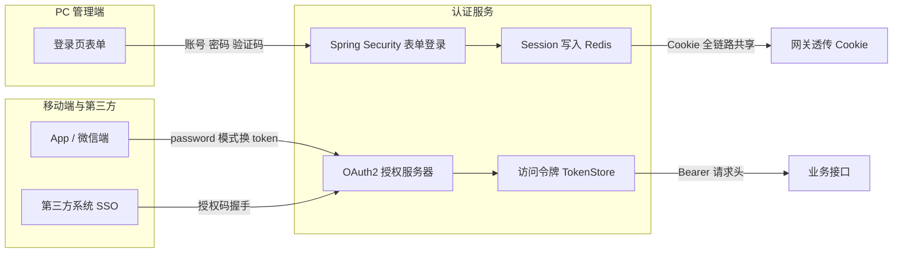
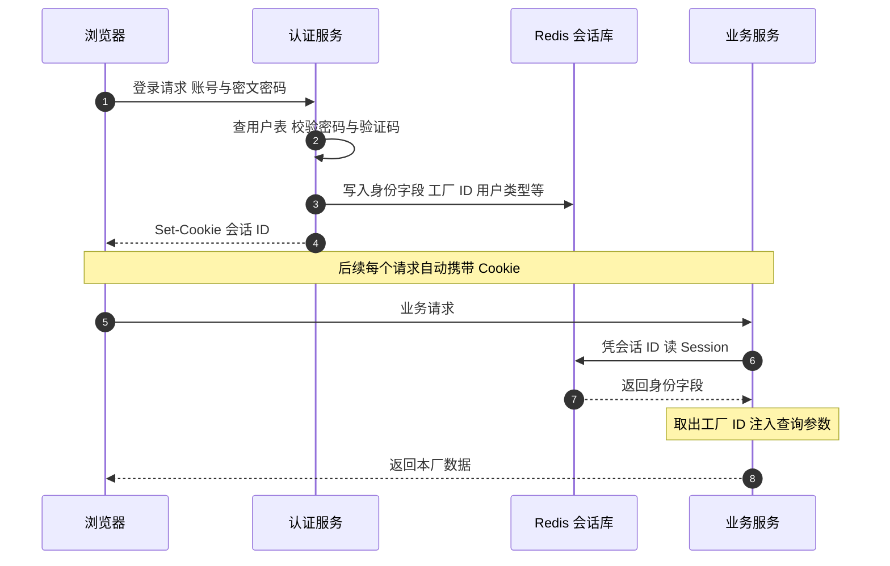

上一篇末尾留了个钩子：一个"工厂"是怎么贯穿二十来个服务的。本篇就把它拆开——这套系统的登录态靠什么在二十来个微服务之间共享而不丢，多工厂隔离的数据是怎么从登录那一刻开始，一路走到每一条 SQL 里的。

这两个话题在面试里的出镜率高得离谱："你们集群下 session 怎么共享？""session 和 JWT 怎么选？""多租户有几种方案，你们为什么这么选？"——都是表面背过、一追问就露馅的问题。本篇的讲法是：先讲这套系统的真实做法，再在每个环节停下来，把面试官最爱追问的那一刀提前拆掉。文末照例有面试视角 Q&A。

<!-- more -->

## 一、先立骨架：双轨认证，但不是你想的那种"双"

这套系统的认证初看很唬人：Spring Security 表单登录、OAuth2 授权服务器、SSO 单点登录、Redis TokenStore，名词一个不少。但把骨架理清楚，其实是一句话——**Web 端靠 Session Cookie 走天下，OAuth2 只给移动端和第三方换票**：



登录 POST 由 Spring Security 标准过滤器链接走：认证服务渲染的登录页提交账号、密文密码和验证码，框架的 `UserDetailService` 查用户表、解密库里存的密文密码做比对，成功后由一个统一的成功处理器往 Session 里塞进一整套身份字段——用户编码、用户名、用户 ID、**所属工厂 ID**、用户类型、语言环境、登录 IP 等十来个字段。这套字段就是后续所有请求的"身份证"。

OAuth2 那一轨不是摆设，但它的服务对象不同：注册了 Web、App、微信三个客户端，password 模式给移动端换 access token，token 存 Redis。所以面试官问"你们是 session 还是 token"，诚实的回答是：**两条轨都在，但 Web 端二十来个服务的日常请求，靠的是 Session**——这个"为什么"留到第三节 Q&A 拆。

密码这块有个值得单独讲的细节：**加密传输和存储加密是两回事，这套系统两样都做了，但用了不同的算法**。前端提交前先用对称加密把明文密码包一层（防止抓包拿明文），服务端解开后——Web 端走 BCrypt 与库中值比对；移动端则直接把提交值加密成密文与库中密文做字符串比对。双轨的成因很朴素：库里的密码是历史密文，Web 端接入 BCrypt 时没有强制全员重置密码的条件，只能在比对环节做兼容。面试里如果被问到"你们的密码怎么存的"，能把"传输加密、存储加密、历史兼容"三层分开讲，比背一个"BCrypt 加盐"要立体得多。

顺带一个安全审计视角的真实发现：早期版本的图形验证码，后端生成后把**明文答案 JSON 返回给前端**，让前端 canvas 自己画——验证码形同虚设，写个脚本先读响应就能绕过。合理的做法是后端画图返回图片、答案只留 Session。这个例子我在面试里讲过，用来回答"你发现过哪些安全问题"——**能指出自己系统的缺陷并说出修法，比宣称系统无懈可击可信十倍**。

## 二、会话外置：Spring Session + Redis 的标准姿势与三个细节

单体时代 Session 放在 Tomcat 里天经地义；拆成二十来个服务之后，登录在认证服务完成，请求却可能落到任何一个业务服务——Session 必须搬到一个所有服务都能读到的地方。这套系统选了 spring-session-data-redis，配置一行注解：

```java
@Configuration
@EnableRedisHttpSession(maxInactiveIntervalInSeconds = 86400,
        redisFlushMode = RedisFlushMode.IMMEDIATE)
public class RedisSessionConfig { }
```

一行配置背后有三个值得展开的细节，每一个都对应一次真实的追问。

**细节一：Session 和业务缓存分库。** 配置中心统一下发 `spring.redis.database=10`（业务缓存）和 `spring.redis.database.session=1`（会话）——同一个 Redis 实例，两个 db 各管各的。为什么不分成两个实例？因为量级不需要；为什么一定要分库？因为 Session 的 key 有自己的命名空间和过期节奏，和业务缓存的 key 混在一起，排查问题和按策略清理时都是灾难。**"分库不分实例"是中小规模下的务实解**，这句话在面试里比"我们用了 Redis 集群"值钱。

**细节二：Cookie 的透传是网关刻意配置出来的。** Zuul 网关默认会把 `Cookie` 列入敏感头剥掉（防止下游服务拿到不该拿的东西），这套系统的网关把敏感头配置显式置空——SESSION Cookie 才能一路透传到每个业务服务。这是一个非常典型的"配置决定架构行为"的案例：**会话共享的成立，一半靠 Spring Session，一半靠网关别把 Cookie 拦下来**。排查"登录态莫名丢失"时，网关的 sensitive-headers 是第一个该看的地方。

**细节三：默认 JDK 序列化与 Spring Session 的墓碑。** 没有显式配置序列化器时，Spring Session 用 JDK 序列化把 Session 属性写进 Redis 的 hash 结构（`spring:session:sessions:{id}` 下挂 `sessionAttr:xxx` 字段）。JDK 序列化的老问题是 notoriously 挑剔：Session 里存的对象，只要任何一个服务的类版本变了（加字段、改 serialVersionUID），反序列化就可能炸——**这也是 Session 里只放简单字段（字符串、数字）而不要放完整对象的原因**，这套系统实际存的就是十来个标量字段，算是无意中做对了。

完整的一次会话建立与使用时序如下：



## 三、factoryid 的环球旅行：行级多租户的完整链路

Session 解决了"你是谁"，多工厂隔离解决的是"你能看谁家的数据"。这套系统的多租户是**行级隔离**：不为工厂分库分 schema，所有业务主表统一带 `factoryid` 字段，查询强制过滤。一个 factoryid 从登录到 SQL 的完整旅程是这样的：

1. **登录写入**：登录成功处理器把用户的工厂 ID 塞进 Session（键名 `factoryId`）；
2. **请求取出**：业务 Controller 继承框架基类，用 `getSession(request, "factoryId")` 取出当前工厂；
3. **参数注入**：框架的参数装配方法把 factoryid 放进查询参数 Map——**但规则是"前端参数优先"**：只有前端没传 factoryid 时才注入 Session 值；
4. **SQL 过滤**：Mapper XML 里手写 `and factoryid = #{factoryid}`，多表 join 时连接条件也带 `on a.factoryid = b.factoryid`；
5. **索引伺候**：建表规范要求工厂字段进联合索引，典型如 `(factoryid, status, 时间列)`。

这条链路设计得很轻，也因此埋了三个真实的坑，每个坑都是一段面试素材。

**坑一：大小写错位。** Session 键是大写 I 的 `factoryId`，数据库列和前端参数是全小写的 `factoryid`——取键名写错大小写不会报错，只会取出 null，然后查询悄悄漏掉工厂条件，或者在插入时工厂字段落空。**无报错的取 null 是这类约定式框架最阴险的失败模式**，排查时看到"查不到数据"先查键名，别急着怀疑 SQL。

**坑二："前端参数优先"的双刃剑。** 框架兜底保证参数 Map 里 factoryid 永远存在（缺省放空串），于是"前端传了空串"会占住位置、挡掉 Session 注入——对一个没有工厂归属的平台账号来说，空串就是它的常态值。连锁反应是：写接口里 `Integer.parseInt("")` 直接抛 NumberFormatException，用户看到的不是设计好的校验提示，而是兜底的"请联系系统运维人员"。**一个默认值（空串）引发的连锁异常**，是我最喜欢在面试里讲的"简单东西出复杂事故"的样本——修法倒是朴素：先判空再取数，空串归零走显式校验。

**坑三：漏加条件就是事故。** 隔离完全靠人工纪律，每条 SQL 手写工厂条件，没有框架级兜底。一次代码巡检里，我们发现了若干处工厂注入调用被注释掉的现场——那些接口查询的是全厂混合数据。万幸都是低频接口没有酿成事故，但它证明了这类模式的本质缺陷：**隔离的正确性依赖每个开发者每次都记得，而"每次都记得"在工程上不成立**。

那为什么不做框架级自动注入（比如 MyBatis 拦截器统一拼条件）？这是面试官必追问的一刀，我的回答分三层：一是历史原因，几百个 Mapper 是十几年积累下来的，拦截器批量改写 SQL 的回归风险远大于收益；二是技术上也不完全可行——报表里大量 union 派生表、跨表 join，拦截器无法可靠判断每个子查询该不该加、加在哪个别名上；三是团队最后选择的补偿方案是**规范 + 巡检 + 联合索引**：建表规范强制工厂字段，代码巡检盯注入调用，索引保证条件加上之后不吃性能。如果重来，我会在项目早期就把拦截器兜底建起来，让手写条件变成双保险而不是唯一防线。

## 四、平台账号：没有工厂的"隐形人"怎么用系统

行级隔离有个逻辑上的死角：**运维和管理类的平台账号不属于任何工厂**，它们 Session 里根本没有 factoryId。系统给这类账号的解法是"用户类型"字段（usertype）驱动的全链路分流：

- **登录后门户分流**：门户页按用户类型跳不同首页，平台账号进管理门户，普通用户进工厂门户；
- **SQL 分支**：菜单权限查询按用户类型走不同分支——平台账号直接查全量菜单，普通用户走"用户-角色-菜单"三表关联过滤。同一个 Mapper 里的两个 `<if>` 分支，是"权限模型为特殊身份开小灶"的活标本；
- **页面条件渲染**：页面布局 XML 支持按用户类型条件渲染列——"所属工厂"下拉只有平台账号能看到，普通账号后端强制注入本厂条件，前端根本不给选择的机会。**隔离逻辑收口在后端，前端只做展示差异**，这条原则在全景篇说过，这里是它的具体实现；
- **交互守卫**：平台账号进工厂功能页时必须先选一个工厂，前端入口挡住未选厂状态——因为后端 Session 注入对它失效，空着查数只会得到空结果或异常。

usertype 的取值语义也值得一提：1 是平台超级账号（跨厂），2 是生产中心普通用户，4 是代理商——**用整数枚举而不是独立表**，好处是 Session 里一个字段就能全链路判断，代价是语义只活在人的脑子里，新维护者得靠文档和口口相传。这是典型的"小系统够用、大系统还债"的设计，面试聊到权限模型时可以主动指出它的适用边界。

## 五、会话治理：登录之后的漫长余生

Session 建立之后的治理问题，很多教程不讲，但这套系统个个都踩过，而且都是面试好料：

**异地登录踢下线。** 同账号在别处登录时，新会话的建立会触发对旧会话的通知——通过 WebSocket 给旧在线端的页面推"当前用户在异地登录"，前端收到后强制登出。实现上没有用 Spring Security 自带的并发会话控制，而是登录成功处理器里手工做的，因为要带着自定义的提示文案和推送行为。**并发会话控制是"为什么我们没用框架自带的"比"我们做了"更有讲头**的典型话题。

**管理端踢人绕开墓碑 key。** 后台管理的"在线用户"页面可以直接注销某个会话。最早的实现是直接删 Redis 里的 Session key，后来发现删不干净——Spring Session 在 Session 过期时会留下一条过期标记（业界俗称"墓碑"），用于可靠地触发 session 销毁事件；直接 DEL 主 key，标记残留，在线状态就对不上。修复方案是把该 Session 的 TTL 设成 3 秒，让 Spring Session 自己走完过期流程。**不熟悉组件内部机制就硬删数据，会留下看不见的尾巴**——这个细节我从面试官那里收获过两次追问，两次都聊得很投机。

**在线人数靠对账表。** 网关和各业务服务都无法直接回答"现在有多少人在线"（Session 散在 Redis 里，且过期时间不一），于是有一个监听器定期把 Redis 里的会话属性抄录进一张在线登录记录表，运营和管理报表都从这张表取数。这是分布式会话的典型衍生成本：**数据一旦外置，"看一眼"就变成了"做一次对账"**。

**双轨超时的错位。** Session 在 Redis 里躺 24 小时，前端还有一套自己的心跳超时（页面无操作若干分钟自动回登录页）——两套超时各自为政，用户偶尔会遇到"页面说超时了但接口还能调通"的窗口期。理想的收口是前端心跳以 Session TTL 为准联动刷新，这也是我复盘时记下的待办之一。

另外还有一段 SSO 场景下的 Cookie 兼容史：跨域单点登录时手工 Set-Cookie，跟 SameSite 属性、Secure 标记和各浏览器 UA 差异搏斗——Cookie 这门"上古技术"在跨域场景下的坑，2020 年代依然原样存在。篇幅所限不展开，面试聊到单点登录时这是个好弹药库。

## 六、面试视角：一个问题串起一串考点

**Q1：你们微服务集群下登录态怎么共享的？为什么不用 JWT？**

答：Spring Session + Redis，所有服务共享同一份会话，网关显式放行 Cookie。不用 JWT 的原因有三个：我们的会话需要**可注销、可踢人、可改属性**——行级多租户要求切换工厂时立刻改 Session 里的 factoryid，JWT 无状态做不到即时失效，除非引入黑名单，而黑名单本身就等于状态存储，那不如直接用 Session；二是身份字段里有十来个标量，放 JWT 里 token 膨胀且暴露信息；三是全套服务都在同一个机房一个 Redis 前面，没有跨域多端一致性诉求，Session 的运维成本更低。JWT 的主场是开放 API 和跨组织调用，我们内部管理系统的形态不匹配。

**Q2：多租户有哪几种方案？你们为什么选行级隔离？**

答：三种主流方案：独立数据库（隔离最强、成本最高）、独立 Schema（中等）、共享表加租户字段（行级，成本最低）。我们服务的是集团内十来个工厂，数量级在几十以内、增长可控，独立库的成本不划算；而 MES 的业务表几十上百张、报表跨表 join 频繁，独立 Schema 会让跨租户运营查询变成灾难。行级隔离一条 `factoryid` 解决，代价是隔离正确性靠人工纪律，我们用建表规范、代码巡检和联合索引来补偿。**选型不是选最好的，是选跟租户数量、表数量、团队纪律相匹配的**。

**Q3：Spring Session 的实现原理是什么？**

答：核心是一个 Servlet 容器标准的 Filter（SessionRepositoryFilter），它把传进来的 request 包一层，`getSession()` 返回的不再是容器的 Session，而是背后由 Redis 支撑的实现——读时按 Cookie 里的会话 ID 从 Redis 加载，写时 IMMEDIATE 或懒同步回 Redis。因为包装的是标准 HttpSession 接口，业务代码零改动就能获得分布式会话。面试时能说出"装饰器模式 + Filter 替换"这两个词，基本就过了。

**Q4：行级隔离靠 SQL 手写条件，怎么防止漏加导致跨厂数据泄露？**

答：我们真实踩过这个坑（巡检发现被注释掉的注入调用）。我的方案分三层：框架层，MyBatis 拦截器对标记了租户字段的表自动拼条件，让手写条件变成双保险；测试层，用两个工厂的账号跑一遍核心接口断言互不可见，把隔离做成回归用例；审计层，定期扫描 Mapper XML，找出既没有工厂条件也没有显式豁免注解的查询。我们项目因为历史包袱只做到了后两层，但这是我复盘后最想推回去的一层。

**Q5：验证码怎么做才安全？你们踩过什么坑？**

答：核心原则是答案永不离开服务端——后端画图返回图片流，明文或哈希只存 Session，校验后立刻失效。我们早期版本把明文答案 JSON 返回给前端自己画图，等于把钥匙挂在锁上，脚本一读就能绕过。修法就是服务端出图，另外配合失败次数阈值——错误几次后强制验证码或锁定。

## 小结

- **双轨认证不丢人，讲清楚每条轨服务谁才加分**：Web 靠 Session Cookie，OAuth2 给移动端和第三方换票，别把名词当架构；
- **会话共享一半靠 Spring Session，一半靠网关放行 Cookie**：配置决定架构行为，排查登录态丢失先看网关 sensitive-headers；
- **Session 里只放简单字段**：JDK 序列化对类版本敏感，十来个标量是最稳的形态；
- **行级多租户的链路要能一口气讲完**：登录写入 → Session 取出 → 参数注入（前端优先）→ SQL 过滤 → 联合索引；
- **人工纪律不构成防线**：漏加工厂条件的坑证明隔离必须框架兜底，"如果重来"的三层方案是面试的加分收尾；
- **会话治理比会话共享更见功力**：踢下线、墓碑 key、在线对账、双轨超时，每一个都是真实工程的肌理。

下一篇预告：自研框架分层与页面引擎——Controller 基类、Layout XML 元数据渲染、Moc 模型注册，这套"半低代码"机制如何让几十个业务模块长得一模一样，以及它在面试里对应的反射与元编程考点。
