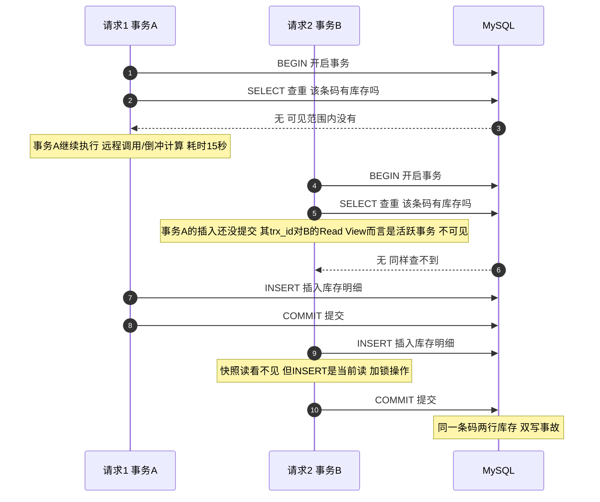
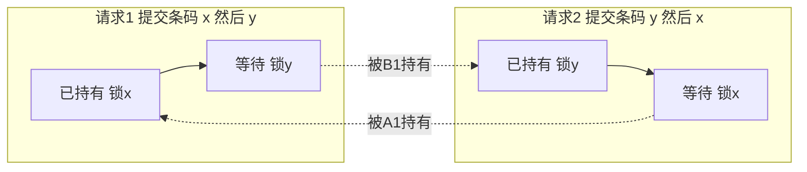

制造系统里有个经典场景：工人手持终端扫一个箱码，点「生产入库」。那天接口卡了二十多秒，工人以为没点上，又点了一次——两次请求都成功返回，库里多了一模一样的两套库存：库存明细、状态表、入库记录、操作流水，四张表整整齐齐各两行。

代码里明明有查重校验（"当前条码已入库，不可重复入库"），为什么两次都没拦住？这篇文章完整复盘根因链：**类级注解把整个入库方法包成一个大事务 → 事务内 MVCC 快照读对并发未提交的插入天然失明 → check-then-act 查重形同虚设 → 生产库唯一索引恰好是普通索引，最后一道兜底也不存在**。以及修复方案里一个容易被一笔带过的细节：多条码批量提交时，为什么要**按条码排序后依次获取锁**才不会死锁。最后附上面试视角的问答拆解——这个问题几乎覆盖了 MVCC、锁、事务、隔离级别的全部高频考点。

<!-- more -->

## 一、先看证据：两次请求真的重叠了

接口访问日志表里躺着关键证据（时间取自注解切面记录）：

| 请求 | 进入时间 | 耗时 | 结果 |
|---|---|---|---|
| 请求1 | 10:10:25 | 15.7s | 成功 |
| 请求2 | 10:10:40 | 1.2s | 成功 |

请求1 在 10:10:40.7 才结束，请求2 在 10:10:40.0 已经进来——**两者重叠约 0.7 秒**。这 0.7 秒就是竞态窗口。

为什么会重叠这么久？入库是个大事务：插入库存明细之前，事务内还要调一次跨服务的质检通知（Feign）、算倒冲料，接口慢的时候事务被拖到十几秒。而查重校验就发生在这个漫长事务的开头。

## 二、根因第一层：一个注解，一个大事务

入库服务类上标了 `@DSTransactional`（baomidou dynamic-datasource 提供的多数据源事务注解），它作用在**类**级别——意味着这个类每个 public 方法从进入到底层 return，就是一个完整事务，中间的远程调用、消息发布全部被包在里面。

这就有了经典的事务边界问题：**查重 SELECT 和插入 INSERT 在同一个事务里，而事务的隔离级别是 MySQL 默认的 REPEATABLE READ**。要理解为什么这让查重失效，得先讲清楚 MVCC。

## 三、根因第二层：MVCC 快照读为什么"看不见"并发插入

### 3.1 MVCC 的基本原理

MySQL InnoDB 的 MVCC（多版本并发控制）核心思路：**读不加锁，读写互不阻塞**。实现上靠三样东西：

1. **行隐藏列**：每行数据带 `trx_id`（最后修改它的事务 id）和 `roll_pointer`（指向 undo log 里的上一个版本）；
2. **undo log 版本链**：一行被改过多次，就在 undo log 里串成一条版本链，`roll_pointer` 一路指下去；
3. **Read View（一致性视图）**：事务做**快照读**（普通 SELECT）时生成的一份"事务可见性快照"，包含生成那一刻系统中**活跃（未提交）事务集合**。

判断某个版本对当前事务是否可见的规则（简化版）：沿着版本链从新到旧找第一个满足以下条件的版本——

- 该版本的 `trx_id` 等于自己 → 可见（自己改的）
- 该版本的 `trx_id` 早于快照中最老的事务 → 可见（快照前早已提交）
- 该版本的 `trx_id` 在快照生成时还活跃、或晚于快照 → 不可见，顺 `roll_pointer` 找上一版

### 3.2 关键细节：快照在**第一次读**时建立

REPEATABLE READ 下，Read View 不是 `BEGIN` 时建的，而是**事务内第一条快照读语句执行时**建立，之后整个事务复用这一份。这是整个事故的命门：



两次查重都返回"无库存"，都放行插入。**不是校验逻辑写错了，是校验所处的读语义根本看不到对方的写入**。这就是 check-then-act 在事务内的经典失效：检查（快照读）和行动（INSERT 当前读）用的是两套可见性规则。

### 3.3 为什么开发环境一开始"复现失败"

本地写了个双线程 `threading.Barrier` 对齐、同时打同一接口的复现脚本，结果第二个请求被拒了，报"系统入库繁忙"。一度以为复现失败——顺着这个报错往下挖，反而挖出了完整真相：

第二个请求确实冲过了**所有应用层校验**（日志异常栈显示它一路跑到 INSERT 语句），是被数据库的**唯一索引**拦下的。它的 INSERT 撞上第一个事务的行锁，阻塞等待；第一个事务提交后，唯一键冲突判定成立，`Duplicate entry` 异常抛出，整个事务回滚——所以开发环境没有双写。

**而生产环境之所以双写，正是因为同一个索引在生产库是普通索引**（DDL 漂移）。普通索引不做唯一性检查，第二个 INSERT 顺利落库。

这一段是整个复盘里最值得记的教训：**复现"失败"本身也是证据**。开发库恰好存在的唯一索引掩盖了应用层防线的缺失，让"没双写"变成一种运气而不是设计。

## 四、修复：Controller 层逐条码编程式分布式锁

### 4.1 锁放哪一层——事务内还是事务外

自研锁组件底层是 Redisson：`tryLock` 快速失败不等待、看门狗自动续期防止业务没跑完锁先过期。项目里已有注解式用法，但这个场景要用**编程式**，原因后面讲。第一个设计问题是锁的位置：

- **放 Service 方法上（注解式）不行**：`@DSTransactional` 的拦截器包在 Service 方法外层，进到方法体时事务已经开启。锁在事务内获取，等锁的时候快照可能已经建立，且别的请求拿到的锁窗口和事务边界错位。
- **放 Controller 层（编程式）**：先抢锁 → 再进 Service（事务开启）→ Service 返回即事务已提交 → finally 释放锁。**锁的持有期完整覆盖事务生命周期，前后都没有缝隙**。

```java
// Controller 层，伪化脱敏后的骨架
List<String> lockKeys = new ArrayList<>();
try {
    // 提取本次提交的所有条码，TreeSet 排序去重
    Set<String> qrcodeSet = new TreeSet<>(collectQrcodes(params));
    for (String qrcode : qrcodeSet) {
        String lockKey = sha256Hex(factoryId + "-" + qrcode);
        if (!lockService.tryLock(lockKey)) {
            releaseAll(lockKeys);            // 回滚已获取的锁
            return error("系统入库繁忙，请稍后重试");  // 毫秒级拒绝
        }
        lockKeys.add(lockKey);
    }
    return stockInService.submit(params);    // 事务在这里面开启并提交
} finally {
    releaseAll(lockKeys);                    // 事务已提交，此时释放才安全
}
```

修复后的并发测试：两个请求同时打进来，拿到锁的那个正常入库（约 2.5 秒），另一个 **0.5 秒即被拒**——对比修复前靠索引兜底时要阻塞 3 秒等对方提交再报错，体验和语义都正确了。

### 4.2 重点：为什么必须"按条码排序后获取"

一次提交可能扫了**多个箱码**（批量入库），要对每个条码各拿一把锁。假设不排序，按请求里条码出现的自然顺序获取，会发生什么：



请求1 持有锁x 等锁y，请求2 持有锁y 等锁x——**等待关系成环，经典锁顺序死锁**，和转账场景里"两边都以相反顺序锁两个账户"是同一个问题。两个请求谁也不释放，谁也拿不齐，直到看门狗续期把它们一起吊死。

解法就是给所有锁定一个**全局一致的获取顺序**：把条码放进 `TreeSet` 排序去重，每个并发请求都按同一顺序（比如字典序）依次获取。任意两个请求的等待关系方向一致，**等待图是有向无环图，不可能成环**，死锁从数学上被排除。任一条码获取失败，立刻释放已持有的锁并快速返回错误——不留半套锁在手里。

这也是分布式锁批量获取的通用范式：**要么排序，要么 tryLock 带超时并释放已得的锁**，两者选一（后者以重试换吞吐）。

## 五、复盘清单

这次事故的三道防线，恰好是防重问题的标准分层：

1. **前端防抖**（提交后按钮置灰直到返回）——挡住绝大多数双击，但挡不住网络重试和抓包重放，不能只靠它；
2. **应用层分布式锁**（本文方案）——语义正确、毫秒级拒绝、文案可控，是主防线；
3. **数据库唯一约束**——最后兜底，但要注意三个坑：复合唯一键里含请求相关字段时（不同请求字段值不同→哈希不同→约束失效）、可空列多 NULL 不触发唯一约束、以及最隐蔽的**开发/生产 DDL 漂移**——你以为有兜底，其实生产没有。

其他收获：

- **复现失败也是线索**：开发环境"没双写"不是因为防线在，是因为碰巧有索引兜底；顺着异常栈挖下去才看到防线全空；
- **错误信息溯源是捷径**：一个"系统入库繁忙"的文案，反查 i18n key、再反查引用点，直接定位到索引冲突路径；
- **修复要验证异常路径**：除了并发双发，还专门触发了一次服务端异常，确认 finally 在异常时也正确释放锁（否则锁泄漏比双写更难排查）。

## 六、面试视角：一个问题串起一堆考点

这道题非常适合在面试里讲：它不是背概念，而是一条完整的因果链。反过来，面试官也可以从任何一环切进去追问。

**Q1：MVCC 是怎么实现的？Read View 的可见性判断规则？**
答：行隐藏列（trx_id / roll_pointer）+ undo log 版本链 + Read View。Read View 记录生成时刻的活跃事务集合，沿版本链从新到旧找第一个"修改者已提交且早于快照"的版本。能讲出 m_ids / min_trx_id / max_trx_id / creator_trx_id 四个字段与判断流程是加分项。

**Q2：REPEATABLE READ 下快照什么时候建立？**
答：**第一条快照读语句执行时**，不是 BEGIN 时（除非 `START TRANSACTION WITH CONSISTENT SNAPSHOT`）。这个细节直接决定了本事故里"请求2 建快照时请求1 未提交→不可见"。很多人这里答错成"BEGIN 时建立"。

**Q3：快照读和当前读的区别？哪些语句是当前读？**
答：普通 SELECT 是快照读；`INSERT / UPDATE / DELETE / SELECT ... FOR UPDATE / LOCK IN SHARE MODE` 是当前读——读最新已提交版本并加锁。本例的精妙（也是坑）之处：查重是快照读、插入是当前读，**同一个事务里两套可见性规则**，检查通过不代表插入时会冲突检测。

**Q4：唯一索引为什么能兜底这种并发？**
答：第二个事务的 INSERT 是当前读，会在第一个事务的索引记录锁（及间隙锁）上阻塞等待；对方提交后唯一性检查失败抛 duplicate key，事务回滚。代价是**阻塞时长等于对方事务剩余时长**（本例十几秒），且报错对用户不友好——所以它适合当最后防线而不是主防线。

**Q5：分布式锁应该包住事务，还是事务包住锁？**
答：**锁包住事务**（先获取锁再开事务，提交后再释放）。反过来"事务内获取锁"有两个问题：等锁期间事务已开启、快照可能已建立（旧数据判定）；且锁释放若早于事务提交，别的请求拿到锁后依然看不到未提交数据，竞态窗口原样存在。追问点：锁超时与事务时长的关系——Redisson 看门狗续期解决"业务没跑完锁先丢"，但锁丢失后的互斥语义要靠 DB 约束兜底。

**Q6：批量获取多把锁怎么避免死锁？**
答：全局一致顺序（排序后依次获取）或 tryLock 超时 + 失败即释放全部已获锁。原理是等待图不成环。可以延伸到数据库侧：InnoDB 自己也有死锁检测（wait-for graph），`innodb_lock_wait_timeout` 与 `innodb_deadlock_detect` 的取舍。

**Q7：除了加锁还有什么方案？**
答：查重改成当前读（`SELECT ... FOR UPDATE`，缩小但依赖索引与事务边界）；数据库唯一约束兜底（需注意复合键设计）；幂等表/幂等键（提交带唯一请求号，落库时约束拦截）；前端防抖减少触发面。生产上一般是"锁 + 唯一约束"双保险，锁给体验、约束给确定性。

把这条链讲清楚，比背十道概念题更能体现工程功力——面试官想听的从来不是"我知道 MVCC"，而是"我知道它在我系统里什么时候会咬我"。

## 小结

- 事务内的 check-then-act 查重在 REPEATABLE READ 下对并发未提交写入失明，是**语义缺陷不是实现 bug**；
- 开发环境的唯一索引会掩盖应用层防线缺失，DDL 漂移让"有兜底"变成错觉；
- 分布式锁要**包住事务**：事务开启前获取、提交后释放；
- 批量多把锁必须**排序获取**防锁顺序死锁，失败即回滚已获锁；
- 防重三道防线：前端防抖、应用层锁、DB 唯一约束——层层递进，缺一不可，但主防线只有一道：语义正确的锁。
