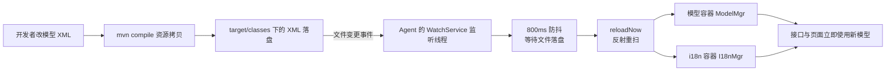
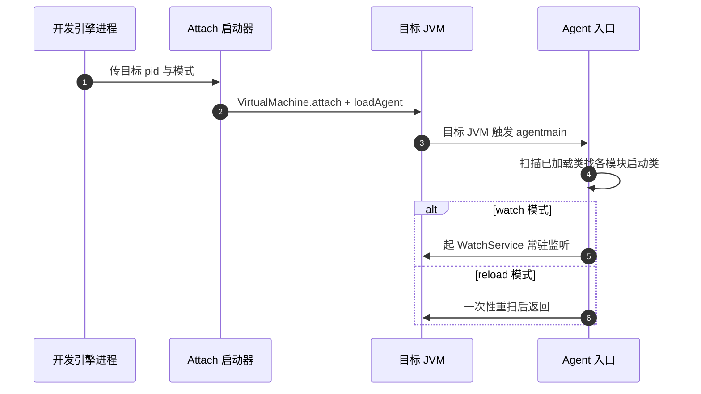

接手 MES 系统的第一周就被一个问题教育了：这套系统是**模型驱动**的——页面、接口、校验规则全部由各模块的模型 XML 声明，启动时统一注册进内存容器。改一行 XML 想看效果？重启整个后端，喝完一杯水回来还没好。而所谓"改模型"恰恰是日常开发里最高频的动作。

于是写了一个两三百行的 Java Agent：改完 XML、`mvn compile` 落盘，运行中的 JVM **两秒内自动重载新模型**，不用重启。这个项目体量很小，但把 Java Agent、Attach API、ClassLoader、NIO 文件监听这几块面试高频知识全部串了一遍。这篇文章拆解它的机制与原理，每部分附上对应的面试考点——这个小项目完全可以当 JVM 方向的自我介绍弹药库。

<!-- more -->

## 一、背景：模型驱动架构下，为什么改 XML 必须重启

MES 系统里大量业务是"声明式"的：每个模块用模型 XML 描述业务对象（字段、类型、校验、列表列、i18n 文案），启动时由各模块的启动类（下文统称 `Activatar`）把这些 XML 解析后注册进两个**静态容器**：

- **模型容器**（化名 `ModelMgr`）：所有业务对象的元数据，接口层、页面层都从这取定义；
- **i18n 资源容器**（化名 `I18nMgr`）：属性文件里的多语言文案。

这套架构带来运行期的灵活性，代价是开发期的笨重：XML 只在启动时被读一次，之后容器就"冻住"了。改模型 → 编译 → 重启 → 等所有模块初始化完 → 验证，一个循环轻松吃掉几分钟。而改模型恰恰是 MES 开发里最高频的操作。

问题本质很清晰：**启动期执行的那段"扫描注册"逻辑，能不能在运行期再跑一遍？** 只要 JVM 里还握着容器的引用和各模块启动类的引用，逻辑上完全可以——缺的只是一个"从外部进入 JVM"的通道。

## 二、总体设计



Agent 本体是一个独立的小 jar，不含任何业务类，通过两种方式进入目标 JVM：

- **启动注入**：`-javaagent` 参数随模块启动，触发 `premain`；
- **运行期注入**：本机的启动器进程通过 Attach API 把 agent 挂到运行中的 JVM，触发 `agentmain`。挂载时带 `watch` 参数就常驻监听，带 `reload` 参数就一次性重扫后退出——后者是文件监听失效时的手动兜底通道。

进入 JVM 后分两步走：先用 `Instrumentation` 扫出所有模块启动类，再为每个模块起 WatchService 盯住它 `target/classes` 下的模型目录和 i18n 目录。XML 或 properties 变更 → 防抖 → 等文件写完 → 反射重跑各启动类的注册逻辑（镜像启动期的调用序列）→ 容器焕然一新。

**一个关键的架构决策**：为什么不用 `Instrumentation.redefineClasses` 做字节码级热替换？因为它有硬限制——不能增删方法、不能改字段、不能改继承关系，而且我们要"热更"的其实不是 class 文件，而是**运行期的模型注册表数据**。真正要复用的资产是启动期那段初始化逻辑，直接反射重跑它，比改字节码简单一个数量级、可靠一个数量级。JRebel 走的是全量字节码热替换（商业级复杂度），Spring Boot DevTools 本质是快速重启，而"重跑初始化逻辑"是在两者之间的第三条路：**不动字节码，只重放业务初始化**。这个选型对比是面试里很好展开的一段。

## 三、挂载机制：premain 与 agentmain

Java Agent 有两个入口，本项目两个都用了，它们触发的时机和方式完全不同：

| | premain | agentmain |
|---|---|---|
| 进入方式 | `-javaagent:xxx.jar` 启动参数 | 运行期 Attach API 注入 |
| 触发时机 | main 方法之前 | JVM 运行中任意时刻 |
| 前提 | 必须在启动时决定 | 可对任何已运行的 JVM 补挂 |
| MANIFEST 声明 | `Premain-Class` | `Agent-Class` |

运行期注入的实现只有几行核心代码，但背后是完整的 Attach API 链路：

```java
VirtualMachine vm = VirtualMachine.attach(pid);
vm.loadAgent(agentJar, mode);   // mode = "watch" 或 "reload"
vm.detach();
```



一个容易被忽视的细节：agent 以 `reload` 模式 attach 时是**一次性**的（重扫完就返回），以 `watch` 模式 attach 才常驻。而且 agent 在目标 JVM 里只会加载一次，所以入口做了**幂等保护**——`volatile boolean started` 标记 + 重复进入直接跳过，保证 premain 已驻留后再 attach 不会起两套监听线程。

> **面试考点 1**：premain 和 agentmain 的区别？agentmain 靠什么机制进入目标 JVM？
> 答题要点：Attach API 的实现原理——每个 JVM 起来后内置一个 Attach Listener 线程，监听本机的 domain socket（Windows 上是命名管道）；attach 方进程通过同一套机制连上去，发送 load 指令，目标 JVM 就在自己的进程内加载 agent jar 并调用 agentmain。这也是 Arthas 能"无侵入连上任意 JVM"的原理。

## 四、动态发现：不配置模块清单，扫已加载类

Agent 怎么知道要盯哪些模块？最直觉的做法是写配置文件列出模块清单，但那样每加一个模块都要维护配置，而且 attach 到不同进程时清单也不一样。

实际做法是利用 `Instrumentation` 的能力**反向发现**：

```java
for (Class<?> c : inst.getAllLoadedClasses()) {
    if (c.getName().endsWith(".startup.Activatar")) { found.add(c); }
}
```

每个模块的启动类都有统一的命名约定 `*.startup.Activatar`，扫一遍已加载类就能拿到全部模块，零配置、天然幂等。这里还有个时序问题：**premain 执行时，应用类一个都还没加载**（它跑在 main 之前）。所以 agent 不能在 premain 里干活，而是起一个等待线程，每秒轮询一次"启动类出现了没有"，最多等 180 秒——等应用启动到位、模块类都加载完，才开始注册文件监听。等不到就打日志放弃，绝不影响应用本身。

> **面试考点 2**：`getAllLoadedClasses` 是怎么拿到的？Instrumentation 接口的底层是什么？
> 答题要点：Instrumentation 实例由 JVM 注入给 agent 入口方法，底层是 JVMTI（JVM Tool Interface）——JVM 暴露给 native agent 的能力面（类的枚举/重定义、堆遍历、断点等），java.lang.instrument 是它的 Java 封装。同族的 getAllLoadedClasses / redefineClasses / retransformClasses / appendToBootstrapClassLoaderSearch 各自的用途和限制值得展开。

## 五、文件监听：WatchService 的正确打开方式

监听用的是 NIO 的 `WatchService`，几个工程细节决定了它"能不能用稳"：

**1. 递归注册 + 新目录动态纳入。** WatchService 只监听注册过的目录本身，不递归。模型和 i18n 目录下有多层子目录，所以注册时 `Files.walk` 把所有子目录全部注册；同时处理 `ENTRY_CREATE` 事件时判断"新出现的是不是目录"，是就把新目录也注册进去——覆盖掉运行中新增的层级。

**2. 事件类型要收窄。** 只关心文件名以 `.xml` / `.properties` 结尾的变更，其他事件（比如临时文件、编辑器备份文件）直接忽略。每次保存 IDE 或 Maven 会产生一串事件，一条条对应处理毫无意义。

**3. 防抖：800ms 时间窗。** 一次保存往往触发 modify + create 等多个事件、一次 Maven 资源拷贝更是连删带建一串。做法是记录上次重扫时间戳，距上次不足 800ms 的整批事件合并为一次重扫。防抖是处理文件系统事件风暴的标准姿势。

**4. 最隐蔽的坑：Maven 拷贝资源是"先删后建"。** 事件到达时，被改的文件可能正处于"已被删除、新文件还没写完"的中间态。如果这时立刻去枚举目录重扫，**刚改的那个文件会缺席本次加载**——表现为"改了但不生效，改第二次才生效"，极具迷惑性。解法是就绪检测：轮询等待所有事件涉及的文件重新存在且可读（上限约 1.5 秒，50ms 步进），文件齐了再补 100ms 稳定期，然后才重扫。这是本项目里最值得讲的工程细节：**不是盲等固定时长，而是以"文件就绪"为条件的短步重试**，既不漏加载，也不在快速构建上白等。

**5. 两个必须处理的边界。** `OVERFLOW` 事件（OS 事件队列溢出，JDK 明确不保证事件完整送达）——本项目选择直接跳过该事件，靠下一轮真实事件兜底；`key.reset()` 返回 false（监听目录失效，比如整个目录被删）——监听线程退出而不是空转。另外 WatchService 的 `take()` 是阻塞的，放在独立线程里跑，不占业务线程。

> **面试考点 3**：WatchService 的底层原理与局限？
> 答题要点：各平台有原生机制（Linux inotify、Windows ReadDirectoryChangesW），JDK 封装成统一 API；局限包括只监听注册目录本身、事件不保证不丢（OVERFLOW）、大批量变更时事件风暴需要应用层防抖、网络文件系统/部分 IDE 的写入方式可能不产生预期事件——所以保留一个手动 reload 的兜底通道。

## 六、重扫执行：类加载器的两个深坑

重扫是整个 agent 里离 JVM 原理最近的部分。需求很朴素：目标 JVM 里，启动类在启动期调用过"模型容器的注册方法"（形如 `ModelMgr.addAppModels(moduleName, activatarClass)`），现在要通过反射再调一遍。但直接写会连环踩坑。

**坑一：LinkageError——同一个类，两个类加载器。**

agent jar 是独立打包的，如果把模型容器类打进 agent jar，或者用 agent 自己的类加载器去 `Class.forName("ModelMgr")`，JVM 里就会出现两个 `ModelMgr`：业务侧一个、agent 侧一个。它们字节码相同，但**由不同 ClassLoader 加载的同一个类，JVM 视为两个完全不同的类型**，互相赋值直接抛 `ClassCastException`，混着用抛 `LinkageError`。

解法分两层：

- **agent jar 里坚决不打包任何业务类**（构建上强制），agent 只做"胶水"；
- 反射调用前，**用目标应用自身的类加载器**去加载容器类：

```java
ClassLoader cl = activatarClass.getClassLoader();
Class<?> mgr = cl.loadClass("ModelMgr");   // 和业务侧同一个 Class 对象
mgr.getMethod("addAppModels", String.class, Class.class).invoke(null, name, activatar);
```

这样拿到的 `Class` 对象和业务代码里用的是同一个，反射调用自然无缝。

**坑二：线程上下文类加载器（TCCL）——ClassNotFoundException 从哪来。**

第一版重扫时，容器注册逻辑内部要按配置反射加载某个业务依赖的第三方库，结果在 agent 线程里稳定抛 `ClassNotFoundException`——这个依赖明明在应用里用得好好的。

根因：容器内部用的是 `Thread.currentThread().getContextClassLoader()`。JVM 里每个线程的 TCCL 默认继承自创建它的线程，而 **agent 的 attach 线程和 watch 线程是 JVM 侧创建的，TCCL 是系统类加载器（AppClassLoader）**——它只看得到启动类路径，看不到应用容器里内层类加载器管的那些业务依赖 jar，自然找不到。

解法：重扫前显式切换上下文类加载器，扫完在 finally 里恢复原值：

```java
ClassLoader prev = Thread.currentThread().getContextClassLoader();
Thread.currentThread().setContextClassLoader(appClassLoader);
try {
    // 反射执行重扫，期间容器内部用 TCCL 加载业务依赖，一切正常
} finally {
    Thread.currentThread().setContextClassLoader(prev);
}
```

> **面试考点 4**：什么是破坏双亲委派？TCCL 和它什么关系？
> 答题要点：双亲委派是类加载的默认规则，但存在合理的"破坏"场景。TCCL 的存在就是为了解决**父加载器需要"反向"使用子加载器才能看到的类**的问题——比如 JDBC：核心库（父）要加载各厂商驱动（子/应用侧），只能借线程上下文类加载器过桥。SPI、JNDI、Spring 的各种资源加载都是这套机制。本题实战场景（agent/JVM 侧线程 TCCL 看不到应用内层依赖，须显式切换并 finally 恢复）是把 TCCL 讲透的绝佳案例。

> **面试考点 5**：为什么"由不同类加载器加载的同一个类"会出问题？
> 答题要点：JVM 中类的唯一性由"类加载器 + 全限定名"共同决定（命名空间隔离）。这是容器化隔离（Tomcat 多 webapp）、OSGi 的基石，也是 agent 开发最常见的事故来源。规避三板斧：agent 不带业务类、反射一律用目标类加载器、必要时 appendToBootstrapClassLoaderSearch。

## 七、并发与工程化细节

几个小而关键的点，都是实际跑起来后补上的：

- **幂等**：`volatile started` 防止 premain 与 attach 双路径重复初始化——agent 类在 JVM 里只加载一次，但入口方法可能被触发多次；
- **优雅降级**：模块没有模型目录就跳过该模块并打日志；180 秒等不到启动类就整体放弃；任何一步失败都不影响应用主流程——**开发辅助工具的第一原则是永远不能成为新的故障点**；
- **差异化处理**：个别模块注册完还有额外步骤（如重建数据库级 i18n 资源），重扫逻辑里按启动类名单独补偿，忠实镜像启动期的调用序列——重扫的正确性标准就是"和重启后的容器状态等价"；
- **日志带时间戳、带模式标注**：出问题时能从应用日志直接还原"哪次变更、哪个模式、扫了哪些模块"，排查成本几乎为零。

## 八、面试考点速查

这个项目的妙处在于：一个两三百行的工具，覆盖了一整套 JVM 方向的面试题，且每一问你都有真实踩坑经历背书：

| 考点 | 对应本文 | 亮出的实战证据 |
|---|---|---|
| Java Agent：premain / agentmain / Attach API 原理 | 第三节 | 两种挂载模式双通道设计，幂等保护 |
| JVMTI 与 Instrumentation 能力面 | 第四节 | getAllLoadedClasses 做模块自动发现 |
| 双亲委派与类加载器命名空间 | 坑一 | agent 与业务的 LinkageError 规避 |
| 线程上下文类加载器 | 坑二 | agent 线程 ClassNotFoundException 的根因与修复 |
| redefineClasses 的能力边界 | 第二节 | 为什么选重跑初始化逻辑而非字节码替换 |
| NIO 文件监听原理与事件风暴 | 第五节 | 防抖、OVERFLOW、就绪检测、手动兜底 |

面试时讲项目的常见失败姿势是堆功能清单。这个项目反过来，**每个功能点背后都是一个原理题的实战版本**：被问 TCCL 时，讲 agent 线程看不到业务依赖导致 ClassNotFoundException、setContextClassLoader + finally 恢复的修复；被问类加载器隔离时，讲"字节码相同 ≠ 同一个类"；被问 WatchService 时，讲 Maven 先删后建导致"改第二次才生效"的诡异现象。原理 + 事故现场 + 修复方案三件套，比背概念的说服力强得多。

## 小结

这个热重载 Agent 的完整链路：Attach API 注入 → 扫已加载类动态发现模块 → WatchService 监听 target/classes → 防抖与落盘检测 → 反射 + 目标类加载器 + TCCL 切换重跑初始化逻辑。工程上它只是个开发期工具，但把 JVM 类加载体系、Java Agent 机制、NIO 文件监听这几块知识全部落地成了可讲、可演示、可追溯的实战故事。类似的技术栈在 Arthas、JRebel、各路 APM agent 里都能看到影子——读懂了这个两三百行的小项目，再去读那些明星工具的公开资料，会顺很多。
