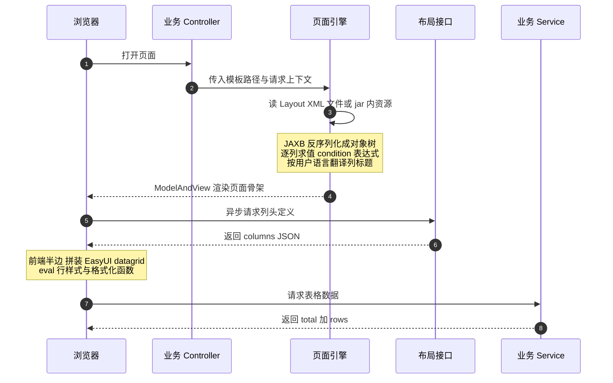

面试聊到业务项目，往上讲是架构（讲过）、往中间讲是机制（讲过），但真正拉开差距的往往是往下这一层：**你和你的团队在业务代码之下沉淀过什么**。"讲讲你们的框架封装""写过什么通用组件""反射和注解在实际项目里怎么用的"——这类问题考的不是背概念，而是你有没有真正维护过一套别人每天都在用的基础设施。

这套 MES 的业务代码之下确实压着这样一层：自研框架封装在私服 jar 里，业务仓库里看不到它的源码，但几十个业务模块的每一个列表页、每一个编辑弹窗、每一次字典翻译、每一处分页，都是它在背后撑着。本篇把它拆开：页面引擎怎么用 XML 元数据渲染出整个 EasyUI 界面，模型元数据怎么驱动通用 CRUD，查询管道怎么把反射、分页、字典翻译和 XSS 转义串成一条线——以及这套"半低代码"机制的账本，利和弊我都翻给你看。

<!-- more -->

## 一、先看问题：几十个模块为什么要长一个样

这套系统有二十来个服务、上百个业务页面：工单管理、设备台账、模具台账、质检记录、库存单据……它们大多是同一个形状——上面一排查询条件，中间一个数据表格，点新增弹一个编辑窗。如果没有框架，每个页面都是"HTML 结构 + 前端列定义 + 查询 JS + CRUD 接口 + 分页封装"五件套手写一遍；几十个页面乘以五件套，再乘以人员流动，就是一场可维护性灾难。

自研框架的解法是把"长得一样"的部分全部下沉，业务开发只剩三样东西：**一个声明列和查询条件的 XML、一个几行代码的 Controller 方法、一个写业务规则的 Service**。一个典型的列表页 Controller 方法长这样：

```java
public ModelAndView Order(HttpServletRequest request) {
    Map paraMap = this.getParameterMap(request);
    return this.createMultiGridPatternView(
            paraMap, this.getClass(),
            "MesRoot/Order/Order", request.getServletPath());
}
```

没有列定义、没有模板选择、没有菜单权限注入——全在 `createMultiGridPatternView` 一个调用里完成。这就是平台型框架的价值：**业务代码里剩下的每一行，都是业务本身**。

## 二、页面引擎：Layout XML 到 datagrid 的完整旅程

框架的核心是一个元数据驱动的页面引擎。每个页面有一份 Layout XML，声明这个页面"长什么样"：

```xml
<Column name="FactoryId" type="int" condition="{usertype} == '1'">
    <Field value="FactoryId"/>
    <Title value="order.grid.factoryid" chs="所属工厂" eng="FactoryId"/>
    <Width value="80"/><Hidden value="true"/>
</Column>
```

这一小段信息量不小：`Column` 声明一列，`Title` 带 i18n key 和中英文兜底文案，`condition` 是一个**运行时按会话求值的表达式**——只有平台账号（usertype=1）登录时这一列才会渲染出来，普通账号根本看不到"所属工厂"下拉。上一节登录会话篇里"前端只做展示差异"的原则，落地处就在这个属性上。查询区字段、编辑弹窗字段（必填校验、下拉数据源、默认值、布局跨列）也都在同一份 XML 里声明式配置。

从 XML 到用户眼前的表格，完整旅程是：



这条链路里有四个实现细节，每一个都对应一道面试题。

**细节一：XML 怎么读——文件系统和 jar 内资源双路径。** 开发期 XML 躺在 webapp 目录里，改完热生效；生产环境打 fat jar 后，XML 变成 jar 内资源，框架要改用 jar entry 流的方式读同一份文件。**同一份元数据、两种加载路径**，是所有"约定优于配置"式框架都会遇到的问题——Spring 自己扫 classpath 资源也是同款复杂度。

**细节二：条件表达式的求值器是自写的。** `condition="{usertype} == '1'"` 里的 `{usertype}` 会被替换成会话值，然后走框架自带的表达式求值器算出布尔结果。不引重型规则引擎、不上 SpEL，一个百行级的小求值器只支持比较和三目——**表达力按需裁剪**，这比"能不能"更重要的是"该不该"。

**细节三：i18n 是三层叠加的。** 列标题先查 properties 资源文件（随 jar 发布，管静态词条）；数据库里另有一对"词条表 + 语言版本表"管运营可维护的词条（字典显示名、新增菜单名）；前端运行时再把词条批量拉进 localStorage 缓存几小时，页面 JS 用统一的翻译函数取词。中文标题还有个土办法的妙用：没有显式配列宽时，**按标题里中文算 30 像素、英文算 20 像素自动估列宽**——粗糙，但让九成列免于手配。

**细节四：列头接口和数据接口是分离的。** 页面骨架和列头定义走统一的布局端点，表格数据走各业务自己的查询接口。这个分离带来一个意外的收益：导出功能可以直接复用列头定义生成 Excel 表头（本系列导出篇会讲），**"列"作为一等公民被两处消费**，元数据的价值翻倍。

## 三、Moc 模型：数据层的元数据和通用 CRUD

页面层有 Layout XML，数据层对应的是 Moc 模型 XML——声明一个业务对象的逻辑名、物理表名和字段集：

```xml
<Moc name="Order" table="biz_order">
  <FieldDef>
    <Field name="orderno" type="string" length="32"/>
    <Field name="type" type="enum" enum="ordertype"/>
    <Field name="state" type="enum" enum="orderstate"/>
  </FieldDef>
</Moc>
```

每个服务的启动类里有一个叫 Activatar 的启动器，异步扫描 `model` 目录（生产环境扫 jar entry），把 Moc XML 反序列化后注册进一个静态注册表——业务代码随时能按名字 `"Order"` 拿到这张表的元数据。注册完成之后，框架的通用服务就提供了按 Moc 名定位的通用增删改查、按字段集的查重校验、按 ID 查详情——**业务 Service 不用为每张表手写一遍 insert/update 的参数装配**。

这里有两个值得在面试里展开的点：

**一是"注册表为什么敢用 static Map"。** 元数据在启动时加载、运行期只读，静态 Map 的不可变用法天然规避了并发问题；扫描注册放在异步线程池里延后几秒执行，是为了不阻塞服务启动——**启动速度和元数据就绪之间做了个让步**，代价是服务刚起来的一小段窗口里元数据还没就绪，框架用"注册完成才放行就绪探针"来兜。

**二是枚举字段直接挂在 Moc 里。** `type="enum"` 的字段在 XML 里内嵌枚举定义（code + 多语言显示名），通用 CRUD 和页面下拉共用同一份定义——数据字典在"模型、存储、展示"三处的一致性，靠的就是这一份元数据被三处消费。

## 四、查询管道：反射、分页、字典翻译、转义一条龙

Service 层的基类提供一个反射式查询门面，业务侧一行调用：

```java
builder.addDictTransform("ProductType", "materialtype", "materialtypedsp");
return queryDaoDataT(iOrderDao, "queryOrderMaterial", params, builder);
```

它背后按顺序做了五件事，串成了这条系统里所有查询的标准管道：

1. **反射调 DAO**：按方法名从 DAO 接口找方法、Map 参数反射调用——业务 DAO 不用注册到任何地方，方法名即约定；
2. **分页织入**：参数里有分页页码就调 PageHelper 的 startPage 拦截 SQL 拼 limit，没有就给个默认页大小——分页策略收口在管道里，业务代码看不见 limit；
3. **字典翻译**：管道里声明的翻译规则（哪列的编码、按哪个字典组、翻译进哪个新列）先攒起来，然后**一条 SQL 把涉及的字典组整批查出来**，装进二维内存表，逐行内存翻译——如果天真地在每行每列上单查字典，一百行三个编码列就是三百次 SQL，N+1 问题是翻译场景的经典雷区；
4. **统一封装**：分页对象里的总行数、页数连同数据行装进统一的结果结构，EasyUI datagrid 拿 `total` 和 `rows` 就能渲染；
5. **key 全小写 + HTML 转义**：返回给前端的每个字段名统一转小写（防御不同数据库、不同写法的 SQL 里列名大小写漂移），每个值做 HTML 转义（防御存储型 XSS）——**这两个防御放在管道而不是业务代码里，意味着业务开发想犯错都没有入口**。

还有一个来自真实事故的后手：大数据量报表翻页时，PageHelper 默认每次都要跑一遍 count 语句，几十万行的 union 报表 count 一次就是秒级开销。后来在前端翻页请求里加了个"跳过 count"的开关，后端跳过计数、用上一次的总数回填分页条。**分页框架的 count 是不是每次都必要，是报表型系统迟早要还的账**——细节留给本系列的导出与性能篇。

## 五、账本：这套半低代码的利与弊

讲自研框架最容易讲成软文。这套机制我维护了不短的时间，利和弊都摆在台面上。

**利的账本**：一个标准列表页 = 一份 XML + 一个薄 Controller + 一个业务 Service，几十个页面长得一模一样，新人和 AI 助手都能按套路开发；列布局的个人自定义（每个用户可以拖列、存偏好）、多工厂列差异、多语言、导出表头，全是框架兜底，业务零成本。**约定优于配置的红利是可预期性**——这在人员流动频繁的团队里是硬通货。

**弊的账本**同样真实：

- **表达力天花板撞得早。** 复杂交互一出现，XML 就不够用了，框架的应对是在 XML 里补图灵完备性的补丁：行样式属性里塞 CDATA 包着的完整 JS 函数、自写表达式求值器、按反射调用的取值钩子。**当配置文件里开始出现函数体，配置就已经在往代码堕落**，只是堕落在了一个没有 IDE 支持、没有类型检查、没有断点的方言世界里。
- **绕开它的页面越来越多。** 甘特图、车间看板、监控大屏这类复杂页面，团队最后直接手写前端列定义——全库数了一下，绕开元数据引擎硬编码列的页面有八十多个。**低代码平台的真实使用率，是它价值最诚实的度量**。
- **改 XML 等于改资产。** 元数据在 jar 里，改一列标题也要走构建发版，和改代码没区别——"配置化"省掉的发布成本其实并没有省掉。
- **元数据本身没有测试。** 列名拼错、条件表达式写错，编译器不会报错，全靠页面上肉眼发现。

团队的演进方向也印证了这些痛点：后来出现的动态布局控制器把页面定义搬进了数据库（改配置不用发版、还能按工厂个性化），再往后引入了带流程引擎的低代码模块，页面定义、数据模型、审批流全部在线定义。**从"文件式声明元数据"走到"数据库式配置元数据"，本质上是承认：配置的变更频率已经追上了代码**。

## 六、面试视角：五个问题拆到底

**Q1：为什么自研框架，不用现成的低代码平台？**

答：这个框架的历史比市面上成熟的开源低代码方案早，迁移成本远大于收益是第一层；更本质的是它的定制深度贴着业务——运行时按会话求值的列级权限、工厂级自定义字典、用户级列布局偏好、导出表头直接复用列定义，这些和制造业务咬得太紧，通用平台反而要绕。如果今天从零开始，我会在开源低代码方案和自研之间先做一个"扩展点匹配度"评估，而不是默认自研。

**Q2：元数据驱动渲染，技术上的关键点是什么？**

答：四个：XML 到对象树的绑定（JAXB 这类映射工具）、加载路径的双兼容（文件系统与 jar 内资源）、条件表达式求值（自写的小求值器，表达力按需裁剪）、元数据的启动期注册与缓存（静态只读注册表加异步预热）。这四点合起来其实就是一个微型的"编译前端"：解析、校验、求值、缓存。

**Q3：反射调用 DAO，性能没问题吗？**

答：查询门面每次按方法名反射调用，看起来有开销，但拆开算：方法查找是接口级的 getDeclaredMethod，纳秒到微秒级，相对一次数据库查询可以忽略；真正的坑不在反射本身，而在反射结果的缓存——框架对方法对象和元数据都做了缓存，避免重复解析。**反射的性能问题几乎总是"重复解析"而不是"反射本身"**，这个认知比背"反射慢"重要。

**Q4：XML 里内嵌 JS 函数，你怎么看这个设计？**

答：它是表达力不足时的务实补丁，不是好设计。行样式、格式化这类逻辑放 XML 的 CDATA 里，前端 eval 执行——换来了配置集中，付出了没有类型检查、没有 IDE 支持、XSS 攻击面扩大三样代价。系统里对应做了 HTML 转义兜底，但如果重新设计，我会把这类逻辑显式注册成命名函数库，XML 里只引用函数名不内嵌函数体——配置引用代码，而不是配置包含代码。

**Q5：让你设计一个低代码表单引擎，怎么入手？**

答：我会按这套系统教给我的边界来切：schema（字段定义）和渲染器分离，schema 描述"有什么"，渲染器决定"怎么画"；扩展点前置——复杂交互在 schema 之外留显式的代码插槽，宁可让 20% 的页面走手写，也不要让 schema 变成图灵完备的方言；元数据进数据库加版本化，让配置变更可回滚；最后是逃生舱——低代码引擎最重要的设计不是"能配置什么"，而是"配置不了的时候用户体面地逃到哪里"。

## 小结

- **框架的价值是让业务代码里剩下的每一行都是业务**：薄 Controller + 声明式 XML + 业务 Service，是可预期性的来源；
- **元数据驱动 = 解析、求值、缓存、双路径加载**四件事，本质是微型编译前端；
- **管道是防御的收口处**：分页、字典批量翻译（防 N+1）、key 小写、HTML 转义，下沉到管道业务代码想犯错都没有入口；
- **配置里出现函数体的那一刻，配置就在堕落成代码**：表达力天花板要早承认，逃生舱要早设计；
- **低代码的真实价值看使用率和绕开率**：八十多个绕开引擎的手写页面，比任何宣传都诚实；
- **配置的变更频率追上代码时，就该从文件搬进数据库**——这套框架的演进史本身就是这条规律的注脚。

下一篇讲工单状态机：几十个工单状态、每种状态一个策略子模块，"没过首检不许开工"这类拦截规则如何收口——设计模式和业务建模的结合部，是本系列业务味最浓的一篇。
