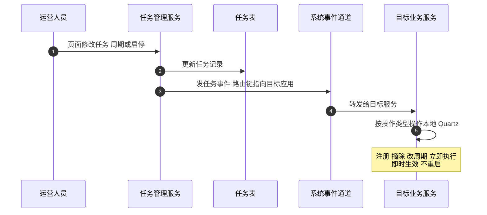

在制造行业的运维工单排行榜上，"定时任务不执行"常年霸榜——不是因为它难，是因为它**平时的正确性完全不可见**：任务跑了没动静，不跑也没动静，直到某天运营发现预警没发、报表没出、库存没归档，倒回来查的时候现场早凉了。

教科书答案是 `@Scheduled` 一行注解。但真实系统用不了它——改一次执行周期要发版、启停一个任务要重启、运营和实施人员完全无法自助、多实例部署还重复跑。这套 MES 的定时任务体系就是为了解决这四件事搭建的：**任务存数据库、页面全治理、变更即时生效、集群防重**。本篇拆它的两条加载路径（一个真实的生产事故就栽在它们身上）、三层防重设计，以及那张沉淀了三轮排查弯路的排查清单。上一篇讲的系统事件通道，本篇正好是它最重要的消费者。

<!-- more -->

## 一、为什么 @Scheduled 用不了：需求倒逼的形态

先把反例立起来。代码库里至今留着十几处被注释掉的 `@Scheduled` 注解和一整套被注释的"按环境禁用任务"开关——那是这套系统的史前时代：任务编译期写死在注解里，改个执行时间就是一轮发版，部署环境的差异靠代码里的环境开关区分。后来全部迁到了**任务表驱动**：

任务在表里就是一行记录——任务名、分组、Cron 表达式、目标 Bean 类、方法名、是否允许并发、**所属应用**、状态标志。调度器在每个业务服务进程内各起一个 Quartz 实例，启动时只加载"所属应用 = 自己"的任务；执行体是反射调用：按记录里的 Bean 名从 Spring 容器取实例、按方法名反射执行。**任务的定义从代码里搬进了数据里**，于是增删改查、启停、改周期全部变成了数据操作，页面治理才有立足之地。

这个形态有两个容易被追问的决策点。一是"反射调用不怕性能问题吗"——任务级调用一天几百次，反射开销纳秒级，讲过真正该怕的是重复解析而不是反射本身。二是"为什么每个服务自己跑 Quartz，不搞一个统一调度服务"——任务执行体是业务 Bean，业务 Bean 在业务服务的 Spring 容器里，统一调度服务就得把任务逻辑全部 Feign 化，事务和上下文都断在边界上；**调度贴近执行体**是这套系统的选择，代价（每个服务都要懂自己的 Quartz）由框架基类承担。

## 二、两条加载路径：一个事故养出的机制认知

任务表驱动有一个绕不开的技术事实：**这套部署里的 Quartz 是进程内内存态的**——没有用数据库 JobStore，服务重启，调度器里的任务全部蒸发。所以任务从表到调度器必须有一座桥，而这座桥有两个入口：

**入口一：启动加载。** 每个服务的框架基类在初始化阶段查任务表——条件是"状态为启用 且 所属应用是自己"——逐条注册进 Quartz。一次性动作，之后不再看表。

**入口二：消息即时生效。** 任务管理页面（独立的服务模块）上的每个操作——保存、修改、删除、启用、停用、暂停、恢复、**立即执行一次**——都是两步：先改库，再发一条系统事件到消息总线，路由键精确指向目标任务所属的应用。目标服务的事件监听器收到后按操作类型分发：保存和启用就注册、修改就更新触发器、删除和停用就摘除、立即执行就手动触发一次。上一节说的"页面改完即时生效"，靠的就是这条路。

两条路径本应互补，但它们之间有一道缝，一个真实的生产事故就栽在缝里——值得整段复述。

**事故经过**：实施人员按文档在生产库里插入了一个新任务、状态置启用，然后等它执行——没执行。第一轮排查怀疑页面启停操作没注册调度器（方向错）；第二轮怀疑目标服务没配消息通道（补了配置但方向也不对）；第三轮才定位到根因：**入口一只在服务启动时跑，库里插一条新任务，不重启目标服务它永远不会被加载**；而补配置为什么也没用，是第二层暗礁（下一节讲）。事故的最终沉淀是仓库里的一篇复盘文档和一张排查清单。

还要记一个反直觉的字段语义：任务表的状态标志里，**'1' 才是启用、'0' 是停止**——和"0 是默认值即正常"的直觉相反。库里躺着的一大堆历史任务全是 '0'，排查的人一不留神就会把"停用"看成"正常"，这是那张清单的第一条。

## 三、条件装配的暗礁：静默失效比报错更贵

第二层暗礁值得单独成节，因为它展示了微服务里一类最阴险的故障形态。

任务管理服务发的事件，靠目标服务的统一事件监听器接收——而那个监听器头上挂着条件注解：**配置文件里声明了消息队列参数，这个监听器类才会被创建**。这是讲过的"接入三步"的一部分，初衷是让不参与消息系统的服务干净地跳过。但事故服务的配置文件恰恰漏了那几行参数——于是监听器静默地不存在，任务事件石沉大海，**没有报错、没有日志、没有任何症状**，唯一的表现是"页面启停对它无效"。

这就是条件装配的代价面：它把"功能缺失"从启动失败变成了静默降级。报错的缺陷在上线前就被逮住，静默的缺陷在三个月后由实施人员在生产发现。解药不是放弃条件装配（它对不接入的服务是对的），而是**给静默路径补可见性**：接入检查清单、启动日志里打印"事件监听已激活/未激活"、任务管理页面显示每个应用的事件通道连通状态——事故之后补的就是这三样。

事故最终沉淀的排查清单是本篇最实用的产出，四步、有序、可执行：

1. **查库**：任务状态标志是不是启用值（反直觉语义，看反了全盘错）；
2. **查重启**：任务插入或启用之后，目标服务重启过没有——没走消息通道的变更只能靠启动加载；
3. **查通道**：目标服务的配置里有没有消息队列参数——没有的话页面操作永远无效；
4. **查日志**：目标服务日志里搜两类特征——任务执行日志（走到了没）和事件到达日志（消息来了没），两者缺哪个，故障就在哪一段。

清单的力量在于**把三轮弯路压缩成四步直线**，这也是面试聊"你排查过什么问题"时最值得展示的产出形态：不是讲故事，是讲故事之后留下来的那张纸。

## 四、集群防重：三层防护各管一段

服务多实例部署后，"每实例一个内存 Quartz"立刻产生新问题：同一分钟内，三个实例都会到点触发同一个任务。Quartz 官方的集群方案是数据库 JobStore 加行锁，这套系统没用它（内存态的取舍一致），防重拆成了三层：

**第一层：分布式锁挡跨实例。** 任务执行前先抢 Redis 分布式锁——锁的键是应用名加"Bean 类.方法名"，粒度精确到单个任务；抢不到锁的实例直接跳过本轮。这里有个写代码时的语义陷阱值得记：锁工具的方法名和返回值语义相反——"获取锁"返回的是"没获取到"，调用方统一写"取反判断才执行"。命名反直觉的代码一旦进入基础设施，每个使用者都要重新踩一遍理解坑，**基础设施的命名税是全团队交的**。

**第二层：并发注解挡同实例重叠。** 上一轮任务还没跑完、下一个触发点又到了怎么办？Quartz 原生有解——任务类带"禁止并发执行"注解时，同一调度器内自动排队。更有意思的是任务表里有个字段让**每个任务自己选**：重扫类任务（全量扫描发预警）可以允许并发，长事务类任务必须禁止——并发性成了任务的可配置属性而不是全局纪律。

**第三层：Redis 注册表挡"停用漂移"。** 页面上停用一个任务，消息广播给所有实例摘除——但如果某实例错过了消息呢？它本地 Quartz 里还挂着这个任务，会一直执行。兜底是两个 Job 工厂在每次执行前都查一个 Redis 注册表：发现任务已被标记停用，就地把自己本地调度器里的任务删掉。**停用状态通过共享存储持续对账，而不是依赖一次性的消息送达**——这和的"双写必漂、对齐机制兜底"是同一个哲学。

## 五、可观测与幂等：让任务敢被重跑

任务体系的另一半工程在"跑了之后"。

**可观测**：每次执行落两条日志——开始一条、结束一条（状态成功/失败、耗时秒数），配专门的查询页面；页面上编辑 Cron 时实时预览未来十次触发时间，写错表达式当场现形。欠账也如实记录：任务失败只落日志和错误日志，没有自动接入消息告警——失败发现靠人看页面或下游反馈；队列积压倒是有专门的监控任务兜着发短信。**任务失败告警的自动化，是这套体系下一个该补的洞**。

**幂等**是任务敢被"立即执行一次"按钮随便按的底气，实例覆盖四种形态：

- **状态位重试**：对外推送类任务扫"待推送"状态的记录，成功置成功、失败置失败带原因，任务重跑只扫待处理的——天然可重试；
- **先查后改的标记位**：聚合类任务先查超阈值未处理记录再逐条标记，重跑不会重复聚合；
- **插入忽略式归档**：大表清理任务每批"归档表插入忽略 + 原表按主键删"，中断重跑不产生归档重复——讲过的归档纪律的任务化落地；
- **全量重扫 + 下游去重**：预警类任务每次全量扫条件满足的对象重发，幂等交给下游的通知去重——最粗暴但最健壮，因为它对"上一轮执行到一半挂了"完全免疫。

配一张简短的"任务即业务"全景：预警扫描族（工单延期、质检超时、模具维保、库存安全水位）、聚合族（设备模次聚合产量、多线程分工厂并发）、治理族（大表清理、数据转储、年度初始化）、推送族（第三方设备数据、ERP 关单）。几十个任务里没有一个是"技术任务"——**定时任务系统在制造业里本质是业务的自动化神经系统**。

## 六、面试视角：五个问题拆到底

**Q1：分布式环境下定时任务怎么防重复执行？**

答：三层：跨实例靠分布式锁（键粒度到单个任务，抢不到直接跳过）；同实例靠 Quartz 的禁止并发注解（是否允许并发做成任务的可配置属性）；停用状态的漂移靠 Redis 注册表执行前对账兜底。没有用 Quartz 的数据库 JobStore 集群模式，因为调度器整体走内存态，防重在应用层自己收口。

**Q2：任务运行时变更怎么生效？**

答：双路径。启动加载保证重启后的状态恢复；页面操作走"改库 + 发系统事件（路由键指向目标应用）"让目标服务即时操作本地调度器。这套机制的暗礁是接收端条件装配——没配消息参数的服务静默收不到事件，我们为此付过一次生产事故的学费，事后补了接入检查和通道状态可见性。

**Q3：@Scheduled、Quartz、分布式调度平台（如 xxl-job）怎么选？**

答：@Scheduled 适合单实例、任务定义随代码发布的场景；这套系统的任务表驱动加进程内 Quartz 介于两者之间——治理能力页面化了，但调度和执行体同进程，事务和上下文不断；xxl-job 这类平台强在执行器集群管理和失败重试的调度视角，代价是任务逻辑要么独立部署要么强依赖平台。如果今天重建，我会在"任务归属服务"这个决策上保持不变（调度贴执行体），但会把失败告警和执行链路追踪前置建成，而不是事后补。

**Q4：任务执行失败怎么处理？**

答：现状分两半：可观测半成品——执行日志双写加页面查询有了，失败自动告警还没接入消息总线；正确性靠幂等兜底——状态位重试、先查后改标记、插入忽略归档、全量重扫下游去重四种形态保证重跑安全。我的改进优先级是失败告警接入总线（成本最低收益最大）、再是超时熔断（现在只有 Feign 层 10 秒超时，Quartz 层裸奔）。

**Q5：让你设计一个任务管理平台，表模型怎么定？**

答：核心表六列起：任务标识（名+分组）、调度参数（Cron+并发标志）、执行体定位（Bean+方法）、**归属应用**（决定哪个进程加载它，这是多服务架构里最容易被漏掉的列）、状态标志（语义要定义得反不了直觉）、审计字段。加一张执行日志表（开始/结束/状态/耗时）和"立即执行一次"的校验（未启用不许手动触发）。再往上才是调度器选型和防重机制——表模型定错了，后面全要返工。

## 小结

- **任务从代码搬进数据，治理才有立足之地**：一行任务表记录加反射调用，换运营自助和免发版；
- **调度贴执行体**：每个服务自己的进程内 Quartz，代价由框架基类承担；
- **两条加载路径之间有缝**：启动加载不认新任务、消息通道依赖配置——真实事故把这条缝踩成了排查清单；
- **条件装配的静默失效比报错更贵**：给静默路径补可见性，是微服务接入治理的必修课；
- **防重三层各管一段**：跨实例锁、同实例并发注解、停用状态持续对账——和双写对账是同一哲学；
- **幂等让任务敢被随便按**：四种重跑安全形态，比任务失败重试更根本；
- **把弯路压缩成清单**：事故的价值不在复盘文章，在那张四步排查清单。

下一篇预告：主线机制还剩两篇，先写 **IoT 设备接入**——设备模次上报怎么驱动自动报工（Redis delta 缓存 + 定时聚合的两段式已在状态机篇埋过钩子，本篇拆接入侧：MQTT、断连告警、数据链路），然后把最后的 APS 排产留给收官阶段。
