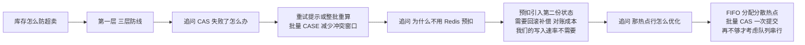

系列最后一篇。前二十四篇是弹药库，这一篇是**出膛前的最后一道组装工序**：一张二十五问的高频清单（每问标注答案锚点）、三棵追问树（展示面试官怎么从一个问题追到第五层）、几条应答的元规则、以及最容易被浪费的面试最后五分钟——反问环节。

给了按提问路径组织的索引，给了开场与应答的骨架；本篇补的是实战的最后一层——**追问的纵深预演**。面试的分水岭不在第一问答得多好，在第三层追问答不答得住；而第三层的问题是可以预先推演的。

<!-- more -->

## 一、高频问题清单：二十五问

按主题分四组，每问给出答案锚点（篇目）和**第一句话该说什么**。清单的使用方式：遮住右列自测，答不出第一句的回去重读对应篇目。

**项目与架构（8 问）**

| # | 问题 | 第一句话该说 |
|---|---|---|
| 1 | 介绍你的项目 | 先讲业务闭环：ERP 管单、我管造、WMS 管仓（） |
| 2 | 为什么拆微服务 | 按业务域垂直拆，改一个需求只发布一个服务 |
| 3 | 服务之间怎么通信 | 同步 Feign、异步事件总线——按"要不要当场拿结果"分 |
| 4 | MES/WMS 边界怎么画 | 画在数据所有权上；跨库禁 join、只走接口（） |
| 5 | 多租户方案对比 | 三方案按租户量与表量选；行级隔离的正确性要框架兜底（） |
| 6 | 私有化和 SaaS 的区别 | 隔离哲学和成本结构不同，不是部署位置不同（） |
| 7 | 技术栈为什么这么老 | 栈是选给业务形态的；技术债清单和重来方案也说得出（） |
| 8 | 自研框架的得失 | 薄 Controller 加元数据渲染换可预期性；账本里利弊都摆（） |

**数据与一致性（7 问）**

| # | 问题 | 第一句话该说 |
|---|---|---|
| 9 | 库存怎么防超卖 | 三层防线：量校验、CAS、可用量口径——不是一把锁的事（） |
| 10 | 讲一次线上事故 | MVCC 双写：现象、根因链、修复、沉淀清单（） |
| 11 | 乐观锁和分布式锁怎么选 | 冲突概率决定装备；两者防的不是同一个问题 |
| 12 | 锁为什么要加在事务外 | 先抢锁再开事务——事务内等锁会拖垮连接池 |
| 13 | 跨服务事务怎么保证 | 先收拢执行避免它；再在途表中间态；最后账本兜底 |
| 14 | 增量同步不丢不重 | 水位回拨重叠窗加下游幂等，不承诺精确增量（） |
| 15 | 大表怎么治理 | 查得快（覆盖索引）、搬得稳（短事务）、删得准（主键三步法） |

**机制与设计（6 问）**

| # | 问题 | 第一句话该说 |
|---|---|---|
| 16 | 业务流程怎么避免 if-else | 状态建模、规则外置、策略路由三层解法（） |
| 17 | 消息丢了怎么办 | 先流量分级：什么能丢、什么不走 MQ、什么记账本（） |
| 18 | 定时任务集群怎么防重 | 跨实例锁、同实例并发注解、停用状态对账三层（） |
| 19 | 设备数据怎么扛量 | 写合并优先于并发；TTL 状态机管在线（） |
| 20 | 用过什么算法 | 约束求解器落地：建模、打分、时间预算、人机协同（） |
| 21 | 算法为什么 sometimes 不用 | 问题结构是图不是链、好解可规则推导时，确定性贪心胜出（） |

**端侧与工具链（4 问）**

| # | 问题 | 第一句话该说 |
|---|---|---|
| 22 | 车间终端怎么做 | 壳三件事：硬件桥接、防呆联锁、离线兜底；PAD 无业务逻辑（） |
| 23 | 移动端混合开发得失 | 原生只补一票否决项；适配税是壳的宿命（） |
| 24 | 鸿蒙迁移做了什么 | 契约沿用桥名不动、Web 零改动；坑全在两个世界的边界（） |
| 25 | 自研工具链值吗 | 效能账回本两个月；沉淀的工程纪律是长期价值（） |

## 二、追问树：三层纵深预演

面试官的追问有惯性：**顺着你的话找没说清的点**。预先把树推演出来，第三层的从容就是碾压级的。给三棵示例树。

**树一：从"库存防超卖"追下去**（）

**树二：从"多租户"追下去**（ + ）：行级隔离为什么不用独立库（租户量、表量、报表跨租户）→ 漏加租户条件怎么办（框架兜底缺失的欠账与三层补偿方案）→ SaaS 渠道层怎么设计（租户与渠道正交，代理商是运营视图不是超级账号）。

**树三：从"消息可靠性"追下去**（）：消息不丢怎么保证（先分级）→ 通知类消息丢了业务能接受吗（预警靠重扫自愈的判断）→ 那交易类为什么不走 MQ（同步接口加事务，MQ 只给旁路）→ 发送侧 MQ 挂了怎么办（现状诚实交代加改造方向）。

推演追问树的方法论一句话：**每一层的答案里，主动留一个"但是"或"代价"——面试官的追问一定从那里来，与其被动挨打不如把那里备好**。

## 三、应答的元规则

二十五问共享四条元规则，它们是全系列每篇"面试视角"的公约数：

**结论先行。** 第一句话给立场（"我们选行级隔离""不用乐观锁"），细节在被追问时再展开——结论先行的答案面试官可以随时打断，铺陈式的答案打断即废。

**代价认领。** 每个方案的回答里主动说一句"代价是 X"——认领代价是可信度的最快通道，只说好处的方案默认打折。

**演进叙事。** "最早 A，因为 B 换成 C，如果重来会 D"——四段式的演进叙事天然展示判断力，比静态描述强一个量级。

**诚实分层。** 团队底盘和个人楼层分清；不知道的问题答"这块我没深入，我的理解是……"——面试官对诚实的宽容度远大于对编造的。

## 四、反问环节：最后五分钟的价值

反问不是礼貌环节，是**你唯一拥有提问权的五分钟**，问什么直接暴露你的层次。三类值得问的：

**问技术判断**（展示你在意工程文化）："团队里最有争议的一次技术决策是什么，最后怎么定的？""系统里有没有'大家都知道是债但一直没还'的部分？"——前者的答案能预判你入职后的协作方式，后者能预判技术债的水位。

**问业务与团队**："这个岗位进来第一件事大概率是什么？""团队的交付节奏和值班机制是怎样的？"——实用且不冒犯。

**问成长**："这个团队里做得最好的人，强在哪？"——答案会告诉你这个环境值不值得去。

**别问的**：薪资细节（留给 HR 环节）、网上五分钟能查到的公司信息、以及任何"你们加班吗"作为第一问——它该在拿到其他答案后自然带出。反问的最后一条永远可以是："今天的交流里，您觉得我的经历和这个岗位还有什么匹配度上的疑虑吗？"——**把否决权的使用提前**，如果对方说出疑虑，你还有当场补救的最后机会。

## 五、备战节奏：一周计划

材料齐了之后的执行节奏，按面试日倒排：

- **D-7 到 D-5**：按目标岗位裁剪考点（索引的五层里选三层），重读对应篇目的"面试视角"章节；
- **D-4 到 D-3**：把的 3 分钟脚本练到脱稿，录音回听一遍（第一遍录音都会被自己吓到）；
- **D-2**：推演追问树——对着话术里的每个技术词问自己"如果面试官追三层，我在哪"，追不下去的地方回篇目补；
- **D-1**：只读二十五问清单的第一句话列，遮住自测；准备三个反问；
- **D-0**：面试前 30 分钟只做一件事——重读目标岗位对应层的小结；进门前把 30 秒电梯版在心里过一遍。

## 六、小结与完结

- **二十五问的第一句话清单**是面试前 30 分钟的复习资料，遮列自测是检验方式；
- **追问树提前推演到第三层**：每层答案主动留"但是"，把追问引向你备好的地方；
- **四条元规则贯穿所有应答**：结论先行、代价认领、演进叙事、诚实分层；
- **反问是把否决权提前使用的五分钟**：问技术判断和团队现实，最后索性问出对方的疑虑；
- **备战按周倒排**：裁剪、脱稿、推演、自测、30 分钟复读——材料已经齐了，剩下的是节奏。

系列到此完结。二十五篇，从一个面试场景的痛点出发，把一套制造业系统的业务、架构、机制、数据、交付、端侧和工具链翻来覆去讲了三遍——由上至下、由下至上、再按面试官的提问路径重排。回头看，这个系列最大的收获不是那二十五问的答案，而是写它的过程逼着每一个"当时那么做了"补齐了"为什么、代价是什么、重来会怎么做"——**面试备战做到这个深度，备战本身就成了复盘**。祝你面试顺利；也祝这套方法在你自己的项目上，长出属于你的版本。
