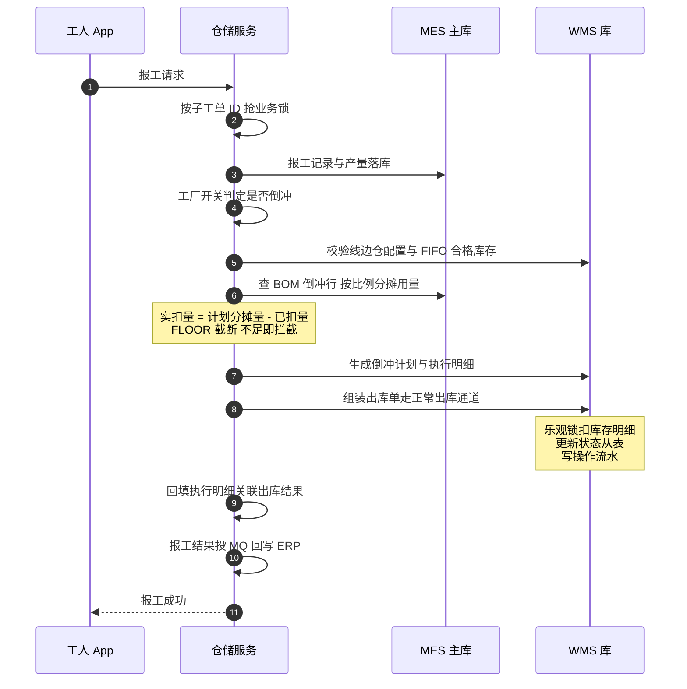
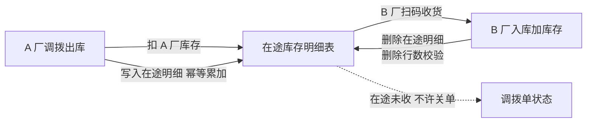

微服务面试的必答题排行榜上，"跨服务的数据一致性怎么保证"常年第一。大多数候选人能背出 2PC、TCC、Saga、本地消息表，但一被追问"你们系统里**具体哪一笔写操作**用了哪种、为什么、后来呢"就露馅了——因为答案只有在真实系统里拆过一次跨库写操作的人才讲得出来。

本篇就拆这样一笔：工人在 App 上点了一次报工，系统按 BOM 自动把原料从线边仓扣掉——这笔"倒冲扣料"横跨 MES 主库和 WMS 库，是全套系统里一致性要求最高的写路径。在拆它之前，先把地基讲清楚：MES 和 WMS 的边界画在哪、跨库取数的纪律是什么。上一篇讲到报工驱动状态机，本篇讲报工同时驱动了什么。

<!-- more -->

## 一、边界画在哪：MES 管过程，WMS 管账

全景篇说过一句话："边界画在数据所有权上"。落到具体：**MES 主库管过程数据**——工单、报工记录、质检、产量；**WMS 库管库存账**——现存量、出入库单据、批次流水。两个库在物理上是两个独立实例，但在部署上不是两个独立团队各管一摊的"微服务自治"：仓储服务（wms2）在自己的 JVM 里通过多数据源路由组件同时挂着两个数据源，主库一个、WMS 库一个，用 `@DS(数据源)` 注解或手动上下文切换来指定某次 SQL 打到哪个库。

这个"一服务两库"的形态值得停一下。它不是教科书的微服务（每服务每库），而是一个务实的中间态：**所有权边界画在库上，但执行边界收在一个服务里**——因为报工扣料这类操作要同时动两边的表，如果 MES、WMS 是两个完全对等的服务，每一次报工都是一场跨服务分布式事务；把执行收拢到一个服务里，跨库写就退化成了"同一个 JVM 里两个数据源的事务"，用多数据源组件的本地多库事务就能绑住。**服务拆分不只是拆职责，也是在给事务划边界**——这是我在这套边界上学到的第一课。

库存侧的表结构也值得一看，它和业务系统的表长得不一样：库存明细表的每一行是一段批次库存——现存量、库位、批次号、生产日期、供应商，外加五组辅助属性（等级、版本、包装、车型、基地）和三个控制字段：条码级标识、乐观锁版本号、事务独占标识。**没有"冻结数量"字段**——冻结是另一张状态从表按状态拆分数量的存量，加上一张逐笔操作流水。账和流水分离、状态从主表剥离，这是仓储表设计和业务表设计的根本差异：**库存表的每一行都要经得起"对账"的拷问，所以它的每一个动作都必须留痕**。

还有一个历史包袱要交代：仓储模块其实有两代，v1 和 v2 并存。v2 承接了核心域（出入库、库存、倒冲、跨厂调拨、追溯），v1 还剩销售单据和 ERP 拉数。迁移是按表、按域逐步搬的——连条码主档表都经历了一次"从主库搬进 WMS 库"，report 里至今留着新旧两条查询路径并存的过渡注释。**分库迁移从来不是开关，是漫长的共存期**，面试聊到"你们怎么迁移的"，敢说共存期比吹一刀切可信得多。

## 二、跨库纪律：禁止 join 之后，数据怎么流动

分库之后第一个阵痛是查询。报表要把 MES 的报工数据和 WMS 的库存数据放在一起看，SQL 的本能是写 join——但两个实例物理隔离，join 无从谈起。系统里因此立了一条明文纪律：**禁止硬编码跨库实例名做 join，跨库取数一律走 Feign**。

落地形态是三层约定：

1. **WMS 侧开放只读端点**：仓储服务的 Feign 专用 Controller 统一挂在 `/feign-api` 路径下，DAO 层显式标注 WMS 数据源，进出的都是 Map、统一的结果封装，异常必须记完整堆栈不许吞；
2. **调用方降级**：项目里没有用 Feign 的 fallback 类机制，降级是调用方手写 try-catch——同步类调用失败记日志"不阻塞主流程"，重要的失败再落一张同步失败兜底表，后续补偿或人工处理；
3. **返回最小数据集**：WMS 的明细查询不 join 主库表，只返回物料 ID，物料名称这类主数据由调用方回主库自己补——**跨库接口传输"键"而不是"宽结果"**，避免 WMS 侧反向依赖主库表结构。

这条纪律有两个踩坑痕迹值得记。一个是基础设施的：十几个模块各自定义了同名的 Feign 客户端接口，Spring 启动直接报 bean 冲突，最后靠"允许同名 bean 覆盖"的开关压下去——正确解法其实是接口下沉公共库，这是欠着的债。另一个是哲学层面的：**为什么宁可手写 try-catch 也不用 fallback 类？** 因为 fallback 类会把"降级成什么"藏在客户端配置里，团队需要降级逻辑显式可见、可区分"查询失败"和"同步失败"两种处理。机制没有绝对好坏，可读性也是正确性的一部分。

## 三、一笔倒冲扣料的一生

现在进入正题。倒冲（backflush）是制造业术语：不领料，**报工时按 BOM 反算用了多少料，自动从线边仓扣掉**——工人不碰仓库，仓库的账跟着生产走。它的完整一生是这样的：

这条链路上有五个设计决策，每一个都是面试考点。

**决策一：锁在事务外，不在事务内。** 报工入口的防重锁加在 Controller 层——这不是随手为之，代码注释里写着血泪：多数据源事务的拦截器在方法外层，锁如果加在 Service 方法上，会先开启事务再去竞争锁，**锁等待期间事务一直开着，数据库连接和 MVCC 快照全被这个空等的事务占着**——锁越堵，事务越长，连接池越枯。上一篇状态机篇说"锁的粒度跟业务语义走"，本篇补上另一半：**锁的时机跟事务边界走，永远先抢锁、再开事务**。

**决策二：实扣量 = 计划分摊量 − 已扣量。** BOM 用量按"本次报工数 ÷ 计划数 × 单位用量"分摊，做小数截断；关键的是再减去这张工单已经累计扣过的量——所以同一个子工单重复报工、分批报工，算出来的都是增量，天然幂等。算出负数直接跳过。**幂等不靠"查重拦截"，靠"差值计算"**，这是倒冲这条链路防重的真正答案。

**决策三：倒冲不是特殊路径，是自动生成的领料单。** 系统里没有"倒冲专用扣库存代码"——它先生成一张倒冲计划和执行明细，然后把扣减动作组装成一张标准的"生产倒冲出库单"，走**和人工领料完全相同的出库通道**。好处是双份的：扣库存、记流水、更新状态表这些逻辑只有一份（不会出现"人工领料扣了账、倒冲扣漏流水"的分叉）；倒冲天然获得了正常出库的全部校验和留痕能力。**把新场景表达成旧场景，而不是为新场景写第二套路径**——这是我在这个模块里看到的最好的设计。

**决策四：库存不足是拦截，不是负库存。** 校验开关打开时，线边仓 FIFO 合格库存不够扣，整个报工直接失败，错误信息精确到"子项物料编号、本次需求、库存数量、还差多少"。允许不允许负库存是仓储系统的一个根本立场选择——这套系统站在"不允许"一边，宁可报工失败让工人去找仓管员，不让账悄悄变负。**账实一致是仓储系统的命，交互体验是它的脸，命比脸重要**。

**决策五：扣库存、改状态表、写流水，同事务完成。** 三个写动作在同一笔多库事务里，任何一步抛异常全部回滚——不存在"库存扣了、流水没写"的对账黑洞。加上决策一的锁在事务外，锁的持有时间被压到最短。

## 四、乐观锁的地盘：为什么这里用了、状态机没用

库存扣减用的是教科书级乐观锁：`set 库存量 = 新值, 版本号 = 版本号 + 1 where id = ? and 版本号 = 旧值`，更新影响行数为零就抛"库存繁忙请稍后再试"。

上一篇状态机篇刚说完"不用乐观锁"，这一篇就用了——不矛盾，恰恰是同一原则的两面：**冲突概率决定装备**。子工单状态变更的冲突概率是"两个工人同时点一张单"，极低；库存明细是热点行——同一批物料可能被几十张工单同时倒冲扣，FIFO 分配让最老的批次行成为全场必争之地。乐观锁用在高冲突场景才有意义，而且这套系统为高冲突做了配套优化：逐行循环更新被替换成一条 `CASE id` 的批量 CAS 语句，几十行库存一次提交，冲突时整批重试而不是逐行空转。

同事务的另一半是事务技术的演进史，这条痕迹值得整段讲给面试官。最早的报工扣料是**两个服务的 Feign 链路**：报工落库在生产服务，倒冲校验、倒冲提交两次远程调用到仓储服务，用 tx-lcn 分布式事务管理器把两边绑起来——一个经典的跨服务半事务形态。后来它被整体重构掉了：报工扣料逻辑聚拢进仓储服务，跨服务事务变成同 JVM 的多数据源事务，tx-lcn 从这条链路退场（全项目现存的分布式事务注解只余十几处，全在单库场景）。重构的原因注释写得很直白：**tx-lcn 与多数据源事务不兼容**。这正好回答面试题"分布式事务你们怎么选的"——答案不是选了哪个组件，而是**发现两套事务机制打架之后，把执行收拢让问题消失**：能用本地事务解决的，就不要让它变成分布式事务。

链路里还留着一个精细的防御细节：盘盈盘亏审核方法里有个"回滚守卫"——先判断当前线程存在未决事务上下文才执行回滚，回滚幂等（回滚过的再调是空操作），保证异步收尾时"先回滚、再独立记账"的顺序。**异步逻辑介入事务收尾时的时序守卫**，是分布式事务实战里教科书从不讲的部分。

## 五、跨厂调拨：在途表的中间态

跨库一致性的另一种形态是跨厂调拨：A 厂把一批料调给 B 厂。它的做法不是"发出方扣、接收方加"的两笔直动，而是引入**在途库存表**作为中间态：

三个细节让这个中间态足够结实：写入在途用幂等 upsert（重复提交是数量累加而不是插两行）；接收时**删除在途明细并校验删除行数**——删少了说明有人并发动了这批货，直接抛异常回滚；条码维度的查重防止同一箱货被重复出库。单据状态还有"部分接收"的中间档，存在未收在途时不许关闭调拨单。

这个设计的本质是**把一次分布式写拆成两次带中间态的本地写**——和 Saga 的思路同源，但中间态有实体表、有单据状态、可查询可盘点，比纯Saga 的补偿日志对业务友好得多：仓管员随时能回答"那批调拨的货现在在哪"，这就是中间态的价值。

## 六、边界的后期成本：追溯、对账与修数

分库的账单在建立边界时就该心里有数，这套系统里三笔清晰可见：

**追溯变贵了。** 扫一个箱码看它的完整履历（入库、移库、领用、跨厂、出库），WMS 侧的实现是把六七类单据明细表 `union all` 串成时间线——每类单据一个 select，字段对齐后合并排序。而"从原料到成品"的完整追溯要横跨 MES 质检数据和 WMS 履历数据，报表服务只能先 Feign 拿 WMS 节点、再查主库节点、两边拼接。单库时代一个 join 的事，现在是两次调用加内存拼接。**追溯能力是设计时就要想清楚的，它是分库最贵的隐性成本**。

**对账变成常态机制。** ERP 完工前要校验"这张工单的入库记录是否全部同步成功"——校验本身就要跨两个库三张表走一遍核对。同步失败有兜底表，兜底表要有人处理，处理完还要复核——**分库之后，"最终一致"不是一句口号，是一整套人工和自动的对账流程**。

**修数要有专用工具。** 库存不平了怎么办？这套系统有一个专用的库存修数服务：Excel 对账匹配、分类产出"未匹配/需删除/需扣减"，最终批量修正收敛到一个存储过程保证原子性。有意思的是，这个修数工具的 SQL 里留着**全仓库唯一一处硬编码跨库 join**——修数场景的特批。连纪律的例外都要有出处，这大概就是纪律真实存在的证明。

## 七、面试视角：六个问题拆到底

**Q1：你们跨服务数据一致性怎么保证的？**

答：分三层答。第一层是**避免**：把高耦合的写路径（报工+扣料）收拢到一个服务一个 JVM，跨服务事务退化为同 JVM 的多数据源本地事务，很多"分布式事务问题"在这个层面就消灭了。第二层是**中间态**：真正跨边界的场景（跨厂调拨）用在途表做中间态，拆成两次本地写加状态机，可查询可对账。第三层是**兜底**：同步类调用失败落兜底表走补偿，关键链路（完工前校验）做对账。曾经用过的 tx-lcn 分布式事务管理器，因为和多数据源事务不兼容在这条链路上退场了——这个"退场史"比"我们用了什么"更能说明选型能力。

**Q2：为什么禁止跨库 join？**

答：技术上是 join 不了——两个物理实例，硬编码实例名的伪 join 是把连接层耦合进 SQL，性能和运维都是灾难。但真正的原因是所有权：跨库 join 意味着两边表结构互相锁定，WMS 改一张表、MES 的报表就崩，边界名存实亡。Feign 取数强迫接口显式化，**数据依赖变成了契约依赖**，代价是 N+1 次调用和延迟，用返回最小数据集和批量接口来还。

**Q3：倒冲扣料怎么保证不重不漏？**

答：不重靠差值幂等——实扣量永远等于计划分摊量减已扣累计量，重复报工算出来是零或负数直接跳过；不漏靠同事务——扣库存、改状态表、写流水在一个多库事务里，任何一步失败整体回滚；再叠加业务锁防并发进入、FIFO 分配时同一明细不重复分配。四层防线各管一种错误形态。

**Q4：乐观锁冲突高发怎么办？**

答：承认它是高冲突场景的正常现象而不是异常。工程上三招：批量 CAS（一条 CASE 语句批量提交几十行，减少冲突窗口）、冲突即重试提示（影响行数为零报"繁忙请稍后"，让上层决定重试）、以及设计上用 FIFO 分配时的一次性占用减少同行争抢。如果还不够，才升级到数据库悲观锁或队列串行化——我们没走到那一步。

**Q5：防重锁为什么加在 Controller 层？**

答：因为事务拦截器在 Service 方法外层。锁加在 Service 里会先开事务再抢锁，锁等待期间事务持有数据库连接和快照空转，高并发时连接池被锁等待拖垮——这是"锁的范围要小于事务的范围"原则的具体化。我们代码注释里明确记了这条，因为它来自真实教训。

**Q6：跨服务同步失败了怎么办？**

答：按业务后果分级。不阻塞主流程的（条码主档同步）：catch 住记日志，失败落同步失败兜底表，独立事务写——注意兜底表不能用同一个事务写，事务回滚会把失败记录也回滚掉；影响账实的（ERP 回写）：MQ 投递加对账校验，ERP 完工前核对入库同步状态。原则是**降级动作绝不能和被降级的操作共命运**。

## 小结

- **边界画在库上，执行收在服务里**：一服务两库的中间态，把跨服务事务问题降维成多数据源本地事务；
- **禁止跨库 join 的本质是保护所有权**：Feign 传键不传宽结果，数据依赖变契约依赖；
- **倒冲扣料的五个决策**：锁在事务外、差值幂等、复用出库通道、不足即拦截、同事务记账——一笔写操作的设计密度，抵得上十页 PPT；
- **乐观锁和业务锁不是二选一**：冲突概率决定装备，库存热点行用乐观锁加批量 CAS，子单状态用业务锁；
- **tx-lcn 的退场是比它的使用更有价值的经验**：两套事务机制打架时，收拢执行让问题消失；
- **跨厂调拨用在途表中间态**：可查询、可盘点、可部分接收的 Saga，比补偿日志对业务友好；
- **分库的成本在后期**：追溯拼接、常态对账、修数工具——边界建立那天就要把这三笔账列入预算。

下一篇继续数据线，讲倒冲的邻居：**库存一致性机制**——冻结/解冻、盘点盘亏、组装拆卸这些库存动作的一致性设计，以及它们和"双写事故"那篇 MVCC 故事的完整拼图。
