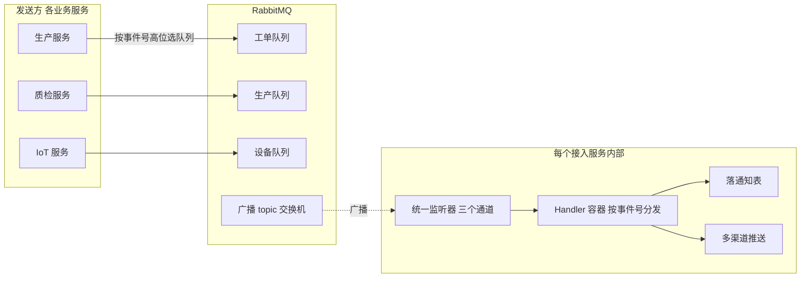
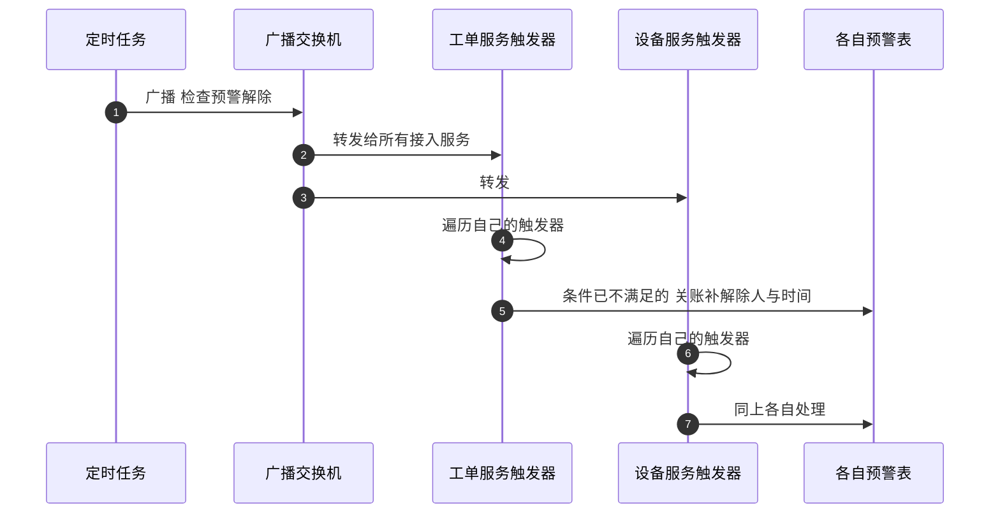

面试聊到消息队列，大多数候选人的答案在"削峰、解耦、异步"六个字上就停了。再往深追问就见真章："一条事件要被十几个服务各自消费，你的事件模型怎么设计？""消费者怎么知道自己该处理哪条消息？""消息丢了怎么办——**哪些消息允许丢，想过吗？**"最后一问最狠，因为它考的不是组件用法，是对自家业务流量分级的真实理解。

本篇拆这套 MES 的自建事件总线——机制点清单里"MQ 事件总线"的兑现。它不是引一个 MQ 中间件那么简单：整套总线收在一个所有服务共享的 jar 里（事件模型、队列声明、消费分发、通知落库、多渠道推送），业务服务写一个空配置类继承基类就完成接入。本篇讲它的三个设计核心——位编码事件号、自注册 Handler 容器、广播式预警解除——以及同等重要的部分：**一份诚实的可靠性欠账清单**。

<!-- more -->

## 一、事件模型：一个 int 承载路由和类型

自建总线的第一刀切在事件模型上。业务事件是一个可序列化的简单对象：事件号、工厂 ID、业务对象 ID、数据 JSON、流程类型、一个每次构造自动生成的全局唯一 ID（多租户字段在场——事件从出生就带着工厂身份）。

核心设计是事件号的**位编码**：一个 int，高 16 位是模块号（设备、模具、质检、生产、工单、仓储……十三个业务模块，外加一个 255 号的全局广播），低 16 位是模块内的业务事件序号。全系统九十多种事件（工单下发、预计延期、保养到期、工艺参数超限、安灯呼叫……）共用这一个编码空间。

这个设计的精妙处在于**一个字段同时干了两件事**：

```java
int eventId = event.getEventId();
int moduleId = eventId >> 16;      // 高16位 决定投递到哪个模块的队列
int bizId   = eventId & 0xFFFF;    // 低16位 决定由哪个 Handler 处理
```

发送侧按高 16 位查"模块号 → 队列名"映射表决定投递目标，消费侧按完整事件号在 Handler 容器里找处理器。没有路由配置文件、没有事件注册中心，**事件号的二进制结构本身就是路由协议**。当然它也有代价：模块号是稀缺资源，这套系统里能查到历史注释——两个早期平台的模块号下线后，编号被新模块复用，说明**编码空间管理出过冲突**；位宽也是硬约束（低 16 位意味着每模块最多六万多种事件，倒是够用很久）。

另一套系统事件走独立通道：任务状态、设备断连、导出超时、数据增长异常这类"运维级"事件，带自己的路由键走专用 topic 交换机，消费端直通钉钉、短信等运维告警渠道——**业务事件和系统事件从模型到通道全部分离**，因为它们的消费者（业务 Handler vs 值班运维）根本是两种物种。

## 二、拓扑：一条队列一个模块，直投不绕路

拓扑保守得出奇：每个业务模块一条持久化队列，命名按统一惯例（`mes.queue.模块名`），**直接投默认交换机**——队列名就是路由键，没有任何 exchange 绑定规则。另开两个 topic 交换机：一个业务广播通道，一个系统事件通道。



直投默认交换机是个值得讨论的取舍：topic 交换机可以做灵活的通配订阅，但默认交换机 direct 语义最简单——**发到队列名，就完事**。这套系统的订阅关系其实很稳定（模块固定、队列固定），灵活路由的需求被模块号编码吸收了，拓扑就没必要复杂。映射表里还有多对一的务实痕迹：螺杆模块的事件挂到模具队列、安灯事件挂到生产队列——**队列是部署单元不是逻辑单元**，小模块不值得独占一条队列。

发送侧是同步的：调用线程直接投递，投完往发送日志表记一笔（含事件全局唯一 ID），预警类发送前还要过工厂级事件开关——工厂可以整体关掉某一类预警的推送。同步发送意味着 MQ 挂了会拖累业务主流程，这个欠账第五节专门讲。

## 三、消费侧：配置激活 + 自注册容器

消费侧有两个设计，都是"约定优于配置"的教科书变体。

**激活是配置驱动的。** 统一监听器上挂着条件注解——配置文件里声明了队列名这个类才存在。它的孪生约束是：每个接入服务还要有一个继承总线基类的空配置类，基类里的 Bean 定义负责在启动时自动声明队列、交换机和绑定（RabbitAdmin 自动声明，**不需要人工去控制台建队列**）。这套激活链的坑记录得很诚实：只加配置不加配置类，监听器会去监听一条不存在的队列，服务直接启动失败；反过来只加配置类不加配置，条件注解不满足，静默不接入。**"接入三步"被文档化成标准动作**，但两条失败路径都有真实踩过的痕迹。

**分发靠自注册容器。** 每个 Handler 实现统一接口（处理事件 + 报告自己的身份信息），在自己的**构造函数里**调用容器单例的注册方法，把自己挂到"事件号 → 处理器"的 Map 上。消费收到事件后按事件号取 Handler，取不到打一条 error 日志后确认消息、继续消费——不崩、不重投。

构造函数自注册 vs 注解扫描，值得停下来比一比。注解扫描更"现代"：定义 `@EventHandler(EVENT_ID)` 注解，启动时扫容器。总线选了构造函数注册，原因和的字符串策略路由同源——**注册动作显式可见**：新写一个 Handler，注册这行代码就是它的存在声明，IDE 跳转直达；而注解扫描把注册关系藏进了反射的黑盒，"这个事件号有没有人处理"变得需要全文搜索才知道。代价是容器 API 命名不一致的坑真实存在（三个容器两个叫 regist、一个叫 register），以及一个复制粘贴事故——某 Handler 的"身份报告"方法返回了别的类的类名，日志定位时带偏了排查方向。**显式注册的代价是手工错误的概率，隐式注册的代价是可读性**，这笔账各团队各算。

## 四、预警的生命周期：产生、广播、解除

通知类流量里最讲究的是预警（Alert）——它和一次性通知（Notice）的本质区别是**有生命周期**：产生了就必须有解除，解除前一直在看板角标上闪。这套系统的预警三档分级（通知/预警/告警），落三张表，预警表比通知表多出等级、解除人、解除时间字段。

产生侧是"触发器"模式：每种预警实现一个触发器接口（触发 + 列出可解除的预警），构造函数注册进触发器容器；触发时机两种——定时任务周期扫描（保养到期、预计延期），或 IoT 实时数据驱动（工艺参数超限当场触发）。

解除侧的设计最见巧思。一个定时任务广播一条"检查预警解除"的消息到 topic 交换机，**所有接入服务都收到**，各自的预警管理器遍历自己的触发器问一遍："你那些预警，条件还满足吗？"不满足的各自关账（补解除人和解除时间）。用广播而不是逐个 Feign 询问，是因为"谁有预警"这个信息只存在于各模块自己的触发器里——中心化收集再下发是两轮网络调用加一个中心化的状态表，广播让**解除逻辑留在产生逻辑旁边**，中心只负责喊一嗓子。



落库之后是"通知中台"的最后一段：统一的消息扩散服务把通知发往小程序、企业微信、钉钉机器人、短信、邮件，预警还有**语音播报**——把文案里的数字转成朗读格式（正则处理十位八位数字的逗号读法）推到车间音响，播报限速靠线程休眠。扩散用四线程的小线程池异步化，发送结果全部记发送日志。MQ 事件本身不直接推手机——**移动端模块根本不连 MQ**，链路是事件落库、扩散服务异步推。这个间接层的价值在第五节就看得出来：推送渠道的失败不反噬业务事件。

## 五、可靠性欠账清单：诚实比完美值钱

这一节按真实代码讲这套总线的欠账，每一条都是面试里"你们消息怎么保证不丢"的诚意素材。

**消费失败即丢。** 统一监听器捕获 Handler 的所有异常只打日志不重抛，配的是自动确认模式——消息处理失败不会重回队列，**没有死信队列、没有重试**。配置类里留着大段被注释的手动 ack 代码，是演进痕迹：早期手工 ack，后来换 @RabbitListener 方案时把重试复杂度一起扔了。支撑这个决策的业务判断是：**通知类流量丢了可容忍**——预警基于定时任务持续重扫，丢了下一轮会再来；落库类消息真丢了，看板少一条红点，不至于资损。这套逻辑对交易类消息（扣料、回写）不成立，所以那些链路根本不走事件总线，走的是同步接口加事务。

**幂等有地基没闭环。** 发送日志表带着全局唯一 ID，按理是现成的查重依据——但查重接口写好了没人调用。真出现重复消费时，多数 Handler 靠业务查询兜底（通知已存在就不再插）。**幂等设施只建了一半**，这是复盘时公认的第一优先补齐项。

**MQ 挂了业务会疼。** 发送没有生产方确认、没有 try-catch，事件发送内联在业务 Service 里，MQ 不可用时异常会随业务事务回滚——主流程被通知类旁路拖累，违反"旁路不应反噬主路"。工厂级事件开关是事实上的止血阀，正确的手术是把发送改异步加确认，发送失败落补偿表。

**堆积吃过亏。** 监控专用队列的配置类注释写着血泪："队列参数改过必须删队列重建（PRECONDITION_FAILED）"、"消费端宕机或 DB 故障时堆积必须有界，绝不拖垮 broker 磁盘连坐业务队列"。它的配置是教科书级的隔离组合：消息 TTL 三十分钟、队列长度上限、超限从头部丢弃、毒消息不重回队列。**这套参数只在监控队列上生效**——业务队列还没享受到，欠账又记一笔。

**序列化还是 JDK 默认。** JSON 转换器配了两处、注释了两处，事件对象靠 JDK 序列化传输，版本号写死防漂移——和讲过的 Session JDK 序列化是同款风险、同款克制：字段只放简单类型，改字段必须全局同步发版。

把欠账列全之后，一个面试的高分结构自然浮现：**先讲流量分级（什么能丢什么不能丢），再讲现状与欠账，最后讲改进的优先级**——比背"生产方确认 + 手动 ack + 死信 + 幂等消费"四件套可信十倍，因为四件套谁都会背，分级和取舍才是真做过的人才有的东西。

## 六、演进三阶段与选型分界

考古这块代码能看到清晰的三阶段：最早期 fanout 广播三条队列加手工 ack 容器（大段注释代码）；中期收敛为"每模块一条队列 + 事件号路由"的现行形态；近期长出系统事件通道、数据同步通道和 CDC 接入的第三种队列声明写法。**一个自建基础设施的演进史，就是使用它的团队对"够用"二字的定义不断修正的历史。**

选型分界线也值得复述一遍：进程内 Spring Event 只用于 MQTT 连接层——分界是"跨不跨进程"；同步取数走 Feign、异步通知走 MQ——分界是"要不要当场拿到结果"；而一发多收的场景（预警解除广播、多服务各自落库通知）是 MQ 不可替代的决定性理由。这套总线的最终形态，一句话概括：**一个 jar 让任何服务免费获得"收事件、发通知、管预警"的全套能力**——它是个消息中间件的用法问题，更是个通知中台的设计问题。

## 七、面试视角：六个问题拆到底

**Q1：你们 MQ 怎么保证消息不丢？**

答：先分级再回答。通知预警类：允许丢，预警靠定时重扫自愈，所以消费端自动确认加异常吞掉，没上死信——丢的成本是看板少个红点。交易类：不允许丢，这类操作不走 MQ，走同步接口加分布式事务。中间地带（发送日志、扩散记录）落库可查可补偿。诚实补充：当前发送侧无生产方确认，MQ 故障会随业务事务回滚，这是已记录的欠账，改造方向是异步发送加补偿表。

**Q2：事件模型怎么设计的？**

答：单个 int 位编码——高十六位模块号做路由键（决定投哪条队列），低十六位业务序号做消费分发键（决定哪个 Handler）。九十多种事件共用这个空间，外加一个广播模块号。好处是零配置路由，代价是编码空间管理（历史上有模块号复用的冲突）。

**Q3：新写一个消费者要动哪些地方？**

答：实现统一接口、构造函数里把事件号注册进容器单例、把类放进会被扫描的包——三步，不动总线一行代码。配套的坑要背下来：容器注册方法命名不一致、漏注册的唯一症状是一条"无人处理"的 error 日志、身份报告方法别复制粘贴错。

**Q4：MQ 不可用时业务怎么办？**

答：现状要诚实：发送内联在业务事务里，MQ 故障会拖累主流程，靠工厂级事件开关止血。正确形态我画过：发送异步化加失败补偿表，旁路流量和主路流量在连接层隔离；更进一步按模块拆分发送通道，防止单一 broker 故障面扩大。

**Q5：消息堆积怎么处理？**

答：先定位再限流。定位看是消费慢还是生产暴量；限流用队列参数兜底——TTL 过期、长度上限、超限丢头、毒消息不重回队列，保证堆积有界不连坐。这套参数先上了监控队列，业务队列的推广是待办。预防侧：消费线程池独立、慢 Handler 拆出去，别让一条慢事件堵住整条队列。

**Q6：广播怎么实现，为什么不用 fanout？**

答：广播场景是"预警解除"和"全员落库通知"，用 topic 交换机加统一绑定键实现。没选 fanout 的原因是广播消息往往还要带语义路由（按事件类型或系统事件类型区分消费者），topic 的绑定键给了这层灵活性，而 fanout 的无差别投递会让每个服务都收到自己不需要的消息再自己过滤——**广播的粒度应该由交换机管，不该由消费者管**。

## 小结

- **位编码事件号是自建总线的灵魂**：一个 int 同时承载路由和分发，零配置的代价是编码空间要有人管；
- **队列是部署单元不是逻辑单元**：小模块挂大模块的队列，direct 直投比花哨拓扑更符合稳定订阅的现实；
- **自注册容器让接入是三行代码的事**：显式注册换可读性，命名不一致和复制粘贴是它的真实成本；
- **预警的解除用广播**：解除逻辑留在产生逻辑旁边，中心只喊一嗓子——一发多收是 MQ 不可替代的场景；
- **可靠性的答案从流量分级开始**：通知可丢、交易不走 MQ、中间落库补偿——先分级再谈保证；
- **欠账清单是最好的面试素材**：堆积参数、幂等半成品、序列化克制，每一个"没做完"都带着做过的人才有的判断。

下一篇预告：定时任务体系——Quartz 的两条加载路径（重启加载与 MQ 即时生效）、任务管理的页面化治理，以及"任务不跑"这个 MES 运维最高频工单的排查套路。
