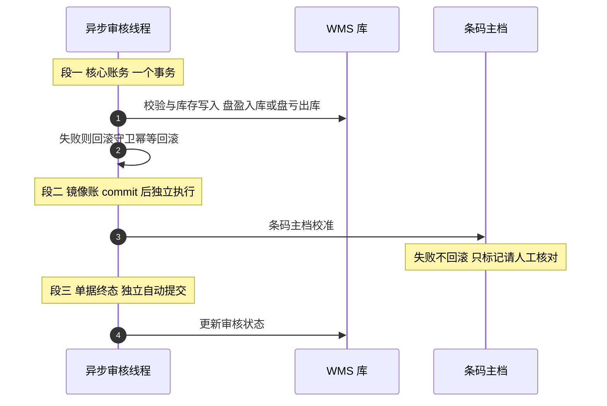

"库存怎么防超卖？"——这道题的标准答案满地都是：乐观锁、分布式锁、Redis 预扣。但它们回答的是"一次扣减怎么安全"，仓储系统的真问题是另一层：**账本本身怎么设计，才能让成千上万笔不同性质的动作（入库、领料、冻结、盘点、调拨、组装）打在同一个账本上，一年到头对得起来**。锁是战术，账本是战略。

本篇拆这套 WMS 的库存账本设计。它和已发布的（一次事故的显微镜）、上一篇（倒冲扣料的一生）共同构成库存三部曲：事故篇讲"怎么摔的"，边界篇讲"一笔扣料怎么走"，本篇讲"整个账本为什么散不了架"——三维状态从表、三个收敛原语、多层并发闸、三段式异步簿记，和一条"双写一定会漂、漂了要能自愈"的工程信仰。

<!-- more -->

## 一、账本的四张表与三维状态

一次库存动作要动四张表，每张表的职责切得很干净：

| 表 | 职责 | 关键内容 |
|---|---|---|
| 库存明细表 | 账本主体 | 现存量、批次、库位、辅助属性、乐观锁版本号 |
| 状态从表 | 数量的状态拆分 | 按质量 × 业务 × 位置三维各记一份量 |
| 操作流水表 | 每笔动作留痕 | 变动量 + 变动后结余 |
| 条码主档 | 条码维度的镜像账 | 可用量、初始量、位置 |

最有味道的是状态从表。库存的量不是一个数，是三个维度的组合：**质量状态**（合格/待检/不合格）× **业务状态**（正常/冻结中）× **位置状态**（在库/在途），每个组合各记一行、各带自己的数量。于是一个天生漂亮的性质出来了——**可用量不是存储的字段，是查询条件的自然推导**：所有可分配库存的查询都强制带上"合格 + 正常 + 在库"三个条件，冻结量、在途量、不合格量天然从可用量里消失，不需要任何减法运算。要新增一个状态维度，加从表行而不是改表结构。

为什么状态拆从表、不在明细表上加三个字段？因为一个明细可能同时有"一部分合格、一部分待检"——放字段就得拆明细行，放从表就是加一行，**数量变更的粒度和账本的行粒度对齐**，更新永远是对从表单行的小事务。

流水表的字段设计也有个反直觉的选择：不记 before/after 两个数，而是记**变动量 + 变动后结余**。为什么？因为对账的时候，任何一笔流水都能用"上一笔的结余 + 我的变动量"校验出我的结余——流水和流水之间是链式自洽的，缺一笔、改一笔、重一笔都能被前后夹出来。before/after 双数看起来信息更全，实际给篡改和漂移留了自由度。**流水的设计目标不是记录历史，是让历史可被数学校验**。

## 二、原语收敛：所有业务汇到三个入口

采购收料、生产入库、销售出库、组装拆卸、跨厂调拨、盘点调整、倒冲扣料——业务动作十几种，但往下追到底层，全部汇到**三个库存原语**：入库（插明细 + 插状态行 + 写 Increase 流水）、出库（校验 + CAS 扣减 + 写 Decrease 流水）、在途切换（在库 ↔ 在途的状态迁移加扣减）。单据层各写各的，库存层只有一个入口家族。

这个收敛是整套一致性设计的地基。反例很容易想象：如果组装拆卸自己写一套扣减 SQL、倒冲再写一套、销售出库再写一套，三个月后就会有三种对"扣减是否校验充足量"的不同理解、两种写流水和不写流水的实现，对账程序无从下手。收敛之后，**校验、锁、乐观锁、流水这些防御只需要布防三个口子**——上一篇边界篇讲的"倒冲复用正常出库通道"，正是这个收敛原则的落地样本。

收敛还有一个容易被忽略的隐性收益：业务规则可以挂在原语的调用参数上。组装拆卸审核通过后要先"解冻再出库"，代码注释里写着原因——出库查询强制业务状态为正常，不解冻就查不到自己的库存。这种"忘了解冻"的 bug，在没有收敛入口的系统里会以五种形态散落在五个模块；收敛之后，它只需要在审核方法里出现一次。

## 三、入库即冻结：给"质量未定"的量一个隔离期

冻结是仓储和业务系统差异最大的概念。这套系统的规则是：**生产入库、采购入库（按配置）、跨厂调拨入库，入账后自动冻结**——冻结的语义是"已入账，但质量未定"。

实现很优雅：入库原语在入口集中判定冻结决策（按业务类型查物料的仓储属性），冻结就是状态从表里记一条"业务状态 = 冻结中"的量，附一笔冻结流水；出库查询强制"业务状态 = 正常"，所以冻结量**不需要任何拦截代码就天然不可领用**——它不是被挡住的，是根本不在可用量的口径里。

解冻有三条路径：采购检验合格自动解冻（支持部分解冻——冻结量大于待解冻量时把状态行拆成两条）、库存检验完成解冻、人工解冻。每条路径都写解冻流水，流水里带着冻结时点的三态快照，事后能完整回答"这批货什么时候因为什么被冻、什么时候被谁放出来"。

这套设计回答的是制造现场的 truth：**实物进了仓库，不等于它可以被使用**。待检的料被工人顺手领走，是所有质量事故的源头之一。把"账上有"和"能用"分开，冻结就是那道时间的隔离墙。

## 四、盘点：账和实的一次正式对话

盘点是账实一致性的终极仪式，也是并发设计最微妙的地方——**盘的期间，仓库还在正常出入库**。这套系统的应对是一组环环相扣的约束：

**建单时**：同一仓库 + 物料 + 库位的盘点范围与任何未完成盘点单重叠即拒绝——保证同一个账本区域不会有两场盘点同时进行。

**录入时**：实盘提交按明细 ID 加锁防并发；每一行录入都校验库存明细的乐观锁版本号，**盘点期间这条明细的库存动过，这一行就拒绝提交**——要么重盘，要么等差异处理。宁可重盘，不要"盘出来一个混着中间态的数"。

**漏盘兜底**：盘点范围内没有回传实盘数的明细，默认按实盘 0 处理（全部盘亏）——但因为太凶残，必须二次确认才能生效。这个默认值的选择本身就值得玩味：漏盘按 0 是"发现管理漏洞"的立场，按"维持原账"是"给管理者留后路"的立场，系统选了前者。

**差异入账**：差异生成盘盈/盘亏两张库存调整单，审核后才真正动账——盘亏复用出库原语，盘盈复用入库原语。又是原语收敛：连"改错账"都不开新路径。

最有技术含量的是**线边盘盈亏的异步审核**。审核动作是异步执行的，一个审核要动三类资产（库存、条码主档、单据状态），一致性要求不同，于是拆成三段：

段一是核心账务，一个事务内完成，失败时由一个"回滚守卫"收尾——守卫先判断当前线程存在未决事务上下文才回滚，且回滚幂等（已提交后再调是空操作），保证"先回滚、再独立簿记"的顺序不会错。段二条码主档校准放在核心事务 commit 之后独立执行，失败**不回滚账务**，只落"请人工核对"的标记——镜像账的精度和核心账的原子性是两种要求，不能互相绑架。段三单据终态独立提交。配套还有一个启动恢复器：服务重启后把卡在"审核中"的单据全量复位为待审核——**异步任务的中间态必须在进程重启后有出路**，否则一次发布就是一批永久卡死的单据。

盘亏审核里还有个防"批量预检陷阱"的细节：多行盘亏可能共享同一段库存明细，每行预检时量都够，实扣时才爆——所以分配时用一个"已占用"映射做行间预占。这是"检查通过 ≠ 提交会成功"在批量场景下的标准解法。

## 五、双写一定会漂：条码主档的两种维护策略

库存明细和条码主档是同一事实的两本账（明细管仓位批次维度，主档管条码维度），双写就一定会漂。上一篇事故篇讲过双写怎么闯祸，本篇讲漂了之后怎么活。

系统里两条维护策略并存：**增量式**——每次动作在主档上加减，可用量不允许为负，超扣直接抛异常阻断（负数主档比差一分钱的账严重得多）；**绝对校准式**——把该条码在所有仓位的明细现存量求和，直接覆写主档可用量。增量式保实时，校准式保收敛：**漂移不可怕，有一个随时能把账拉回来的绝对基准才可怕**。校准在盘盈亏审核、调拨接收等关键节点触发，双写漂移被压在"两次校准之间"的窗口里。

这个思路可以推广成面试里的一句话：**能接受最终一致的双写，前提是给其中一个副本一个"重新对齐"的机制**——对齐可以是定时全量、事件触发，或者像这里的关键节点校准。没有对齐机制的双写，才叫事故；有的，叫架构。

## 六、并发闸的多层布防

把这套系统挡并发和重复的手段全列出来，会发现它们不是一个层面的东西：

- **业务锁**（Redis）：按"工厂 + 物料 + 仓 + 库位 + 批次"组合键哈希加锁，粒度细到"同一格货架"；注解版直接标在 Controller 或 Service 方法上；
- **量校验**：出库前充足量判断——挡的是逻辑错误，不是并发；
- **乐观锁 CAS**：扣减带版本号、批量用一条 CASE 语句、影响行数不足整批失败——挡并发覆盖；
- **唯一约束 upsert**：状态从表、冻结登记表全部 `on duplicate key update`——重复提交变成幂等累加；
- **内容寻址唯一键**：入库明细的幂等键是对"工厂 + 物料 + 库位 + 批次 + 供应商 + 条码"整串做哈希，同内容重复提交触发唯一键冲突，转成友好提示——**幂等键的内容寻址设计**，比"业务单号去重"更能防住"换了单号但内容相同"的重复；
- **CAS 终态翻转**：单据状态更新带事务独占标识做 CAS，异步审核前重读状态、不是"审核中"就放弃——防拒绝/复位后的重复入账。

而 `SELECT FOR UPDATE` 全库只有一处（打印份额扣减）。**行锁不是不好，是它会让事务持有数据库连接排队**——能用"乐观锁 + 业务锁 + 幂等"组合解决的地方，悲观锁是最后手段。这套布防的排序逻辑值得背下来：先幂等（重复无害），再乐观锁（冲突重试），最后业务锁（串行化入口），悲观锁殿后。

## 七、口径与纪律：关账、归档和"例外要有出处"

最后三个偏运维但面试很加分的机制。

**期末关账**：财务月结后，当月库存操作要封账。有意思的是这套系统的关账表**只做登记、不做接口拦截**——真正的封账体现在扣料口径上：倒冲扣料在关账后回写时，把簿记时间压到关账时刻前一秒、剔除关账后的流水再算。为什么不硬拦？因为硬拦会让关账瞬间卡死所有在途作业；口径收口让"账期"和"作业"解耦——**财务要的是归属期正确，不是操作被禁止**。

**流水归档**：操作流水是增长最快的大表，归档任务按配置的保留天数搬运，类头注释立了规矩："主键三步法 + 组级短事务（500 行一提交），禁止类级事务"。上一篇讲过 28GB 大表在线瘦身的教训，这里是它的制度化和预防版。另有按日库存快照任务，给追溯和对账提供时点基准。

**纪律的例外要有出处**：属性修改（改批次、改生产日期）这类危险操作各自有独立流水表加业务锁；而全仓库唯一一处硬编码跨库 join 留在修数工具里。**一个系统的工程成熟度，不在于它有没有例外，在于例外是不是被显式记录和管理**。

## 八、面试视角：六个问题拆到底

**Q1：库存怎么防超卖和负库存？**

答：分三层。逻辑层：出库前量校验挡住正常路径的超量；并发层：乐观锁 CAS 加影响行数校验，并发覆盖会导致更新失败抛"繁忙"；口径层：可用量在查询时强制"合格+正常+在库"三条件，冻结和在途量根本进不了分配视野，条码主档增量更新不允许为负、超扣阻断。超卖不是被某一把锁挡住的，是三层各自挡住一种形态。

**Q2：可用量怎么定义和实现？**

答：定义是"现存量 − 冻结 − 在途 − 不合格"，实现上不做减法——状态从表按质量×业务×位置三维各记一行数量，可用量就是带三个条件的查询的自然结果。好处是新增状态维度零表结构变更，坏处是所有可用量查询都要带齐条件，漏一个条件就是一次事故，所以条件收在入库/出库原语里而不是散在各业务查询里。

**Q3：盘点期间仓库还在出入库怎么办？**

答：四道约束：建单时盘点范围与未完成单重叠即拒；录入行校验明细乐观锁版本号，库存动过的行拒绝提交（宁可重盘）；漏盘行默认实盘 0 但需二次确认；差异审核后用出入库原语入账，不另开改账路径。核心立场是**盘点数据和业务中间态宁可隔离失败，不可混合成功**。

**Q4：异步审核怎么保证一致性？**

答：按资产的精度要求分三段：核心账务一个事务、失败由幂等的回滚守卫收尾；镜像账（条码主档）在 commit 后独立执行、失败不回滚只标记人工核对；单据终态独立提交。配套启动恢复器把进程重启后卡在"审核中"的单据复位。要点是**承认不同数据的一致性等级不同，把它们拆开而不是包一个大事务**。

**Q5：库存和条码主档双写漂移怎么办？**

答：接受它会发生。增量式维护保实时（负数即阻断），绝对校准式在关键节点把主档覆写为全仓位明细之和，作为收敛基准。双写的工程问题从来不是"怎么不漂"，是"漂了之后有没有一个能把账拉回来的机制"。

**Q6：库存流水表怎么设计？**

答：记变动量加变动后结余，不记 before/after——流水之间链式自洽，缺改重都能被前后夹出来，对账是数学校验而不是人工比对。再配按日快照和保留期归档（组级短事务防大事务），流水就是这套系统里唯一不可妥协的资产。

## 小结

- **账本一致性是战略，锁是战术**：三维状态从表让"可用量"成为查询的自然推导，而不是扣减后的残留值；
- **原语收敛是所有防御的地基**：十几种业务动作汇到入库/出库/在途三个入口，锁、CAS、流水只布防三个口子；
- **入库即冻结**：把"账上有"和"能用"分开，待检量的隔离靠状态口径而不是拦截代码；
- **盘点的立场是宁可重盘不可混合**：版本号拒提交、漏盘按零二次确认、差异走原语入账；
- **异步簿记按一致性等级分段**：核心账务一个事务、镜像账独立收敛、终态独立提交，外加启动恢复兜底；
- **双写必漂，对齐机制才是答案**：增量保实时、校准保收敛；
- **并发闸的排序**：幂等 → 乐观锁 → 业务锁 → 悲观锁殿后，`for update` 全库只有一处是克制的勋章。

下一篇继续数据线，讲**数据库设计规范与字典体系**：全库主表的标准字段约定、联合索引范式、字典三表与多语言体系——那些"没有技术含量"却决定了系统能不能活十几年的地基。
