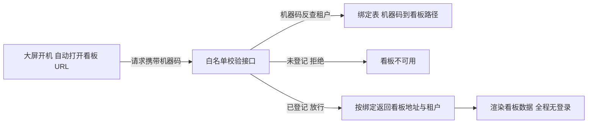

电子看板是 MES 的脸面——客户老板参观工厂时看的就是那几块大屏。但对开发团队它是个出了名难伺候的东西：**每个客户要的图表不一样、每块屏挂的位置不一样、大屏浏览器没有登录态、数据量还随工厂规模线性涨**。处理不好，看板就变成"十七个复制粘贴的 Controller"——本文的主角恰好就是这么开始的，所以它后来的每一步收敛都有讲头。

本篇是交付线的收尾，拆这套系统的看板体系：可配置布局怎么把 Controller 数量封顶、日预聚合表怎么扛住几十块大屏的轮询、**用 MAC 地址当凭证的"无人大屏"鉴权**及其代价，和 three.js 的 3D 车间监控值不值。看板不大，但它是"多租户 + 多端 + 高频轮询 + 免登录"四个难题的交集，麻雀虽小。

<!-- more -->

## 一、可配置：从复制粘贴到布局存表

这套看板体系的第一代产物就是"十七个 Controller"——每个客户、每块屏、每种主题一个 Controller，URL 一对一。它能跑，但每接一个客户就是一轮复制改。

收敛后的形态是**三层分离**：一个"大屏容器页"负责承载（全屏、无浏览器边框、按配置加载图表组件）；**布局存表**——哪块屏放哪些图表、每个图表的数据源和位置，全部是数据库里的行（看板表 + 图表表 + 指标图表关联表），改布局是改数据不是改代码；数据服务按指标域拆分（计划达成、设备综合效率、质量、安灯、SmartReport 报表中心……），Controller 数量随"指标域"增长而不再随"客户×屏幕"增长。**可配置的验收标准**和的协议适配一样苛刻：新客户的一块新大屏，实施人员配数据、配布局就能上线，开发只在新指标出现时才需要动手。

## 二、数据层：明细表喂不动大屏

看板查询的天敌是它自己的使用方式：**几十块屏、每块三十秒一轮、一开就是一整天**——如果每轮都去扫生产明细表，数据库会被这种"永远在线的低价值查询"拖垮（明细表还要伺候报工写入，讲过写路径的锁有多金贵）。

解法是**明细与预聚合的双轨取数**：看板的高频指标（当日产量、达成率、设备效率）查按天预聚合的报表表（日产量表、设备效率日表），这些表由的定时任务在夜间和整点计算；只有"当前正在生产的工单"这类真实时数据才查明细表。 Mapper 里的证据一目了然：聚合表的引用次数远高于明细表。

刷新节奏也做了分层：**数据三十秒一轮、时钟三秒一轮**——时钟给大屏提供"活着"的观感，数据用可接受的延迟换数据库的命。看板数据的新鲜度要求和生产操作不同（晚三十秒看见产量不影响任何决策），**按消费者分 freshness 等级**是高托认知的入门课。

## 三、无人大屏的鉴权：用物理标识当凭证

看板最难缠的问题是鉴权。大屏浏览器常年全屏开着某个页面，**没有人登录、没有人输密码、没有人点注销**——互联网的会话模型在它身上完全失效。这套系统的答案是 MAC 地址白名单：

第一次部署时，实施人员把大屏的机器码登记进绑定表、和某个租户的某个看板 URL 绑上；之后大屏每次打开凭机器码反查——查到就放行对应看板，查不到就拒绝。这套设计的巧妙与代价都值得说：

**巧在它贴合大屏的物理属性**：大屏是钉在墙上的设备，物理位置就是它的身份——机器码不可篡改性虽然不如密码，但"走进车间改一块屏的 MAC"的攻击成本远高于收益；且租户隔离顺带解决（机器码绑定到具体租户，**跨租户蹭 URL 在白名单模型下天然不通**）。

**代价也要点名**：换块屏（硬件坏了）就要重新登记；机器码在不少设备上可软件伪造；白名单接口本身必须匿名可达，它的攻击面就是整个看板数据——所以白名单接口只返回"该看哪个 URL"，真正的数据接口还要再过一道租户条件。**用物理标识当凭证是工程权衡不是安全最佳实践**，面试聊到要主动说清它的适用边界：封闭园区、低价值数据、设备位置即身份的场景。

## 四、3D 形态：什么时候值得上 three.js

看板的进化方向之一是 3D 车间建模——用 three.js 把车间、机台、在制品渲染成可旋转的三维场景，机台状态实时着色。这套系统里的 3D 看板是**独立打包的 Vue 应用**（three.js 藏在 vendor 包里），后端只提供按设备维度的 JSON 接口。

对 3D 的评价要冷静：它的价值排序首先是"汇报观感"，其次才是信息密度——同样的数据用平面图表也能呈现，但三维车间模型对"哪台机在哪、什么状态"的空间表达确实无可替代。工程上它带来两个真实成本：**渲染端**（几十台设备的实时着色要控 drawcall，模型文件要压缩）和**接口形态**（3D 前端是独立打包的静态资源，跨域访问数据接口时 CORS 直接放开——内网大屏场景可以接受，但这个口子要留 knowingly）。**3D 是看板军备竞赛的终点而不是起点**——先把二维图表的可配置和数据层做稳，3D 是锦上添花的最后一步。

## 五、多端同源：看板接口的三种消费者

看板体系的另一个隐形设计是**接口与端解耦**：同一套看板数据接口，被三种端消费——JSP 大屏（容器页加图表组件）、独立打包的 Vue/3D 应用（跨域调用）、客户的 Android 看板 APK（装在车间电视盒子上轮询同一套接口）。甚至还有按客户定制的特化服务（某客户的三维辅机监控有专属数据组装逻辑，以独立 Service 挂在通用 Controller 后面）。

多端同源的前提是接口的**租户上下文不依赖会话**——三种端里只有 JSP 大屏和平台同域，另外两种都是"匿名加白名单"消费。所以看板接口的租户语义全部来自机器码绑定或显式租户参数，和主系统的 Session 体系（）刻意解耦。**面向"物"的接口和面向"人"的接口，鉴权模型要分开设计**——这是看板篇最想留下的通用原则。

## 六、面试视角：五个问题拆到底

**Q1：看板系统怎么做到可配置？**

答：三层分离——容器页管承载、布局存数据库（屏到图表的绑定是数据行）、数据服务按指标域拆 Controller。验收标准是新客户新大屏由实施配数据配布局上线，开发只在新增指标时介入。反例就是我们自己的第一代：每屏一个 Controller，十七个复制粘贴的起点。

**Q2：几十块大屏三十秒一轮，数据层怎么扛？**

答：双轨取数：高频指标查按天预聚合的报表表（夜间和整点由定时任务计算），真实时数据才查明细；刷新分层——时钟三秒撑观感、数据三十秒保数据库。原则是看板查询和业务写入抢资源时，先让路的是看板——它的数据晚三十秒不产生决策损失。

**Q3：没有登录态的大屏怎么鉴权？**

答：机器码白名单——实施时把大屏机器码与租户看板 URL 绑定，开机凭机器码反查放行，未登记拒绝。它用"物理位置即身份"换掉了会话模型，顺带解决了跨租户蹭 URL；代价是换屏重登记、机器码可伪造、白名单接口自身匿名可达——所以白名单只给地址，数据接口还要过租户条件。适用边界是封闭园区低价值数据。

**Q4：看板为什么用轮询不用 WebSocket？**

答：算过账：几十块屏的轮询对预聚合表是几十 QPS 的简单查询，WebSocket 要维护长连接、心跳、断线重连和推送扇出，基建成本换来的只是"秒级新鲜度"——而看板数据三十秒的延迟没有决策损失。WebSocket 留给真正事件驱动的场景（质检呼叫、设备报警弹窗）。技术选型的标准不是新不新，是新鲜度值不值。

**Q5：3D 车间看板值得做吗？**

答：价值排序要诚实：汇报观感第一、空间表达第二、信息密度反而不如平面图表。工程成本在渲染端（实时着色的性能、模型压缩）和接口形态（独立打包应用带来的跨域暴露）。我们的定位是锦上添花——先做稳可配置布局和预聚合数据层，3D 是最后一步；反过来先上 3D 的项目，通常死在数据层撑不住上。

## 小结

- **可配置的验收标准是实施自助**：布局存表、数据服务按指标域拆分，Controller 数量随指标增长而不是随客户×屏幕增长；
- **看板数据层靠预聚合扛**：明细喂不动"永远在线的低价值查询"，刷新节奏按消费者分层（时钟三秒、数据三十秒）；
- **无人大屏用物理标识当凭证**：机器码白名单贴合大屏钉在墙上的物理属性，顺带解决租户隔离——代价与适用边界要主动讲；
- **面向物的接口和面向人的接口鉴权分家**：看板接口的租户语义来自机器码绑定，与 Session 体系刻意解耦；
- **3D 是看板军备竞赛的终点不是起点**：数据层和可配置做稳之前，three.js 只是负债；
- **多端同源靠接口解耦会话**：JSP 大屏、Vue 应用、Android APK 消费同一套接口，匿名加绑定是它们的公共上下文。

下一篇预告：进入端侧与工具链线——**X5 WebView 壳与 JSBridge**：给传统 MES 的 H5 页面装上扫码、推送、打印的原生能力，腾讯 X5 内核的降级策略、双通道扫码（ZXing + 华为 ScanKit），以及在 targetSdk 34 时代维护 minSdk 19 老壳的适配史。
