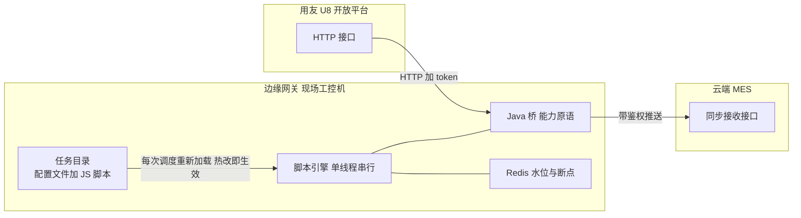

"你们 MES 怎么和 ERP 集成的？"——制造系统面试的必答题。它看着是个集成问题，实际考的是两层东西：**接口形态的判断**（对方给什么，HTTP 开放接口、WebAPI、还是只能连数据库？）和**增量同步的工程**（数据怎么不丢、不重、可恢复）。前者是应变，后者是内功——而绝大多数候选人只会答"写了个定时任务同步数据"。

这一篇拆同一个平台上真实跑过的**四种 ERP 适配层**：用友 U8 的边缘同步引擎（脚本热改，主菜）、金蝶 K3Cloud 的表单级 WebAPI、SAP Business One 的直连数据库、以及新旧 MES 并行期的同步中间件。上一篇讲的是交付形态，本篇讲的是每种形态里都绕不开的那根刺——**增量同步的同一道命门**：水位线怎么设计，失败怎么办。

<!-- more -->

## 一、先看问题：ERP 适配难在哪

ERP 适配难，难在三个"不由你"：**接口形态不由你**（厂商开放 HTTP API 是福气，只留数据库是常态）；**数据口径不由你**（ERP 的物料分类、字段语义是客户多年的历史约定）；**变更节奏不由你**（客户会在上线后新增存货分类、调整车间划分）。

于是适配层的设计空间被这三种"不由你"框死了，四种真实方案正好是四个象限：

| 方案 | ERP 接口形态 | 业务逻辑放哪 | 水位线 | 失败兜底 |
|---|---|---|---|---|
| U8 边缘引擎 | HTTP 开放接口 + token | **JS 脚本热改** | Redis 水位 + 分页断点 | 水位不动自然重跑 |
| K3Cloud 组件 | WebAPI 表单级（formid） | Java 硬编码 | 异常记录表 = 失败账本 | 成功销号 + 告警 + 人工重发 |
| SAP 直连 | SQL Server 直查 | SQL 内翻译 | 时间戳水位 + 回拨重叠窗 | 手动补数 |
| 旧系统并行 | 直连旧 MySQL + OpenAPI | Java + 暂存表 | 时间窗参数 | 定时重推 |

下面按精彩程度倒着讲也行，但按演进逻辑讲更好——从最朴素的旧系统并行开始。

## 二、旧系统并行：OpenAPI 网关的守正出奇

新旧 MES 切换期最痛苦：老系统还在跑生产，新系统的数据必须逐天补齐，切换那天要无缝。这个场景的适配层是一个独立 OpenAPI 网关——单数据源直连旧系统库，对外暴露两套容器：**拉（Pull）十一个数据类型、推（Push）五个**，模具、设备、排单、报工、三阶段质检各自一个实现类，在构造函数里把自己注册进容器（的自注册模式第三次出场）。

它的精髓在推侧的**三段式写库**：新工单先进暂存表——回填产品外键、跑业务校验——校验通过的才从暂存表转入正式工单表并修正自增水位；校验失败的行按行号回标错误信息，**支持部分成功**。一千张单里两张有问题，不能让剩下九百八十八张陪葬。另有定时任务兜底重推失败记录，切换期结束后强制结单走 Feign 回写新引擎。

这个方案教会我的事：**新旧并行期的适配层，"部分成功"不是容错，是刚需**——数据迁移的真理是永远别让一批数据里最坏的一行，决定其余所有行的命运。

## 三、SAP 直连：在别人的数据库里做翻译

客户上了 SAP Business One，不给开放接口，但给了一个数据库账号。适配层的形态就变成了：独立同步服务 + XXL-Job 调度 + **直连 SAP 的 SQL Server 库查数**。

调度侧是九个策略实现（订单、BOM、物料、客户、库存……各一个），共享一个四步模板——**查数、写同步日志、处理数据、回写处理结果**——策略在构造函数里按常量编码自注册，XXL-Job 的 handler 只做"取参数、选策略、执行"三行。XXL-Job 在这里的选型理由值得一句：任务参数要能被实施人员在管理页随时改（补数的时间窗就是任务参数），自研任务表（）和 XXL-Job 都能做到，选现成的是因为客户运维更认它。

数据侧最有味道的是两个细节。**其一是水位回拨重叠窗**：增量条件用 ERP 的行更新时间戳，每轮拉取前把水位回拨十分钟——因为 ERP 侧的事务提交和数据可见之间有时差，不重叠就可能永久漏单；重叠的代价是少量重复拉取，由下游按主键幂等消化。**"宁可重拉、不可漏拉"在 ERP 同步里比在自己库里更绝对**，因为 ERP 的数据你修不起。**其二是翻译全在 SQL 里**：SAP 的状态码、拆单号规则、工作中心兜底，全部在取数 SQL 里翻译成 MES 语义——翻译逻辑放在离数据最近的地方，Java 层拿到的已经是能直接入库的行。

直连数据库的代价也要诚实说：绕过了 ERP 的业务校验和审计，客户 IT 每次升级都可能悄悄改表结构——所以这类方案的运维文档里永远有一节"ERP 升级后先跑校验脚本"。

## 四、K3Cloud：把失败当账本记

金蝶的开放程度居中：有官方 WebAPI SDK，但接口是**表单级**的——每次调用登录、按表单标识提交模型 JSON，和 REST 的资源模型完全是两种世界观。这个适配的形态也特殊：边缘引擎的 K3Cloud 策略族**作为组件内嵌在云端应用里**，云端按消息触发组装单据，边缘端点负责真正调金蝶——云端与边缘之间是"下发一个代发 HTTP 请求"的关系。

这个方案最有价值的发明是**把失败当账本记**：每次推送写一张异常记录表，金蝶返回逐条解析——成功的行直接删除异常记录（销号），失败的行更新错误信息并钉钉机器人告警。账本有进有出，**"当前积压哪些失败"永远是一个查询就能回答的问题**，而不是翻日志。更难得的是给失败记录配了人工兜底的运维页面：边缘每次请求的参数和响应压缩存库，出问题时**运维可以改参数重发**——集成的现实是永远有改一个字段就能过的单子，给现场留一扇门，比十次自动重试都管用。

## 五、U8 边缘引擎：把变更成本压到脚本层（主菜）

压轴讲这个，因为它是四种方案里唯一把"客户会变"当成第一设计约束的。场景：客户用用友 U8 开放平台，同步存货档案、生产订单、领料单、销售订单——这类资料同步的痛点不是技术，是**变更频率**：客户说"机加车间的订单要走 BOM 工艺路线、装配车间走标准路线"，说"存货分类 08 开头的是模具、06 是成品"——每次变更都改 Java 发版？实施人员等不起。

解决方案是一个**部署在客户现场工控机上的边缘网关**（Spring Boot jar 注册成 Windows 服务），它的架构三层堆叠：

**底层：能力原语。** Java 侧只暴露与业务无关的原语——HTTP 收发、U8 token 管理、金蝶全家桶调用、Redis 缓存读写、CloudMes 带鉴权调用。所有 ERP 的鉴权细节、分页参数、字段翻译，Java 一概不管。

**中层：JSON 编排的任务流。** 一个同步任务 = 有序的流程链（取数 → 转换 → 推送 → 断言结果），上一个流程的响应就是下一个流程的输入——责任链加管道，流程编排写在配置文件里，任务就是磁盘上的一个目录。

**上层：JS 脚本做业务逻辑。** 每个流程的转换逻辑是一段 JavaScript（JVM 内嵌的 Nashorn 引擎执行），Java 桥对象把能力原语注入脚本。关键设计有三处：

**一是热改即生效**：每次调度都重新加载磁盘上的脚本文件——改逻辑 = 改文件 = 保存生效，不发版不重启。配套还有一个浏览器里的配置台（代码编辑器形态），调试走独立目录、发布动作把脚本拷进正式目录——**调试与发布的双轨制，让现场实施敢改**。

**二是水位线加断点续传全在 Redis**：整体水位（上次成功时间）每任务一个；分页断点独立记——**翻页期间时间条件冻结**（防止翻页过程中数据漂移导致漏页），一轮翻完才推进时间；中断后从断点页继续，天然续传。

**三是失败的自愈语义**：末尾的断言流程判断本轮成败，只有成功才推进水位；失败时水位不动，下一个调度周期自然重跑——**没有独立重试队列，"水位不动"本身就是重试语义**。这与的"双写必漂、要给拉回机制"和的幂等重跑是同一族思想：把恢复交给幂等，把状态压缩到一个水位值。

这套方案教我的事可以压缩成一句：**当需求变更的主体是实施人员而不是开发时，把变更层从代码里剥出来，就是架构**。分类映射表写在脚本里（"以后 ERP 新增存货分类，只需要补一行映射"是设计稿里的原话），鉴权和分页写在 Java 桥里，编排写在配置里——三层各自对应一种变更频率。

## 六、四种方案的共性：那道命门

四种方案形态迥异，但拆到底都是同一道命门的四种解法——**增量同步怎么不丢、不重、可恢复**：

- **不丢**：U8 用"翻页期冻结 + 整轮成功才推水位"；SAP 用"水位回拨十分钟重叠窗"；旧系统并行用"时间窗参数加对账"。共同点是**从不相信精确的增量边界，永远用重叠加幂等换安全**；
- **不重**：下游全按业务主键幂等消化（覆盖式更新），重拉的代价被压到零；
- **可恢复**：失败状态的载体五花八门——水位值、异常记录表、暂存表——但共同哲学是**失败必须物化成一个可查询、可重放的状态，而不是散落在日志里**。

另外一个共性值得单列：**四种方案全部是独立部署的适配层，没有一个把 ERP 逻辑写进 MES 主服务**。这不是巧合——ERP 适配的变更频率、可用性要求、安全边界都和 MES 主业务不同源，隔离成边缘服务后，ERP 挂了不影响产线报工，适配层重启不影响库存账。（的"旁路不反噬主路"在集成场景的又一次应验。）

## 七、面试视角：六个问题拆到底

**Q1：MES 和 ERP 集成的一般架构是什么？**

答：先问接口形态再定架构。有开放接口走适配服务调 API（U8 的 token、金蝶的表单 WebAPI）；只给数据库就直连查、翻译放 SQL（SAP B1）；新旧系统并行就做 OpenAPI 网关拉推。共同纪律是适配层独立部署、失败账本化、增量走水位线——ERP 挂了产线不能停。

**Q2：增量同步怎么保证不丢不重？**

答：不丢靠"水位加重叠"：时间戳水位每轮回拨十分钟制造重叠窗，翻页场景时间条件在整轮翻页期间冻结、翻完才推进水位——两种手段都在防"增量边界处的数据漂移"。不重靠下游幂等：按业务主键覆盖更新，重拉零代价。我从不承诺"精确增量"，承诺的是"重叠加幂等的等价安全"。

**Q3：为什么把同步逻辑写成 JS 脚本热改？**

答：因为变更主体是现场实施而不是开发。资料同步的分类映射、车间到工艺路线的翻译，客户几个月一变，每次走开发发版等不起。方案是三层按变更频率分层：能力原语（HTTP、token、缓存）是 Java，编排是配置，业务翻译是脚本——每次调度重新加载脚本文件，改完即生效。配套调试发布双轨和错误回推，让实施敢改、错了能看到。

**Q4：ERP 接口持续失败怎么办？**

答：分三步：失败物化（异常记录表，成功销号失败留痕，积压一查便知）；自动自愈（水位不动下轮重跑，重跑安全靠幂等）；人工兜底（运维页面改参重发，钉钉告警）。设计原则是**失败是常态不是异常**——集成的世界里对方升级、网络抖动、单据不规范都会来，系统要按"总会有一批失败挂着"来设计。

**Q5：适配层为什么部署在客户现场（边缘）？**

答：三个原因：网络（ERP 在客户内网，云端够不着或要走专线）、变更（脚本热改要在现场即时生效，实施人员就在那）、责任（边缘挂了只影响同步，云端产线无感）。边缘形态的代价是运维分散，所以我们把边缘做成了"配置即文件"——任务目录可以 zip 分发、版本化，winsw 注册成服务开机自启。

**Q6：四种方案怎么选？**

答：按三个变量：接口开放度（有 API 走 API，没 API 直连但翻译放 SQL）、变更频率（现场经常调规则的选脚本热改层）、运维力量（有实施驻场的才敢上热改脚本，没人管的选 Java 硬编码加账本）。我的默认顺序：开放 API 加独立适配服务打底，变更频繁再上脚本层，失败账本和水位线是无论如何都要有的两样。

## 小结

- **ERP 适配考的是两种能力**：接口形态的应变（HTTP/WebAPI/直连）和增量同步的内功（水位、幂等、账本）；
- **四种方案是同一命门的四种解法**：不丢靠重叠、不重靠幂等、可恢复靠失败物化；
- **失败是集成的常态**：异常记录表加销号机制，让"积压什么"永远可查；人工改参重发的门要给现场留；
- **变更频率决定逻辑放哪层**：能力原语在 Java、编排配置化、业务翻译下沉脚本——热改是给实施人员的架构；
- **适配层永远独立部署**：变更频率、可用性、安全边界都和主业务不同源，边缘挂了产线不能停；
- **翻译放在离数据最近的地方**：直连方案里 SQL 做翻译，API 方案里脚本做翻译，Java 层只拿能直接入库的行。

下一篇预告：**老栈嫁接 AI**——2023 年前的 Spring Boot 2.1 老栈上长出的 AI 智能体组件：iframe 加一次性令牌的免登嵌入、apikey 多租户、数据域白名单直查（不是自然语言转 SQL），以及"零 DDL、零重启、key 不下发浏览器"的三条红线。
