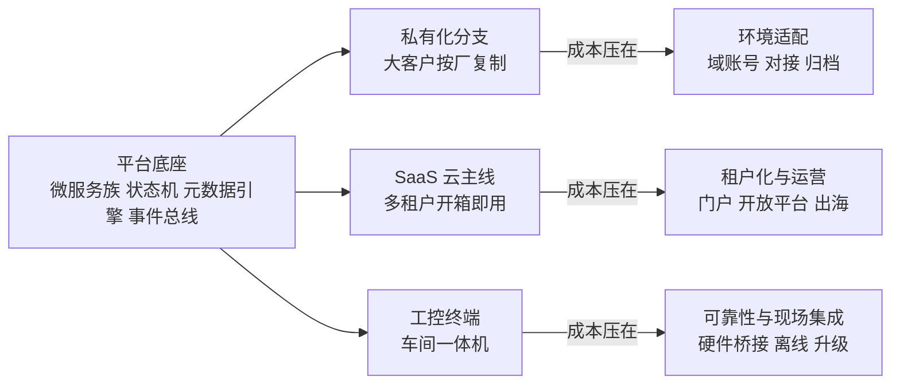
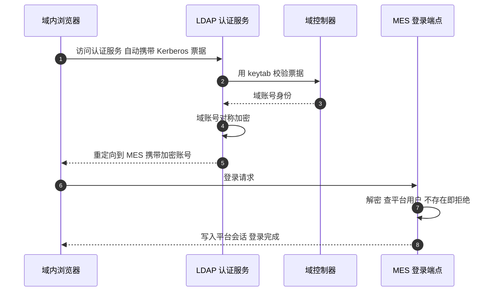

"你们的项目是私有化部署还是 SaaS？""同一套代码服务多个客户，分支怎么管理？"——做产品化系统的团队面试必收这两问。它们和"讲讲你的项目"不同：考的不是某个技术点，而是**你对"一套代码如何变成多种生意"的理解**——这是工程师视角和产品视角的分界线，答好了非常加分。

系列从本篇进入第三章·多客户交付线。前十一章把一个制造执行系统的业务、机制、数据拆了个遍（开的头），本篇拉高一层：这套底座实际交付出了三种形态——**大客户私有化分支、SaaS 云主线、车间工控终端**——每一种都对应一类客户和一种交付成本。本篇讲三种形态各自怎么落地、成本压在哪、以及面试里最常被追问的"分支管理"和"形态选择"。

<!-- more -->

## 一、一个底座，为什么长出三种形态

先立坐标。底座是同一套东西：Spring Boot 微服务族、行级多租户、工单状态机、页面元数据引擎（）、消息事件总线（）。客户却长得完全不一样：大型外企要 AD 域账号体系和自有排产系统对接；中小工厂买云端开箱即用；车间工位要的是一台开机即用的工控机，配扫码枪、刷卡器、打印机。

三种形态不是三套代码，而是**同一底座的三种"配置"加各自的一圈外围**。版本管理用版本库的经典分法：主干是 SaaS 云主线（也是功能演进的主战场），大客户分支从主干拉出、独立演化，客户特有的对接和定制留在分支里，通用能力反过来合回主干。这个模型说起来朴素，真正难的是**差异收敛的纪律**——哪类改动必须回主干、哪类坚决留在分支，没有纪律的分支半年就演化成独立项目。这套系统收敛的原则值得记：**环境适配（配置、对接器、部署物）留分支，能力演进（状态机、报表引擎、框架层）回主干**。

## 二、私有化分支：成本在环境适配

私有化客户是行业大厂，它的 IT 治理不允许任何系统游离在域账号体系之外，也不允许数据出内网。于是私有化交付的实质是"把底座**焊**进客户的环境"，四类适配各有代表性。

**第一类：域账号打通。** 独立起一个 LDAP 认证服务，走 Kerberos SPNEGO——服务端配置服务主体名和 keytab 密钥表，浏览器访问时凭域票据自动完成认证，用户全程无感输入。有意思的是它和平台会话的衔接方式：**不是共享 session，而是"票据换会话"**——Kerberos 校验通过后，把域账号对称加密塞进跳转参数带去 MES 登录端点，MES 侧解密、查平台用户表（域用户不存在则明确拒绝），存在才把身份写进平台 Session。这张流程值得单独画出来：

加密跳转这步常被质疑"不如发 token 安全"，但它是内网环境里防御纵深的一部分：加密串只在域内 HTTPS 链路上出现一次、即时消费，且 MES 侧有"域账号必须已绑定平台用户"的收口——**认证归域、授权归平台**，两边各守各的门。

**第二类：强一致链路的事务兜底。** 私有化分支在"工单流转 + 质检检验"这条链路上引了分布式事务管理器，十来个关键写路径挂了分布式事务注解——对应云主线后来"能用本地事务就不分布式"的演进（），分支和主线的取舍差异恰好构成对照：**大客户要的是审计级的强一致，云上要的是吞吐**。

**第三类：对接客户自有系统。** 客户有自己的排产系统，MES 只做执行——对接靠两个**装成 Windows 服务的同步器**：Spring Boot jar 用服务包装器注册成开机自启的系统服务，配置文件按厂定制（数据源指向本厂库），拉推双向通道同步模具、设备、工单进度——正是排产所需的全套输入。换一个分厂交付，复制目录、改配置文件、注册服务，完事。**"对接器做成可复制的配置驱动服务"**是私有化交付里最值钱的模式。

**第四类：按厂复制。** 一套分支服务客户的多个分厂，每个分厂一套独立部署、独立库、独立文档（需求规格说明书按厂分目录），LDAP 认证服务也按厂出专属配置。**工厂之间连行级租户都不用——物理隔离最贵也最省心**，这是私有化和 SaaS 在隔离哲学上的根本分歧。

## 三、SaaS 云主线：成本在租户化与运营

云主线服务的是"开箱即用"的中小工厂，底座之上叠了三层东西。

**租户层**：行级多租户（讲过）承担"公司 = 一个租户"的隔离，但 SaaS 还多了一层**渠道维度**——代理商门户和直营门户是两个入口，代理商登录只见其名下租户的运营数据，直营账号见全量租户管理视图。租户是隔离单位，渠道是运营单位，两层正交。**SaaS 化最难的不是隔离，是"谁能看到哪些租户"这种运营态权限**。

**运营层**：开放平台让第三方的系统能拉推数据——接入方持 apikey，拦截器完成"apikey → 租户"的映射加开放资源白名单校验，拉推双通道各有版本演进。四语国际化（简繁英越，越南语对应出海工厂）靠的是讲过的词条三表体系，出海只是多一份语言文件——但语言只是 i18n 最浅的一层，单据模板、时区、日期格式才是出海的深水区。

**部署层**：云主线上了 K8s，配置里有个细节很典型：**服务发现改为 Service 域名直连**——网关到认证、门户的地址直接写 K8s 的 Service DNS 名，注册中心仍保留但不再是发现链路的关键路径。这是把"对等发现"换成"平台托管发现"的务实选择：K8s 的 Service 已经解决了稳定寻址，应用层的服务发现只留作备份。**上了 K8s 之后，微服务基础设施的哪些层该交给平台，是每个上云团队都要做的减法**。

云主线还有一个和时代接轨的组件：AI 智能体服务——数据智能体、工艺智能体、助手三类视图，对接外部模型平台按租户签发嵌入式访问令牌，租户各自的 apikey 存在业务表按工厂隔离，业务数据按"数据域"注册后经 apikey 鉴权开放给智能体查询。**2023 年前的技术栈嫁接 2025 年的 AI 能力**，这个组件的拆解值得单独一篇（下下篇），这里只立一个观点：老系统接 AI 的正确姿势不是重写，是**把 AI 当成一个带鉴权的外部视图层**。

## 四、工控终端：成本在可靠性与现场集成

第三种形态根本不是 Java——是 C# WPF 的工控机壳应用，专为车间工位而生。它的设计哲学一句话讲完：**PAD 不含业务逻辑**。

壳里是内嵌浏览器，直接加载云端 MES 页面——业务 UI 一行不写，云端页面升级即终端升级。壳自己只干三件事：

**硬件桥接**：高频 RFID 读卡（换模车载具识别）、IC 卡和身份证读卡登录（读卡号调 MES 上工接口）、串口电子秤（稳定读数自动上报报工数量）、标签打印机静默直出（对接成熟打印引擎，MES 下发打印指令免弹窗出标签）。**每一样都是 Web 页面碰不到、车间离不开的能力**。

**防呆联锁**：壳里有个 Modbus TCP 客户端直连注塑机 PLC——MES 侧判定不该生产（未过首检、停机超时、转产未确认）时下发锁机指令，壳写 PLC 寄存器禁止锁模。关键是职责边界：**PAD 只做执行器，解锁决策永远在 MES 状态机**——首检合格、扫码确认后由平台放行，PAD 无权自行解锁。软件卡生产、卡的是"人绕过系统"的可能，这个设计的对错边界值得在面试里细讲：执行与决策分离，是所有工控防呆系统的第一原则。

**配置驱动的端上能力**：菜单可见性、按钮开关、升级源，全部由云端配置文件远程下发，PAD 启动时合并本地配置生效——产线工位的 PAD 只见报工和提报按钮，因为它的按钮清单是按工位下发的。版本升级双通道：正常走 ClickOnce 自动更新，工控环境网络受限时走自研升级窗手动兜底。

至于"为什么用壳不用原生 App"——这道题留到端侧线拆（后面有两篇专讲 Android 壳和鸿蒙壳，同一套 Web 加桥接口的第三、第四种端侧移植，iOS 壳同理不展开）。这里只给结论：**业务在云端高速演进、硬件桥接相对稳定时，"Web 复用 + 薄原生壳"的演化速度碾压原生**——MES 页面每天在改，壳一年动不了几次。

## 五、三种形态怎么选：面试的收口

三形态的选型逻辑可以压缩成一张决策表，也是本文的收口：

| 维度 | 私有化 | SaaS | 工控终端 |
|---|---|---|---|
| 适配的客户 | 大企业、强 IT 治理、数据不出内网 | 中小工厂、要开箱即用 | 车间工位 |
| 隔离哲学 | 物理隔离（按厂复制） | 行级租户 + 渠道层 | 无租户概念（壳连自己的云） |
| 成本重心 | 环境适配：域账号、对接器、归档 | 租户化与运营：门户、开放平台、出海 | 可靠性：硬件桥接、防呆、升级 |
| 演化速度 | 慢（客户节奏） | 快（产品节奏） | 极慢（壳几乎冻结） |
| 和底座的关系 | 分支 + 对接器 | 主干本身 | 纯消费端 |

面试聊到这里，最有力的收尾是承认代价：**三种形态是三种重复**——同一个功能（比如一次报表改造）要在主干改一遍、可能回分支一遍、终端适配再想一遍。多客户交付的真实成本不是"维护三个项目"，是**每一次演进都要回答"这个改动属于哪一层、要辐射到哪几个形态"**。收敛纪律（环境留分支、能力回主干）和配置外置（能配置的不写死）是把这份成本压到最低的两根杠杆。

## 六、面试视角：六个问题拆到底

**Q1：私有化和 SaaS 交付的本质区别是什么？**

答：不是部署位置，是**隔离哲学和成本结构**。私有化按厂物理隔离，成本压在环境适配——每个客户一套域账号、一套对接器、一套归档策略；SaaS 行级租户共享一切，成本压在租户化与运营——门户分层、开放平台、语言与时区。选哪种看客户的数据主权要求和 IT 治理强度，不看技术先进性。

**Q2：多客户代码分支怎么管理？**

答：主干承载云主线和能力演进，大客户分支从主干拉出独立演化。收敛纪律两条：环境适配留分支（对接器、配置、部署物），能力演进回主干（框架、状态机、报表引擎）；落到工程上是配置外置——能做成配置文件的绝不写进代码，分支上的代码量越少，主干合并越轻。这个纪律的失败形态我也见过：分支上堆业务逻辑，半年后主干新功能合不下去，分支变成永不回流的老项目。

**Q3：企业内网 MES 怎么和客户 AD 域打通？**

答：Kerberos SPNEGO——独立认证服务持 keytab 向域控校验浏览器自动携带的域票据，用户全程无感。和平台会话的衔接用"票据换会话"：域账号加密后一次性跳转，MES 侧解密、查平台用户绑定、写平台 Session。原则是认证归域、授权归平台，认证服务和 MES 之间没有共享存储，链路短且可审计。

**Q4：SaaS 的租户体系为什么要分两层？**

答：租户层（工厂级行级隔离）和渠道层（代理商/直营）是正交的两个维度：前者回答"数据属于谁"，后者回答"谁能运营谁"。代理商门户只见名下租户，直营见全量——把渠道做成租户之上的运营视图，而不是给代理商开超级账号，是权限设计里最值得守的线。

**Q5：车间终端为什么用 C# 壳加载 Web，而不是写原生 App？**

答：演化速度。业务页面在云端以周为单位演进，壳的能力（硬件桥接）以年为单位稳定——让业务走 Web、让壳只做硬件桥接和防呆执行，两边的发布节奏互不拖累。原生 App 只在硬件能力 Web 实在给不了、且交互频率极高的场景才值得，即便那样我们也选择了"壳加桥"而不是全原生。多端复用同一套桥接口约定，新端移植时 Web 零改动。

**Q6：三种形态的团队怎么分工？**

答：底座团队养主干（框架、状态机、报表引擎），交付团队吃分支（对接器、环境适配、客户定制），终端团队养壳（硬件桥接、防呆、升级通道）。三者的沟通契约是配置格式和接口——底座往外交付"可配置的能力"，交付往底座回提"通用化的需求"。判断一个产品化团队是否成熟，就看它是靠人记差异还是靠结构收差异。

## 小结

- **一个底座三种形态，是三类客户的投影**：大厂私有化、小厂 SaaS、车间要工控机——形态选择是生意问题不是技术问题；
- **版本管理靠收敛纪律**：环境适配留分支、能力演进回主干、能配置的不写死——纪律失守的分支半年变孤岛；
- **私有化的成本在环境适配**：域账号"票据换会话"（认证归域、授权归平台）、对接器做成可复制的配置驱动 Windows 服务；
- **SaaS 的成本在租户化与运营**：租户层与渠道层正交，开放平台 apikey 映射租户加白名单，K8s 之后应用层发现做减法；
- **工控终端的哲学是 PAD 无业务逻辑**：云端配置驱动端上能力，锁机只做执行器、解锁决策在状态机；
- **多客户交付的真实成本是每一次演进都要回答"辐射到哪几个形态"**——三份重复里长出来的收敛能力，就是产品化团队的核心竞争力。

下一篇预告：**四种 ERP 适配层**——制造系统绕不开"和客户现有 ERP 对话"：用友 U8 的边缘同步引擎（元数据加内嵌脚本热改、水位线断点续传）、金蝶 K3Cloud 拉取、SAP 策略族对接、旧系统并行中间件，四种答案背后的同一个设计问题。
