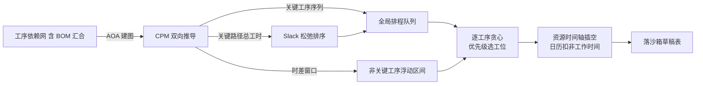

讲了约束求解器怎么给注塑车间排产，结尾埋了一个对照实验：同一个排产模块里还住着**另一台引擎**——装配类多工序排产，它没有用 OptaPlanner，一行业务代码都不沾求解器 API。什么时候用求解器、什么时候不用？这个问题比"怎么用求解器"更能体现算法工程的判断力。

先纠正一个容易想当然的答案。多工序排产不是"放弃求解器、改用 CPM 算最优解"——**CPM 关键路径在这台引擎里根本不排程**，它只负责三件算术：算每张单的总工时、找出关键工序链、给出非关键工序的浮动时间窗。真正排程的是一套**确定性贪心规则**：最小松弛排序、优先级选工位、资源时间轴插空。求解器的能力被"规则定排程、CPM 供依据"整体替代了。为什么这个组合敢替代求解器？本篇拆到底。

<!-- more -->

## 一、问题结构变了：链变成了图

单工序注塑和装配多工序，表面都是排产，问题结构完全不同。注塑的决策是"工单选哪台机哪副模、链上排哪"——一台机一条顺序链，OptaPlanner 的链式变量（前驱挂链、影子变量沿链推时间）正好把"顺序"编码进数据结构。

装配多工序的决策对象是**工序**：一张工单按工艺路线拆成一串工序（下料、加工、装配、检验），每道工序要选一个工位；工序之间有先后依赖，而且依赖不全是直线——**BOM 汇合**让多个子件的末道工序共同依赖父件的首道工序，依赖关系天然是一张有向图。求解器的链式模型是"每节点一个前驱"的链，图进不去：要么把图硬掰成链（丢失并行度），要么换成更复杂的建模（图着色类变量加大量自定义移动）。**当领域结构是图而不是链时，链式建模的红利消失，求解器的建模成本反超收益**——这是不用求解器的第一层理由。

第二层理由是优化目标的必要性：注塑的换模换色代价矩阵让解空间里"好坏"差异巨大，值得让求解器搜；装配多工序的约束相对刚性（工序顺序固定、工位固定优先级），**好解的位置可以被规则直接推出来**——搜索的必要性也随之消失。

## 二、CPM 在干什么：三件算术，不排程

引擎把每张工单的工序依赖网（含 BOM 汇合）翻译成关键路径法（CPM）的活动图。建模有个容易搞混的细节：用的是**活动箭线图（AOA）**——工序是**边**，图上的节点只是工序的入点和出点两个事件；BOM 汇合造成的交叉依赖，靠插入权重为零的虚拟节点消解。经典教科书画法，工程上已经很少有手写的了。

图建好后跑标准的 CPM 双向推导：正向沿边累加工时得每个事件点的**最早时间**，反向回退得**最晚时间**，最早等于最晚的节点串起来的边就是关键路径。推导本身是拓扑序上的线性扫描，教科书算法， worth 复习的价值在于它的三个产出各自喂给了谁：

1. **关键路径总工时** → 喂给松弛排序：一张单的"最快生产时长"不是各工序工时简单相加，而是关键路径的长度（并行支路不计入）——松弛度算不准，排序就全错，这是 CPM 的第一份价值；
2. **关键工序序列** → 喂给排程顺序：关键路径上的工序先进全局队列先排，非关键工序挂在后面补排；
3. **时差窗口** → 喂给非关键工序的时间约束：非关键工序可以浮动，但必须卡在"前道结束到后道开始"的窗口内——这就是 CPM 时差概念的直接落地。

注意这三件事**没有一件是"找最优解"**。CPM 在这里退化成了一个高精度的工时计算器和依赖关系校验器——而这恰恰是它的正确用法：确定性的图算法做确定性的事。

## 三、排程本体：确定性贪心的三步

真正的排程是三步贪心，每一步都简单到不需要解释正确性，合起来却覆盖了排产的核心诉求。

**第一步：最小松弛排序（Slack 优先）。** 每张工单算一个松弛度——交期减去数量乘关键路径单件工时再减排产基准时间，分钟数越小越先排。直觉表述：**离"来不及"最近的单先排**。同时完成预校验：交期早于基准时间的、没关联工艺路线的、关键路径权重为零的（说明产品配置不完整），在这一步就踢出去报错——烂单不给求解成本，这个设计上一在求解器版本里也见过，两台引擎在"预校验前移"上达成了完全一致。

**第二步：优先级选工位。** 每道工序的候选工位带优先级（配置表维护），贪心取最高优先级的可用工位。没有"尝试其他工位看看分数"，没有回溯——工位选择的业务含义是"这条产线优先干这种活"，优先级本身就是车间管理意志的编码，贪心恰好是它的忠实执行。

**第三步：资源时间轴插空。** 每个工位维护一条占用时间轴（已存在任务、在制任务、新排任务分桶登记），新工序在日历有效时段里找第一个不重叠的空档落下——在制工序锚定其计划时间不动，新任务绕开它排。没有求解器，资源冲突靠**每资源一条时间轴加顺序插入**解决，模具在这个引擎里干脆不存在（装配不需要）。

代码里还留着一次重要的决断痕迹：早期版本有多轮重排循环（排完检查、不满意再来一轮，最多三轮），后来整段被注释——**单遍贪心定稿**。多轮迭代是求解器思维对贪心引擎的残留入侵：贪心引擎的可预期性恰恰来自"一遍过"，加了迭代，响应时间就不可预期了，而排产员对"点开始到出结果"的时间容忍度是刚性的。

还有正向/倒排两种模式：正排从基准时间往后推，倒排从交期往回推——同一套规则两个方向，应对"尽快开工"和"卡着交期开工"两种车间习惯。

## 四、两台引擎怎么共存：重活不同，生命周期相同

多工序引擎和 OptaPlanner 引擎在同一个模块里并存，共存方式值得专门一节。**入口是两个独立接口**——排产员在页面上选的排产类型决定调哪台；**工单类型在 SQL 层分流**——注塑单工序的需求查询带着单据类型过滤，装配多工序按工序计划行查。两台引擎互不知道对方存在。

**结果却落进同一张沙箱表**——单工序行写设备、模具、子工单，多工序行写工位、工序、路线，列的语义按引擎分工，但沙箱隔离、undo 快照、差异计算、确认回写（第五节）这些生命周期机制完全共享。这是一个很好的架构模式：**计算引擎可以换成完全不同的范式，只要它向"草稿表"这个契约收敛**——甘特图、确认流程、审计全部对契约编程，对引擎无感。

调试侧还有个朴素好用的遗物：算法中间数据按时间戳落盘的转储器（日志目录名还带着第一代遗传算法的前缀），排产结果不对时，把当时的排序输入、关键路径、插空决策全部倒出来复盘。**自研算法最大的成本是可观测性**，这个转储器就是还给这笔债的利息。

## 五、面试视角：六个问题拆到底

**Q1：什么场景不用约束求解器？**

答：两个信号：问题结构不是链而是一般图（求解器链式建模套不上，通用建模成本陡增）；好解能被规则直接推导（约束刚性、没有需要权衡的软目标）。装配多工序两条全中：依赖是 BOM 汇合的图，工序顺序和工位优先级都是车间意志的确定性编码——求解器在这场景是花搜索的钱买规则免费给的东西。

**Q2：CPM 在你的排产引擎里干什么？**

答：三件算术，不排程：算关键路径总工时（给松弛排序当分母）、给出关键工序序列（先排）、算非关键工序的时差窗口（浮动约束）。建模用活动箭线图，工序在边上节点是事件点，BOM 汇合靠零权虚拟边消解。这个用法的关键认知是：CPM 是确定性图算法，让它做确定性的算术，别让它背排程优化的锅。

**Q3：没有求解器，资源冲突怎么避免？**

答：每资源一条占用时间轴，任务分桶登记（已存在、在制、新排）；新工序在日历有效时段找第一个不重叠空档；在制锚定不动，新任务绕行。冲突避免从"打分惩罚"变成"物理插空"——因为工位选择已由优先级确定性给出，插空只需要保证时间合法。

**Q4：排程结果不是全局最优，能接受吗？**

答：这个场景能。理由三点：工位优先级本身就是车间管理意志，"最优"的定义权在排产员，算法越权反而没人用；贪心一遍过的响应时间可预期（求解器的多轮迭代被我们主动注释掉了）；关键路径给了全局下界参照——关键工序先排加时差窗口约束，实际上已经把最大的浪费源（关键路径被非关键工序挤占）堵死了。剩下的优化空间排产员在甘特图上拖，比让机器多算两分钟更符合协作习惯。

**Q5：两台引擎共存，怎么避免变成两套系统？**

答：让它们向同一个契约收敛：沙箱草稿表是唯一出口，undo、差异计算、确认回写、审计全对契约编程、对引擎无感。引擎的分工在入口和 SQL 层分流，代码互不引用。判断一个模块"引擎可替换"的标准就是这条：换引擎时页面和确认流程一行不改。

**Q6：自研 CPM 有什么坑？**

答：三个：建模语义（AOA 里工序在边上，节点是事件点——搞反了整个推导全错，交叉依赖要靠虚拟节点消解）；日历耦合（CPM 算的是相对工时，落墙钟要过工作日历，两套口径要显式分离）；可观测性（确定性算法的调试靠中间数据转储，我们把排序输入、关键路径、插空决策全量落盘，排产争议靠复盘日志裁决）。以及一个元认知：这个引擎经历了"遗传算法一代、启发式二代、CPM 增强三代"，自研算法的迭代成本远高于预期，能上成熟求解器的场景尽量上——我们留下自研，是因为场景本身不需要搜索。

## 小结

- **问题结构决定算法形态**：链式领域喂求解器，图式领域看规则能否直接推导好解——装配多工序两条信号全中；
- **CPM 的正确用法是三件算术**：关键工时喂排序、关键序列定顺序、时差窗给浮动——它是计算器不是优化器；
- **确定性贪心三步走**：最小松弛排序、优先级选工位、时间轴插空——每步简单到无需证明，合起来覆盖排产核心；
- **单遍贪心是多轮迭代的坟场**：可预期性是排产工具的生命线，迭代思维从求解器蔓延过来也要砍掉；
- **引擎可换、契约不变**：两台范式完全不同的引擎共享沙箱与确认链路——对草稿表编程，不对引擎编程；
- **自研算法的成本在可观测性**：中间数据全量转储，让排产争议可以靠日志裁决。

下一篇预告：**工控终端上墙**——C# WPF 壳把 MES 搬进车间：CefSharp 页面复用、Modbus TCP 直控注塑机锁机的防呆联锁、RFID 与刷卡登录的硬件桥接，以及"PAD 无业务逻辑"背后的执行与决策分离原则。
