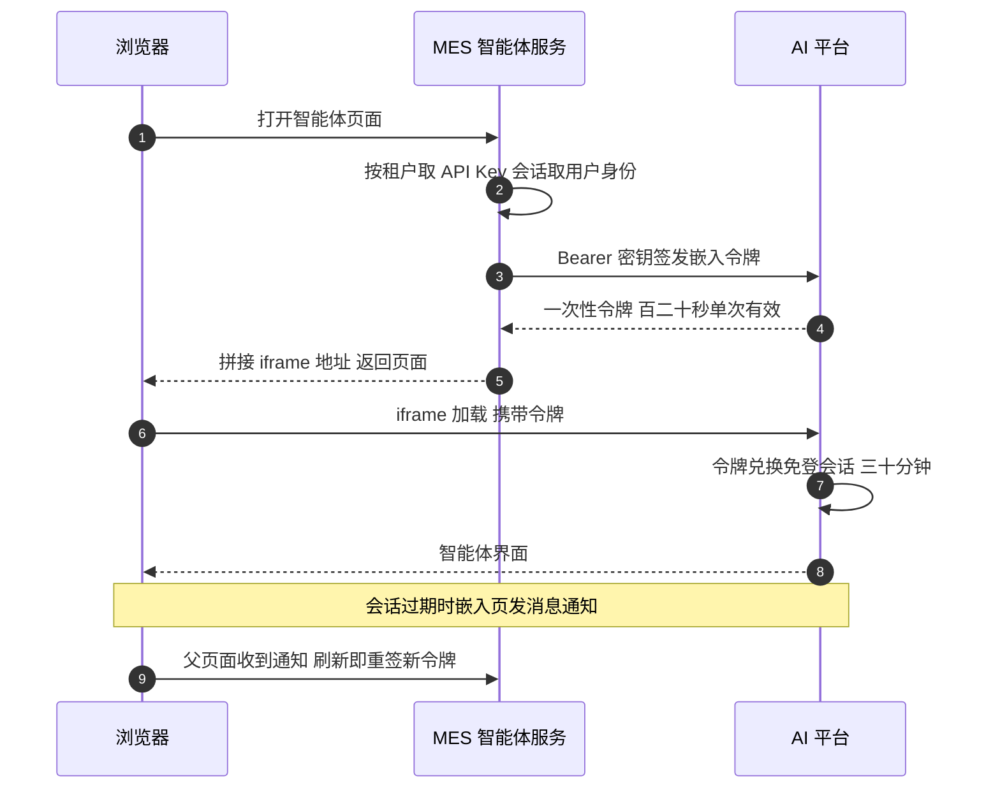

"你们的老系统接 AI 了吗？怎么接的？"——2023 年之后，这题出现的频率逐年攀升，而且它有个隐蔽的陷阱：**多数人答的是"接了大模型 API"，而面试官想听的是架构**。老系统接 AI 的真正难点不在调模型，在三个工程问题：**老用户的身份怎么安全地带进一个外部 AI 平台？老系统的数据怎么受控地开放给智能体查询？多租户客户的 API Key 怎么管？**

本篇拆这套 SaaS MES 的 AI 智能体组件——一个跑在 2023 年前技术栈（的云主线）上的独立服务。它的全部设计可以压缩成三条红线：**零 DDL（不动老库表结构）、零重启（配置与数据域热生效）、API Key 不下发浏览器**。读下来的你会看到，这三条红线把"接 AI"从一个模型调用问题，变成了一个精细的边界设计问题。

<!-- more -->

## 一、先立观点：AI 是一个带鉴权的外部视图层

组件形态先说清：独立 Spring Boot 应用（微服务族里的一员，注册中心照挂、会话与主系统共享——的 Redis Session 又一次发挥作用），双数据源——主库放配置、旁路库放同步数据。聊天和流式输出的全部交互发生在**外部 AI 平台的页面里**（iframe 嵌入），MES 侧不写一行聊天代码。

这个形态是一种克制的宣言：**不把 AI 塞进主系统，而是把 AI 当成一个"带鉴权的外部视图层"**。主系统对它的全部职责只有四件事——管好每个租户的钥匙、开放受控的数据、签发免登凭证、授权谁能用哪个应用。模型怎么选、提示词怎么调、流式怎么渲染，全是外部平台的事。老系统接 AI 的架构题，一半的答案是"决定自己不做什么"。

## 二、免登嵌入：一次性令牌的完整生命周期

最精巧的部分是免登链路。需求：租户用户点开 MES 里的智能体页面，要在 iframe 里的外部平台自动登录——但不能把 API Key 给浏览器，也不想让用户在外部平台再注册一遍。设计是**服务端签发一次性令牌（OTP）**：

四个安全细节值得逐个点：**Key 只活在服务端**（类注释原话"API Key 仅服务端持有，不下发浏览器"）；令牌是**百二十秒单次有效**，注释明令"禁止缓存复用"——窗口短到泄漏了也来不及用；会话过期不静默，嵌入页通过 postMessage 通知父页面**刷新重签**，体验和安全各拿一半；还有"应用可见性"的前置断言——签发之前先查这个角色能不能用这个应用。四类可嵌入资产（报表页、聊天智能体、多页面应用、单据模板）走同一套签发协议，差异只在资源标识。

**多租户的钥匙管理也顺带解决了**：每个租户一把平台 Key，存一张 KV 行式配置表（租户号 + 配置项 + 值，全局行用特殊租户号表示）——**加一个 SaaS 客户 = 加一行配置，零 DDL 零发版**；配置直查不缓存，管理页改完立即生效；管理页留空则保持原 Key，避免误清空。这是"零 DDL"红线的第一次落地：老系统的表结构动不得，那就把新配置全部设计成"加行"而不是"加列"。

## 三、数据开放：白名单直查，坚决不做自然语言转 SQL

智能体要查 MES 的数据，常见答案是把用户问题转成 SQL 去查库——这个方案在这套系统里被明确否决了，理由写在注释里：让模型生成 SQL，等于把数据库的攻击面交给一个概率系统。替代方案是**数据域注册表 + 结构化查询 DSL**：

**数据域**是"一张源表 + 字段清单 + 同步方式"的注册行，存配置表，每次请求现读不缓存——**新增一个可查数据域 = 插一行注册，零代码零重启**（"零重启"红线的落地）。注册时做三道校验：表名列名过标识符白名单正则、对照信息模式确认列真实存在、水位列必须登记为字段；坏域剔除而不打挂整个查询服务。

**查询走结构化 DSL**：前端传 JSON（过滤条件、分组、聚合、时间分桶、排序、条数），服务端把它编译成 SQL。安全红线是一整段类注释，逐条都是血泪：**强制时间窗**（必须带时间范围、窗口深度有上限——防一次查询拖全表）；**聚合白名单**（可聚合的列要逐列登记）；**条数钳制加查询超时**（语句内嵌最大执行时间注释）；**标识符与值分离**（白名单校验后的表名列名才允许进语句，用户值全走预编译参数）；**租户条件强制注入**（factoryid 由服务端从 Key 反查注入，请求说了不算）加**禁 JOIN、禁写、单域单表**。

还有一个反直觉的安全选择：**无效 Key 统一返回 404 语义**，不区分"没配置"和"写错了"——不给探测者任何区分信号。这类细节在面试里说出来，比背"参数化查询防注入"高一个段位。

## 四、同步通道的自我消亡：一段值得背诵的架构史

数据要从主库流到智能体可查的地方，这个组件走过一条完整的演进路，路线图的每一步都值得记。

**第一代：旁路库 diff 同步。** 定时任务每十五分钟跑一轮，按注册表的同步策略分发——全量比对（跨库 diff 后批量落旁路库）、滚动窗口（逐日补数加快照删插）、父子表引用同步三种策略，批量大小全程钳制。问题很快暴露：跨库删除用了 DELETE JOIN 的写法，**对源表的联锁读和 MES 的高频采集更新互相锁**——改造为"快照读出主键、按主键元组分批删"，这是跨库纪律的又一次具象化。

**第二代：通道收敛为平台拉取。** 后来同步通道整体趋于停用——注释里的结论是"旁路库同步对主库有锁风险，已停用；本服务把数据出口收敛为单表加现成索引加分页的域查询，平台定时来拉"。**推模式自我消亡、让位给拉模式**，理由是锁风险和运维分散。但它没有白活：注册表、字段校验、水位机制全部被直查通道继承。

这段史的真实教训是：**给 AI 开数据出口，先想清楚出口的锁成本**——直查是读，读可以控制（超时、白名单、单表）；同步是写，写就会和主业务的写打架。

## 五、安全演进史：新旧两代入口的对照

组件里新旧两代页面并存，恰好构成一部缩微的安全改进史：

**老一代入口**把用户 ID 放在 URL 明文参数里传给 iframe——身份可伪造，服务端只能反查兜底头像；甚至留着硬编码租户号修正的补丁（某几个租户号强制映射到另几个）。**新一代入口**的注释反复强调一句话："用户与工厂一律取 Session，透传审计身份，不可由请求参数伪造"——身份从请求参数回归会话，旧页面的伪造面就是新页面的设计清单。

**授权层**的设计也值得记：应用对角色默认不开放——没配置授权的应用普通用户不可见，集团账号直通；平台侧下架应用后，本地残留的授权行"无害不清理"（引用不存在的应用不构成漏洞，清理反而引入同步复杂度）。**授权默认关闭加孤儿数据无害化**，是多租户权限设计里性价比极高的两条守则。

最后是**数据量的自我保护**：日志类数据域曾有开发环境三十一大两百多万行的量级记录，于是直查通道挂满闸门——过滤器数量上限、IN 元素上限、LIKE 长度上限、单次扫描行数上限、默认条数……**每一个常量背后都是一次"查询把服务拖挂"的事故**，这类常量表本身就是面试里"你们做过什么防御"的最佳证据。

## 六、面试视角：六个问题拆到底

**Q1：老系统怎么接 AI 能力？**

答：不重写、不内嵌，把 AI 当成一个带鉴权的外部视图层：独立服务负责身份、钥匙、数据、授权四件事，聊天交互整体外包给 AI 平台的前端（iframe 嵌入）。判断依据是变更频率——模型和提示词以周为单位变，老系统的表结构以年为单位变，两者必须隔离开。

**Q2：免登嵌入怎么设计才安全？**

答：服务端持有租户 Key 签发一次性令牌（百二十秒、单次、禁缓存），令牌进 iframe URL 由平台兑换成三十分钟会话，过期通过 postMessage 通知父页面刷新重签。三个要点：Key 永不下浏览器、令牌窗口足够短、签名前先断言应用对该角色可见。

**Q3：为什么不做自然语言转 SQL？**

答：NL2SQL 等于把数据库攻击面交给概率系统——模型生成的语句无法静态保证安全。替代是数据域注册表加结构化 DSL：能查什么在注册时白名单化，查询语句由服务端从受控 JSON 编译生成，标识符过正则、值走预编译、租户条件强制注入、语句级超时兜底。模型负责理解意图，SQL 的构造权在代码手里。

**Q4：数据怎么开放给智能体？**

答：三代演进：旁路库定时 diff 同步（因跨库删除锁源表被停用）→ 收敛为平台凭 Key 拉取的单表分页域查询 → 未来可演进为平台侧直接对接主库只读实例。核心判断：**给 AI 的数据出口优先选读而不是写**，读能加超时和白名单，写会和服务端高频更新抢锁。

**Q5：AI 功能的多租户怎么隔离？**

答：三层。钥匙层每租户一把平台 Key（KV 行式配置，加客户加行零 DDL）；数据层查询强制注入租户条件且单域单表禁 JOIN；应用层授权默认不开放、按角色矩阵可见性控制。Key 与数据出口同源（同一把 Key 既是嵌入免登的签发凭证也是直查凭证），避免多套凭证的同步管理。

**Q6：这套架构现在看有什么问题？**

答：三个诚实的问题：令牌换会话的嵌入模式依赖平台方安全水位，MES 侧无法约束 iframe 内的行为；数据域直查绕过了主库的列级权限（白名单只能做到表和列的粒度）；老一代入口的 URL 传身份是事实上的遗留风险面，迁移没有完成。以及一个更大的判断：如果今天重建，可能会选平台直连只读副本加语义层，把数据出口再往前推一层——但"零 DDL 零重启"两条红线在那个老库的现实约束下，当时的取舍是对的。

## 小结

- **老系统接 AI 的架构题，一半是"决定自己不做什么"**：AI 是带鉴权的外部视图层，聊天与流式全外包，MES 只管身份、钥匙、数据、授权；
- **免登嵌入的三件套**：服务端持 Key、百二十秒单次令牌、过期 postMessage 重签——窗口短到泄漏无用；
- **多租户 Key 用 KV 行式配置**：加客户加一行、直查不缓存、留空保原值——零 DDL 红线让老库不动表结构；
- **数据出口选读不选写**：注册表白名单加 DSL 直查胜过 NL2SQL，同步通道被锁事故证明"写出口"的成本；
- **无效 Key 统一 404**：不给探测者区分信号，安全细节的段位藏在语义选择里；
- **新旧入口的对照就是安全演进史**：URL 传身份的伪造面，是下一代设计清单的来源；
- **常量表是事故的化石**：每一个查询上限背后都是一次拖挂，把它们背下来是面试里最好的防御性设计证据。

下一篇预告：**放弃 OptaPlanner 的场景**——装配类多工序排产为什么没走约束求解器：Slack 最小松弛排序、AOA 图上的关键路径推导、资源时间轴插空的确定性贪心，以及"CPM 算关键、规则定排程"的组合拳与第 11 篇构成完整对照。
