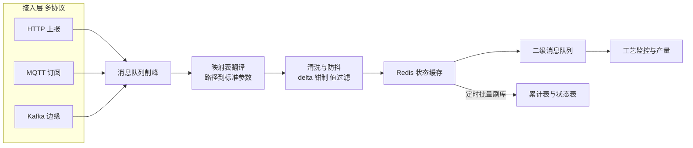

面试聊到物联网数据接入，常见问法是"几千台设备高频上报，怎么扛？"——但制造业 IoT 的真正难点不在量，在**乱**：每家设备商一套报文格式（协议碎片化），设备本身不讲武德（不发心跳、时钟乱跳、计数器回绕、65535 当真实值上报）。量的问题有一百种通用解法，乱的问题只有一种解法——**在接入层之后、业务层之前，放一个又宽又厚的清洗与状态层**。

本篇拆这套 MES 的 IoT 接入体系。上一篇里"设备模次聚合产量"的钩子在这篇收口——不过那笔账（两段式自动报工）已在讲过，本篇讲的是它上游的接入侧：多协议怎么收、碎片化报文怎么翻译成标准参数、设备在不讲武德的世界里怎么维持一个可信的状态机，以及一份物联网系统特有的欠账清单。

<!-- more -->

## 一、多协议接入：碎片化现实的接纳

先看协议版图。这套系统的设备接入有四条通道并存：**HTTP 上报**是主通道——注塑机、辅机电表、挤出机各一个端点，外加心跳端点和"网关-子设备关系"端点；**MQTT 订阅**是第二通道，吃某台型厂商格式的报文（订阅通配全部主题，收到什么解析什么）；**华为云 IoT 边缘**走 Kafka 消费，按需启用（配置里的自动启动开关默认关着）；工艺模块还有一套双向 MQTT，既收实时数据也对外发布（按工厂开关控制分发）。

为什么主通道是朴素的 HTTP 而不是更"物联网正确"的 MQTT？这是被环境决定的：工厂内网里设备数据通常由边缘网关聚合后转发，网关到服务端的链路稳定可靠，HTTP 的无状态、易调试、免连接管理反而成了优势；MQTT 通道留着给直连型设备和第三方平台。**协议选型不看潮流看链路**——面试聊到 IoT 架构，这个判断比"我们支持 MQTT"有价值得多。

所有通道在接入层之后汇到同一个形态：**接入薄、处理厚**。HTTP 端点只做两件事——解析报文、投消息队列削峰（唯一例外是某机型同步写库，历史上没改干净）。这个分层在面试里可以概括为一条原则：**接入层的职责边界是"把字节变成消息"，绝不在这层做业务**——因为设备端什么都能错，接入层必须保持最笨才最稳。

## 二、配置驱动的协议适配：新机型零代码接入

协议碎片化的核心痛点：同一台"注塑机"，A 厂商的报文里模次叫某个 PLC 标签路径、单位是次数，B 厂商的叫另一个路径、要除以 8 才是真值，C 厂商还有版本子版本。如果每种设备写一个解析类，三十种机型就是三十个类和无穷的维护。

这套系统的解法是一张**参数映射表**：设备型号字段决定用哪组映射，映射行的内容是"原始参数路径 → 标准参数名 + 除数 + 精度"。报文进来，按设备型号加载映射，用原始路径 key 查表翻译成系统标准参数（模次、周期时间、熔胶时间……），顺带完成单位换算。映射在启动时加载进内存，另有开关控制热刷新。特殊机型再配一层 XML 适配文件处理跨版本报文差异。

这是"配置驱动适配"的又一次出场（的流程图、的 Layout XML 都是同款思想），但它和前两者有一个关键差异：**映射表的行是实施人员可以自己加的**。新机型接入的操作是插几行映射配置、设备记录上改个型号编号、刷一下缓存——不写代码、不发版。面试里被问"策略模式和配置表怎么选"，这里是最好的例子：**映射关系是数据（路径对路径的翻译），配置表完胜；映射逻辑是行为（解析流程本身），才轮到策略类**。

## 三、扛量：靠写合并不靠并发

上报的量级不算恐怖（百台级设备、秒级上报），但模次这种"只增计数"的数据有个经济学问题：每次上报都更新数据库，一天就是几十万次无意义的行锁竞争——设备一整天才产生几千个模次，中间几百次上报全是中间态。

这套系统的答案是 **Redis 写合并加三 key 轮转批量刷库**：模次增量先进 Redis 三个轮转缓存槽，槽带六十多秒的 TTL；TTL 过期后**由下一笔上报触发**批量刷库（异步线程加分布式锁防多实例重复刷）。两个设计细节都值得在面试展开：

**为什么靠数据触发而不是定时扫描？** 定时任务也能把缓存刷进库，但数据驱动触发有个隐含优点：**没有上报就没有刷库**——设备停机时缓存自然冻结，系统不会空转；而触发本身的可靠性由"下一笔数据"保证，生产中的设备下一笔永远会来。配合的兜底思路，兜底扫描作为低频保险存在。

**为什么敢单队列串行消费？** 消费端没有配并发，看起来是抗量的大忌，实际上单消费者意味着**所有写合并逻辑天然无锁**——多消费者就得为"同一个设备的两笔上报并行处理"引入按设备分区的复杂度。扛量靠的是合并（几十次上报折叠成一次数据库写），不是吞吐军备竞赛。**先算清楚数据的真实增量速率，再决定要不要并发**——这是 IoT 后端和通用高并发的最大区别。

防抖的另一端是 delta 钳制：模次增量等于本次值减上次值，**负数或超过上限直接按 1 处理**——负数来自设备计数器清零或换模重置，超限来自设备重启后计数错乱。宁少报不错报，产量这块数据的口径从设备端就开始收口。

## 四、Redis TTL 状态机：设备在说谎，系统在记账

这是本篇我最想讲的设计。设备在线状态的管理，朴素方案是心跳表加定时扫描：心跳落库，任务每分钟扫一遍"最后心跳超过 N 秒的设备"标记离线。这套系统用的却是 **Redis TTL 当状态机**：每个设备两个 key——心跳 key（带五分钟过期）和工作数据 key（过期时间按设备周期动态计算），**key 存在即在，过期即断**。

TTL 状态机的优雅在于把"超时判定"这个逻辑外包给了 Redis：没有扫描、没有时间戳比较、没有时钟偏差问题——过期就是过期，物理保证。断连发现变成了一个低频任务去比对哪些 key 消失了，消失的组装成系统事件发运维告警（钉钉、企业微信、短信，的系统事件通道的又一次出场）。

然后是"设备不讲武德"系列的真实记录，三条防线对应三种谎言：

**谎言一：某型号网关经常只发生产数据不发心跳。** 解法是服务端补偿——收到生产数据但心跳 key 快过期时，服务端代它续一下心跳。这个"服务端迁就设备"的哲学在 IoT 系统里是常态：设备侧固件不可能为你升级，**后端的容错就是对物理世界不完美的接纳**。

**谎言二：设备时钟不准。** 采集时校验上报时间戳与服务器时差，超过十二小时发网关时间异常告警（告警本身用 Redis 十分钟去重防风暴）；配置端点顺带给网关下发 NTP 时间源——服务端这里兼职当了配置中心。十几个小时的阈值也是被现实磨出来的：宽了发现不了问题，严了天天误报。

**谎言三：设备状态抖动。** 空闲转工作要求连续几个周期确认才判"开工"（防一次误触发），工作态的等待超时按设备周期动态计算还带上下限钳制（慢机台和快机台不能共用一个阈值）。每两分钟一个定时任务把 Redis 里的在线/工作状态变化落成状态记录表——Redis 是"现在"，数据库是"历史"，各司其职。

还有一层聚合防误报：单台设备断连可能只是网线松了，**按网关聚合判断**——某个网关下的存活设备数跌破阈值才升级告警，恢复了还有恢复通知。告警的噪声控制是 IoT 运维的生命线，误报三次之后没人再看告警，真故障就在沉默里发生。

## 五、下游消费：两级队列与工艺参数的五步防抖

接入层之后是两级消息队列：一级队列供 IoT 服务自己做状态维护和累计落库；工艺相关的参数再发一级队列给工艺模块，做参数监控和产量明细。

工艺参数的存储值得单独一看：**宽表动态列**——采集参数按报文里的 key 动态拼列名写入一张宽表，不同机型的参数集不同但都能落进去。这是 schema-less 思想在 MySQL 里的务实实现：不用为每种机型建表，代价是列的语义只活在映射表里（又是配置驱动）。

参数监控的核心是**五步防抖的周期时间校准**：设备上报的周期时间偶尔会蹦出离谱值（开关模具测试、半途停机），不能直接采信——偏差超过阈值的值要连续出现 N 次才采信，超大周期单独处理，采信后还按配置摊薄写库频率。参数超限预警则按工艺控制计划的上下限比对，超限触发预警（接的触发器体系）、回落自动解除，预警状态用 Redis 去重防风暴。

这一节串起来看会发现一个模式：**从设备到业务，数据的"可信度"是一层层喂出来的**——接入层保证字节正确，映射层保证语义正确，防抖层保证统计正确，状态层保证时间正确。每层都只解决一种错误，但叠起来就是一个能用的系统。

## 六、欠账清单：IoT 系统的深夜面

照例，把不讲武德的部分也讲完。

**MQTT 重连是手写死循环**：连接丢失回调里 `while(true) { 重连; 睡五秒; }`——能跑，但没有退避、没有监控指标、没有重连成功通知，属于"最原始但诚实的自愈"。配套的客户端类里连接异常全是打印堆栈了事，发布失败无补偿。

**0 号节点单点**：服务是 K8s 多副本部署，但 MQTT 消费、缓存刷库、状态落库任务的代码里都有同一个判断——"只有 0 号节点干这活，其余副本收到数据直接丢弃"。这是用**应用层选主替代了真正的分布式协调**：简单可靠（StatefulSet 的 0 号 pod 身份稳定），但 0 号挂了这一路数据就断流，靠 K8s 重建兜底，恢复期间的数据丢失没有补偿。面试聊到这段，"简单性和可用性的交易"是核心叙事。

**死锁重试靠异常字符串匹配**：消费端检测到异常信息里包含"Deadlock"就睡两秒重投——脆弱但有效，正确姿势是异常类型判定加有限重试。

还有挤出机同步写库不走队列的历史例外、被注释掉的第三方云转发、针对某台特定设备的专项调试日志——这些"遗址"的共同价值是提醒：**物联网系统的代码里，一半的逻辑在处理设备，另一半在处理上一个开发者留下的现场**。

## 七、面试视角：六个问题拆到底

**Q1：大量设备高频上报怎么扛？**

答：先算真实增量再谈架构。我们的模次数据是"只增计数"，几十次上报里只有最后一次有意义，所以核心手段是 Redis 写合并加 TTL 轮转批量刷库，把每秒几十次数据库更新折叠成每分钟一批；消息队列负责削峰，消费端反而刻意单队列串行——合并逻辑免锁，比堆消费者简单得多。并发是最后的手段，合并是第一手段。

**Q2：设备断连怎么判定？**

答：Redis TTL 状态机：心跳 key 带过期时间，存在即在线、过期即断——超时判定外包给 Redis 的物理机制，没有扫描也没有时钟偏差问题。三个配套：服务端补偿心跳（迁就不发心跳的型号）、网关级聚合阈值（单台断连不上告警、整网关跌破阈值才报）、恢复通知形成闭环。

**Q3：设备协议碎片化怎么适配？**

答：配置驱动的映射表：设备型号决定映射组，每行是"原始参数路径 → 标准参数名 + 换算除数 + 精度"。新机型接入是插配置行改设备型号，零代码。这个选择成立的条件是映射关系确实是"数据对数据"的翻译；如果适配需要不同流程逻辑，那才升级成策略类。我们两种都有——映射表管参数翻译，少数格式特殊的机型有独立解析分支。

**Q4：采集数据怎么防抖？**

答：按数据类型分层：计数值做 delta 钳制（负数和超限按最小值处理，宁少报不错报）；状态值做连续确认（连续几个周期才判状态切换）；统计值做偏差缓冲（离谱值连续出现才采信，采信后摊薄写库）。所有防抖的共同哲学是**让设备证明自己多次，而不是采信一次**。

**Q5：实时看板怎么实现？**

答：分清"实时的对象"。设备当前状态是 Redis 快照加前端轮询——秒级新鲜度，实现最简单；事件驱动的通知（如质检呼叫）才走 WebSocket 推送。全量上 WebSocket 的成本（连接管理、断线重连、消息顺序）在管理看板场景不值，**新鲜度要求决定技术选型**。

**Q6：设备时钟不可信怎么办？**

答：三层：阈值告警（上报时间与服务器差超过十二小时发网关时间异常，告警本身十分钟去重防风暴）、根因治理（配置端点下发 NTP 时间源给网关）、数据侧免疫——状态判定尽量不依赖设备时钟（TTL 状态机、服务端时间戳落库），让设备时间只在"必须用"的场景出现。

## 小结

- **接入薄、处理厚**：接入层只把字节变成消息，设备端什么都能错，接入层必须最笨；
- **配置驱动的映射表胜过三十个解析类**：翻译是数据，流程才是代码——新机型零代码接入是它最好的验收标准；
- **扛量靠合并不靠并发**：先算真实增量速率，写合并加批量刷库，单消费者免锁；
- **Redis TTL 是设备状态机的物理保证**：过期即断，补偿心跳接纳设备的不完美，网关聚合控制告警噪声；
- **数据的可信度是一层层喂出来的**：字节正确、语义正确、统计正确、时间正确，各层只解决一种错误；
- **0 号节点单点是简单性和可用性的交易**：承认它的边界，比假装它是高可用诚实得多；
- **欠账清单是物联网系统的深夜面**：死循环重连和字符串匹配重试能跑，但记录下来才是工程。

下一篇预告：主线机制收官前最后一块硬骨头——**APS 排产**。这个主题博客里已有一篇加密成文（OptaPlanner 约束求解），下一版本篇计划以"面试视角"重构公开版：排产问题的建模（机台/模具/工单三实体）、约束设计、求解配置与现场落地。数据线剩余的导出归档集成篇并入收官盘点。
